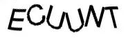
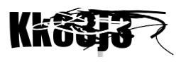
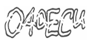
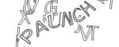
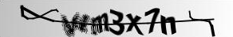
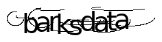
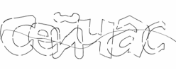
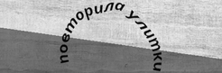

import { ArticleHead } from '../../../src/theme/ArticleHead';

<ArticleHead slug="captchas/ImageToText/module-name" />

# Передача имени модуля

В работе с автоматическим распознаванием капч важна точность и скорость обработки. Разные сервисы используют свои уникальные типы капч, и универсальное решение не всегда справляется с ними одинаково эффективно. Например, капча от **Google**, **SolveMedia**, **Whatsapp** или **Yandex** может иметь свои особенности, из-за которых стандартный модуль распознавания работает медленнее или с ошибками.

Чтобы повысить эффективность и снизить вероятность некорректного распознавания, CapMonster Cloud позволяет указать конкретный модуль, который будет обрабатывать вашу капчу. Система применит специализированный алгоритм распознавания, разработанный для конкретного сервиса, вместо использования универсального метода обработки капчи.

## Как передать имя модуля в CapMonster Cloud, используя только ApiKey поле

Если в интеграции доступно только поле для API-ключа, укажите имя нужного модуля после ключа в следующем формате:

```text
{apikey}__имя-модуля
```

Например:

```text
00f87cb0f01330d33709ce3339ad0c8c__solvemedia
```

API-ключ и имя модуля должны быть разделены **двумя символами нижнего подчеркивания (`__`)**.


Список доступных имен модулей представлен ниже:
<table>
    <tbody>
        <tr>
            <td align="center">amazon</td>
            <td align="center"></td>
        </tr>
        <tr>
            <td align="center">apple</td>
            <td align="center"></td>
        </tr>
        <tr>
            <td align="center">botdetect</td>
            <td align="center"></td>
        </tr>                
        <tr>
            <td align="center">facebook</td>
            <td align="center"></td>
        </tr>
        <tr>
            <td align="center">gmx</td>
            <td align="center"></td>
        </tr>
        <tr>
            <td align="center">google</td>
            <td align="center"></td>
        </tr>
        <tr>
            <td align="center">hotmail</td>
            <td align="center"></td>
        </tr>
        <tr>
            <td align="center">mailru</td>
            <td align="center"></td>
        </tr>
        <tr>
            <td align="center">okeng</td>
            <td align="center"></td>
        </tr>
        <tr>
            <td align="center">okrus</td>
            <td align="center"></td>
        </tr>
        <tr>
            <td align="center">partiallyblur</td>
            <td align="center"></td>
        </tr>
        <tr>
            <td align="center">ramblerrus</td>
            <td align="center"></td>
        </tr>
        <tr>
            <td align="center">ramblerrusnew</td>
            <td align="center"></td>
        </tr>
        <tr>
            <td align="center">solvemedia</td>
            <td align="center"></td>
        </tr>
        <tr>
            <td align="center">steam</td>
            <td align="center"></td>
        </tr>
        <tr>
            <td align="center">vk</td>
            <td align="center"></td>
        </tr>
        <tr>
            <td align="center">whatsapp</td>
            <td align="center"></td>
        </tr>
        <tr>
            <td align="center">wikimedia_paddle_ensemble</td>
            <td align="center"></td>
        </tr>
        <tr>
            <td align="center">yandex</td>
            <td align="center"></td>
        </tr>        
        <tr>
            <td align="center">yandexnew (капча из двух слов)</td>
            <td rowspan="2" align="center"></td>
        </tr>
        <tr>
            <td align="center">yandexwave</td>
        </tr>        
        <tr>
            <td align="center">captcha_math</td>
            <td align="center"></td>
        </tr>
        <tr>
            <td align="center">sat</td>
            <td align="center"></td>
        </tr>
        <tr>
            <td align="center">bls_text</td>
            <td align="center"></td>
        </tr>
        <tr>
            <td align="center">universal (все остальные текстовые капчи)</td>
            <td align="center"></td>
        </tr>
    </tbody>
</table>

:::info Info
Если не удается отправить CAPTCHA на нужный модуль, пожалуйста, обратитесь в [службу поддержки](https://helpdesk.zennolab.com/ru/conversation/new). Мы поможем проверить настройки и решить проблему.
:::