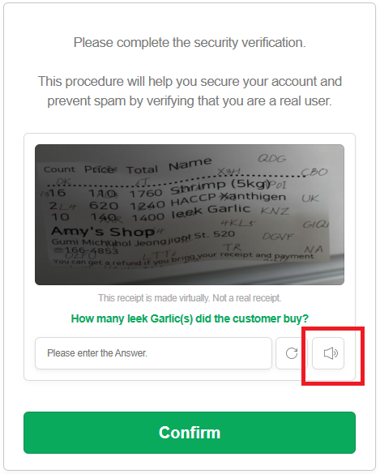

import Tabs from '@theme/Tabs';
import TabItem from '@theme/TabItem';
import ParamItem from '@theme/ParamItem';
import MethodItem from '@theme/MethodItem';
import MethodDescription from '@theme/MethodDescription'
import PriceBlock from '@theme/PriceBlock';
import PriceBlockWrap from '@theme/PriceBlockWrap';
import { ArticleHead } from '../../../../src/theme/ArticleHead';

<ArticleHead slug="captchas/compleximage/bills_audio" />

# bills_audio


<PriceBlockWrap>
  <PriceBlock title="bills_audio" captchaId="complex-rec_bills_audio" />
</PriceBlockWrap>

:::warning **Внимание!**
Использование прокси-серверов для данной задачи не требуется.
:::
<br />
Аудио-капча `bills_audio` — это звуковая версия «капчи с чеками», где сгенерированные изображения или данные имитируют чеки и содержат, например, цифры, суммы и даты. В этом типе задачи пользователю предлагается прослушать аудиофайл и на основе услышанной информации подтвердить правильность ввода. Такой формат может выглядеть, например, следующим образом:

 

## Параметры запроса

<br />
<span style={{ fontSize: "15px", fontWeight: 700 }}>
>  ВАЖНО: получайте base64 аудио непосредственно перед созданием задачи, чтобы избежать ошибок при решении (см. раздел [Получение аудио и конвертация в Base64](#получение-аудио-и-конвертация-в-base64)).
</span>
<br />

<div className="bordered-panel">
    <ParamItem title="type" required type="string" />
    **ComplexImageTask**

    ---

    <ParamItem title="class" required type="string" />
    **recognition**

    ---

    <ParamItem title="imagesBase64" required type="array" />
    Аудио в кодировке base64, обёрнутое в массив.<br />
    Пример: `[ "UklGRnjuAwBXQVZFZm10...f/2f/9/6z/vf8MAAAA"]`

    ---

    <ParamItem title="Task (внутри metadata)" required type="string" />
    Название задания: `"bills_audio"`<br />

    ---

    <ParamItem title="PayloadType (внутри metadata)" required type="string" />
    Тип передаваемых данных в задаче: `"Audio"`

</div>

## Создание задачи

<MethodItem>

```http
https://api.capmonster.cloud/createTask
```

</MethodItem>
<br />

:::info Альтернативный адрес метода

Для пользователей из России также доступен:

```text
https://ru.api.capmonster.cloud/createTask
```

Подробнее в разделе [createTask](/docs/api/methods/create-task/).

:::

<div className="method-panel">
    <MethodDescription>
      **Пример запроса**
```json
{
    "clientKey": "API_KEY",
    "task": {
        "type": "ComplexImageTask",
        "class": "recognition",
        "imagesBase64": [
            "UklGRnjuAwBXQVZFZm10...f/2f/9/6z/vf8MAAAA"
        ],
        "metadata": {
            "Task": "bills_audio",
            "PayloadType": "Audio"
        }
    }
}
```

    **Пример ответа**
    ```json
    {
        "errorId": 0,
        "taskId": 143998457
    }
    ```
    </MethodDescription>
</div>

## Получение результата задачи

<MethodItem>

```http
https://api.capmonster.cloud/getTaskResult
```

</MethodItem>
<br />

:::info Альтернативный адрес метода

Для пользователей из России также доступен:

```text
https://ru.api.capmonster.cloud/getTaskResult
```

Подробнее в разделе [getTaskResult](/docs/api/methods/get-task-result/).

:::

<div className="method-panel-full">
    <MethodDescription>
    **Пример запроса**
    ```json
    {
        "clientKey": "API_KEY",
        "taskId": 143998457
    }
    ```
    **Пример ответа**  <br/>
    В ответе возвращаются цифры из аудио:
    ```json
    {
      "solution": {
          "answer": [6, 8, 4, 1, 2, 3],
          "metadata": {"AnswerType": "Text"}
      },
      "cost": 0.0008,
      "status": "ready",
      "errorId": 0,
      "errorCode": null,
      "errorDescription": null
    }
    ```
    </MethodDescription>
</div>

## Получение аудио и конвертация в Base64

1. Откройте страницу с капчей и запустите **DevTools**, затем перейдите во вкладку **Network**.
2. Активируйте аудио-режим капчи, нажав соответствующую кнопку.
3. В списке запросов найдите адрес вида:
   `blob:https://example.com/3be79ac6-1b3d-43ef-9a8a-7ad8877b3606`
4. Скопируйте этот URL и откройте его в адресной строке браузера — откроется аудиофайл капчи в формате **.wav**.


5. Сохраните файл и выполните конвертацию из **.wav** в **Base64** удобным для вас способом — например, с помощью кода на Node.js:
```JavaScript
const fs = require("fs");

// Путь к исходному .wav файлу
const filePath = "C:\\Users\\User\\Downloads\\file-acbe-4fb3-9f8e-f989ba6c7fde.wav";

const fileBuffer = fs.readFileSync(filePath);

// Конвертация в Base64
const base64 = fileBuffer.toString("base64");

// Сохранение Base64-строку в текстовый файл
fs.writeFileSync("output.txt", base64);

console.log("Файл успешно конвертирован в Base64 и сохранён как output.txt");
```

6. Используйте полученную строку Base64 в запросе на решение в CapMonster Cloud.

## Используйте библиотеку SDK

<Tabs className="full-width-tabs filled-tabs request-tabs" groupId="captcha-type">

  <TabItem value="js" label="JavaScript / TypeScript" default className="method-panel">
  <details>
      <summary>Показать код (для браузера)</summary>
```js
// https://github.com/CapMonsterCloud/capmonster-nodejs-captcha-solver

import {
  CapMonsterCloudClientFactory,
  ClientOptions,
  ComplexImageTaskRecognitionRequest
} from "@zennolab_com/capmonstercloud-client";

document.addEventListener("DOMContentLoaded", async () => {

  const API_KEY = "YOUR_API_KEY"; // Укажите ваш API-ключ CapMonster Cloud

  const client = CapMonsterCloudClientFactory.Create(
    new ClientOptions({ clientKey: API_KEY })
  );

  // Для ComplexImageTaskRecognitionRequest прокси не требуются
  const billsAudioRequest = new ComplexImageTaskRecognitionRequest({
    imagesBase64: ["your_audio_base64"],
    metaData: {
      Task: "bills_audio",
      PayloadType: "Audio",
    },
  });

  // При необходимости можно проверить баланс
  const balance = await client.getBalance();
  console.log("Balance:", balance);

  const result = await client.Solve(billsAudioRequest);
  console.log("Solution:", result.solution);
});
```
  </details>

    <details>
      <summary>Показать код (Node.js)</summary>
```javascript
// https://github.com/CapMonsterCloud/capmonster-nodejs-captcha-solver

const {
  CapMonsterCloudClientFactory,
  ClientOptions,
  ComplexImageTaskRecognitionRequest,
} = require("@zennolab_com/capmonstercloud-client");

const API_KEY = "YOUR_API_KEY"; // Укажите ваш API-ключ CapMonster Cloud

async function solveBillsAudio() {
  const client = CapMonsterCloudClientFactory.Create(
    new ClientOptions({ clientKey: API_KEY }),
  );
  // Для ComplexImageTaskRecognitionRequest прокси не требуются
  const billsAudioRequest = new ComplexImageTaskRecognitionRequest({
    imagesBase64: ["your_audio_base64"],
    metaData: {
      Task: "bills_audio",
      PayloadType: "Audio",
    },
  });

  // При необходимости можно проверить баланс
  const balance = await client.getBalance();
  console.log("Balance:", balance);

  const result = await client.Solve(billsAudioRequest);
  console.log("Solution:", result.solution);
}

solveBillsAudio().catch(console.error);
```
</details>

  </TabItem>

  <TabItem value="python" label="Python" className="method-panel">
  <details>
      <summary>Показать код</summary>
```python
# https://github.com/CapMonsterCloud/capmonster-python-captcha-solver

import asyncio

from capmonstercloudclient import CapMonsterClient, ClientOptions
from capmonstercloudclient.requests import RecognitionComplexImageTaskRequest

API_KEY = "YOUR_API_KEY"  # Укажите ваш API-ключ CapMonster Cloud


async def solve_bills_audio():
    client = CapMonsterClient(
        options=ClientOptions(api_key=API_KEY)
    )

    # Для RecognitionComplexImageTaskRequest прокси не требуются
    bills_audio_request = RecognitionComplexImageTaskRequest(
        imagesBase64=[
            "your_audio_base64"
        ],
        metadata={
            "Task": "bills_audio",
            "PayloadType": "Audio",
        },
    )

    # При необходимости можно проверить баланс
    balance = await client.get_balance()
    print("Balance:", balance)

    result = await client.solve_captcha(bills_audio_request)
    print("Solution:", result)


asyncio.run(solve_bills_audio())
```
    </details>

  {/* </TabItem> */}

  {/* <TabItem value="csharp" label="C#" className="method-panel">
  <details>
      <summary>Показать код</summary>
```csharp
// https://github.com/CapMonsterCloud/capmonster-dotnet-captcha-solver

using System;
using System.Threading.Tasks;
using Newtonsoft.Json;
using Zennolab.CapMonsterCloud;
using Zennolab.CapMonsterCloud.Requests;

class Program
{
    static async Task Main(string[] args)
    {
        const string API_KEY = "YOUR_API_KEY"; // Укажите ваш API-ключ CapMonster Cloud

        var clientOptions = new ClientOptions
        {
            ClientKey = API_KEY
        };

        var cmCloudClient = CapMonsterCloudClientFactory.Create(clientOptions);

        // Для RecognitionComplexImageTaskRequest прокси не требуются
        var billsAudioRequest = new RecognitionComplexImageTaskRequest
        {
            ImagesBase64 = new[]
            {
                "your_audio_base64"
            },

            Metadata = new RecognitionComplexImageTaskRequest.RecognitionMetadata
            {
                Task = "bills_audio",
                PayloadType = "Audio"
            }
        };

        // При необходимости можно проверить баланс
        var balance = await cmCloudClient.GetBalanceAsync();
        Console.WriteLine("Balance: " + balance);

        var result = await cmCloudClient.SolveAsync(billsAudioRequest);

        Console.WriteLine("Solution:");
        Console.WriteLine(
            JsonConvert.SerializeObject(
                result.Solution,
                Formatting.Indented
            )
        );
    }
}
``` 
</details> */}
  </TabItem>

</Tabs>