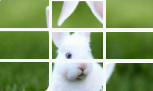
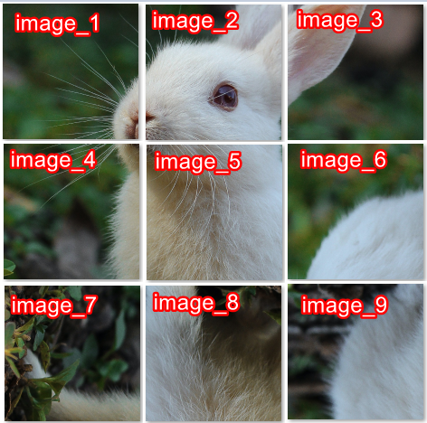

import Tabs from '@theme/Tabs';
import TabItem from '@theme/TabItem';
import ParamItem from '@theme/ParamItem';
import MethodItem from '@theme/MethodItem';
import MethodDescription from '@theme/MethodDescription'
import PriceBlock from '@theme/PriceBlock';
import PriceBlockWrap from '@theme/PriceBlockWrap';
import { ArticleHead } from '../../../../src/theme/ArticleHead';

<ArticleHead slug="captchas/compleximage/betpunch_3x3_rotate" />

# betpunch_3x3_rotate




<PriceBlockWrap>
  <PriceBlock title="betpunch_3x3_rotate" captchaId="complex-rec_betpunch_3x3_rotate_request" />
</PriceBlockWrap>

:::warning **Внимание!**
Использование прокси-серверов для данной задачи не требуется.
:::
<br />

В запросе необходимо передать девять изображений. Передавать изображения нужно в следующем порядке:



## Параметры запроса

<br />
<span style={{ fontSize: "15px", fontWeight: 700 }}>
>  ВАЖНО: получайте base64 изображений непосредственно перед созданием задачи, чтобы избежать ошибок при решении (см. раздел [Как получить base64](#как-получить-base64)).
</span>
<br />

<div className="bordered-panel">
    <ParamItem title="type" required type="string" />
    **ComplexImageTask**

    ---

    <ParamItem title="class" required type="string" />
    **recognition**

    ---

    <ParamItem title="imagesBase64" required type="array" />
    Массив изображений в кодировке base64 (без префикса `data:image/png;base64,`).

    ---

    <ParamItem title="Task (внутри metadata)" required type="string" />
    Название задания: `betpunch_3x3_rotate`

</div>

## Создание задачи

<MethodItem>

```http
https://api.capmonster.cloud/createTask
```

</MethodItem>
<br />

:::info Альтернативный адрес метода

Для пользователей из России также доступен:

```text
https://ru.api.capmonster.cloud/createTask
```

Подробнее в разделе [createTask](/docs/api/methods/create-task/).

:::

<div className="method-panel">
	<MethodDescription>
      **Пример запроса**
      ```json
      { 
        "clientKey": "API_KEY",
        "task": {
          "type": "ComplexImageTask",
          "class": "recognition",
          "imagesBase64": [
            "image_1_Base64",
            "image_2_Base64",
            "image_3_Base64",
            "image_4_Base64",
            "image_5_Base64",
            "image_6_Base64",
            "image_7_Base64",
            "image_8_Base64",
            "image_9_Base64",
          ],
          "metadata": {
            "Task": "betpunch_3x3_rotate"
          }
        }
      }
      ```

    	**Пример ответа**
    	```json
    	{
    	  "errorId":0,
    	  "taskId":407533072
    	}
    	```
    </MethodDescription>

</div>

## Получение результата задачи

<MethodItem>

```http
https://api.capmonster.cloud/getTaskResult
```

</MethodItem>
<br />

:::info Альтернативный адрес метода

Для пользователей из России также доступен:

```text
https://ru.api.capmonster.cloud/getTaskResult
```

Подробнее в разделе [getTaskResult](/docs/api/methods/get-task-result/).

:::

<div className="method-panel-full">
	<MethodDescription>
		**Пример запроса**
		```json
		{
		  "clientKey":"API_KEY",
		  "taskId": 407533072
		}
		```
      **Пример ответа**<br/>
      "answer":[X,X,X,X,X,X,X,X,X], где X - целочисленное значение от 1 до 4 для каждого изображения. 4 - означает, что картинку не нужно поворачивать; 1-3 - количество поворотов картинки против часовой стрелки.
      ```json
      {
        "errorId":0,
        "status":"ready",
        "errorCode":null,
        "errorDescription":null,
        "solution":
        {
          "answer":[4,4,4,4,4,3,1,2,2],
          "metadata":{"AnswerType":"NumericArray"}
        }
      }
      ```
	</MethodDescription>
</div>

## Как получить Base64

Изображения на страницах могут быть представлены либо в виде ссылки (URL), либо сразу закодированы в формате Base64. Чтобы найти нужное значение, кликните правой кнопкой мыши по изображению, выберите **Просмотреть код** (**Inspect**) и внимательно изучите раздел **Элементы** или сетку сетевых запросов – там вы сможете обнаружить ссылку или закодированное содержимое.

1. Откройте ваш сайт, где отображается капча, в браузере.
2. Правой кнопкой кликните по элементу капчи и выберите **Inspect**.


## Используйте библиотеку SDK

<Tabs className="full-width-tabs filled-tabs request-tabs" groupId="captcha-type">

  <TabItem value="js" label="JavaScript / TypeScript" default className="method-panel">
  <details>
      <summary>Показать код (для браузера)</summary>
```js
// https://github.com/CapMonsterCloud/capmonster-nodejs-captcha-solver

import {
  CapMonsterCloudClientFactory,
  ClientOptions,
  ComplexImageTaskRecognitionRequest
} from "@zennolab_com/capmonstercloud-client";

document.addEventListener("DOMContentLoaded", async () => {

  const API_KEY = "YOUR_API_KEY"; // Укажите ваш API-ключ CapMonster Cloud

  const client = CapMonsterCloudClientFactory.Create(
    new ClientOptions({ clientKey: API_KEY })
  );

  // Для ComplexImageTaskRecognitionRequest прокси не требуются
  const betpunchRequest = new ComplexImageTaskRecognitionRequest({
    imagesBase64: [
      "your_image_1_base64",
      "your_image_2_base64",
      "your_image_3_base64",
      "your_image_4_base64",
      "your_image_5_base64",
      "your_image_6_base64",
      "your_image_7_base64",
      "your_image_8_base64",
      "your_image_9_base64",
    ],
    metaData: {
      Task: "betpunch_3x3_rotate",
    },
  });

  // При необходимости можно проверить баланс
  const balance = await client.getBalance();
  console.log("Balance:", balance);

  const result = await client.Solve(betpunchRequest);
  console.log("Solution:", result.solution);
});
```
    </details>

    <details>
      <summary>Показать код (Node.js)</summary>
```javascript
// https://github.com/CapMonsterCloud/capmonster-nodejs-captcha-solver

const {
  CapMonsterCloudClientFactory,
  ClientOptions,
  ComplexImageTaskRecognitionRequest,
} = require("@zennolab_com/capmonstercloud-client");

const API_KEY = "YOUR_API_KEY"; // Укажите ваш API-ключ CapMonster Cloud

async function solveBetpunch3x3Rotate() {
  const client = CapMonsterCloudClientFactory.Create(
    new ClientOptions({ clientKey: API_KEY }),
  );

  // Для ComplexImageTaskRecognitionRequest прокси не требуются
  const betpunchRequest = new ComplexImageTaskRecognitionRequest({
    imagesBase64: [
      "your_image_1_base64",
      "your_image_2_base64",
      "your_image_3_base64",
      "your_image_4_base64",
      "your_image_5_base64",
      "your_image_6_base64",
      "your_image_7_base64",
      "your_image_8_base64",
      "your_image_9_base64",
    ],
    metaData: {
      Task: "betpunch_3x3_rotate",
    },
  });

  // При необходимости можно проверить баланс
  const balance = await client.getBalance();
  console.log("Balance:", balance);

  const result = await client.Solve(betpunchRequest);
  console.log("Solution:", result.solution);
}

solveBetpunch3x3Rotate().catch(console.error);
```
</details>

  </TabItem>

  <TabItem value="python" label="Python" className="method-panel">
  <details>
      <summary>Показать код</summary>
```python
# https://github.com/CapMonsterCloud/capmonster-python-captcha-solver

import asyncio

from capmonstercloudclient import CapMonsterClient, ClientOptions
from capmonstercloudclient.requests import RecognitionComplexImageTaskRequest

API_KEY = "YOUR_API_KEY"  # Укажите ваш API-ключ CapMonster Cloud


async def solve_betpunch_3x3_rotate():
    client = CapMonsterClient(
        options=ClientOptions(api_key=API_KEY)
    )

    # Для RecognitionComplexImageTaskRequest прокси не требуются
    betpunch_request = RecognitionComplexImageTaskRequest(
        imagesBase64=[
            "your_image_1_base64",
            "your_image_2_base64",
            "your_image_3_base64",
            "your_image_4_base64",
            "your_image_5_base64",
            "your_image_6_base64",
            "your_image_7_base64",
            "your_image_8_base64",
            "your_image_9_base64",
        ],
        metadata={
            "Task": "betpunch_3x3_rotate",
        },
    )

    # При необходимости можно проверить баланс
    balance = await client.get_balance()
    print("Balance:", balance)

    result = await client.solve_captcha(betpunch_request)
    print("Solution:", result)


asyncio.run(solve_betpunch_3x3_rotate())
```
    </details>

  </TabItem>

  <TabItem value="csharp" label="C#" className="method-panel">
  <details>
      <summary>Показать код</summary>
```csharp
// https://github.com/CapMonsterCloud/capmonster-dotnet-captcha-solver

using System;
using System.Threading.Tasks;
using Newtonsoft.Json;
using Zennolab.CapMonsterCloud;
using Zennolab.CapMonsterCloud.Requests;

class Program
{
    static async Task Main(string[] args)
    {
        const string API_KEY = "YOUR_API_KEY"; // Укажите ваш API-ключ CapMonster Cloud

        var clientOptions = new ClientOptions
        {
            ClientKey = API_KEY
        };

        var cmCloudClient = CapMonsterCloudClientFactory.Create(clientOptions);

        // Для RecognitionComplexImageTaskRequest прокси не требуются
        var betpunchRequest = new RecognitionComplexImageTaskRequest
        {
            ImagesBase64 = new[]
            {
                "your_image_1_base64",
                "your_image_2_base64",
                "your_image_3_base64",
                "your_image_4_base64",
                "your_image_5_base64",
                "your_image_6_base64",
                "your_image_7_base64",
                "your_image_8_base64",
                "your_image_9_base64"
            },

            Metadata = new RecognitionComplexImageTaskRequest.RecognitionMetadata
            {
                Task = "betpunch_3x3_rotate"
            }
        };

        // При необходимости можно проверить баланс
        var balance = await cmCloudClient.GetBalanceAsync();
        Console.WriteLine("Balance: " + balance);

        var result = await cmCloudClient.SolveAsync(betpunchRequest);

        Console.WriteLine("Solution:");
        Console.WriteLine(
            JsonConvert.SerializeObject(
                result.Solution,
                Formatting.Indented
            )
        );
    }
}
``` 
</details>
  </TabItem>

</Tabs>