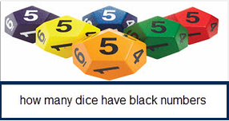
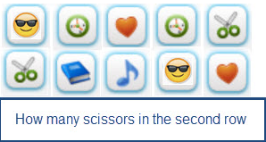
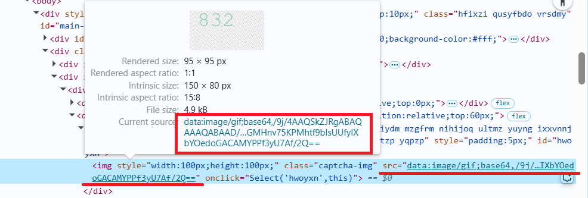

import Tabs from '@theme/Tabs';
import TabItem from '@theme/TabItem';
import ParamItem from '@theme/ParamItem';
import MethodItem from '@theme/MethodItem';
import MethodDescription from '@theme/MethodDescription'
import PriceBlock from '@theme/PriceBlock';
import PriceBlockWrap from '@theme/PriceBlockWrap';
import { ArticleHead } from '../../../../src/theme/ArticleHead';

<ArticleHead slug="captchas/compleximage/dli_ensemble" />

# dli_ensemble


<PriceBlockWrap>
  <PriceBlock title="dli_ensemble" captchaId="complex-rec_oocl_rotate_new" />
</PriceBlockWrap>

:::warning **Внимание!**
Использование прокси-серверов для данной задачи не требуется.
:::
<br />

В запросе необходимо передать одно изображение (вместе с текстом) в формате base64.

## Параметры запроса

<br />
<span style={{ fontSize: "15px", fontWeight: 700 }}>
>  ВАЖНО: получайте base64 изображения непосредственно перед созданием задачи, чтобы избежать ошибок при решении (см. раздел [Как получить base64](#как-получить-base64)).
</span>
<br />

<div className="bordered-panel">
    <ParamItem title="type" required type="string" />
    **ComplexImageTask**

    ---

    <ParamItem title="class" required type="string" />
    **recognition**

    ---

    <ParamItem title="imagesBase64" required type="array" />
    Изображение в кодировке base64 (обёрнутое в массив, без префикса `data:image/png;base64,`).

    ---

    <ParamItem title="Task (внутри metadata)" required type="string" />
    Название задания: `"dli"`

</div>

## Создание задачи

<MethodItem>

```http
https://api.capmonster.cloud/createTask
```

</MethodItem>
<br />

:::info Альтернативный адрес метода

Для пользователей из России также доступен:

```text
https://ru.api.capmonster.cloud/createTask
```

Подробнее в разделе [createTask](/docs/api/methods/create-task/).

:::

<div className="method-panel">
    <MethodDescription>
      **Пример запроса**
      ```json
      {
        "clientKey": "API_KEY",
        "task": {
          "type": "ComplexImageTask",
          "class": "recognition",
          "imagesBase64": [
            "base64"
          ],
          "metadata": {
            "Task": "dli"
          }
        }
      }
      ```

    	**Примеры задания:**

    	
    	

    	**Пример ответа**
    	```json
    	{
    	  "errorId":0,
    	  "taskId":143998457
    	}
    	```
    </MethodDescription>

</div>

## Получение результата задачи

<MethodItem>

```http
https://api.capmonster.cloud/getTaskResult
```

</MethodItem>
<br />

:::info Альтернативный адрес метода

Для пользователей из России также доступен:

```text
https://ru.api.capmonster.cloud/getTaskResult
```

Подробнее в разделе [getTaskResult](/docs/api/methods/get-task-result/).

:::

<div className="method-panel-full">
	<MethodDescription>
		**Пример запроса**
		```json
		{
		  "clientKey":"API_KEY",
		  "taskId": 143998457
		}
		```
		**Пример ответа**<br/>
		Результат вычисления (числовое значение), переданный как строка:
      ```json
      {
          "solution":
        {
          "answer": "1",
          "metadata": {
              "AnswerType": "Text"
          }
        },
          "cost": 0.0003,
          "status": "ready",
          "errorId": 0,
          "errorCode": null,
          "errorDescription": null
      }
      ```
	</MethodDescription>
</div>

## Как получить Base64

Изображения на страницах могут быть представлены либо в виде ссылки (URL), либо сразу закодированы в формате Base64. Чтобы найти нужное значение, кликните правой кнопкой мыши по изображению, выберите **Просмотреть код** (**Inspect**) и внимательно изучите раздел **Элементы** или сетку сетевых запросов – там вы сможете обнаружить ссылку или закодированное содержимое.

1. Откройте ваш сайт, где отображается капча, в браузере.
2. Правой кнопкой кликните по элементу капчи и выберите **Inspect**.


