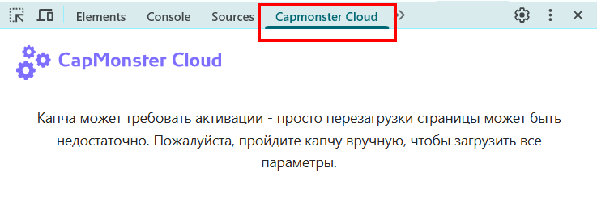
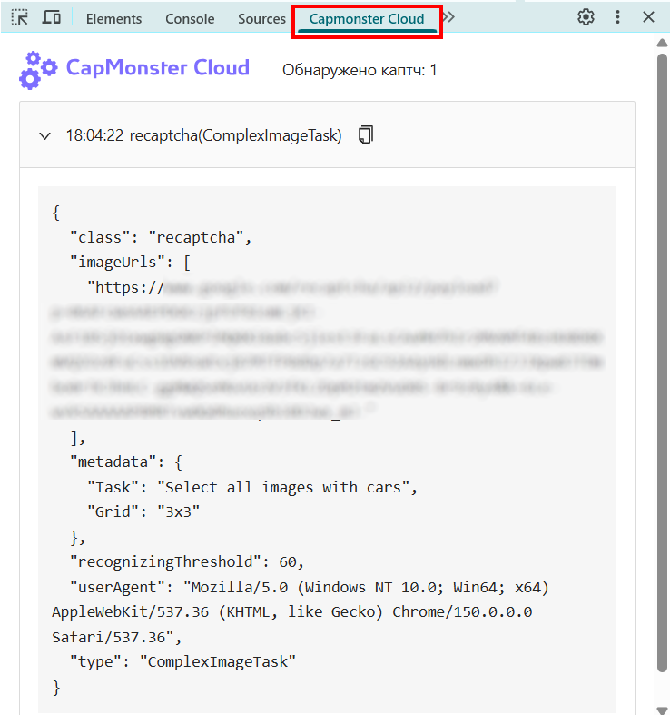

import { ArticleHead } from '../../../src/theme/ArticleHead';

<ArticleHead slug="extension/captcha-parameters" />

# Получение параметров CAPTCHA в расширении Chrome

Расширение CapMonster Cloud отображает параметры CAPTCHA, обнаруженной на странице. Полученные данные можно использовать как пример при формировании объекта `task` для отправки задачи через API CapMonster Cloud.

:::warning Внимание!
Функция предназначена только для ознакомления с **форматом запроса**. Не копируйте все значения параметров из расширения, так как некоторые из них могут меняться каждый раз при загрузке страницы с CAPTCHA. 
Перед отправкой задачи используйте актуальные параметры (*более подробно, как найти все параметры, см. в документации для соответствующего [типа CAPTCHA](../../captchas/)*).
:::

## Как просмотреть параметры

Перед началом убедитесь, что:

- расширение CapMonster Cloud установлено и включено;
- в настройках указан действующий API-ключ;
- на балансе достаточно средств;
- нужный тип CAPTCHA включён для автоматического решения.

Чтобы просмотреть параметры:

1. Откройте страницу с CAPTCHA.
2. Откройте **Инструменты разработчика**.
3. Перейдите на вкладку **CapMonster Cloud**:

   

4. Перезагрузите страницу.

Параметры обнаруженной CAPTCHA отобразятся автоматически:



Чтобы скопировать параметры, нажмите значок копирования рядом с названием обнаруженной CAPTCHA.

:::info
Во вкладке отображается содержимое объекта `task`, которое расширение передаёт в CapMonster Cloud.

При самостоятельной отправке запроса через API поместите эти данные в поле `task` и добавьте `clientKey`.
:::

Пример полного запроса для выбранного типа CAPTCHA (в данном случае для reCAPTCHA v2, решаемой [методом кликов](/docs/captchas/recaptcha-click.mdx)):

```json
{
  "clientKey": "API_KEY",
  "task": {
    "class": "recaptcha",
    "imageUrls": ["IMAGE_URL"],
    "metadata": {
      "Task": "Select all squares with motorcycles",
      "Grid": "3x3"
    },
    "recognizingThreshold": 60,
    "userAgent": "userAgentPlaceholder",
    "type": "ComplexImageTask"
  }
}
```

:::warning Важно
Для API-запросов используйте актуальный `userAgent`, поддерживаемый CapMonster Cloud.

Получить текущее значение можно по адресу: [https://capmonster.cloud/api/useragent/actual](https://capmonster.cloud/api/useragent/actual).
:::

## Поддерживаемые типы CAPTCHA и параметры

| Тип CAPTCHA | Отображаемые параметры |
|---|---|
| **reCAPTCHA V2 (Click)** | `class`, `imageUrls`, `Task` внутри `metadata`, `Grid` внутри `metadata`, `recognizingThreshold`, `userAgent`, `type` |
| **reCAPTCHA V2 (Token)** | `websiteURL`, `websiteKey`, `userAgent`, `type` |
| **reCAPTCHA V2 Invisible** | `class`, `imageUrls`, `Task` внутри `metadata`, `Grid` внутри `metadata`, `recognizingThreshold`, `userAgent`, `type` |
| **reCAPTCHA V2 Enterprise (Click)** | `class`, `imageUrls`, `Task` внутри `metadata`, `Grid` внутри `metadata`, `recognizingThreshold`, `userAgent`, `type` |
| **reCAPTCHA V2 Enterprise (Token)** | `websiteURL`, `websiteKey`, `userAgent`, `recaptchaDataSValue`, `type` |
| **reCAPTCHA V3** | `websiteURL`, `websiteKey`, `pageAction`, `minScore`, `type` |
| **GeeTest v3** | `websiteURL`, `gt`, `challenge`, `userAgent`, `type` |
| **GeeTest v4** | `websiteURL`, `gt` (`captcha_id`), `userAgent`, `version`, `type` |
| **Cloudflare Turnstile** | `websiteURL`, `websiteKey`, `userAgent`, `type` |
| **Cloudflare Challenge** | `websiteURL`, `websiteKey`, `userAgent`, `pageAction`, `data`, `pageData`, `cloudflareTaskType`, `type` |
| **ImageToText** | `body` в формате `base64`, `type` |
| **BLS** | `class`, `imagesBase64`, `Task` внутри `metadata`, `TaskArgument` внутри `metadata`, `type` |
| **Binance** | `websiteURL`, `websiteKey`, `validateId`, `userAgent`, `type` |

Набор отображаемых параметров зависит от типа CAPTCHA и её реализации на конкретном сайте.
