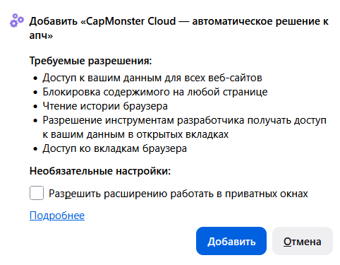
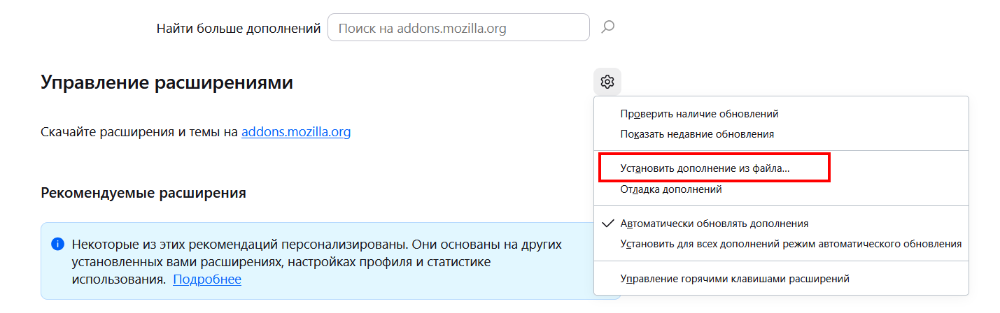
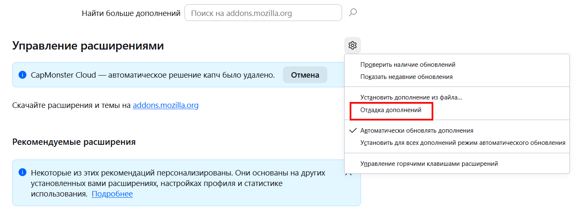
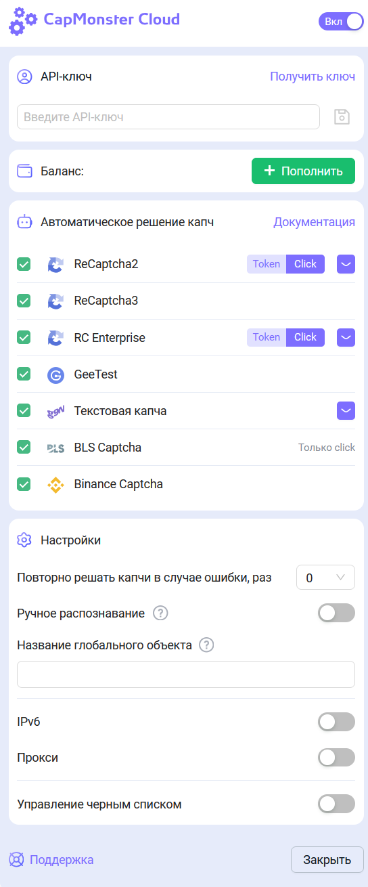
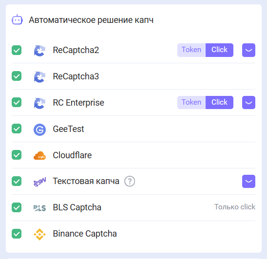
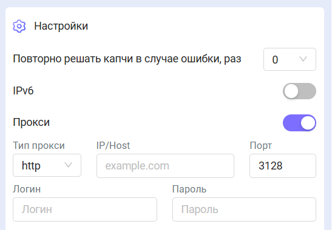
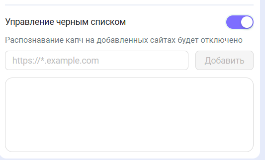

import { ArticleHead } from '../../src/theme/ArticleHead';

<ArticleHead slug="extension/extension-firefox" />

# Расширение для браузера Firefox

## Описание

С помощью данного расширения можно распознавать CAPTCHA в автоматическом режиме прямо в браузере.

Расширение предназначено для работы в браузере Mozilla Firefox.

---

## Автоматическая установка

1. Откройте [Интернет-магазин Firefox](https://addons.mozilla.org/ru/firefox/addon/capmonster-cloud/).
2. Нажмите **Добавить в Firefox**.
3. Подтвердите добавление расширения, нажав `Добавить` в модальном окне.

   

Чтобы начать работу с расширением, нажмите на его значок справа от адресной строки и перейдите к [настройкам](#настройки).

Если установить расширение из интернет-магазина не удалось, воспользуйтесь инструкцией по ручной установке.

Ручная установка расширения

1. Скачайте [архив с расширением](https://zenno.link/firefox-actual-build).

2. Откройте Firefox и перейдите к управлению расширениями:

   

3. Откройте раздел `Управление расширениями`, нажмите значок шестерёнки и выберите `Установить дополнение из файла…`.

   

4. Выберите скачанный архив с расширением.

5. После установки вернитесь в раздел `Управление расширениями` и откройте установленное расширение.

   

6. Перейдите на вкладку `Разрешения` и убедитесь, что все необходимые разрешения предоставлены. 
   

Если при стандартной установке возникают ошибки, используйте режим отладки дополнений:

1. В разделе `Управление расширениями` нажмите значок шестерёнки и выберите `Отладка дополнений`.

   

2. В открывшемся окне нажмите `Загрузить временное дополнение` и выберите скачанный архив с расширением.

Ручное обновление расширения

Если вы устанавливаете расширение поверх предыдущей версии, после обновления исходных файлов нажмите `Обновить` на странице `Управление расширениями`.

Инструкции по открытию этой страницы приведены выше в разделе ручной установки.

---

## Настройки

Как закрепить расширение

По умолчанию установленное расширение автоматически закрепляется на панели браузера.

После активации откроется окно расширения:

### API-ключ

Введите API-ключ в соответствующее поле (**1**) и нажмите **Сохранить** (**2**).

Если ключ указан правильно, ниже отобразится текущий баланс (**3**).

### Автоматическое решение CAPTCHA

Выберите типы CAPTCHA, которые расширение должно распознавать автоматически.

:::info
После изменения настроек может потребоваться перезагрузка страницы с CAPTCHA.
:::

### Повторное решение CAPTCHA при ошибке

Если CAPTCHA не удалось решить с первой попытки, расширение будет повторно отправлять задачи до успешного решения или достижения лимита, указанного в настройках.

### Прокси

В этом разделе можно указать прокси, который будет передан вместе с задачей на распознавание.

Поля **Логин** и **Пароль** заполнять необязательно. Расширение также поддерживает прокси с **IPv6**.

### Управление чёрным списком

С помощью чёрного списка можно настроить сайты, на которых расширение будет игнорировать CAPTCHA.

После включения этой опции появится поле для ввода сайтов:

Домены необходимо указывать вместе с протоколом: `https://` или `http://`.

Можно использовать следующие маски:

- `?` — любой один символ, кроме точки;
- `*` — любое количество любых символов.

| Фильтр | Пояснение |
|---|---|
| `https://zennolab.com` | Запрет работы расширения на сайте `https://zennolab.com` |
| `https://*.zennolab.com` | Запрет работы расширения на всех поддоменах `zennolab.com` |
| `https://www.google.*` | Запрет работы расширения на Google во всех доменных зонах |

При возникновении ошибок при решении CAPTCHA см. [глоссарий ошибок](/api/api-errors.mdx).

## Получение параметров CAPTCHA

Во вкладке **CapMonster Cloud** в инструментах разработчика можно просмотреть параметры обнаруженной CAPTCHA и содержимое объекта `task`, которое расширение передаёт в CapMonster Cloud.

Подробнее см. в разделе [Маппинг параметров CAPTCHA в расширении Firefox](./captcha-parameters/captcha-parameters-firefox.mdx).
