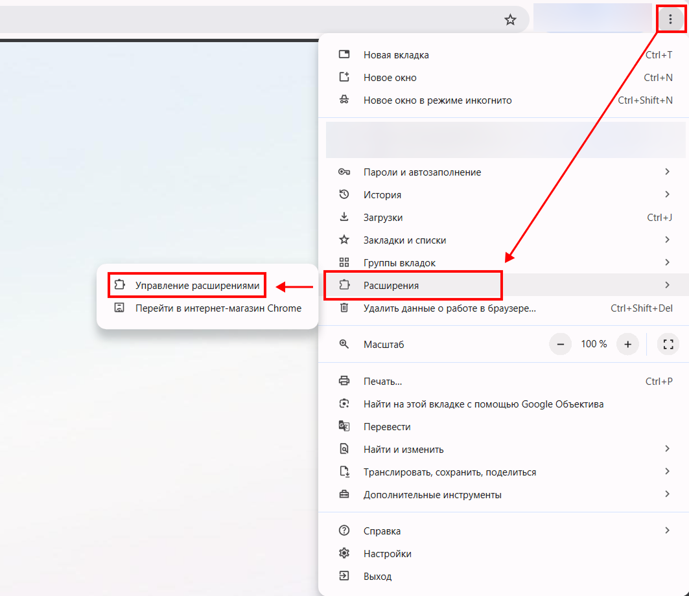
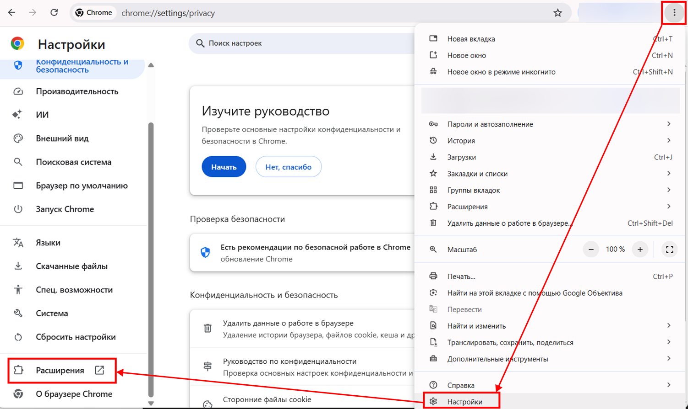
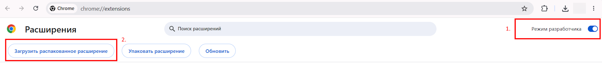
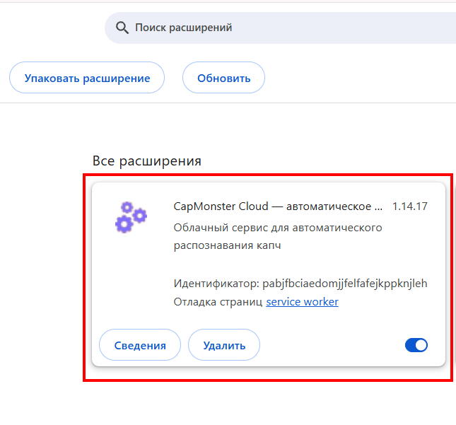
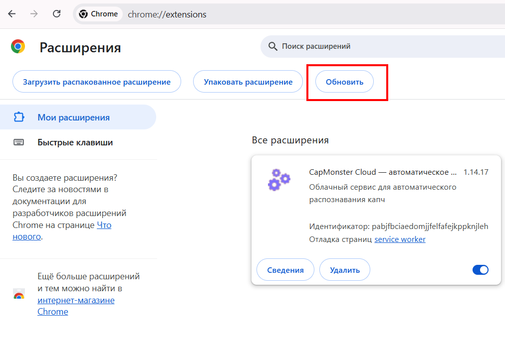

---
sidebar_position: 0
sidebar_label: Расширение для браузера Chrome
---

import { ArticleHead } from '../../src/theme/ArticleHead';

<ArticleHead slug="extension/extension-main" />

# Расширение для браузера Chrome

## Описание
С помощью данного расширения можно распознавать капчи в автоматическом режиме прямо в браузере.

Расширение предназначено для работы в браузере Google Chrome.

-----
## Автоматическая установка
**Важно!** В режиме инкогнито и гостевом режиме устанавливать расширение не рекомендуется.

1. Откройте [Интернет-магазин Chrome](https://chrome.google.com/webstore/detail/capmonster-cloud-%E2%80%94-automa/pabjfbciaedomjjfelfafejkppknjleh?hl=ru).
2. Нажмите **Установить**.

Чтобы начать работу с расширением, нажмите на его значок справа от адресной строки. Переходите к [Настройкам](#настройки).

*Если по какой-то причине не удалось установить расширение из библиотеки Google Chrome, воспользуйтесь инструкцией по ручной установке.*

Ручная установка расширения

1. Скачайте [архив с расширением](https://zenno.link/chrome-actual-build).

2. Распакуйте скачанный архив в папку с любым именем.

   > `Важно:` после установки не удаляйте папку с расширением, иначе браузер больше не сможет его использовать.

3. Введите в адресную строку браузера `chrome://extensions` и нажмите `Enter`.

   Можно открыть страницу расширений одним из следующих способов:

   - Через меню: нажмите в правом верхнем углу (рядом с изображением профиля) `⋮` → `Расширения` → `Управление расширениями`.

     

   - Или откройте настройки Google Chrome и в левом меню выберите `Расширения` (в самом низу списка).

     

4. Включите `Режим разработчика`.

5. В верхней части страницы появится панель, на которой нажмите кнопку `Загрузить распакованное расширение`.

   

6. В открывшемся окне выберите папку, в которую был распакован архив.

7. После этого расширение появится в списке установленных.

   

    
Ручное обновление расширения

Если вы устанавливаете расширение поверх предыдущей версии, после обновления исходных файлов необходимо также нажать кнопку `Обновить` на странице `Управление расширениями`. (Инструкции по открытию этой страницы приведены выше в разделе `Ручная установка`.)

-----
## Настройки

    
Как закрепить расширение

По умолчанию вновь установленное расширение скрыто. Чтобы оно постоянно отображалось, его нужно закрепить, кликнув на соответствующий значок.

После активации вы увидите окно:

 
### API ключ
Введите API-ключ в соответствующее поле(**1**), нажмите кнопку **Сохранить**(**2**). Если вы ввели правильный ключ, то ниже отобразится ваш баланс(**3**)

 

### Автоматическое решение капч
Здесь вы можете выбрать те типы капч, которые расширение будет распознавать автоматически

 

:::info !
Может потребоваться перезагрузка страницы с капчей для вступления изменений в силу!
:::

### Повторно решать капчи в случае ошибки
Если с первой попытки не удалось решить капчу, то расширение будет отправлять повторные задание, пока капча не будет решена, либо пока не будет достигнут лимит, указанный в данной настройке.

### Прокси
 

В этом разделе можно указать прокси, который будет передан вместе с задачей на распознавание.

Поля **Логин** и **Пароль** заполнять необязательно. Расширение также поддерживает прокси с **IPv6**.

### Управление чёрным списком
С помощью чёрного списка можно настроить сайты, на которых расширение будет игнорировать капчу.

После включения данной опции появится поле для ввода сайтов:

 

Домены нужно указывать вместе с протоколом (https:// или http://)
Можно использовать маски поиска:

- ? - любой один символ кроме точки
- \* - любое количество любых символов

Примеры:

|**Фильтр**|**Пояснение**|
| :-: | :-: |
|`https://zennolab.com`|Запрет работы расширения на сайте `https://zennolab.com`|
|`https://*.zennolab.com`|Запрет работы расширения на всех поддоменах `https://zennolab.com`|
|`https://www.google.*`|Запрет работы расширения на google во всех зонах (ru, com, com.ua и т.д.)|

При возникновении ошибок в разгадывании капч см. [глоссарий ошибок](/api/api-errors.mdx).

## Маппинг (отображение) параметров капч

Расширение CapMonster Cloud предоставляет удобный способ просмотра параметров различных типов капч, необходимых для их правильной отправки на сервер и успешного решения. Отображаемые данные позволяют убедиться в корректности передаваемых параметров и могут использоваться в качестве примера при формировании ваших API-запросов.

### Поддерживаемые типы капч и их параметры

| Тип капчи                           | Какие параметры отображаются                                                                                              |
| ----------------------------------- | ------------------------------------------------------------------------------------------------------------------------- |
| **reCAPTCHA V2 (Click)**            | `class`, `imageUrls`, `Task` (внутри `metadata`), `Grid` (внутри `metadata`), `recognizingThreshold`, `userAgent`, `type` |
| **reCAPTCHA V2 (Token)**            | `websiteURL`, `websiteKey`, `userAgent`, `type`                                                                           |
| **reCAPTCHA V2 Invisible**          | `class`, `imageUrls`, `Task` (внутри `metadata`), `Grid` (внутри `metadata`), `recognizingThreshold`, `userAgent`, `type` |
| **reCAPTCHA V2 Enterprise (Click)** | `class`, `imageUrls`, `Task` (внутри `metadata`), `Grid` (внутри `metadata`), `recognizingThreshold`, `userAgent`, `type` |
| **reCAPTCHA V2 Enterprise (Token)** | `websiteURL`, `websiteKey`, `userAgent`, `recaptchaDataSValue`, `type`                                                    |
| **reCAPTCHA V3**                    | `websiteURL`, `websiteKey`, `pageAction`, `minScore`, `type`                                                              |
| **GeeTest v3**                      | `websiteURL`, `gt`, `challenge`, `userAgent`, `type`                                                                      |
| **GeeTest v4**                      | `websiteURL`, `gt` (`captcha_id`), `userAgent`, `version`, `type`                                                         |
| **Cloudflare Turnstile**            | `websiteURL`, `websiteKey`, `userAgent`, `type`                                                                           |
| **Cloudflare Challenge**            | `websiteURL`, `websiteKey`, `userAgent`, `pageAction`, `data`, `pageData`, `cloudflareTaskType`, `type`                   |
| **ImageToText**                     | `body` (в формате `base64`), `type`                                                                                       |
| **BLS**                             | `class`, `imagesBase64`, `Task` (внутри `metadata`), `TaskArgument` (внутри `metadata`), `type`                           |
| **Binance**                         | `websiteURL`, `websiteKey`, `validateId`, `userAgent`, `type`                                                             |

Чтобы воспользоваться этой функцией, активируйте расширение, укажите API-ключ в настройках и убедитесь, что на балансе есть средства. Затем откройте страницу с капчей, проверьте, что её тип поддерживается и выбран для решения, и выполните следующие шаги:

1. Откройте **Инструменты разработчика** (DevTools) и перейдите на вкладку **Capmonster Cloud**:
   
   

2. Перезагрузите страницу.

:::warning **Важно**
Для API-запросов используйте актуальный `userAgent`, поддерживаемый [нашим сервисом](https://capmonster.cloud/api/useragent/actual).
:::

Параметры выбранной капчи отобразятся автоматически:

