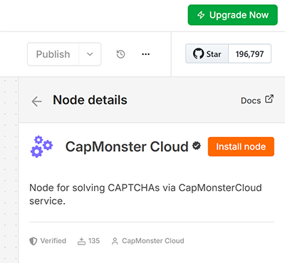
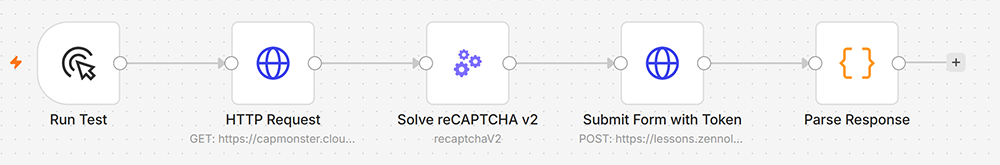

import { ArticleHead } from '../../src/theme/ArticleHead';
import Tabs from '@theme/Tabs';
import TabItem from '@theme/TabItem';

<ArticleHead slug="external-services/external-n8n" />

# Как установить и использовать ноду CapMonster Cloud для n8n

[**n8n**](https://n8n.io/) — это открытая платформа автоматизации рабочих процессов, в которой бизнес-логика строится из узлов (нод), обменивающихся данными через HTTP API, вебхуки и интеграции с внешними сервисами. Её ключевое преимущество — возможность запускать автоматизации как в n8n Cloud (по [разумной цене](https://n8n.io/pricing/)), так и на собственном сервере.

**Нода CapMonster Cloud** позволяет добавить в эти рабочие процессы автоматическое решение CAPTCHA: она отправляет задачи в CapMonster Cloud, получает готовые токены или ответы и передаёт их далее по цепочке. Это позволяет надёжно автоматизировать сценарии n8n, связанные с веб-формами, регистрациями, входом в систему, скрапингом и другими операциями, которые иначе блокируются CAPTCHA-защитой.

Нода поддерживает практически все типы задач, для которых CapMonster Cloud API предоставляет решения, и регулярно обновляется.

Некоторые типы задач опционально поддерживают прокси. Необходимость использования собственных прокси можно узнать на [страницах конкретных капч](https://docs.capmonster.cloud/ru/docs/captchas/).

## Установка ноды

В зависимости от вашей конфигурации n8n вы можете установить **ноду CapMonster Cloud** одним из нижеследующих способов.

<Tabs className="full-width-tabs filled-tabs request-tabs" groupId="captcha-type">

    <TabItem value="self-hosted" label="Собственный сервер n8n" default className="method-panel">

        ### <span style={{padding: '0px 0px 0px 15px', marginTop: '15px', display: 'inline-block'}}>Установка через CLI</span>

        1. Войдите в свой инстанс n8n через CLI
        2. Перейдите в каталог, в котором обычно устанавливаются ноды n8n (например, `~/.n8n/nodes`)
        3. Установите пакет как community-ноду:

           `npm install @zennolab_com/n8n-nodes-capmonstercloud`

        4. Перезапустите n8n командой:

           `n8n`

        5. Готово.

        ### <span style={{padding: '0px 0px 0px 15px', marginTop: '15px', display: 'inline-block'}}>Установка через UI</span>

        1. Откройте UI n8n в браузере
        2. Перейдите в раздел **Settings → Community nodes**

           

        3. Нажмите **Install a community node**

           

        4. Введите `@zennolab_com/n8n-nodes-capmonstercloud` в поле **npm Package Name**, отметьте флажок «I understand the risks…» и нажмите **Install**

           

        5. Готово.

    </TabItem>

    <TabItem value="n8n-cloud" label="n8n Cloud" default className="method-panel">

        <span style={{padding: '0px 0px 0px 15px', marginTop: '15px', display: 'inline-block'}}>Чтобы установить community-ноду CapMonster Cloud в ваш инстанс n8n Cloud:</span>

        1. Откройте [панель управления n8n](https://app.n8n.cloud/dashboard) и перейдите в один из своих инстансов n8n.
        2. Создайте новый рабочий процесс или откройте любой существующий.
        3. Перейдите на **Canvas** и откройте панель нод, нажав **\+** или клавишу **N**

           

        4. Найдите ноду **CapMonster Cloud** и выберите её

           

        5. Нажмите **Install node**

           

        6. Теперь вы можете добавлять ноду в свои рабочие процессы.

    </TabItem>

</Tabs>

## Пример использования

Ниже приведено пошаговое руководство по демонстрационному рабочему процессу с использованием ноды CapMonster Cloud.



Если вы опытный пользователь n8n, вы можете [скачать](./images/external-n8n/CapMonster_Cloud_node_for_n8n_Demo.json) этот рабочий процесс, импортировать его в свой проект и изучить самостоятельно.

### Необходимые условия

* Аккаунт CapMonster Cloud
* API-ключ CapMonster Cloud (получить его можно в [панели управления CapMonster Cloud](https://dash.capmonster.cloud/))

### Шаг 1 — Создание нового рабочего процесса

1. В левой боковой панели нажмите **\+ New workflow**
2. Нажмите на заголовок в верхней части и переименуйте его: `CapMonster Cloud — reCAPTCHA v2 Demo` (например)

### Шаг 2 — Нода Manual Trigger

1. На холсте нажмите **\+** → найдите **Manual Trigger** → добавьте его
2. Дважды кликните по ноде → установите **Name** в значение `Run Test`
3. Закройте панель

### Шаг 3 — Нода HTTP Request (получение актуального User-Agent)

Эта нода получает актуальную строку User-Agent с собственного эндпоинта CapMonster Cloud, что повышает процент успешного принятия токенов.

1. Нажмите **\+** после `Run Test` → найдите **HTTP Request** → добавьте его
2. Переименуйте ноду: `HTTP Request`
3. Заполните параметры:

    | Поле | Значение |
    | ----- | ----- |
    | **Method** | GET |
    | **URL** | `https://capmonster.cloud/api/useragent/actual` |

4. Оставьте все остальные настройки по умолчанию
5. Закройте панель

### Шаг 4 — Нода CapMonster Cloud (решение CAPTCHA)

В этом примере показаны настройки ноды для решения reCAPTCHA v2 на специальной демо-странице CapMonster Cloud.

1. Нажмите **\+** после `HTTP Request` → найдите **CapMonster Cloud** → добавьте его
2. Переименуйте ноду: `Solve reCAPTCHA v2`
3. Заполните параметры:

    | Поле | Значение |
    | ----- | ----- |
    | **Task Type** | RecaptchaV2 (reCAPTCHA V2) |
    | **Website URL** | `https://lessons.zennolab.com/captchas/recaptcha/v2_simple.php?level=high` |
    | **Website Key** | `6Lcg7CMUAAAAANphynKgn9YAgA4tQ2KI_iqRyTwd` |
    | **User Agent** | Переключитесь в режим выражения (`=`) и введите `{{ $json.data }}` |
    | **Is Invisible** | Выключено (false) |

4. В разделе **Credential** нажмите **Create new credential**:
   * Вставьте свой API-ключ CapMonster Cloud в поле **Client Key**
   * Нажмите **Save**
5. Закройте панель

### Шаг 5 — Нода HTTP Request (отправка токена)

1. Нажмите **\+** после `Solve reCAPTCHA v2` → найдите **HTTP Request** → добавьте его
2. Переименуйте ноду: `Submit Form with Token`
3. Заполните параметры:

    | Поле | Значение |
    | ----- | ----- |
    | **Method** | POST |
    | **URL** | `https://lessons.zennolab.com/captchas/recaptcha/verify.php?type=v2&subtype=simple&level=high` |

4. Включите переключатель **Send Body**:

   * **Body Content Type** → `Form Urlencoded`
   * **Specify Body** → `Using Fields Below`
   * Нажмите **Add Field**:
     * **Name**: `g-recaptcha-response`
     * **Value**: переключитесь в режим выражения (`=`) и введите `{{ $json.gRecaptchaResponse }}`
5. Разверните раздел **Options** внизу:

   * Откройте **Response**
   * Включите **Full Response** (возвращает код статуса и заголовки)
   * Включите **Never Error** (при ответах не из диапазона 2xx исключение вызываться не будет)
   * **Response Format** → `Text`
6. Закройте панель

### Шаг 6 — Нода Code (разбор ответа сервера)

Сервер ZennoLab возвращает HTML-страницу. JSON с результатом проверки встроен внутрь тега `<pre>`. Эта нода Code извлекает его.

1. Нажмите **\+** после `Submit Form with Token` → найдите **Code** → добавьте его
2. Переименуйте ноду: `Parse Response`
3. Установите **Language** в значение `JavaScript`
4. Замените код по умолчанию следующим:

    ```javascript
    const html = $input.first().json.data;
    const match = html.match(/<pre>([\s\S]*?)<\/pre>/);
    if (!match) {
      // Если тег <pre> не найден, возвращаем объект с ошибкой
      return [{ json: { success: false, challenge_ts: null, hostname: null, _error: 'No pre tag found' } }];
    }
    const parsed = JSON.parse(match.trim());
    return [{ json: parsed }];
    ```

5. Закройте панель

### Шаг 8 — Проверка соединений

Убедитесь, что стрелки идут именно в таком порядке:

**Run Test → HTTP Request → Solve reCAPTCHA v2 → Submit Form with Token → Parse Response**

Если какая-либо нода не соединена — перетащите стрелку от выхода предыдущей ноды к входу следующей.

### Шаг 9 — Сохранение и запуск

1. Нажмите **Ctrl+S** (или **Save** в верхней части экрана), чтобы сохранить рабочий процесс
2. Нажмите **Test workflow** (или **Execute** на ноде `Run Test`)
3. Подождите примерно 15–20 секунд, пока CapMonster Cloud решит CAPTCHA

### Ожидаемый результат

В выводе ноды **`Parse Response`** вы должны увидеть:

```json
{
  "success": true,
  "challenge_ts": "2026-07-17T14:15:48Z",
  "hostname": "lessons.zennolab.com"
}
```

`"success": true` подтверждает, что токен CAPTCHA был решён CapMonster Cloud и принят API верификации Google.