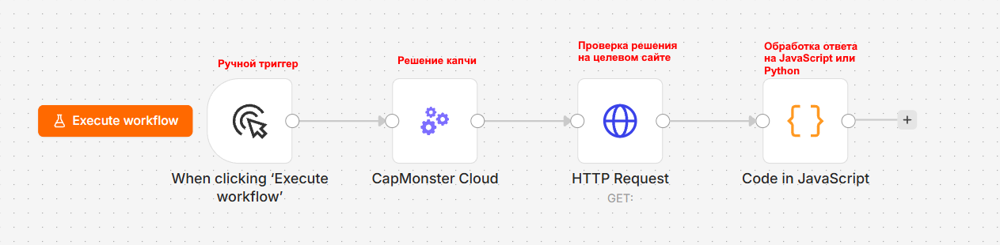
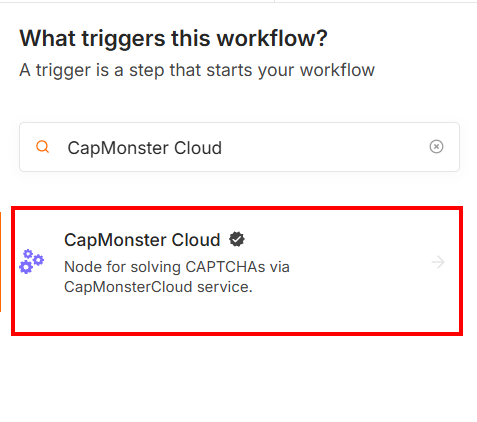
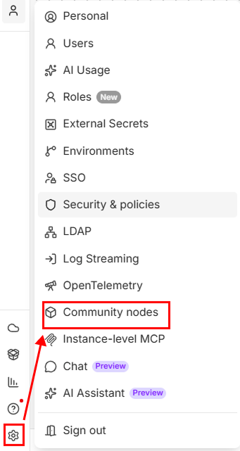
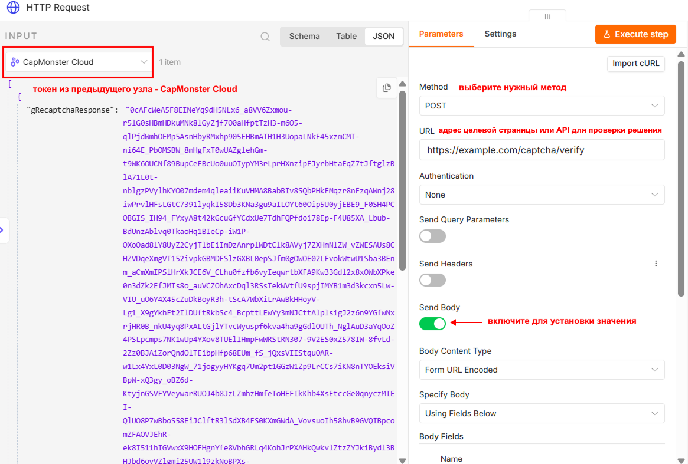
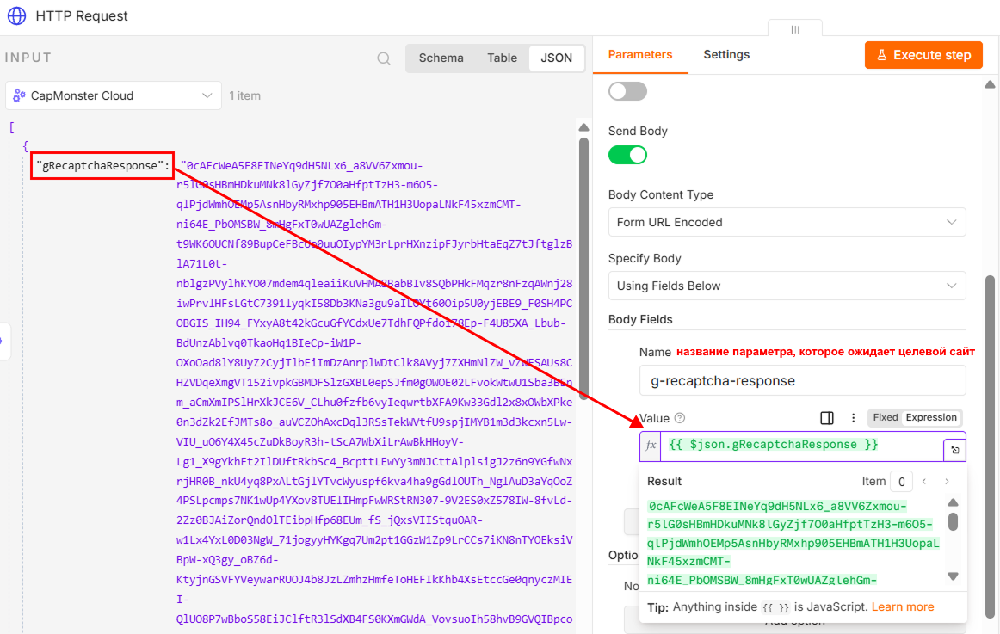
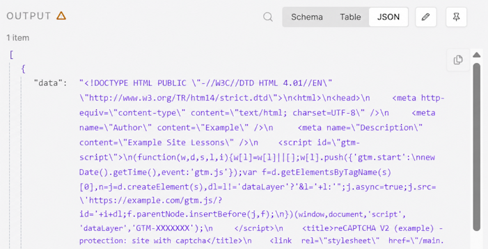
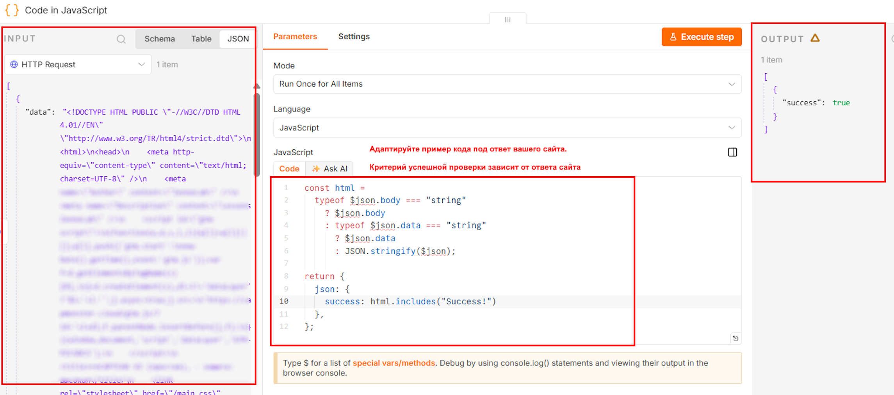

import BlogLink from '@theme/BlogLink';
import { ArticleHead } from '../../src/theme/ArticleHead';

<ArticleHead slug="external-services/n8n" />

# Решение CAPTCHA в n8n с помощью CapMonster Cloud

n8n – это платформа для автоматизации рабочих процессов, в которой сценарии создаются из связанных между собой узлов (нод). Каждый узел выполняет отдельное действие: запускает workflow, отправляет HTTP-запрос, обрабатывает данные или обращается к внешнему сервису. n8n можно использовать в облаке или развернуть на собственном сервере.

CapMonster Cloud в n8n используется для автоматического решения CAPTCHA внутри workflow. Узел (нода) отправляет параметры CAPTCHA в сервис, получает токен или другой результат решения и передаёт его следующим узлам – например, для отправки формы, выполнения API-запроса или продолжения сбора данных с веб-страницы.

Базовый workflow может выглядеть следующим образом:



<BlogLink url="https://capmonster.cloud/ru/blog/kak-reshit-recaptcha-v2-v-n8n-s-pomoshchyu-capmonster-cloud/"/>
<BlogLink url="https://capmonster.cloud/ru/blog/capmonster-cloud-teper-dostupen-v-n8n/"/>

## Способы установки

### Установка из панели узлов

1. Откройте workflow.
2. Нажмите **Add first step...** или **+**. При необходимости переименуйте workflow, заменив имя по умолчанию `My workflow`, например, на `CapMonster Cloud workflow`.


3. В строке *Search nodes...* введите "CapMonster Cloud".
4. Выберите найденный узел.



5. Нажмите **Install node**:


### Установка через npm

Этот способ предназначен для **self-hosted n8n** и требует доступа к серверу или компьютеру, на котором развернут сервис. После установки пакета перезапустите n8n, чтобы узел **CapMonster Cloud** появился в панели добавления узлов.

1. Остановите запущенный экземпляр n8n.

2. Откройте терминал на сервере.

3. Перейдите в каталог пользовательских узлов n8n:

```bash
cd ~/.n8n/nodes
```

Если каталога ещё нет, создайте его:

```bash
mkdir -p ~/.n8n/nodes
cd ~/.n8n/nodes
```

4. Если в каталоге отсутствует файл `package.json`, создайте его:

```bash
npm init -y
```

5. Установите пакет CapMonster Cloud:

```bash
npm install @zennolab_com/n8n-nodes-capmonstercloud
```

6. Запустите или перезапустите n8n.

7. Откройте workflow, нажмите **+** и найдите узел **CapMonster Cloud**.

Проверить установленную версию пакета можно командой:

```bash
npm list @zennolab_com/n8n-nodes-capmonstercloud
```

:::warning Важно
Не устанавливайте пакет глобально с параметром `-g`. Он должен находиться в каталоге пользовательских узлов того экземпляра n8n, в котором будет использоваться.
:::

## Обновление и удаление пакета

### Через интерфейс n8n

Если узел установлен из панели узлов:

1. Откройте **Settings** → **Community nodes**.



2. Найдите пакет **CapMonster Cloud**.
3. Откройте меню **Options** с помощью кнопки `⋮`.
4. Выберите нужное действие:
   * **Update package** – установить доступную новую версию;
   * **Uninstall package** – удалить пакет.
5. При необходимости перезапустите n8n.

:::note
* Кнопка **Update package** отображается только при наличии новой версии пакета.

* После удаления пакета существующие workflow с узлом CapMonster Cloud сохранятся, но не смогут выполняться до его повторной установки.
:::

### Через npm

```bash
cd ~/.n8n/nodes
```

Чтобы установить последнюю доступную версию, выполните:

```bash
npm install @zennolab_com/n8n-nodes-capmonstercloud@latest
```

Чтобы удалить пакет, выполните:

```bash
npm uninstall @zennolab_com/n8n-nodes-capmonstercloud
```

После обновления или удаления перезапустите n8n.


:::warning Важно
После удаления пакета существующие workflow с узлом CapMonster Cloud сохранятся, но не смогут выполняться до повторной установки пакета.
:::


## Настройка узла CapMonster Cloud

В разделе **Triggers** отображаются доступные способы запуска workflow: <br />

**On a Schedule** – запускает workflow автоматически по заданному расписанию. Например, сценарий можно выполнять через определённые интервалы времени, ежедневно или по cron-выражению. *Подробнее см. в документации n8n: [Schedule Trigger](https://docs.n8n.io/integrations/builtin/core-nodes/n8n-nodes-base.scheduletrigger/)*. <br />

**On a Webhook call** – запускает workflow при поступлении HTTP-запроса на webhook URL. Такой способ подходит, если параметры CAPTCHA передаются из внешнего приложения, сайта или сценария браузерной автоматизации. *Подробнее см. в документации n8n: [Webhook](https://docs.n8n.io/integrations/builtin/core-nodes/n8n-nodes-base.webhook/)*. <br />

:::note
Сообщение **No CapMonster Cloud Triggers available** означает, что узел CapMonster Cloud не может запускать workflow самостоятельно. Его добавляют после триггера или другого узла, который передаёт параметры CAPTCHA.
:::

Чтобы вернуть результат внешнему приложению после запуска через webhook, можно использовать узел [Respond to Webhook](https://docs.n8n.io/integrations/builtin/core-nodes/n8n-nodes-base.respondtowebhook/).

Типовая последовательность узлов:

```text
Trigger → CapMonster Cloud → использование полученного результата
````

Для запуска через webhook последовательность может выглядеть так:

```text
Webhook → CapMonster Cloud → Respond to Webhook
```

В разделе **Actions** представлены все доступные для решения типы CAPTCHA: 


6. Выберите нужный тип капчи.
7. Нажмите **Create new credential**.


8. В открывшемся окне укажите API-ключ CapMonster Cloud.
9. Вставьте ключ в поле **API Key** и сохраните.


10. Заполните все обязательные параметры. 

:::warning Важно
* Не передавайте API-ключ непосредственно в параметрах workflow и не публикуйте его в экспортированном JSON-файле. Храните ключ в Credentials n8n и ограничьте доступ к учётным данным.

* Для некоторых типов CAPTCHA также требуется прокси – соответствующие требования указаны в документации выбранного типа CAPTCHA.
:::


:::tip
* Подробное описание параметров и способы получения их значений приведены в разделе [Типы CAPTCHA](../../captchas). Выберите нужный тип CAPTCHA и откройте соответствующую статью.

* Актуальный User-Agent устанавливается автоматически.
:::

Во вкладке **Settings** настраивается поведение узла:

* **Always Output Data** – возвращать данные даже при пустом результате.
* **Execute Once** – выполнить узел один раз для всех входных данных.
* **Retry On Fail** – повторить выполнение при ошибке.
* **On Error** – выбрать действие при ошибке.
* **Notes** – добавить комментарий к узлу.
* **Display Note in Flow** – показать комментарий на схеме workflow.

Обычно эти параметры можно оставить без изменений.

11. Заполнив все данные, нажмите **Execute step**:


:::tip
* **Execute step** выполняет только выбранный узел;

* **Execute workflow** запускает весь сценарий
:::

Если задача выполнена успешно, в панели **OUTPUT** появится объект с результатом решения. Например, для reCAPTCHA v2 ответ будет содержать поле с полученным токеном:


Полученный ответ необходимо передать в следующий узел workflow и использовать при отправке запроса к целевому сайту.

:::warning Важно
Результат решения может иметь ограниченный срок действия, поэтому рекомендуется использовать его сразу после получения.
:::


## Типичные сценарии использования

Узел **CapMonster Cloud** можно использовать в workflow n8n, где выполнение следующего шага зависит от результата решения CAPTCHA.

### Сбор данных с веб-страниц

При сборе общедоступных данных сайт может запрашивать прохождение CAPTCHA перед отображением страницы или выполнением поискового запроса.

Типовая последовательность узлов:

```text
Trigger → HTTP Request → CapMonster Cloud → HTTP Request → обработка данных
```

Workflow может выполнять следующие действия:

1. Открыть целевую страницу с помощью **HTTP Request**.
2. Получить параметры CAPTCHA.
3. Передать их в узел **CapMonster Cloud**.
4. Получить токен или другой результат решения.
5. Повторить запрос к странице с результатом CAPTCHA.
6. Извлечь нужные данные с помощью узлов **HTML**, **Code** или **Edit Fields**.
7. Сохранить результат в файл, таблицу или базу данных.

### Отправка веб-форм

Узел можно использовать в сценариях, где перед отправкой формы необходимо получить результат CAPTCHA.

Типовая последовательность:

```text
Получение данных → CapMonster Cloud → HTTP Request → проверка ответа
```

Например, workflow может:

1. Получить данные формы из webhook, таблицы или другого узла.
2. Решить CAPTCHA.
3. Добавить полученный токен в тело запроса.
4. Отправить форму с помощью **HTTP Request**.
5. Проверить ответ сайта или API.

Название параметра, в котором передаётся токен, зависит от реализации целевого сайта.

### Работа с API

Некоторые API требуют результат CAPTCHA вместе с остальными параметрами запроса.

Типовая последовательность:

```text
Trigger → CapMonster Cloud → HTTP Request → Code
```

После выполнения узла **CapMonster Cloud** результат можно передать в JSON-теле, query-параметрах или заголовках запроса – в зависимости от требований API.

Например:

```json
{
  "captchaToken": "{{$json.solution.gRecaptchaResponse}}",
  "action": "submit"
}
```

Структура результата и путь к токену зависят от выбранного типа CAPTCHA.

### Браузерная автоматизация

Результат решения можно передать во внешний сценарий браузерной автоматизации, например в Playwright, Puppeteer, Selenium или ZennoPoster.

Пример последовательности:

```text
Webhook → CapMonster Cloud → HTTP Request → сценарий браузерной автоматизации
```

В этом случае n8n может:

1. Получить параметры CAPTCHA из внешнего сценария.
2. Создать задачу в CapMonster Cloud.
3. Вернуть результат через webhook или API.
4. Передать токен в браузерную сессию.
5. Продолжить выполнение сценария.

При таком подходе важно использовать результат в той же браузерной сессии, для которой были получены параметры CAPTCHA.

### Пакетная обработка

Если входной узел возвращает несколько элементов, n8n может создать отдельную задачу для каждого элемента.

Например:

```text
Google Sheets → Loop Over Items → CapMonster Cloud → HTTP Request
```

Такой workflow подходит для последовательной обработки списка страниц или заданий.

При пакетной обработке рекомендуется:

* ограничивать количество одновременно выполняемых задач;
* использовать **Loop Over Items** или другой механизм управления очередью;
* обрабатывать ошибки отдельно для каждого элемента;
* не включать **Execute Once**, если CAPTCHA должна решаться для каждого входного элемента;
* учитывать лимиты и баланс аккаунта CapMonster Cloud.


## Работа с узлом HTTP Request

Чтобы использовать полученный результат решения, добавьте после узла **CapMonster Cloud** узел **HTTP Request**.

1. Нажмите **+** рядом с узлом CapMonster Cloud.
2. Найдите и выберите **HTTP Request**.
3. Укажите метод запроса и адрес целевой страницы или API.



4. При необходимости добавьте заголовки, параметры запроса, cookies и тело запроса.

:::warning Важно 
Если целевой сайт использует сессию, отправляйте результат CAPTCHA с теми же cookies, прокси, заголовками и другими параметрами, которые использовались при открытии страницы. Изменение параметров сессии может привести к отклонению результата. 
:::

5. В поле, предназначенное для результата CAPTCHA, передайте значение из предыдущего узла с помощью **Expression**.

Например:



6. После отправки результата CAPTCHA вы получите ответ целевой страницы или API. Формат ответа зависит от используемого эндпоинта: это может быть HTML-код страницы, JSON-объект или другой тип данных.




**Дополнительно:**

Для автоматической проверки результата можно добавить после **HTTP Request** узел **Code**.

:::note
Способ проверки зависит от ответа целевого сайта. В узле **Code** можно проверить HTTP-статус, конечный URL после перенаправления, наличие ожидаемого элемента в HTML, установку cookie или другой признак успешной обработки запроса.
:::

### Проверка HTML-ответа

Например, если после успешной проверки на странице отображается текст «Success!», результат можно автоматически проверить с помощью следующего кода в узле **Code**: 

```js
const html =
  typeof $json.body === "string"
    ? $json.body
    : typeof $json.data === "string"
      ? $json.data
      : JSON.stringify($json);

return {
  json: {
    success: html.includes("Success!")
  },
};
```



### Проверка JSON-ответа

Если API возвращает JSON, проверяйте нужное поле напрямую. Например, для ответа:

```json
{
  "success": true,
  "status": "verified"
}
```

можно использовать следующий код:

```js
return {
  json: {
    success:
      $json.success === true &&
      $json.status === "verified"
  },
};
```

Названия полей и ожидаемые значения необходимо заменить в соответствии с ответом используемого API.

## Экспорт и перенос workflow

При экспорте workflow учётные данные не передаются вместе с ним. После импорта сценария в другой экземпляр n8n необходимо заново создать **Credentials** и выбрать их в узле CapMonster Cloud.

## Отладка workflow

Для проверки данных между узлами можно:

* открыть вкладку **OUTPUT**;
* временно закрепить результат с помощью **Pin data**;
* добавить узел **Edit Fields** для преобразования структуры данных;
* использовать узел **Code** для проверки и нормализации ответа;
* просмотреть историю выполнений в разделе **Executions**.

## Обработка ошибок

Если узел завершился с ошибкой:

1. Откройте вкладку **OUTPUT**.
2. Проверьте код и текст ошибки.
3. Убедитесь, что параметры CAPTCHA указаны правильно.
4. Проверьте баланс и API-ключ.
5. Убедитесь, что прокси доступен и подходит для выбранного типа задачи.
6. При временной ошибке включите **Retry On Fail** во вкладке **Settings**.


| Проблема                 | Возможная причина                               |
| ------------------------ | ----------------------------------------------- |
| Узел не отображается     | Пакет не установлен или n8n не перезапущен      |
| Ошибка авторизации       | Неверный API-ключ                               |
| Задача долго выполняется | CAPTCHA сложная или прокси работает нестабильно |
| Токен отклонён сайтом    | Истёк срок действия или нарушена сессия         |
| Отсутствует результат    | Неверно указаны параметры CAPTCHA               |
<br />


:::tip
Ошибки при решении капчи описаны в [специальном разделе](../../api/api-errors)
:::