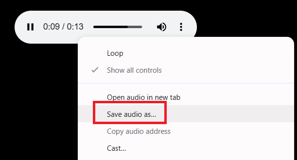

import Tabs from '@theme/Tabs';
import TabItem from '@theme/TabItem';
import ParamItem from '@theme/ParamItem';
import MethodItem from '@theme/MethodItem';
import MethodDescription from '@theme/MethodDescription';
import PriceBlock from '@theme/PriceBlock';
import PriceBlockWrap from '@theme/PriceBlockWrap';
import { ArticleHead } from '@site/src/theme/ArticleHead';

<ArticleHead slug="captchas/compleximage/bills_audio" />

# bills_audio


<PriceBlockWrap>
  <PriceBlock title="bills_audio" captchaId="complex-rec_bills_audio" />
</PriceBlockWrap>

:::warning **Attention!**
Using proxy servers is not required for this task.
:::
<br />
The `bills_audio` audio captcha is an audio version of the “receipt captcha”, where generated images or data simulate receipts and may contain digits, amounts, and dates. In this type of task, the user is asked to listen to an audio file and verify the correct input based on the information heard. This format may look like the following:

 

## Request parameters

<br />
<span style={{ fontSize: "15px", fontWeight: 700 }}>
> IMPORTANT: obtain the base64 audio directly before creating the task to avoid errors during solving (see section [Obtaining audio and converting to Base64](#obtaining-audio-and-converting-to-base64)).
</span>
<br />

<div className="bordered-panel">
    <ParamItem title="type" required type="string" />
    **ComplexImageTask**

    ---

    <ParamItem title="class" required type="string" />
    **recognition**

    ---

    <ParamItem title="imagesBase64" required type="array" />
    Base64-encoded audio wrapped in an array.<br />
    Example: `["UklGRnjuAwBXQVZFZm10...f/2f/9/6z/vf8MAAAA"]`

    ---

    <ParamItem title="Task (inside metadata)" required type="string" />
    Task name: `"bills_audio"`<br />

    ---

    <ParamItem title="PayloadType (inside metadata)" required type="string" />
    Type of data sent in the task: `"Audio"`

</div>

## Create task method

<div className="method-panel">
    <MethodItem>
    ```http
    https://api.capmonster.cloud/createTask
    ```
    </MethodItem>
    <MethodDescription>
      **Request example**
```json
{
    "clientKey": "API_KEY",
    "task": {
        "type": "ComplexImageTask",
        "class": "recognition",
        "imagesBase64": [
            "UklGRnjuAwBXQVZFZm10...f/2f/9/6z/vf8MAAAA"
        ],
        "metadata": {
            "Task": "bills_audio",
            "PayloadType": "Audio"
        }
    }
}
```
**Response example**
```json
{
    "errorId": 0,
    "taskId": 143998457
}
```
</MethodDescription>

</div>

## Get task result method

<div className="method-panel-full">
    <MethodItem>
    ```http
    https://api.capmonster.cloud/getTaskResult
    ```
    </MethodItem>
    <MethodDescription>
    **Request example**
    ```json
    {
        "clientKey": "API_KEY",
        "taskId": 143998457
    }
    ```
    **Response example:**<br/>
    The result contains digits from the audio:
    ```json
    {
      "solution": {
          "answer": [6, 8, 4, 1, 2, 3],
          "metadata": {"AnswerType": "Text"}
      },
      "cost": 0.0008,
      "status": "ready",
      "errorId": 0,
      "errorCode": null,
      "errorDescription": null
    }
    ```
    </MethodDescription>
</div>

## Obtaining audio and converting to Base64

1. Open the captcha page and launch **DevTools**, then go to the **Network** tab.  
2. Activate the audio mode of the captcha by clicking the corresponding button.  
3. In the request list, find an address like:  
   `blob:https://example.com/3be79ac6-1b3d-43ef-9a8a-7ad8877b3606`  
4. Copy this URL and open it in the browser address bar — the captcha audio file in **.wav** format will open.




5. Save the file and convert the **.wav** file to **Base64** using any convenient method — for example, with Node.js:

```JavaScript
const fs = require("fs");

// Path to the source .wav file
const filePath = "C:\\Users\\User\\Downloads\\file-acbe-4fb3-9f8e-f989ba6c7fde.wav";

const fileBuffer = fs.readFileSync(filePath);

// Convert to Base64
const base64 = fileBuffer.toString("base64");

// Save Base64 string to a text file
fs.writeFileSync("output.txt", base64);

console.log("File successfully converted to Base64 and saved as output.txt");
```

6. Use the resulting Base64 string in the CapMonster Cloud task request.

## Use the SDK library

<Tabs className="full-width-tabs filled-tabs request-tabs" groupId="captcha-type">

  <TabItem value="js" label="JavaScript / TypeScript" default className="method-panel">
  <details>
      <summary>Show code (for browser)</summary>
```js
// https://github.com/CapMonsterCloud/capmonster-nodejs-captcha-solver

import {
  CapMonsterCloudClientFactory,
  ClientOptions,
  ComplexImageTaskRecognitionRequest
} from "@zennolab_com/capmonstercloud-client";

document.addEventListener("DOMContentLoaded", async () => {

  const API_KEY = "YOUR_API_KEY"; // Specify your CapMonster Cloud API key

  const client = CapMonsterCloudClientFactory.Create(
    new ClientOptions({ clientKey: API_KEY })
  );

  // Proxies are not required for ComplexImageTaskRecognitionRequest
  const billsAudioRequest = new ComplexImageTaskRecognitionRequest({
    imagesBase64: ["your_audio_base64"],
    metaData: {
      Task: "bills_audio",
      PayloadType: "Audio",
    },
  });

  // You can check your balance if necessary
  const balance = await client.getBalance();
  console.log("Balance:", balance);

  const result = await client.Solve(billsAudioRequest);
  console.log("Solution:", result.solution);
});
```
  </details>

    <details>
      <summary>Show code (Node.js)</summary>
```javascript
// https://github.com/CapMonsterCloud/capmonster-nodejs-captcha-solver

const {
  CapMonsterCloudClientFactory,
  ClientOptions,
  ComplexImageTaskRecognitionRequest,
} = require("@zennolab_com/capmonstercloud-client");

const API_KEY = "YOUR_API_KEY"; // Specify your CapMonster Cloud API key

async function solveBillsAudio() {
  const client = CapMonsterCloudClientFactory.Create(
    new ClientOptions({ clientKey: API_KEY }),
  );
  // Proxies are not required for ComplexImageTaskRecognitionRequest
  const billsAudioRequest = new ComplexImageTaskRecognitionRequest({
    imagesBase64: ["your_audio_base64"],
    metaData: {
      Task: "bills_audio",
      PayloadType: "Audio",
    },
  });

  // You can check your balance if necessary
  const balance = await client.getBalance();
  console.log("Balance:", balance);

  const result = await client.Solve(billsAudioRequest);
  console.log("Solution:", result.solution);
}

solveBillsAudio().catch(console.error);
```
</details>

  </TabItem>

  <TabItem value="python" label="Python" className="method-panel">
  <details>
      <summary>Show code</summary>
```python
# https://github.com/CapMonsterCloud/capmonster-python-captcha-solver

import asyncio

from capmonstercloudclient import CapMonsterClient, ClientOptions
from capmonstercloudclient.requests import RecognitionComplexImageTaskRequest

API_KEY = "YOUR_API_KEY"  # Specify your CapMonster Cloud API key


async def solve_bills_audio():
    client = CapMonsterClient(
        options=ClientOptions(api_key=API_KEY)
    )

    # Proxies are not required for RecognitionComplexImageTaskRequest
    bills_audio_request = RecognitionComplexImageTaskRequest(
        imagesBase64=[
            "your_audio_base64"
        ],
        metadata={
            "Task": "bills_audio",
            "PayloadType": "Audio",
        },
    )

    # You can check your balance if necessary
    balance = await client.get_balance()
    print("Balance:", balance)

    result = await client.solve_captcha(bills_audio_request)
    print("Solution:", result)


asyncio.run(solve_bills_audio())
```
    </details>

  {/* </TabItem> */}

  {/* <TabItem value="csharp" label="C#" className="method-panel">
  <details>
      <summary>Show code</summary>
```csharp
// https://github.com/CapMonsterCloud/capmonster-dotnet-captcha-solver

using System;
using System.Threading.Tasks;
using Newtonsoft.Json;
using Zennolab.CapMonsterCloud;
using Zennolab.CapMonsterCloud.Requests;

class Program
{
    static async Task Main(string[] args)
    {
        const string API_KEY = "YOUR_API_KEY"; // Specify your CapMonster Cloud API key

        var clientOptions = new ClientOptions
        {
            ClientKey = API_KEY
        };

        var cmCloudClient = CapMonsterCloudClientFactory.Create(clientOptions);

        // Proxies are not required for RecognitionComplexImageTaskRequest
        var billsAudioRequest = new RecognitionComplexImageTaskRequest
        {
            ImagesBase64 = new[]
            {
                "your_audio_base64"
            },

            Metadata = new RecognitionComplexImageTaskRequest.RecognitionMetadata
            {
                Task = "bills_audio",
                PayloadType = "Audio"
            }
        };

        // You can check your balance if necessary
        var balance = await cmCloudClient.GetBalanceAsync();
        Console.WriteLine("Balance: " + balance);

        var result = await cmCloudClient.SolveAsync(billsAudioRequest);

        Console.WriteLine("Solution:");
        Console.WriteLine(
            JsonConvert.SerializeObject(
                result.Solution,
                Formatting.Indented
            )
        );
    }
}
``` 
</details> */}
  </TabItem>

</Tabs>
