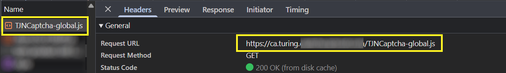

import Tabs from '@theme/Tabs';
import TabItem from '@theme/TabItem';
import ParamItem from '@theme/ParamItem';
import MethodItem from '@theme/MethodItem';
import MethodDescription from '@theme/MethodDescription'
import PriceBlock from '../../../../../src/theme/PriceBlock';
import PriceBlockWrap from '@theme/PriceBlockWrap';
import BlogLink from '@theme/BlogLink';
import { ArticleHead } from '../../../../../src/theme/ArticleHead';

<ArticleHead slug="captchas/tendi" />

# TenDI - Tencent CAPTCHA

<PriceBlockWrap>
  <PriceBlock title="Tencent captcha" captchaId="tencent"/>
</PriceBlockWrap>


<BlogLink url="https://capmonster.cloud/en/blog/ten-1/what-is-tencent-captcha-and-how-do-i-bypass-it"/>

:::warning **Attention!**
CapMonster Cloud uses built-in proxies by default — their cost is already included in the service. You only need to specify your own proxies in cases where the website does not accept the token or access to the built-in services is restricted.

If you are using a proxy with IP authorization, make sure to whitelist the address **65.21.190.34**.
:::

## Request parameters
<div className="bordered-panel">
    <ParamItem title="type" required type="string" />
    **CustomTask**

    ---

    <ParamItem title="class" required type="string" />
    **TenDI**

    ---

    <ParamItem title="websiteURL" required type="string" />
    The address of the main page where the captcha is solved.

    ---

    <ParamItem title="websiteKey" required type="string" />
    **captchaAppId** corresponds to the `aid` value. For example, `"websiteKey": "189123456"` is a unique parameter for your website. It can be obtained from the HTML of the page containing the captcha or from the network traffic (see the description below).

    ---

    <ParamItem title="captchaUrl (inside metadata)" type="string" />
    Link to the CAPTCHA script. The file is usually named `TCaptcha.js` or `TCaptcha-global.js`. For the second version, files named `TJNCaptcha*.js` and `TJCaptcha*.js` may also be used, where `*` represents any string or an empty string, for example `-global`. You can find the script among the network requests (see the example below).

    ---

    <ParamItem title="userAgent" type="string" />
    Browser User-Agent. Use the current value supported by CapMonster Cloud: `userAgentPlaceholder`<br />

You can get the latest value at: [https://capmonster.cloud/api/useragent/actual](https://capmonster.cloud/api/useragent/actual).
	
     ---

    <ParamItem title="proxyType" type="string" />
    **http** - regular http/https proxy;<br />**https** - try this option only if "http" doesn't work (required for some custom proxies);<br />**socks4** - socks4 proxy;<br />**socks5** - socks5 proxy.

     ---

    <ParamItem title="proxyAddress" type="string" />
    <p>
      IPv4/IPv6 proxy IP address. Not allowed:
      - using transparent proxies (where you can see the client's IP);
      - using proxies on local machines.
    </p>

     ---

    <ParamItem title="proxyPort" type="integer" />
    Proxy port.

     ---

    <ParamItem title="proxyLogin" type="string" />
    Proxy-server login.

     ---

    <ParamItem title="proxyPassword" type="string" />
    Proxy-server password.

</div>

## Create task method
<Tabs className="full-width-tabs filled-tabs request-tabs" groupId="captcha-type">

  <TabItem value="proxyless" label="CustomTask (without proxy)" default className="method-panel">
    <MethodItem>
      ```http
      https://api.capmonster.cloud/createTask
      ```
    </MethodItem>
    <MethodDescription>
      **Request example**
      ```json
      {
        "clientKey": "API_KEY",
        "task": {
          "type": "CustomTask",
          "class": "TenDI",
          "websiteURL": "https://yourwebsite.com/page-with-tencent",
          "websiteKey": "your-website-key",
          "userAgent": "userAgentPlaceholder",
          "metadata": {
            "captchaUrl": "https://global.captcha.example.com/TCaptcha-global.js"
          }
        }
      }
      ```

      **Response example**
      ```json
      {
        "errorId": 0,
        "taskId": 407533072
      }
      ```
    </MethodDescription>
  </TabItem>

  <TabItem value="proxy" label="CustomTask (with proxy)" className="method-panel">
    <MethodItem>
      ```http
      https://api.capmonster.cloud/createTask
      ```
    </MethodItem>
    <MethodDescription>
      **Request example**
      ```json
      {
        "clientKey": "API_KEY",
        "task": {
          "type": "CustomTask",
          "class": "TenDI",
          "websiteURL": "https://yourwebsite.com/page-with-tencent",
          "websiteKey": "your-website-key",
          "userAgent": "userAgentPlaceholder",
          "metadata": {
            "captchaUrl": "https://global.captcha.example.com/TCaptcha-global.js"
          },
          "proxyType": "your-proxy-type",
          "proxyAddress": "your-proxy-address",
          "proxyPort": 1234,
          "proxyLogin": "your-proxy-login",
          "proxyPassword": "your-proxy-password"
        }
      }
      ```

      **Response example**
      ```json
      {
        "errorId": 0,
        "taskId": 407533072
      }
      ```
    </MethodDescription>
  </TabItem>

</Tabs>

## Get task result method
Use the [getTaskResult](../api/methods/get-task-result.mdx) method to get the TenDI solution.

<div className="method-panel-full">
	<MethodItem>
		```http
		https://api.capmonster.cloud/getTaskResult
		```
	</MethodItem>
	<MethodDescription>
		**Request example**
		```json
		{
		  "clientKey":"API_KEY",
		  "taskId": 407533072
		}
		```
		**Response example**
```json
{
  "errorId": 0,
  "status": "ready",
  "solution": {
    "data": {
      "randstr": "@EcL",
      "ticket": "tr03lHUhdnuW3neJZu.....7LrIbs*"
    },
    "headers": {
      "User-Agent": "userAgentPlaceholder"
    }
  }
}		
```
	</MethodDescription>
</div>

## How to get websiteKey (captchaAppId)
Turn on the *Developer Tools*, go to the **Network** tab, activate the captcha and look at the requests. Some of them will contain the parameter value you need. In this case `websiteKey=aid`
 

## How to get captchaUrl
Open *Developer Tools*, go to the **Network** tab, trigger the CAPTCHA, and inspect the network requests. Among the loaded files, find `TCaptcha.js` or `TCaptcha-global.js`:


For the second version, files named `TJNCaptcha*.js` and `TJCaptcha*.js` may also be used:



`*` in the filename represents any string or an empty string. For example, the pattern `TJNCaptcha*.js` can match files such as `TJNCaptcha.js` or `TJNCaptcha-global.js`.

## How to find all required parameters for task creation

### Automatically

To automate parameter extraction, you can retrieve them via a **browser** (regular or headless, e.g., using **Playwright**) or directly from **HTTP requests**. Since dynamic parameter values are short-lived, it is recommended to use them immediately after retrieval.

:::warning **Important!**
The provided code snippets are basic examples for learning how to extract the required parameters. The exact implementation will depend on your captcha page, its structure, and the HTML elements and selectors used.
:::

<Tabs className="full-width-tabs filled-tabs request-tabs">
  <TabItem value="js" label="JavaScript" default className="method-panel">
    <details>
      <summary>Show code (Node.js)</summary>
      ```js
      import { chromium } from "playwright";

      (async () => {
        const browser = await chromium.launch({ headless: false });
        const page = await browser.newPage();

        // Intercept requests
        page.on("request", (request) => {
          const url = request.url();
          if (
            url.startsWith("https://sg.captcha.qcloud.com/cap_union_prehandle?aid=")
          ) {
            const parsedUrl = new URL(url);
            const aid = parsedUrl.searchParams.get("aid");
            console.log("Extracted aid:", aid);
          }
        });

        await page.goto("https://www.example.com/", { waitUntil: "load" });

        await page.waitForTimeout(5000);

        await browser.close();
      })();
      ```
    </details>
  </TabItem>

  <TabItem value="python" label="Python" className="method-panel">
    <details>
      <summary>Show code</summary>
      ```python
      import asyncio
      from playwright.async_api import async_playwright

      async def main():
          async with async_playwright() as p:
              browser = await p.chromium.launch(headless=False)
              page = await browser.new_page()

              # Intercept requests
              page.on("request", lambda request: handle_request(request))

              await page.goto("https://www.example.com/", wait_until="load")

              await asyncio.sleep(5)

              await browser.close()

      def handle_request(request):
          url = request.url
          if url.startswith("https://sg.captcha.qcloud.com/cap_union_prehandle?aid="):
              parsed_url = request.url.split('?')[1]
              params = dict(param.split('=') for param in parsed_url.split('&') if '=' in param)
              aid = params.get('aid')
              print("Extracted aid:", aid)

      asyncio.run(main())
      ```
    </details>
  </TabItem>

  <TabItem value="csharp" label="C#" className="method-panel">
    <details>
      <summary>Show code</summary>
      ```csharp
      using System;
      using System.Threading.Tasks;
      using Microsoft.Playwright;

      class Program
      {
          public static async Task Main()
          {
              using var playwright = await Playwright.CreateAsync();
              await using var browser = await playwright.Chromium.LaunchAsync(new BrowserTypeLaunchOptions {
                 Headless = false });
              var page = await browser.NewPageAsync();

              // Intercept requests
              page.Request += (_, request) =>
              {
                  var url = request.Url;
                  if (url.StartsWith("https://sg.captcha.qcloud.com/cap_union_prehandle?aid="))
                  {
                      var uri = new Uri(url);
                      var queryParams = System.Web.HttpUtility.ParseQueryString(uri.Query);
                      var aid = queryParams.Get("aid");
                      Console.WriteLine("Extracted aid: " + aid);
                  }
              };

              await page.GotoAsync("https://www.example.com/", new PageGotoOptions {
               WaitUntil = WaitUntilState.Load });

              await Task.Delay(5000);

              await browser.CloseAsync();
          }
      }
      ```
    </details>
  </TabItem>
</Tabs>

## Use the SDK Library

<Tabs className="full-width-tabs filled-tabs request-tabs" groupId="captcha-type">

  <TabItem value="js" label="JavaScript / TypeScript" default className="method-panel">
  <details>
      <summary>Show code (for browser)</summary>

```js
// https://github.com/CapMonsterCloud/capmonster-nodejs-captcha-solver

import {
  CapMonsterCloudClientFactory,
  ClientOptions,
  TenDIRequest
} from "@zennolab_com/capmonstercloud-client";

document.addEventListener("DOMContentLoaded", async () => {

  const API_KEY = "YOUR_API_KEY"; // Specify your CapMonster Cloud API key

  const client = CapMonsterCloudClientFactory.Create(
    new ClientOptions({ clientKey: API_KEY })
  );

  // Basic example without proxy
  // CapMonster Cloud automatically uses its own proxies
  let tenDIRequest = new TenDIRequest({
    websiteURL: "https://yourwebsite.com/page-with-tendi",
    websiteKey: "your-website-key",
  });

  // Example using your proxy
  // Uncomment this block if you want to use your own proxy
  /*
  const proxy = {
    proxyType: "http",
    proxyAddress: "123.45.67.89",
    proxyPort: 8080,
    proxyLogin: "username",
    proxyPassword: "password",
  };

  tenDIRequest = new TenDIRequest({
    websiteURL: "https://yourwebsite.com/page-with-tendi",
    websiteKey: "your-website-key",
    proxy,
    userAgent: "userAgentPlaceholder",
  });
  */

  // You can check your balance if necessary
  const balance = await client.getBalance();
  console.log("Balance:", balance);

  const result = await client.Solve(tenDIRequest);
  console.log("Solution:", result.solution);
});
```
</details>

<details>
      <summary>Show code (Node.js)</summary>
```JavaScript
// https://github.com/CapMonsterCloud/capmonster-nodejs-captcha-solver

const {
  CapMonsterCloudClientFactory,
  ClientOptions,
  TenDIRequest,
} = require("@zennolab_com/capmonstercloud-client");

const API_KEY = "YOUR_API_KEY"; // Specify your CapMonster Cloud API key

async function solveTenDI() {
  const client = CapMonsterCloudClientFactory.Create(
    new ClientOptions({ clientKey: API_KEY }),
  );

  // Basic example without proxy
  // CapMonster Cloud automatically uses its own proxies
  let tenDIRequest = new TenDIRequest({
    websiteURL: "https://yourwebsite.com/page-with-tendi",
    websiteKey: "your-website-key",
  });

  // Example using your proxy
  // Uncomment this block if you want to use your own proxy
  /*
  const proxy = {
    proxyType: "http",
    proxyAddress: "123.45.67.89",
    proxyPort: 8080,
    proxyLogin: "username",
    proxyPassword: "password",
  };

  tenDIRequest = new TenDIRequest({
    websiteURL: "https://yourwebsite.com/page-with-tendi",
    websiteKey: "your-website-key",
    proxy,
    userAgent: "userAgentPlaceholder",
  });
  */

  // You can check your balance if necessary
  const balance = await client.getBalance();
  console.log("Balance:", balance);

  const result = await client.Solve(tenDIRequest);
  console.log("Solution:", result.solution);
}

solveTenDI().catch(console.error);
```
</details>

  </TabItem>

  <TabItem value="python" label="Python" className="method-panel">

  <details>
      <summary>Show code</summary>
```python
# https://github.com/CapMonsterCloud/capmonster-python-captcha-solver

import asyncio

from capmonstercloudclient import CapMonsterClient, ClientOptions
from capmonstercloudclient.requests import TenDiCustomTaskRequest
# Import ProxyInfo if you plan to use your own proxy
from capmonstercloudclient.requests.proxy_info import ProxyInfo

API_KEY = "YOUR_API_KEY"  # Specify your CapMonster Cloud API key


async def solve_tendi():
    client = CapMonsterClient(
        options=ClientOptions(api_key=API_KEY)
    )

    # Basic example without proxy
    # CapMonster Cloud automatically uses its own proxies
    tendi_request = TenDiCustomTaskRequest(
        websiteUrl="https://yourwebsite.com/page-with-tendi",
        websiteKey="your-website-key",
    )

    # Example using your proxy
    # Uncomment this block if you want to use your own proxy
    """
    proxy = ProxyInfo(
        proxyType="http",
        proxyAddress="123.45.67.89",
        proxyPort=8080,
        proxyLogin="username",
        proxyPassword="password",
    )

    tendi_request = TenDiCustomTaskRequest(
        websiteUrl="https://yourwebsite.com/page-with-tendi",
        websiteKey="your-website-key",
        proxy=proxy,
        userAgent="userAgentPlaceholder",
    )
    """

    # You can check your balance if necessary
    balance = await client.get_balance()
    print("Balance:", balance)

    result = await client.solve_captcha(tendi_request)
    print("Solution:", result)


asyncio.run(solve_tendi())
```
</details>

  </TabItem>

  <TabItem value="csharp" label="C#" className="method-panel">
<details>
      <summary>Show code</summary>
```csharp
// https://github.com/CapMonsterCloud/capmonster-dotnet-captcha-solver

using System;
using System.Threading.Tasks;
using Zennolab.CapMonsterCloud;
using Zennolab.CapMonsterCloud.Requests;

class Program
{
    static async Task Main(string[] args)
    {
        // Specify your CapMonster Cloud API key
        var clientOptions = new ClientOptions
        {
            ClientKey = "YOUR_API_KEY"
        };

        var cmCloudClient = CapMonsterCloudClientFactory.Create(clientOptions);

        // Basic example without proxy
        // CapMonster Cloud automatically uses its own proxies
        var tenDiRequest = new TenDiCustomTaskRequest
        {
            WebsiteUrl = "https://yourwebsite.com/page-with-tendi",
            WebsiteKey = "your-website-key",
            UserAgent = "userAgentPlaceholder"
        };

        // Example using your proxy
        // Uncomment this block if you want to use your own proxy
        /*
        tenDiRequest = new TenDiCustomTaskRequest
        {
            WebsiteUrl = "https://yourwebsite.com/page-with-tendi",
            WebsiteKey = "your-website-key",
            UserAgent = "userAgentPlaceholder",

            Proxy = new ProxyContainer(
                "123.45.67.89",
                8080,
                ProxyType.Http,
                "username",
                "password"
            )
        };
        */

        // You can check your balance if necessary
        var balance = await cmCloudClient.GetBalanceAsync();
        Console.WriteLine("Balance: " + balance);

        var tenDiResult = await cmCloudClient.SolveAsync(tenDiRequest);

        Console.WriteLine("Solution Data: " + string.Join(", ", tenDiResult.Solution.Data));
        Console.WriteLine("Solution Headers: " + string.Join(", ", tenDiResult.Solution.Headers));
    }
}
```
</details>
  </TabItem>

</Tabs>
