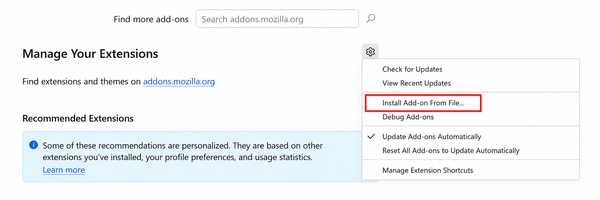
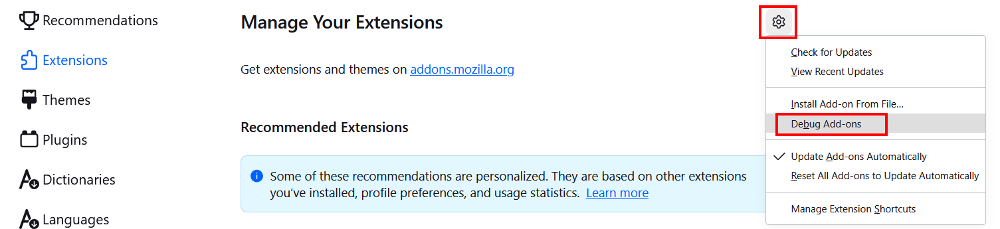

---
sidebar_position: 1
sidebar_label: Firefox browser extension
title: "Firefox browser extension"
---

import { ArticleHead } from '../../../../../src/theme/ArticleHead';

<ArticleHead slug="extension/extension-firefox" />

# Firefox browser extension

## Description

With this extension, you can solve CAPTCHA automatically directly in your browser.

The extension is designed for use with Mozilla Firefox.

---

## Automatic installation

1. Open the [Firefox Add-ons Store](https://addons.mozilla.org/en-US/firefox/addon/capmonster-cloud/).
2. Click **Add to Firefox**.
3. Confirm the installation by clicking `Add` in the modal window.

   

To get started, click the extension icon to the right of the address bar and go to [Settings](#settings).

If you cannot install the extension from the Firefox Add-ons Store, follow the manual installation instructions below.

Manual extension installation

1. Download the [extension archive](https://zenno.link/firefox-actual-build).

2. Open Firefox and go to the extension management page:

   

3. Open `Manage Your Extensions`, click the gear icon, and select `Install Add-on From File…`.

   

4. Select the downloaded extension archive.

5. After installation, return to `Manage Extensions` and open the installed extension.

   

6. Go to the `Permissions` tab and make sure that all required permissions are granted.

   

If errors occur during the standard installation, use the add-on debugging mode:

1. In `Manage Your Extensions`, click the gear icon and select `Debug Add-ons`.

   

2. In the window that opens, click `Load Temporary Add-on` and select the downloaded extension archive.

Manual extension update

If you install the extension over a previous version, click `Update` on the `Manage Your Extensions` page after replacing the extension files.

Instructions for opening this page are provided in the manual installation section above.

---

## Settings

How to pin the extension

By default, the installed extension is automatically pinned to the browser toolbar.

After activating the extension, the following window will open:

### API key

Enter your API key in the corresponding field (**1**) and click **Save** (**2**).

If the key is valid, your current balance (**3**) will be displayed below.

### Automatic CAPTCHA solving

Select the CAPTCHA types that the extension should solve automatically.

:::info
After changing the settings, you may need to reload the page containing the CAPTCHA.
:::

### Repeat CAPTCHA solving after an error

If the CAPTCHA cannot be solved on the first attempt, the extension will continue submitting new tasks until the CAPTCHA is solved or the retry limit specified in the settings is reached.

### Proxy

 

In this section, you can specify a proxy that will be sent together with the recognition task.

The **Login** and **Password** fields are optional. The extension also supports **IPv6** proxies.

### Blacklist management

The blacklist allows you to specify websites where the extension should ignore CAPTCHAs.

After enabling this option, a field for entering websites will appear:

Specify domains together with the protocol: `https://` or `http://`.

You can use the following wildcards:

- `?` — any single character except a period;
- `*` — any number of any characters.

| Filter | Description |
|---|---|
| `https://zennolab.com` | Prevents the extension from working on `https://zennolab.com` |
| `https://*.zennolab.com` | Prevents the extension from working on all subdomains of `zennolab.com` |
| `https://www.google.*` | Prevents the extension from working on Google in all domain zones |

If CAPTCHA solving fails, see the [error glossary](/api/api-errors.mdx).

## Getting CAPTCHA parameters

In the **CapMonster Cloud** tab of the browser's Developer Tools, you can view the parameters of the detected CAPTCHA and the contents of the `task` object that the extension sends to CapMonster Cloud.

For more information, see [Parameter mapping in the Firefox extension](./captcha-parameters/captcha-parameters-firefox.mdx).
