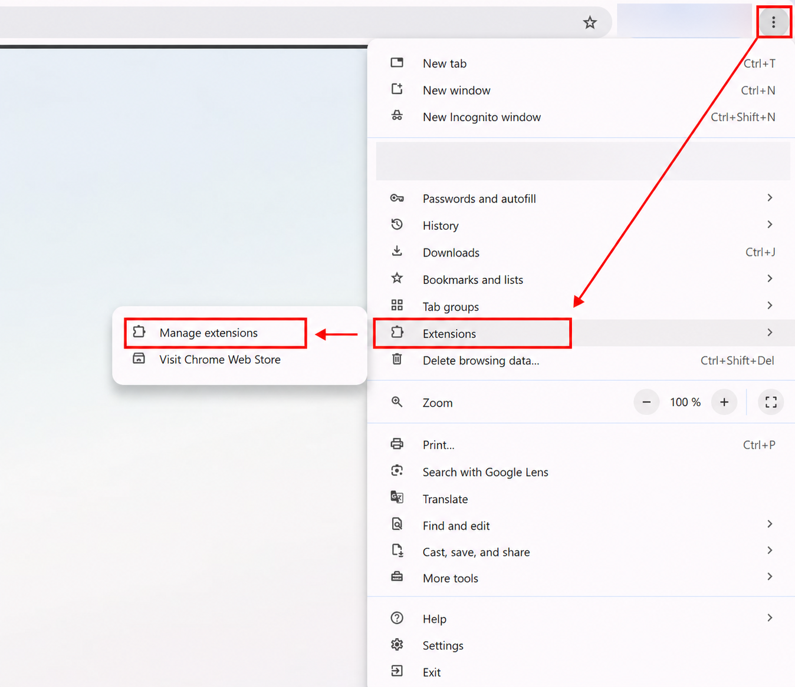
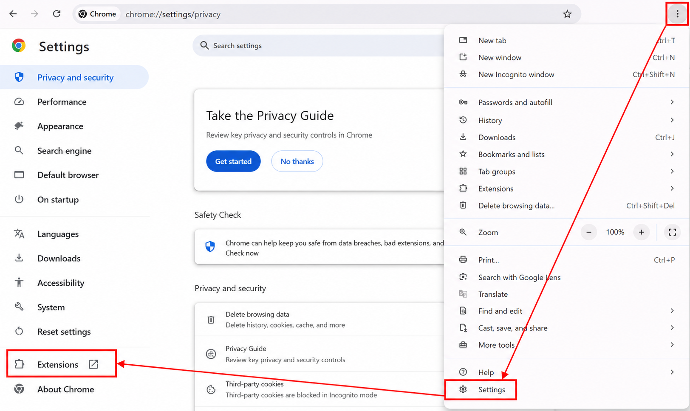
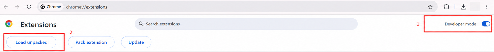
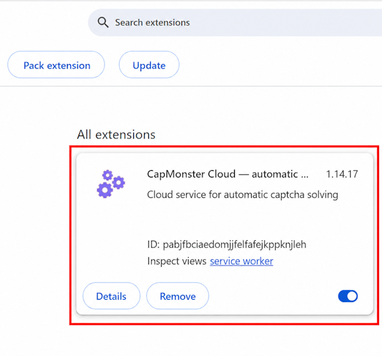
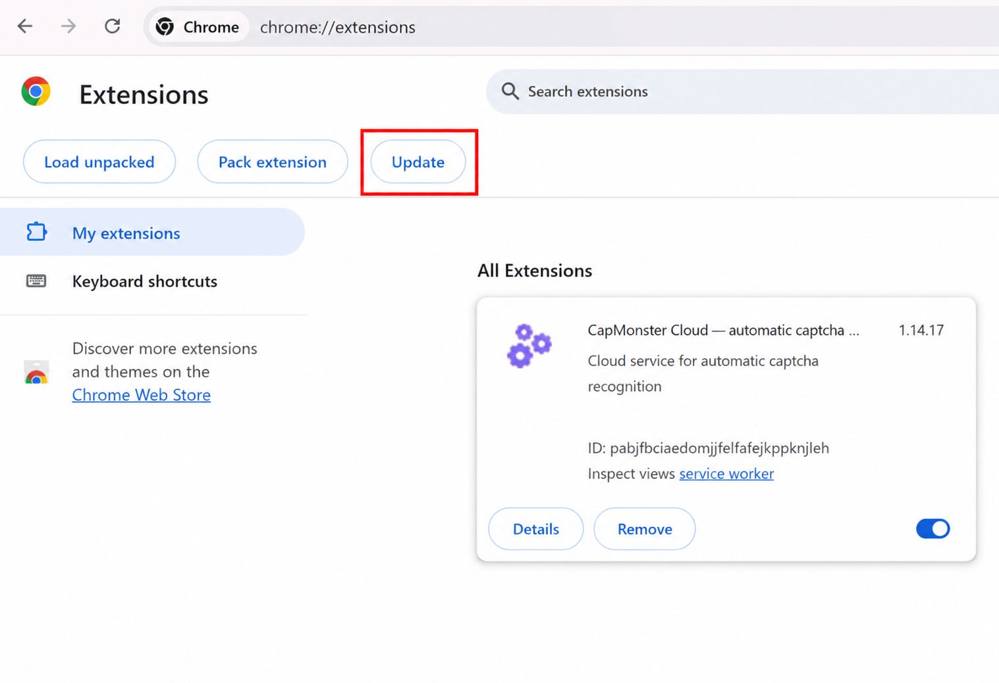
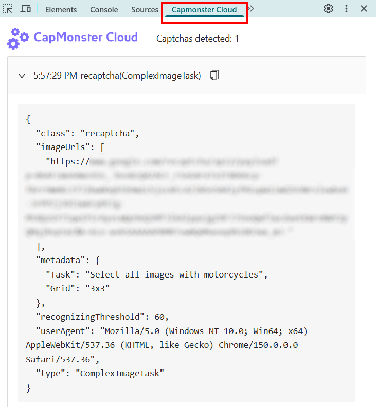

---
sidebar_position: 0
sidebar_label: Chrome browser extension
---

import { ArticleHead } from '../../../../../src/theme/ArticleHead';

<ArticleHead slug="extension/extension-main" />

# Chrome browser extension
## Description
With this extension, you can recognize captchas automatically directly in the browser.

The extension works in the Google Chrome browser.

-----
## Automatic installation
**Important!** It is not recommended to install extensions in incognito mode or guest mode.

1. Open the [Chrome Web Store](https://chrome.google.com/webstore/detail/capmonster-cloud-%E2%80%94-automa/pabjfbciaedomjjfelfafejkppknjleh?hl=en).
2. Click **Install**.

To get started with the extension, click on its icon to the right of the address bar. Go to the [Settings](extension-main.mdx#settings).

*If for some reason it was not possible to install the extension from the Chrome Web Store, use the instructions for manual installation.*

    
Manual installation

1. Download the [archive with the extension](https://zenno.link/chrome-actual-build).

2. Extract the downloaded archive to a folder with any name.

   > `Important:` after installation, do not delete the folder with the extension, otherwise the browser will no longer be able to use it.

3. Enter `chrome://extensions` in the browser address bar and press `Enter`.

   You can open the extensions page in one of the following ways:

   - Through the menu: click `⋮` in the upper-right corner, next to the profile image → `Extensions` → `Manage extensions`.

     

   - Or open Google Chrome settings and select `Extensions` in the left menu, at the very bottom of the list.

     

4. Enable `Developer mode`.

5. A panel will appear at the top of the page. Click the `Load unpacked` button.

   

6. In the window that opens, select the folder where the archive was extracted.

7. After that, the extension will appear in the list of installed extensions.

   

  

    
Manual update of the extension

If you are installing the extension over the previous version, then when you update the original extension files, you also need to click the update button on the `Extensions` page (how to open this page is described above in the `Manual installation` section).

-----
## Settings

    
How to pin the extension

By default the installed extension is hidden. To pin it you have to click on the **Pin** button:

After launching the extension you’ll see this window:

### API key
Enter API key in the corresponding field(**1**), press **Save** button(**2**). If you entered the correct key, your balance will be displayed below(**3**).

### Automated captcha solving
Here you can select the types of captchas that the extension will recognize automatically.

:::info !

You may need to reload the page with captcha for the changes to take effect!

:::
### Repeat captcha solving in case of an error
If the first attempt to solve the captcha is failed, the extension will send repeated tasks until the captcha is not solved, or until the limit specified in this setting will not be reached.

### Proxy
 

In this section, you can specify a proxy that will be passed along with the recognition task.

The **Login** and **Password** fields are optional. The extension also supports proxies with **IPv6**.

### Blacklist control
Using the blacklist you can configure the extension to ignore captchas on specific websites.

After enabling this option, a field for entering sites will appear:

Domains must be specified along with the protocol (https:// or http://).
You can use masks:

- ? - any one character except period
- \* - any number of any characters

Examples:

|**Filter**|**Description**|
| :-: | :-: |
|`https://zennolab.com`|Prohibition of the extension on the site `https://zennolab.com`|
|`https://*.zennolab.com`|Prohibition of the extension on all subdomains `https://zennolab.com`|
|`https://www.google.*`|Prohibiting the extension from working on Google in all zones (ru, com, com.ua, etc.)|

When errors occur in solving captchas, see the [error glossary](/api/api-errors.mdx).

## Captcha parameter mapping

The **CapMonster Cloud** extension provides a convenient way to view the parameters of various captcha types required for correct task submission and successful solving. The displayed data helps ensure that the parameters you send are accurate and can be used as examples when forming your API requests.

### Supported captcha types and their parameters

| Captcha type                        | Displayed parameters                                                                                                      |
| ----------------------------------- | ------------------------------------------------------------------------------------------------------------------------- |
| **reCAPTCHA V2 (Click)**            | `class`, `imageUrls`, `Task` (inside `metadata`), `Grid` (inside `metadata`), `recognizingThreshold`, `userAgent`, `type` |
| **reCAPTCHA V2 (Token)**            | `websiteURL`, `websiteKey`, `userAgent`, `type`                                                                           |
| **reCAPTCHA V2 Invisible**          | `class`, `imageUrls`, `Task` (inside `metadata`), `Grid` (inside `metadata`), `recognizingThreshold`, `userAgent`, `type` |
| **reCAPTCHA V2 Enterprise (Click)** | `class`, `imageUrls`, `Task` (inside `metadata`), `Grid` (inside `metadata`), `recognizingThreshold`, `userAgent`, `type` |
| **reCAPTCHA V2 Enterprise (Token)** | `websiteURL`, `websiteKey`, `userAgent`, `recaptchaDataSValue`, `type`                                                    |
| **reCAPTCHA V3**                    | `websiteURL`, `websiteKey`, `pageAction`, `minScore`, `type`                                                              |
| **GeeTest v3**                      | `websiteURL`, `gt`, `challenge`, `userAgent`, `type`                                                                      |
| **GeeTest v4**                      | `websiteURL`, `gt` (`captcha_id`), `userAgent`, `version`, `type`                                                         |
| **Cloudflare Turnstile**            | `websiteURL`, `websiteKey`, `userAgent`, `type`                                                                           |
| **Cloudflare Challenge**            | `websiteURL`, `websiteKey`, `userAgent`, `pageAction`, `data`, `pageData`, `cloudflareTaskType`, `type`                   |
| **ImageToText**                     | `body` (in `base64` format), `type`                                                                                       |
| **BLS**                             | `class`, `imagesBase64`, `Task` (inside `metadata`), `TaskArgument` (inside `metadata`), `type`                           |
| **Binance**                         | `websiteURL`, `websiteKey`, `validateId`, `userAgent`, `type`                                                             |

To use this feature, enable the extension, specify your API key in the settings, and make sure there are funds on your balance. Then open the page with the captcha, check that its type is supported and selected for solving, and follow these steps:

1. Open **Developer Tools** and go to the **Capmonster Cloud** tab:  
   
   

2. Reload the page.

:::warning **Important**
For API requests, use an up-to-date `userAgent` supported by [our service](https://capmonster.cloud/api/useragent/actual).
:::

Captcha parameters will be displayed automatically:  

