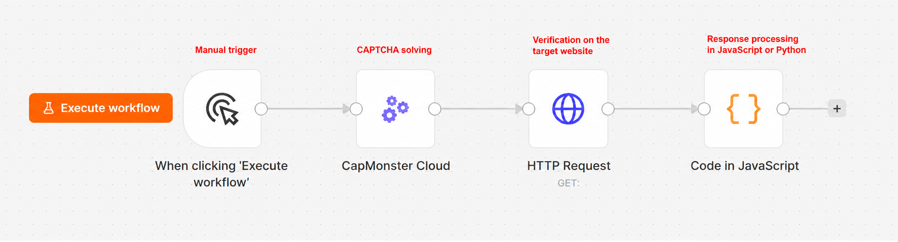
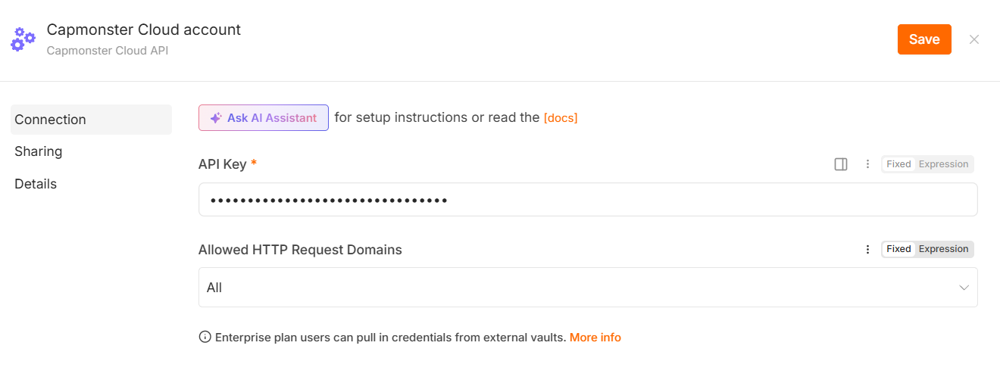
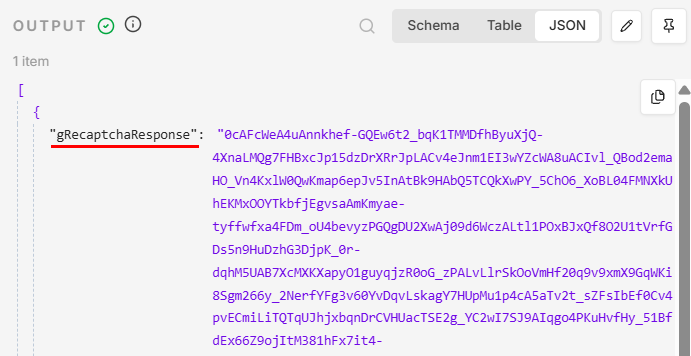
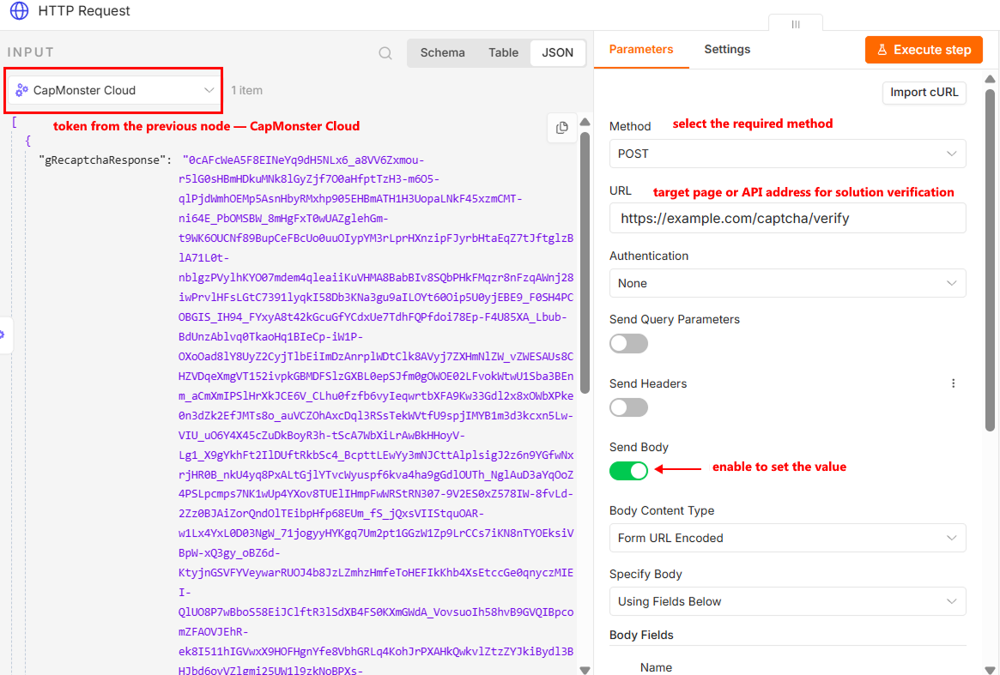
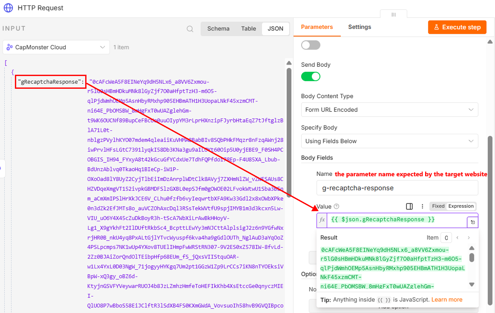
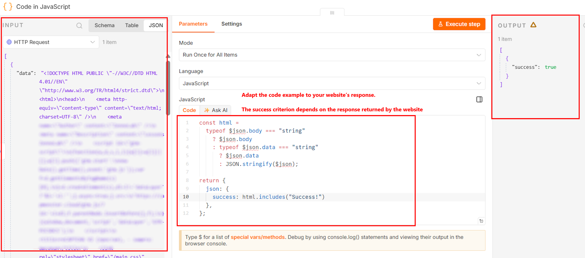

import BlogLink from '@theme/BlogLink';
import { ArticleHead } from '../../../../../src/theme/ArticleHead';

<ArticleHead slug="external-services/n8n" />

# Solving CAPTCHAs in n8n with CapMonster Cloud

n8n is a workflow automation platform where scenarios are built from interconnected nodes. Each node performs a separate action: starts a workflow, sends an HTTP request, processes data, or connects to an external service. n8n can be used in the cloud or deployed on your own server.

CapMonster Cloud is used in n8n to automatically solve CAPTCHAs within a workflow. The node sends CAPTCHA parameters to the service, receives a token or another solution result, and passes it to the next nodes—for example, to submit a form, make an API request, or continue collecting data from a web page.

A basic workflow may look as follows:



<BlogLink url="https://capmonster.cloud/en/blog/how-to-solve-recaptcha-v2-in-n8n-using-capmonster-cloud/"/>
<BlogLink url="https://capmonster.cloud/en/blog/how-to-solve-recaptcha-v2-in-n8n-using-capmonster-cloud/"/>

## Installation methods

### Installation from the nodes panel

1. Open a workflow.
2. Click **Add first step...** or **+**. If necessary, rename the workflow by replacing the default name `My workflow`, for example, with `CapMonster Cloud workflow`.


3. Enter "CapMonster Cloud" in the *Search nodes...* field.
4. Select the node from the search results.


5. Click **Install node**:


### Installation via npm

This method is intended for **self-hosted n8n** and requires access to the server or computer where the service is deployed. After installing the package, restart n8n so that the **CapMonster Cloud** node appears in the nodes panel.

1. Stop the running n8n instance.

2. Open a terminal on the server.

3. Go to the n8n custom nodes directory:

```bash
cd ~/.n8n/nodes
```

If the directory does not exist yet, create it:

```bash
mkdir -p ~/.n8n/nodes
cd ~/.n8n/nodes
```

4. If the directory does not contain a `package.json` file, create one:

```bash
npm init -y
```

5. Install the CapMonster Cloud package:

```bash
npm install @zennolab_com/n8n-nodes-capmonstercloud
```

6. Start or restart n8n.

7. Open a workflow, click **+**, and find the **CapMonster Cloud** node.

You can check the installed package version with the following command:

```bash
npm list @zennolab_com/n8n-nodes-capmonstercloud
```

:::warning Important
Do not install the package globally with the `-g` option. It must be located in the custom nodes directory of the n8n instance where it will be used.
:::

## Updating and uninstalling the package

### Through the n8n interface

If the node was installed from the nodes panel:

1. Open **Settings** → **Community nodes**.


2. Find the **CapMonster Cloud** package.
3. Open the **Options** menu using the `⋮` button.
4. Select the required action:
   * **Update package** – install an available newer version;
   * **Uninstall package** – remove the package.
5. Restart n8n if necessary.

:::note
* The **Update package** button is displayed only when a new package version is available.

* After the package is removed, existing workflows containing the CapMonster Cloud node will remain, but they will not run until the package is installed again.
:::

### Via npm

```bash
cd ~/.n8n/nodes
```

To install the latest available version, run:

```bash
npm install @zennolab_com/n8n-nodes-capmonstercloud@latest
```

To remove the package, run:

```bash
npm uninstall @zennolab_com/n8n-nodes-capmonstercloud
```

Restart n8n after updating or removing the package.


:::warning Important
After the package is removed, existing workflows containing the CapMonster Cloud node will remain, but they will not run until the package is installed again.
:::


## Configuring the CapMonster Cloud node

The **Triggers** section displays the available ways to start a workflow: <br />

**On a Schedule** – starts the workflow automatically according to a specified schedule. For example, the workflow can run at certain intervals, daily, or according to a cron expression. *For more information, see the n8n documentation: [Schedule Trigger](https://docs.n8n.io/integrations/builtin/core-nodes/n8n-nodes-base.scheduletrigger/)*. <br />

**On a Webhook call** – starts the workflow when an HTTP request is sent to the webhook URL. This method is suitable when CAPTCHA parameters are passed from an external application, website, or browser automation script. *For more information, see the n8n documentation: [Webhook](https://docs.n8n.io/integrations/builtin/core-nodes/n8n-nodes-base.webhook/)*. <br />

:::note
The **No CapMonster Cloud Triggers available** message means that the CapMonster Cloud node cannot start a workflow on its own. Add it after a trigger or another node that passes CAPTCHA parameters.
:::

To return the result to an external application after starting the workflow through a webhook, you can use the [Respond to Webhook](https://docs.n8n.io/integrations/builtin/core-nodes/n8n-nodes-base.respondtowebhook/) node.

A typical node sequence is:

```text
Trigger → CapMonster Cloud → use the obtained result
````

For a workflow started through a webhook, the sequence may look as follows:

```text
Webhook → CapMonster Cloud → Respond to Webhook
```

The **Actions** section contains all CAPTCHA types available for solving:


6. Select the required CAPTCHA type.
7. Click **Create new credential**.


8. Enter your CapMonster Cloud API key in the window that opens.
9. Paste the key into the **API Key** field and save it.



10. Fill in all required parameters.

:::warning Important
* Do not pass the API key directly in workflow parameters or publish it in an exported JSON file. Store the key in n8n Credentials and restrict access to the credentials.

* Some CAPTCHA types also require a proxy. The relevant requirements are listed in the documentation for the selected CAPTCHA type.
:::


:::tip
* Detailed parameter descriptions and instructions for obtaining their values are available in the [CAPTCHA Types](../../captchas) section. Select the required CAPTCHA type and open the corresponding article.

* The current User-Agent is set automatically.
:::

The **Settings** tab controls the node behavior:

* **Always Output Data** – return data even when the result is empty.
* **Execute Once** – execute the node once for all input data.
* **Retry On Fail** – retry execution if an error occurs.
* **On Error** – select what to do when an error occurs.
* **Notes** – add a comment to the node.
* **Display Note in Flow** – display the comment in the workflow diagram.

These settings can usually be left unchanged.

11. After filling in all fields, click **Execute step**:


:::tip
* **Execute step** runs only the selected node;

* **Execute workflow** runs the entire workflow.
:::

If the task is completed successfully, an object containing the solution result will appear in the **OUTPUT** panel. For example, for reCAPTCHA v2, the response will contain a field with the obtained token:



The obtained response must be passed to the next workflow node and used when sending a request to the target website.

:::warning Important
The solution result may have a limited validity period, so it is recommended to use it immediately after receiving it.
:::


## Typical use cases

The **CapMonster Cloud** node can be used in n8n workflows where the next step depends on the CAPTCHA solution result.

### Collecting data from web pages

When collecting publicly available data, a website may require a CAPTCHA to be completed before displaying a page or processing a search request.

A typical node sequence is:

```text
Trigger → HTTP Request → CapMonster Cloud → HTTP Request → data processing
```

The workflow can perform the following actions:

1. Open the target page with **HTTP Request**.
2. Obtain the CAPTCHA parameters.
3. Pass them to the **CapMonster Cloud** node.
4. Receive a token or another solution result.
5. Repeat the request to the page with the CAPTCHA result.
6. Extract the required data using the **HTML**, **Code**, or **Edit Fields** nodes.
7. Save the result to a file, table, or database.

### Submitting web forms

The node can be used in workflows where a CAPTCHA result must be obtained before submitting a form.

A typical sequence is:

```text
Get data → CapMonster Cloud → HTTP Request → check the response
```

For example, the workflow can:

1. Receive form data from a webhook, table, or another node.
2. Solve the CAPTCHA.
3. Add the obtained token to the request body.
4. Submit the form using **HTTP Request**.
5. Check the website or API response.

The name of the parameter used to pass the token depends on the target website implementation.

### Working with APIs

Some APIs require a CAPTCHA result together with the other request parameters.

A typical sequence is:

```text
Trigger → CapMonster Cloud → HTTP Request → Code
```

After the **CapMonster Cloud** node runs, the result can be passed in the JSON body, query parameters, or request headers, depending on the API requirements.

For example:

```json
{
  "captchaToken": "{{$json.solution.gRecaptchaResponse}}",
  "action": "submit"
}
```

The result structure and path to the token depend on the selected CAPTCHA type.

### Browser automation

The solution result can be passed to an external browser automation script, for example, Playwright, Puppeteer, Selenium, or ZennoPoster.

Example sequence:

```text
Webhook → CapMonster Cloud → HTTP Request → browser automation script
```

In this case, n8n can:

1. Receive CAPTCHA parameters from an external script.
2. Create a task in CapMonster Cloud.
3. Return the result through a webhook or API.
4. Pass the token to the browser session.
5. Continue running the script.

With this approach, it is important to use the result in the same browser session for which the CAPTCHA parameters were obtained.

### Batch processing

If the input node returns multiple items, n8n can create a separate task for each item.

For example:

```text
Google Sheets → Loop Over Items → CapMonster Cloud → HTTP Request
```

This workflow is suitable for sequentially processing a list of pages or tasks.

For batch processing, it is recommended to:

* limit the number of tasks running simultaneously;
* use **Loop Over Items** or another queue management mechanism;
* handle errors separately for each item;
* do not enable **Execute Once** if a CAPTCHA must be solved for each input item;
* take the CapMonster Cloud account limits and balance into account.


## Working with the HTTP Request node

To use the obtained solution result, add an **HTTP Request** node after the **CapMonster Cloud** node.

1. Click **+** next to the CapMonster Cloud node.
2. Find and select **HTTP Request**.
3. Specify the request method and the target page or API address.



4. Add headers, query parameters, cookies, and the request body if necessary.

:::warning Important
If the target website uses a session, send the CAPTCHA result with the same cookies, proxy, headers, and other parameters that were used when opening the page. Changing session parameters may cause the result to be rejected.
:::

5. In the field intended for the CAPTCHA result, pass the value from the previous node using an **Expression**.

For example:



6. After submitting the CAPTCHA result, you will receive a response from the target page or API. The response format depends on the endpoint being used: it may be an HTML page, a JSON object, or another data type.


**Additionally:**

To check the result automatically, you can add a **Code** node after **HTTP Request**.

:::note
The verification method depends on the response from the target website. In the **Code** node, you can check the HTTP status, the final URL after a redirect, the presence of an expected element in the HTML, whether a cookie was set, or another indicator that the request was processed successfully.
:::

### Checking an HTML response

For example, if the text "Success!" is displayed on the page after successful verification, you can automatically check the result using the following code in the **Code** node:

```js
const html =
  typeof $json.body === "string"
    ? $json.body
    : typeof $json.data === "string"
      ? $json.data
      : JSON.stringify($json);

return {
  json: {
    success: html.includes("Success!")
  },
};
```



### Checking a JSON response

If the API returns JSON, check the required field directly. For example, for the following response:

```json
{
  "success": true,
  "status": "verified"
}
```

you can use the following code:

```js
return {
  json: {
    success:
      $json.success === true &&
      $json.status === "verified"
  },
};
```

Replace the field names and expected values according to the response returned by the API you are using.

## Exporting and transferring a workflow

Credentials are not included when a workflow is exported. After importing the workflow into another n8n instance, you must create the **Credentials** again and select them in the CapMonster Cloud node.

## Debugging a workflow

To inspect data between nodes, you can:

* open the **OUTPUT** tab;
* temporarily pin the result using **Pin data**;
* add an **Edit Fields** node to transform the data structure;
* use a **Code** node to check and normalize the response;
* view the execution history in the **Executions** section.

## Error handling

If the node finishes with an error:

1. Open the **OUTPUT** tab.
2. Check the error code and message.
3. Make sure the CAPTCHA parameters are correct.
4. Check the account balance and API key.
5. Make sure the proxy is available and suitable for the selected task type.
6. For temporary errors, enable **Retry On Fail** in the **Settings** tab.


| Problem                  | Possible cause                                  |
| ------------------------ | ----------------------------------------------- |
| The node is not displayed | The package is not installed or n8n was not restarted |
| Authorization error      | Invalid API key                                 |
| The task takes too long  | The CAPTCHA is complex or the proxy is unstable |
| The token is rejected by the website | The token has expired or the session was changed |
| No result is returned    | Incorrect CAPTCHA parameters                    |
<br />


:::tip
CAPTCHA-solving errors are described in the [dedicated section](../../api/api-errors).
:::
