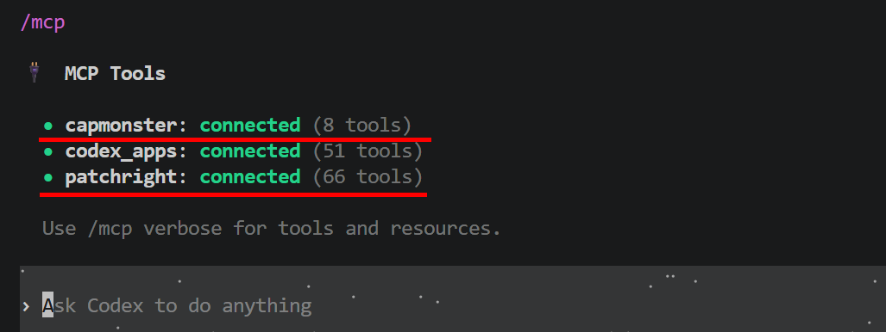

import { ArticleHead } from '../../../../../src/theme/ArticleHead';
import Tabs from '@theme/Tabs';
import TabItem from '@theme/TabItem';
import RemotePrompt from '@site/src/components/RemotePrompt';

<ArticleHead slug="mcp" />

# MCP


**Model Context Protocol (MCP)** allows AI agents to connect to external tools and services.

CapMonster Cloud MCP provides the agent with tools for working with CAPTCHA.


<details style={{ fontWeight: 'normal' }}>
  <summary style={{ fontWeight: 'bold' }}>How CapMonster Cloud MCP works</summary>

With MCP, an AI agent can identify the CAPTCHA type and task parameters, access CapMonster Cloud documentation, create tasks, and retrieve solution results. The agent’s ultimate goal is not only to solve the CAPTCHA, but also to correctly integrate this process into the user’s project.

To work with a web page, CapMonster Cloud MCP can be used together with the browser MCP [`capmonster-mcp-patchright`](https://github.com/CapMonsterCloud/capmonster-mcp-patchright):

```text
AI agent
├── capmonster → CapMonster Cloud API
└── patchright → browser
```

`capmonster` handles interaction with CapMonster Cloud. `patchright` opens the page, helps identify the CAPTCHA type and retrieve its parameters, and applies the completed solution. The agent then transfers the verified workflow into the project code.

The typical workflow covered by [SKILL.md](https://github.com/CapMonsterCloud/capmonster-mcp-captcha-solver/blob/main/capmonster_agent/SKILL.md):

1. Get the target page URL.

2. Identify the CAPTCHA type.

3. Review the documentation and determine the required parameters.

4. Retrieve the parameters from the page.

5. Send a request to CapMonster Cloud.

6. Retrieve the result.

7. Apply the result on the page and integrate this workflow into the user’s code.

:::info Note
Use automation only on resources where you are authorized to do so, such as your own website, a test environment, or a demo page.
:::

</details>

## Quick start

:::tip Copy the prompt for your AI agent
Choose the prompt that matches your environment — **Python / PyPI** or **TypeScript / npm** — and click **Copy prompt**. Then paste it into Claude Code, Codex, or another AI agent. The agent will detect the client and operating system, configure `capmonster` and `patchright`, and verify that they work.

If automatic setup fails, configure MCP manually using the [instructions](#manual-setup).

:::

<Tabs groupId="quick-start-runtime">
<TabItem value="quick-start-python" label="Python / PyPI" default>

<RemotePrompt url="https://raw.githubusercontent.com/CapMonsterCloud/capmonster-mcp-captcha-solver/main/capmonster_agent/PROMPT.md" />

</TabItem>

<TabItem value="quick-start-npm" label="TypeScript / npm">

<RemotePrompt url="https://raw.githubusercontent.com/CapMonsterCloud/capmonster-mcp-captcha-solver/main/capmonster_agent/PROMPT_JS.md" />

</TabItem>
</Tabs>

---

After verification, provide the agent with the target page URL, project files, and the conditions under which the CAPTCHA appears. The agent should not only verify the solution in the browser, but also integrate the working CapMonster Cloud workflow into your code.

:::info Permissions during setup
The agent may request permission to install dependencies, modify the MCP configuration, run commands, access the network, or control the browser. Review each request and confirm expected actions by clicking **Allow** or **Approve**.

In Codex, you can check or change the current permission mode with the `/permissions` command.
:::

You do not need to resend the prompt before every task. In the current session, after [SKILL.md](https://github.com/CapMonsterCloud/capmonster-mcp-captcha-solver/blob/main/capmonster_agent/SKILL.md) has been loaded, you can provide new URLs, CAPTCHA appearance conditions, and integration tasks.

---

## Manual setup

You can work with the agent through a desktop application, terminal, IDE, or code editor. For the complete workflow, we recommend connecting both servers: `capmonster` and `patchright`.

Choose how you want to work — with a CLI agent or a desktop application. Each tab contains the full setup sequence for the selected option.

<Tabs groupId="mcp-work-mode">
<TabItem value="cli" label="CLI agent" default>

<span style={{ fontSize: "1.2em" }}>**Step 1. Install an AI agent**</span>

<br />You need an AI agent or another application that supports MCP.

If the agent is already installed, make sure it starts correctly and is available in your system.

For example, for Claude Code:

```bash
claude --version
```

For Codex:

```bash
codex --version
```

If the command is not found, install the selected AI agent according to its official instructions: [Claude Code](https://code.claude.com/docs/en/setup) or [Codex](https://developers.openai.com/codex/cli).


After installation, make sure the agent starts correctly and supports local MCP servers.

:::tip Agent not found after installation
If the terminal or IDE cannot find the installed agent, fully close and reopen the terminal and development environment. Applications that were already running may still use the old `PATH` value and may not detect the new command until restarted.
:::

<span style={{ fontSize: "1.2em" }}>**Step 2. Install Node.js and, if needed, uv**</span>

<br />Running the MCP servers requires `npx` and, depending on the selected CapMonster MCP implementation, `uvx`.

**Node.js and npx**

:::warning Important:
`patchright` runs through `npx`, so Node.js is required regardless of which CapMonster MCP implementation you choose.
:::

Check the installation:

```bash
node --version
npm --version
npx --version
```

If the commands are unavailable, install Node.js.

`npm` and `npx` are usually installed with Node.js, so you do not need to install `npx` separately.

We recommend using Node.js 18 or later.

**uv and uvx**

If you plan to use the Python/PyPI version of `capmonster-mcp`, you also need `uvx`.

Check whether it is available:

```bash
uvx --version
```

If the command is unavailable, install `uv`.

After installing `uv`, the `uvx` command will also become available.

Check:

```bash
uv --version
uvx --version
```

:::info Note
If you use the TypeScript/npm version of `capmonster-mcp`, you do not need to install `uv` or `uvx`.
:::

<span style={{ fontSize: "1.2em" }}>**Step 3. Get an API key**</span>

<br />`capmonster` requires a CapMonster Cloud API key.

It is passed to the MCP server through the following environment variable:

```text
CM_API_KEY
```

<span style={{ fontSize: "1.2em" }}>**Step 4. Choose a CapMonster MCP implementation**</span>


<br />Two equivalent [`capmonster-mcp`](https://github.com/CapMonsterCloud/capmonster-mcp-captcha-solver) implementations are available.

<Tabs>
<TabItem value="npm" label="npm – TypeScript" default>

This version uses the [`capmonster-mcp` npm package](https://www.npmjs.com/package/capmonster-mcp) and `npx`.

Run the MCP server with:

```bash
npx -y capmonster-mcp
```

</TabItem>

<TabItem value="python" label="PyPI – Python">

This version uses the [`capmonster-mcp` PyPI package](https://pypi.org/project/capmonster-mcp/) and `uvx`.

Run the MCP server with:

```bash
uvx capmonster-mcp
```

</TabItem>
</Tabs>

You do not need to install `capmonster-mcp` as a dependency of your project. By default, the MCP client can run the published package directly through `npx` or `uvx`.

<span style={{ fontSize: "1.1em" }}>**Installing packages with npm and pip**</span>

<br />By default, you do not need to preinstall the MCP packages: you can run them directly through `npx` or `uvx`. If you want to install the packages in advance, use one of the options below.

<Tabs>
<TabItem value="npm-install" label="npm" default>

**CapMonster Cloud MCP**

Install [capmonster-mcp](https://www.npmjs.com/package/capmonster-mcp) with npm:

```bash
npm i capmonster-mcp
```

You can verify the installation with:

```bash
npm list capmonster-mcp
```

After installation, use `npx` to run `capmonster`:

```json
{
  "command": "npx",
  "args": ["capmonster-mcp"],
  "env": {
    "CM_API_KEY": "YOUR_API_KEY"
  }
}
```

**Patchright MCP**

If you plan to use a browser to open pages, retrieve CAPTCHA parameters, and apply solutions, install [`capmonster-mcp-patchright`](https://www.npmjs.com/package/capmonster-mcp-patchright). The source code is available in the [official repository](https://github.com/CapMonsterCloud/capmonster-mcp-patchright):

```bash
npm i capmonster-mcp-patchright
```

You can verify the installation with:

```bash
npm list capmonster-mcp-patchright
```

Preinstalling `capmonster-mcp-patchright` is optional. In all examples below, you can also run it directly with:

```bash
npx -y capmonster-mcp-patchright
```

</TabItem>

<TabItem value="pypi-install" label="pip / PyPI">

The Python version of `capmonster-mcp` is published on [PyPI](https://pypi.org/project/capmonster-mcp/) and requires Python 3.11 or later.

Install `capmonster-mcp` with `pip`:

```bash
python -m pip install capmonster-mcp
```

You can verify the installation with:

```bash
python -m pip show capmonster-mcp
```

After installation, you can use the same CLI command for `capmonster`:

```json
{
  "command": "capmonster-mcp",
  "args": [],
  "env": {
    "CM_API_KEY": "YOUR_API_KEY"
  }
}
```

</TabItem>
</Tabs>

After installing the npm or Python package, fully restart the MCP client if the package was installed after the client had already been started.


<br />
<span style={{ fontSize: "1.2em" }}>**Step 5. Configure the MCP client**</span>

<br />Select the CLI client you use.

<Tabs>
<TabItem value="claude-code-cli" label="Claude Code" default>

For a shared project configuration, create an `.mcp.json` file in the project root and add `capmonster` and `patchright` to it.

:::tip 
This is not the only possible location. Claude Code supports different configuration scopes; user-specific or project-specific settings may also be stored in `.claude.json` or added with Claude Code commands. If an agent is configuring MCP, allow it to determine the appropriate scope and file automatically.
:::

<Tabs>
<TabItem value="claude-cli-npm" label="TypeScript / npm" default>

```json
{
  "mcpServers": {
    "capmonster": {
      "command": "npx",
      "args": ["-y", "capmonster-mcp"],
      "env": {
        "CM_API_KEY": "YOUR_API_KEY"
      }
    },
    "patchright": {
      "command": "npx",
      "args": ["-y", "capmonster-mcp-patchright"]
    }
  }
}
```

</TabItem>

<TabItem value="claude-cli-python" label="Python / PyPI">

```json
{
  "mcpServers": {
    "capmonster": {
      "command": "uvx",
      "args": ["capmonster-mcp"],
      "env": {
        "CM_API_KEY": "YOUR_API_KEY"
      }
    },
    "patchright": {
      "command": "npx",
      "args": ["-y", "capmonster-mcp-patchright"]
    }
  }
}
```

</TabItem>
</Tabs>

After restarting Claude Code, check the connection with the `/mcp` command.

 

</TabItem>

<TabItem value="codex-cli" label="Codex CLI">

Codex CLI, the Codex IDE extension, and ChatGPT Desktop share the same MCP configuration. By default, it is stored in `config.toml`:

- Windows: `%USERPROFILE%\.codex\config.toml`;
- macOS/Linux: `~/.codex/config.toml`.

To connect MCP servers, use the `codex mcp add` command. Codex will automatically save the settings to `config.toml`. You need to add the `capmonster` and `patchright` servers separately by running the corresponding command for each one.

<Tabs groupId="codex-mcp-os">
<TabItem value="codex-mcp-windows" label="Windows" default>

Open PowerShell or the integrated terminal in your IDE.

For the TypeScript/npm version of `capmonster`, run:

```powershell
codex mcp add capmonster --env CM_API_KEY=YOUR_API_KEY -- npx.cmd -y capmonster-mcp
```

For the Python/PyPI version, run instead:

```powershell
codex mcp add capmonster --env CM_API_KEY=YOUR_API_KEY -- uvx capmonster-mcp
```

Then, regardless of the implementation you selected, add `patchright`:

```powershell
codex mcp add patchright -- npx.cmd -y capmonster-mcp-patchright
```

On Windows, `npx.cmd` is used so that starting the MCP server does not depend on the PowerShell execution policy for `npx.ps1`.

</TabItem>

<TabItem value="codex-mcp-macos-linux" label="macOS / Linux">

Open a terminal.

For the TypeScript/npm version of `capmonster`, run:

```bash
codex mcp add capmonster --env CM_API_KEY=YOUR_API_KEY -- npx -y capmonster-mcp
```

For the Python/PyPI version, run instead:

```bash
codex mcp add capmonster --env CM_API_KEY=YOUR_API_KEY -- uvx capmonster-mcp
```

Then, regardless of the implementation you selected, add `patchright`:

```bash
codex mcp add patchright -- npx -y capmonster-mcp-patchright
```

</TabItem>
</Tabs>

Replace `YOUR_API_KEY` with your CapMonster Cloud API key. Do not add the real key to agent messages, code examples, or a public repository.

Verify that both servers have been added:

```bash
codex mcp list
```

<details style={{ fontWeight: 'normal' }}>
  <summary style={{ fontWeight: 'bold' }}>Alternatively: configure the servers through config.toml</summary>

For a trusted project, you can also save the configuration to `.codex/config.toml` in the project root. The project file will only be used after the project has been marked as trusted.

<Tabs>
<TabItem value="codex-cli-npm" label="TypeScript / npm" default>

```toml
[mcp_servers.capmonster]
command = "npx"
args = ["-y", "capmonster-mcp"]

[mcp_servers.capmonster.env]
CM_API_KEY = "YOUR_API_KEY"

[mcp_servers.patchright]
command = "npx"
args = ["-y", "capmonster-mcp-patchright"]
```

</TabItem>

<TabItem value="codex-cli-python" label="Python / PyPI">

```toml
[mcp_servers.capmonster]
command = "uvx"
args = ["capmonster-mcp"]

[mcp_servers.capmonster.env]
CM_API_KEY = "YOUR_API_KEY"

[mcp_servers.patchright]
command = "npx"
args = ["-y", "capmonster-mcp-patchright"]
```

</TabItem>
</Tabs>

On Windows, if you have problems running `npx.ps1`, specify `command = "npx.cmd"` instead of `command = "npx"`. If the initial package download takes too long, you can add `startup_timeout_sec = 60` to each server section.

</details>

Fully restart Codex or your IDE. In a new session, run `/mcp` and make sure `capmonster` and `patchright` are connected and expose their tools. For details, see the [Codex MCP documentation](https://developers.openai.com/codex/mcp).

 

</TabItem>
</Tabs>

Replace `YOUR_API_KEY` with your CapMonster Cloud API key and restart the MCP client.

<span style={{ fontSize: "1.2em" }}>**Step 6. Send the prompt to the agent**</span>

<br />Open a new chat or session and send the prompt from the [Quick start](#quick-start) section. After verification, provide the page URL, project files, and the conditions under which the CAPTCHA appears.

During setup, approve only expected permission requests. You do not need to resend the prompt before every task in the current session.


</TabItem>

<TabItem value="desktop" label="Desktop application">

CapMonster Cloud MCP can be used not only through CLI agents, but also through desktop applications that support local MCP servers.

For example:

- **Claude Desktop**;
- **ChatGPT Desktop with Codex**;
- another desktop client that supports local STDIO MCP servers.

In this case, you do not need to start the AI agent from the terminal. MCP servers are configured in the application itself or in its configuration file.

<span style={{ fontSize: "1.2em" }}>**Step 1. Install a desktop application**</span>

<br />Install the selected MCP-compatible desktop client:

- [Claude Desktop](https://claude.com/download);
- [ChatGPT Desktop](https://chatgpt.com/download).

If the application is already installed, make sure you are using the latest version.

<span style={{ fontSize: "1.2em" }}>**Step 2. Get an API key and install the runtime**</span>

<br />To use `capmonster`, get a CapMonster Cloud API key. During setup, pass it through the `CM_API_KEY` environment variable.

Running `patchright` requires Node.js and `npx`.

Check the installation:

```bash
node --version
npm --version
npx --version
```

If the commands are unavailable, install Node.js. `npm` and `npx` are usually installed together with Node.js.

If you use the Python/PyPI version of `capmonster`, you also need `uvx`.

Check:

```bash
uv --version
uvx --version
```

If `uvx` is unavailable, install `uv`.

:::info Note
For the TypeScript/npm version of `capmonster-mcp`, you do not need to install `uv` or `uvx`.
:::
<br />
<span style={{ fontSize: "1.2em" }}>**Step 3. Configure the MCP servers**</span>

<br />

<br /><Tabs>
<TabItem value="claude-desktop" label="Claude Desktop" default>

Claude Desktop uses a separate local MCP configuration file — `claude_desktop_config.json`.

In Claude Desktop, open **File → Settings → Developer** and click **Edit Config**. Add the `capmonster` and `patchright` servers to the file that opens.

<Tabs>
<TabItem value="claude-npm" label="TypeScript / npm" default>

```json
{
  "mcpServers": {
    "capmonster": {
      "command": "npx",
      "args": ["-y", "capmonster-mcp"],
      "env": {
        "CM_API_KEY": "YOUR_API_KEY"
      }
    },
    "patchright": {
      "command": "npx",
      "args": ["-y", "capmonster-mcp-patchright"]
    }
  }
}
```

</TabItem>

<TabItem value="claude-python" label="Python / PyPI">

```json
{
  "mcpServers": {
    "capmonster": {
      "command": "uvx",
      "args": ["capmonster-mcp"],
      "env": {
        "CM_API_KEY": "YOUR_API_KEY"
      }
    },
    "patchright": {
      "command": "npx",
      "args": ["-y", "capmonster-mcp-patchright"]
    }
  }
}
```

</TabItem>
</Tabs>

Replace `YOUR_API_KEY` with your CapMonster Cloud API key, save the configuration, and fully restart Claude Desktop.

After restarting, click **+** next to the input field and open **Connectors**. Make sure `capmonster` and `patchright` appear in the list. You can also check connection status and startup errors in Claude Desktop Developer settings.


:::info Note
Local MCP servers configured in Claude Desktop through `claude_desktop_config.json` are separate from Claude Code project and user MCP configurations.
:::

</TabItem>

<TabItem value="chatgpt-desktop" label="ChatGPT Desktop / Codex">

You can configure MCP servers manually through the `config.toml` file used by ChatGPT Desktop, Codex CLI, and the Codex IDE extension.

##### 1. Open or create the configuration file

<Tabs groupId="codex-config-os">
<TabItem value="codex-config-windows" label="Windows" default>

The file is located at:

```text
%USERPROFILE%\.codex\config.toml
```

To create the directory and open the file in Notepad, run the following in PowerShell:

```powershell
New-Item -ItemType Directory -Force "$env:USERPROFILE\.codex"
notepad "$env:USERPROFILE\.codex\config.toml"
```

If you are prompted to create a new file, confirm it. Make sure the file is saved with the `.toml` extension, not `.toml.txt`.

</TabItem>

<TabItem value="codex-config-unix" label="macOS / Linux">

The file is located at:

```text
~/.codex/config.toml
```

To create the directory and open the file in `nano`, run:

```bash
mkdir -p ~/.codex
nano ~/.codex/config.toml
```

</TabItem>
</Tabs>

##### 2. Add the MCP server configuration

Paste one of the following configurations into `config.toml`. If the file already contains other settings, do not remove them — add the `mcp_servers` blocks at the end of the file.

<Tabs groupId="codex-config-runtime">
<TabItem value="codex-npm" label="TypeScript / npm" default>

```toml
[mcp_servers.capmonster]
command = "npx"
args = ["-y", "capmonster-mcp"]

[mcp_servers.capmonster.env]
CM_API_KEY = "YOUR_API_KEY"

[mcp_servers.patchright]
command = "npx"
args = ["-y", "capmonster-mcp-patchright"]
```

:::info For Windows
If PowerShell policy blocks `npx`, specify `command = "npx.cmd"` for both servers.
:::

</TabItem>

<TabItem value="codex-python" label="Python / PyPI">

```toml
[mcp_servers.capmonster]
command = "uvx"
args = ["capmonster-mcp"]

[mcp_servers.capmonster.env]
CM_API_KEY = "YOUR_API_KEY"

[mcp_servers.patchright]
command = "npx"
args = ["-y", "capmonster-mcp-patchright"]
```

:::info For Windows
If PowerShell policy blocks `npx`, specify `command = "npx.cmd"` in the `mcp_servers.patchright` section.
:::

</TabItem>
</Tabs>

Replace `YOUR_API_KEY` with your CapMonster Cloud API key and save the file.

##### 3. Restart the application

Fully quit ChatGPT Desktop or Codex, then open the application again.

In a new chat, run:

```text
/mcp
```

Make sure the connected `capmonster` and `patchright` servers appear in the list.

</TabItem>
</Tabs>

<span style={{ fontSize: "1.2em" }}>**Step 4. Send the prompt to the agent**</span>

<br />Open a new chat and send the prompt from the [Quick start](#quick-start) section. After verification, provide the page URL, CAPTCHA appearance conditions, and project files.

During setup, approve only expected permission requests. You do not need to resend the prompt before every task in the current session.

:::info Note
The main difference between the desktop and CLI options is how the MCP servers are connected. The workflow and initial prompt remain the same.
:::

</TabItem>
</Tabs>

---

## Available tools

After connecting the MCP servers, the tools become available to the AI agent automatically. You usually do not need to select them manually — the agent calls the appropriate tools based on the current task.

### CapMonster Cloud

`capmonster-mcp` provides the following tools:

- `get_supported_tasks` — returns the supported CapMonster Cloud task types;
- `get_task_parameters(task_type)` — returns the parameters for the selected task type and the solution schema;
- `get_docs(url, offset, limit, section)` — loads CapMonster Cloud documentation;
- `create_task(task)` — creates a task and returns `taskId`;
- `get_task_result(task_id)` — checks the task status once;
- `get_task_result_wait(task_id, timeout_seconds, poll_interval_seconds)` — automatically waits for the task to complete;
- `get_actual_user_agent()` — returns the current Windows User-Agent;
- `get_balance()` — returns the CapMonster Cloud account balance.

### Patchright

`capmonster-mcp-patchright` provides tools for browser interaction. The agent accesses them through the MCP client and selects the required actions automatically.

The current list of tools is available in the [official repository](https://github.com/CapMonsterCloud/capmonster-mcp-patchright) and on the [`capmonster-mcp-patchright` npm package page](https://www.npmjs.com/package/capmonster-mcp-patchright).

---

## Troubleshooting

:::tip Let the agent diagnose the issue
If the setup does not work, send the error message to the agent. It can check the runtime, startup commands, user and project MCP configurations, and suggest or apply the required fixes.
:::

<details style={{ fontWeight: 'normal' }}>
  <summary style={{ fontWeight: 'bold' }}>The MCP server does not start</summary>

Make sure the command from the configuration is available in the same environment where the MCP client is running:

<Tabs>
<TabItem value="troubleshooting-npm" label="TypeScript / npm" default>

```bash
node --version
npx --version
npx -y capmonster-mcp
```

</TabItem>

<TabItem value="troubleshooting-python" label="Python / PyPI">

```bash
uvx --version
uvx capmonster-mcp
```

</TabItem>
</Tabs>

If the command starts and produces no output, this is not necessarily an error: the STDIO MCP server is waiting for a client connection. You can stop the test run with `Ctrl+C`.

Also make sure that:

- the JSON configuration contains no comments, trailing commas, or unclosed brackets;

- the `mcpServers`, `command`, `args`, and `env` field names are spelled correctly;

- the MCP client was fully restarted after the configuration was changed;

- package downloads through `npx` or `uvx` are not blocked by the network, proxy, antivirus software, or corporate policy.

</details>

<details style={{ fontWeight: 'normal' }}>
  <summary style={{ fontWeight: 'bold' }}>The <code>capmonster-mcp</code> command is not found after installing the package</summary>

A preinstalled CLI command must be available in the `PATH` of the process that starts the MCP client.

Check the command location:

<Tabs>
<TabItem value="command-path-windows" label="Windows" default>

```powershell
where.exe capmonster-mcp
```

</TabItem>

<TabItem value="command-path-unix" label="macOS / Linux">

```bash
which capmonster-mcp
```

</TabItem>
</Tabs>

If the terminal can find the command but the desktop application cannot, fully close and reopen the application. If necessary, specify the full path to the executable in the `command` field.

</details>

<details style={{ fontWeight: 'normal' }}>
  <summary style={{ fontWeight: 'bold' }}><code>capmonster</code> or <code>patchright</code> tools are not displayed</summary>

Ask the agent to check where the current session loads its MCP configuration from. The location depends on the client, configuration scope, and how the server was connected:

- in Claude Code, servers can be configured at the project or user level; the configuration may be stored in `.mcp.json`, `.claude.json`, or managed with Claude Code commands;

- Claude Desktop uses `claude_desktop_config.json`;

- Codex uses `~/.codex/config.toml`, `%USERPROFILE%\.codex\config.toml`, or a project-level `.codex/config.toml`;

- in ChatGPT Desktop, local servers can also be added through the MCP settings.

After fixing the configuration, fully restart the client and open a new session. In Claude Code, you can check the connection with `/mcp`; in Codex, use `/mcp` or `codex mcp list`.

</details>

<details style={{ fontWeight: 'normal' }}>
  <summary style={{ fontWeight: 'bold' }}><code>get_balance</code> returns an error</summary>

Ask the agent to check the `capmonster` configuration. Usually, you need to make sure that:

- the `CM_API_KEY` variable contains a valid CapMonster Cloud API key;

- the placeholder `YOUR_API_KEY` has been replaced;

- the key is passed in the `env` block of the `capmonster` server, not `patchright`.

After changing the key, restart the MCP client. The agent can then check the connection and balance again.

If the balance is zero, top it up before creating tasks.

</details>

<details style={{ fontWeight: 'normal' }}>
  <summary style={{ fontWeight: 'bold' }}><code>get_docs</code> does not load the documentation</summary>

Ask the agent to check the MCP client’s network access to `https://docs.capmonster.cloud/` and whether it can load the following file:

```text
https://docs.capmonster.cloud/llms.txt
```

If the documentation is temporarily unavailable or the task parameters need additional verification, the agent can use the API specification:

```text
https://api.capmonster.cloud/docs/swagger-ui/spec.js
```

</details>

<details style={{ fontWeight: 'normal' }}>
  <summary style={{ fontWeight: 'bold' }}><code>patchright</code> does not open the page</summary>

Check `node`, `npx`, and the startup command:

```bash
npx -y capmonster-mcp-patchright
```

If the page requires a proxy, User-Agent, or locale, provide these parameters to the agent. It can use them when launching the browser through `patchright`.

</details>

<details style={{ fontWeight: 'normal' }}>
  <summary style={{ fontWeight: 'bold' }}>The task returns an error or the website rejects the solution</summary>

Provide the agent with the error message and the conditions under which the CAPTCHA appears. For diagnostics, it can:

1. check the supported task type;

2. retrieve the current parameters and solution schema;

3. open the documentation for the selected CAPTCHA type;

4. retrieve dynamic parameters again after reloading or invoking the CAPTCHA again;

5. verify that the User-Agent, proxy, cookies, headers, and Client Hints are consistent for session-bound CAPTCHAs;

6. make sure the result is applied in the format required for the specific CAPTCHA type.

Do not use expired `challenge`, `token`, `data`, `blob`, or other one-time parameters.

`ERROR_INVALID_TASK` usually indicates invalid or outdated parameters. `ERROR_CAPTCHA_UNSOLVABLE` may be a temporary error — the agent can verify the input data and create a new task.

</details>

---

## Frequently asked questions

<details style={{ fontWeight: 'normal' }}>
  <summary style={{ fontWeight: 'bold' }}>Do I need to select and call MCP tools manually?</summary>

No. After the MCP servers are connected, the tools automatically become available to the AI agent. The agent selects and calls them based on the current task.

</details>

<details style={{ fontWeight: 'normal' }}>
  <summary style={{ fontWeight: 'bold' }}>Do I need to connect both MCP servers?</summary>

No. You can use `capmonster` on its own if the CAPTCHA parameters are already known and browser interaction is not required. `patchright` is needed when the agent must open a page, retrieve CAPTCHA parameters, or apply the solution.

</details>

<details style={{ fontWeight: 'normal' }}>
  <summary style={{ fontWeight: 'bold' }}>Which implementation should I choose: npm or Python?</summary>

Both `capmonster-mcp` implementations provide the same tools. Choose the option that matches your environment:

- npm — if Node.js and `npx` are already installed;

- Python — if you use Python 3.11 or later and have `uvx` installed.

`patchright` requires Node.js and `npx` in either case.

</details>


<details style={{ fontWeight: 'normal' }}>
  <summary style={{ fontWeight: 'bold' }}>Where should I store the API key?</summary>

Pass the API key through the `CM_API_KEY` environment variable in the `capmonster` server configuration. Do not include it in the prompt, chat messages, code examples, or a public repository.

If the configuration file contains a real key, exclude it from Git or use a secure secret storage mechanism supported by the MCP client.

</details>

<details style={{ fontWeight: 'normal' }}>
  <summary style={{ fontWeight: 'bold' }}>Do I need to send the prompt before every CAPTCHA?</summary>

No. After setup, within the current session, it is enough to provide new URLs, CAPTCHA appearance conditions, and integration tasks.

In a new session, we recommend sending the prompt again if the agent does not retain the loaded instructions and environment verification results.

</details>

<details style={{ fontWeight: 'normal' }}>
  <summary style={{ fontWeight: 'bold' }}>How can I check which CAPTCHA types are supported?</summary>

Ask the agent to identify the supported CAPTCHA types. It can use `get_supported_tasks`, and for a specific task, `get_task_parameters(task_type)` and the documentation through `get_docs`.

</details>

<details style={{ fontWeight: 'normal' }}>
  <summary style={{ fontWeight: 'bold' }}>Do I need to configure a proxy in the MCP configuration?</summary>

Not necessarily. If the browser requires a proxy, provide its parameters to the agent — it can use them when launching the browser without changing the MCP configuration.

If the selected CAPTCHA type requires your own proxy, the agent must also pass its parameters in the CapMonster Cloud task. For CAPTCHAs bound to an IP address or session, the same proxy must be used in both the browser and the task.

</details>

