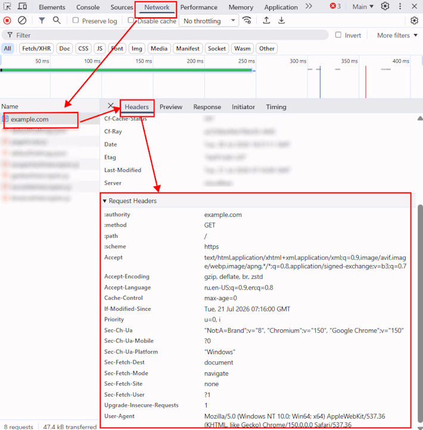

import Tabs from '@theme/Tabs';
import TabItem from '@theme/TabItem';
import ParamItem from '@theme/ParamItem';
import MethodItem from '@theme/MethodItem';
import BlogLink from '@theme/BlogLink';
import { ArticleHead } from '../../../../../src/theme/ArticleHead';

<ArticleHead slug="api/headers" />

# Cabeçalhos HTTP do navegador

Ao resolver CAPTCHAs e enviar solicitações para o site de destino, o servidor pode considerar os cabeçalhos HTTP, os cookies e outros parâmetros da sessão do navegador. Se eles estiverem ausentes ou inconsistentes entre si, o servidor poderá rejeitar a solicitação, redirecionar o usuário ou solicitar uma nova verificação.

Dentro de uma mesma sessão, recomenda-se manter:

- `User-Agent`;
- Client Hints;
- cookies;
- idioma do navegador;
- proxy, se utilizado;
- parâmetros das solicitações.

:::warning Importante

Use o User-Agent atual compatível com o CapMonster Cloud:

```text
GET https://capmonster.cloud/api/useragent/actual
```

Envie esse valor ao abrir a página, criar a tarefa e usar o resultado da resolução da CAPTCHA.

:::

<BlogLink url="https://capmonster.cloud/pt-br/blog/user-agent-updates/"/>

## Finalidade dos cabeçalhos

| Cabeçalho | Finalidade |
| --- | --- |
| `User-Agent` | Informações sobre o navegador e o sistema operacional |
| `Accept` | Formatos de resposta aceitos |
| `Accept-Language` | Idiomas preferidos |
| `Accept-Encoding` | Métodos de compactação compatíveis |
| `Referer` | URL da página de origem da navegação |
| `Origin` | Origem da solicitação usada em solicitações POST e CORS |
| `Cookie` | Cookies da sessão atual |
| `Sec-CH-UA` | Marca e versão do navegador |
| `Sec-CH-UA-Mobile` | Modo móvel ou desktop |
| `Sec-CH-UA-Platform` | Plataforma do navegador |
| `Sec-Fetch-Site` | Relação entre a origem da solicitação e o recurso de destino |
| `Sec-Fetch-Mode` | Modo da solicitação |
| `Sec-Fetch-Dest` | Tipo do recurso solicitado |

## Quais cabeçalhos enviar

Não existe um conjunto universal de cabeçalhos: ele depende do site e do tipo de solicitação.

Normalmente, são utilizados:

- `User-Agent`;
- `Accept`;
- `Accept-Language`;
- Client Hints;
- cabeçalhos `Sec-Fetch-*` correspondentes à solicitação.

Envie os cabeçalhos `Cookie`, `Referer` e `Origin` somente quando eles estiverem presentes na solicitação original do navegador ou forem necessários para a sessão atual.

Não defina manualmente:

- `Host`;
- `Content-Length`;
- `Transfer-Encoding`;
- `Content-Encoding`.

Esses valores geralmente são gerados automaticamente pelo cliente HTTP.

## Consistência da sessão

Dentro de uma mesma sessão, não altere sem necessidade:

- `User-Agent`;
- `Sec-CH-UA`;
- `Sec-CH-UA-Mobile`;
- `Sec-CH-UA-Platform`;
- idioma;
- proxy.

O User-Agent e os Client Hints devem descrever o mesmo navegador.

Exemplo incorreto:

```text
User-Agent: Chrome/150
Sec-CH-UA: "Google Chrome";v="140"
```

Exemplo correto:

```text
User-Agent: Chrome/150
Sec-CH-UA: "Chromium";v="150", "Google Chrome";v="150", "Not:A-Brand";v="99"
```

Os cookies também devem ser obtidos na mesma sessão em que a solicitação é enviada.

## Como lidar com redirecionamentos

Ao seguir redirecionamentos, mantenha os principais parâmetros da sessão:

- `User-Agent`;
- Client Hints;
- cookies;
- idioma;
- proxy.

Os cabeçalhos dependentes do contexto podem mudar:

- `Referer` deve corresponder à página anterior;
- `Sec-Fetch-Site` depende do domínio atual;
- os cookies devem ser atualizados após o recebimento de `Set-Cookie`;
- `Host` deve ser gerado pelo cliente HTTP para o novo URL.

Não envie manualmente cookies nem cabeçalhos de autorização para outro domínio.

## Como obter os cabeçalhos

### Pelas Ferramentas do desenvolvedor

1. Abra a página no navegador.
2. Pressione **F12** e acesse a guia **Network**.
3. Execute a ação necessária ou recarregue a página.
4. Selecione a solicitação correspondente.
5. Na guia **Headers**, copie os valores da seção **Request Headers**.



Também é possível copiar a solicitação usando os comandos **Copy as cURL** ou **Copy as fetch**.

Antes de publicar exemplos, remova cookies reais, tokens de autorização e outros dados confidenciais.

### A partir da sessão do navegador

Ao usar automação de navegador, obtenha os cabeçalhos e cookies da sessão atual. Não combine dados de contextos de navegador diferentes.

Para isso, você pode usar:

- **Playwright** — eventos de solicitação, o método `request.headers()` ou gravação em HAR.
- **Puppeteer** — manipuladores de solicitações de rede ou Chrome DevTools Protocol.
- **Selenium** — Chrome DevTools Protocol ou ferramentas adicionais de rede.
- [**ZennoPoster**](https://zennolab.com/en/products/zennoposter/) — solicitações de rede da sessão atual do navegador.
- **Arquivo HAR** — dados das solicitações, incluindo cabeçalhos, cookies e corpo da solicitação.
- **Analisador de proxy** — inspeção do tráfego HTTP(S) e dos cabeçalhos realmente enviados.
- **cURL** — reprodução e verificação de uma solicitação copiada do DevTools com **Copy as cURL**.

Recomenda-se usar os cabeçalhos da sessão ativa do navegador em vez de criá-los manualmente.

### Geração de cabeçalhos

Os cabeçalhos podem ser gerados programaticamente ou com bibliotecas especializadas, como *header-generator* e ferramentas semelhantes.

:::tip Fingerprint do navegador

O site também pode considerar parâmetros do ambiente do navegador, incluindo tela, fuso horário, Canvas e WebGL. O fingerprint é gerado pelo navegador ou por bibliotecas especializadas e deve ser consistente com o User-Agent, os Client Hints e os demais parâmetros da sessão.

:::

**Exemplos de geração de cabeçalhos**

Os exemplos obtêm o User-Agent atual do CapMonster Cloud, identificam a versão do Chrome e criam um conjunto básico de cabeçalhos do navegador usando uma biblioteca especializada. Em seguida, o User-Agent gerado aleatoriamente é substituído pelo valor atual, e os Client Hints são ajustados para corresponder à versão e à plataforma.

Depois disso, os cabeçalhos gerados são usados para enviar uma solicitação GET à página.

<Tabs className="full-width-tabs filled-tabs request-tabs" groupId="captcha-type">
  <TabItem value="js" label="JavaScript" default className="method-panel">
  <details>
      <summary>Mostrar código</summary>

```js
import { HeaderGenerator } from "header-generator";

const USER_AGENT_URL = "https://capmonster.cloud/api/useragent/actual";

async function createBrowserHeaders() {
  const userAgentResponse = await fetch(USER_AGENT_URL);

  if (!userAgentResponse.ok) {
    throw new Error(
      `Não foi possível obter o User-Agent: ${userAgentResponse.status}`,
    );
  }

  const userAgent = (await userAgentResponse.text()).trim();

  const versionMatch = userAgent.match(/(?:Chrome|Chromium)\/(\d+)/);

  if (!versionMatch) {
    throw new Error(
      "Não foi possível identificar a versão do Chrome no User-Agent",
    );
  }

  const chromeVersion = versionMatch[1];

  const generator = new HeaderGenerator({
    browsers: ["chrome"],
    operatingSystems: ["windows"],
    devices: ["desktop"],
    locales: ["en-US", "en"],
    httpVersion: "2",
  });

  // Gera um conjunto básico sem restringir a versão do Chrome.
  const generatedHeaders = generator.getHeaders();

  // Headers evita a criação de nomes duplicados
  // com letras maiúsculas e minúsculas diferentes.
  const headers = new Headers(generatedHeaders);

  // Substitui o User-Agent aleatório pelo valor exato
  // retornado pelo CapMonster Cloud.
  headers.set("User-Agent", userAgent);

  // Ajusta os Client Hints à versão do Chrome.
  headers.set(
    "Sec-CH-UA",
    `"Chromium";v="${chromeVersion}", ` +
      `"Google Chrome";v="${chromeVersion}", ` +
      '"Not:A-Brand";v="99"',
  );

  headers.set("Sec-CH-UA-Mobile", "?0");
  headers.set("Sec-CH-UA-Platform", '"Windows"');

  return headers;
}

const headers = await createBrowserHeaders();

const response = await fetch("https://example.com/", {
  method: "GET",
  headers,
  redirect: "follow",
});

console.log(response.status);

console.log(Object.fromEntries(headers.entries()));
```

</details>
</TabItem>

  <TabItem value="python" label="Python" className="method-panel">
  <details>
      <summary>Mostrar código</summary>

```python
import re

import requests
from browserforge.headers import HeaderGenerator


USER_AGENT_URL = "https://capmonster.cloud/api/useragent/actual"


def create_browser_headers() -> dict[str, str]:
    response = requests.get(USER_AGENT_URL, timeout=30)
    response.raise_for_status()

    user_agent = response.text.strip()

    version_match = re.search(r"(?:Chrome|Chromium)/(\d+)", user_agent)

    if version_match is None:
        raise ValueError(
            "Não foi possível identificar a versão do Chrome no User-Agent"
        )

    chrome_version = version_match.group(1)

    generator = HeaderGenerator(
        browser="chrome",
        os="windows",
        device="desktop",
        locale=("en-US", "en"),
        http_version=2,
    )

    # Gera um conjunto básico sem restringir a versão do Chrome.
    headers = generator.generate()

    # Substitui o User-Agent aleatório pelo valor
    # retornado pelo CapMonster Cloud.
    headers["User-Agent"] = user_agent

    # Ajusta os Client Hints à versão do Chrome.
    headers["Sec-CH-UA"] = (
        f'"Chromium";v="{chrome_version}", '
        f'"Google Chrome";v="{chrome_version}", '
        '"Not:A-Brand";v="99"'
    )
    headers["Sec-CH-UA-Mobile"] = "?0"
    headers["Sec-CH-UA-Platform"] = '"Windows"'

    return headers


headers = create_browser_headers()

with requests.Session() as session:
    session.headers.update(headers)

    response = session.get(
        "https://example.com/",
        timeout=30,
        allow_redirects=True,
    )

    print(response.status_code)
    print(dict(session.headers))
```

</details>
</TabItem>
</Tabs>

## Exemplo de conjunto de cabeçalhos

Para solicitar uma página HTML, você pode usar o seguinte conjunto básico:

```http
User-Agent: userAgentPlaceholder
Accept: text/html,application/xhtml+xml,application/xml;q=0.9,image/avif,image/webp,*/*;q=0.8
Accept-Language: en-US,en;q=0.9
Accept-Encoding: gzip, deflate, br
Upgrade-Insecure-Requests: 1
Sec-Fetch-Dest: document
Sec-Fetch-Mode: navigate
Sec-Fetch-Site: none
Sec-Fetch-User: ?1
Sec-CH-UA: "Chromium";v="150", "Google Chrome";v="150", "Not:A-Brand";v="99"
Sec-CH-UA-Mobile: ?0
Sec-CH-UA-Platform: "Windows"
```

Em formato JSON:

```json
{
  "headers": {
    "User-Agent": "userAgentPlaceholder",
    "Accept": "text/html,application/xhtml+xml,application/xml;q=0.9,image/avif,image/webp,*/*;q=0.8",
    "Accept-Language": "en-US,en;q=0.9",
    "Accept-Encoding": "gzip, deflate, br",
    "Upgrade-Insecure-Requests": "1",
    "Sec-Fetch-Dest": "document",
    "Sec-Fetch-Mode": "navigate",
    "Sec-Fetch-Site": "none",
    "Sec-Fetch-User": "?1",
    "Sec-CH-UA": "\"Chromium\";v=\"150\", \"Google Chrome\";v=\"150\", \"Not:A-Brand\";v=\"99\"",
    "Sec-CH-UA-Mobile": "?0",
    "Sec-CH-UA-Platform": "\"Windows\""
  }
}
```

:::tip Sec-Fetch-*
Os valores de `Sec-Fetch-*` dependem de como a solicitação é enviada. O exemplo mostra a abertura direta da página, e não a navegação por um link de outro site.
:::

## Uso ao resolver CAPTCHAs

Mantenha os parâmetros da sessão do navegador em todas as etapas da interação com o site de destino:

1. Abra a página com a CAPTCHA.
2. Obtenha os cookies, os cabeçalhos e os parâmetros da sessão atual.
3. Identifique os parâmetros da CAPTCHA, incluindo `websiteURL`, `websiteKey` e outros valores obrigatórios.
4. [Crie uma tarefa](/docs/api/methods/create-task) no CapMonster Cloud.
5. Obtenha o [resultado da resolução](/docs/api/methods/get-task-result).
6. Envie o resultado da resolução, como um token ou cookies, para a página de verificação ou para a API do site de destino dentro da mesma sessão.

### Envio do resultado da resolução para uma página HTML

Use:

- o mesmo `User-Agent`;
- Client Hints correspondentes;
- cookies da sessão atual;
- o mesmo idioma do navegador;
- o mesmo proxy, se tiver sido utilizado;
- `Referer` e `Origin`, se estiverem presentes na solicitação original.

### Envio do resultado da resolução por uma API

Use os cabeçalhos da solicitação original da API.

Não adicione cabeçalhos de navegação do navegador, como `Sec-Fetch-User` e `Upgrade-Insecure-Requests`, se eles não estiverem presentes na solicitação original.

### Sequência de solicitações

```text
GET /page
        │
        ├─ cookies e cabeçalhos HTTP
        ├─ parâmetros da CAPTCHA
        │
        ▼
CapMonster Cloud
        │
        ├─ resultado da resolução
        │
        ▼
POST /verify
        │
        ├─ cookies da sessão atual
        ├─ o mesmo User-Agent
        ├─ Client Hints correspondentes
        ├─ Referer e Origin atuais
        │
        ▼
resposta do site de destino
```

:::info

Exemplos de uso de cabeçalhos ao passar por CAPTCHAs e outras verificações de proteção:

- [Cloudflare Challenge (cf_clearance)](/docs/captchas/turnstile-challenge-task/#exemplos-de-resolução-automática-do-cloudflare-challenge-cf_clearance)
- [TSPD](/docs.capmonster.cloud/pt-br/docs/captchas/tspd-task/#exemplos-de-resolu%C3%A7%C3%A3o-autom%C3%A1tica-do-tspd)
- [Hunt CAPTCHA](/docs.capmonster.cloud/pt-br/docs/captchas/hunt-task/#exemplo-de-resolu%C3%A7%C3%A3o-do-hunt-captcha)

:::

## Erros comuns

| Erro | O que verificar |
| --- | --- |
| Apenas o `User-Agent` é enviado | Adicione os cabeçalhos relevantes da solicitação original |
| São usados dados de sessões diferentes | Obtenha os cabeçalhos e cookies do mesmo contexto do navegador |
| O `User-Agent` não corresponde ao `Sec-CH-UA` | Alinhe as versões do navegador e a plataforma |
| Cookies desatualizados são enviados | Obtenha os cookies novamente ou processe `Set-Cookie` |
| Cabeçalhos de navegação HTML são usados em uma solicitação de API | Use os cabeçalhos de uma solicitação do mesmo tipo |
| `Host` ou `Content-Length` é definido manualmente | Remova o cabeçalho para que o cliente HTTP o gere automaticamente |

<br />

Se a solicitação falhar, compare-a com a solicitação do navegador na guia **Network**. Verifique o URL, o método, o corpo, os cookies, os cabeçalhos, o proxy e o URL final após os redirecionamentos.
