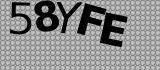
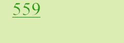

import { ArticleHead } from '../../../../../../src/theme/ArticleHead';

<ArticleHead slug="captchas/ImageToText/module-name" />

# Nome do módulo

Ao trabalhar com o reconhecimento automático de CAPTCHAs, a precisão e a velocidade de processamento são importantes. Diferentes serviços usam seus próprios tipos de CAPTCHA, e uma solução universal nem sempre consegue processá-los com a mesma eficiência. Por exemplo, CAPTCHAs do **Google**, **SolveMedia**, **WhatsApp** ou **Yandex** podem ter características específicas que fazem com que o módulo de reconhecimento padrão funcione mais lentamente ou apresente erros.

Para aumentar a eficiência e reduzir a probabilidade de reconhecimento incorreto, o CapMonster Cloud permite especificar o módulo que processará a CAPTCHA. O sistema usará um algoritmo de reconhecimento especializado, desenvolvido para o serviço específico, em vez do método universal de processamento de CAPTCHAs.

## Como passar o nome do módulo no CapMonster Cloud usando apenas o campo ApiKey

Se a integração disponibilizar apenas um campo para a chave de API, adicione o nome do módulo necessário após a chave no seguinte formato:

```text
{apikey}__nome-do-módulo
```

Por exemplo:

```text
00f87cb0f01330d33709ce3339ad0c8c__solvemedia
```

A chave de API e o nome do módulo devem ser separados por **dois caracteres de sublinhado (`__`)**.

A lista de nomes de módulos disponíveis:
<table>
    <tbody>
        <tr>
            <td align="center">amazon</td>
            <td align="center"></td>
        </tr>
        <tr>
            <td align="center">apple</td>
            <td align="center"></td>
        </tr>
        <tr>
            <td align="center">botdetect</td>
            <td align="center"></td>
        </tr>                
        <tr>
            <td align="center">facebook</td>
            <td align="center"></td>
        </tr>
        <tr>
            <td align="center">gmx</td>
            <td align="center"></td>
        </tr>
        <tr>
            <td align="center">google</td>
            <td align="center"></td>
        </tr>
        <tr>
            <td align="center">hotmail</td>
            <td align="center"></td>
        </tr>
        <tr>
            <td align="center">mailru</td>
            <td align="center"></td>
        </tr>
        <tr>
            <td align="center">okeng</td>
            <td align="center"></td>
        </tr>
        <tr>
            <td align="center">okrus</td>
            <td align="center"></td>
        </tr>
        <tr>
            <td align="center">partiallyblur</td>
            <td align="center"></td>
        </tr>
        <tr>
            <td align="center">ramblerrus</td>
            <td align="center"></td>
        </tr>
        <tr>
            <td align="center">ramblerrusnew</td>
            <td align="center"></td>
        </tr>
        <tr>
            <td align="center">solvemedia</td>
            <td align="center"></td>
        </tr>
        <tr>
            <td align="center">steam</td>
            <td align="center"></td>
        </tr>
        <tr>
            <td align="center">vk</td>
            <td align="center"></td>
        </tr>
        <tr>
            <td align="center">whatsapp</td>
            <td align="center"></td>
        </tr>
        <tr>
            <td align="center">wikimedia_paddle_ensemble</td>
            <td align="center"></td>
        </tr>
        <tr>
            <td align="center">yandex</td>
            <td align="center"></td>
        </tr>        
        <tr>
            <td align="center">yandexnew (captcha de duas palavras)</td>
            <td rowspan="2" align="center"></td>
        </tr>
        <tr>
            <td align="center">yandexwave</td>
        </tr>        
        <tr>
            <td align="center">captcha_math</td>
            <td align="center"></td>
        </tr>
        <tr>
            <td align="center">sat</td>
            <td align="center"></td>
        </tr>
        <tr>
            <td align="center">bls_text</td>
            <td align="center"></td>
        </tr>
        <tr>
            <td align="center">universal (todas as outras captchas de texto)</td>
            <td align="center"></td>
        </tr>
    </tbody>
</table>

:::info Informação
Se você não conseguiu enviar um captcha para um módulo específico, por favor, escreva para nossa [equipe de suporte](https://helpdesk.zennolab.com/en-us/conversation/new), nós iremos ajudá-lo!
:::