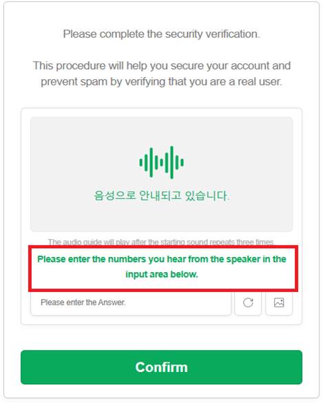

import Tabs from '@theme/Tabs';
import TabItem from '@theme/TabItem';
import ParamItem from '@theme/ParamItem';
import MethodItem from '@theme/MethodItem';
import MethodDescription from '@theme/MethodDescription'
import PriceBlock from '@theme/PriceBlock';
import PriceBlockWrap from '@theme/PriceBlockWrap';
import { ArticleHead } from '@site/src/theme/ArticleHead';

<ArticleHead slug="captchas/compleximage/bills_audio" />

# bills_audio


<PriceBlockWrap>
  <PriceBlock title="bills_audio" captchaId="complex-rec_bills_audio" />
</PriceBlockWrap>

:::warning **Atenção!**
O uso de servidores proxy não é necessário para esta tarefa.
:::
<br />
O captcha de áudio `bills_audio` é uma versão sonora do “captcha de recibos”, onde imagens ou dados gerados simulam recibos e podem conter, por exemplo, números, valores e datas. Neste tipo de tarefa, o usuário deve ouvir um arquivo de áudio e verificar a entrada correta com base nas informações ouvidas. Este formato pode se parecer com o seguinte:

 

## Parâmetros da solicitação

<br />
<span style={{ fontSize: "15px", fontWeight: 700 }}>
> IMPORTANTE: obtenha o áudio em base64 diretamente antes de criar a tarefa para evitar erros durante a resolução (veja a seção [Obtenção de áudio e conversão para Base64](#obtenção-de-áudio-e-conversão-para-base64)).
</span>
<br />

<div className="bordered-panel">
    <ParamItem title="type" required type="string" />
    **ComplexImageTask**

    ---

    <ParamItem title="class" required type="string" />
    **recognition**

    ---

    <ParamItem title="imagesBase64" required type="array" />
    Áudio codificado em base64, envolvido em um array.<br />
    Exemplo: `[ "UklGRnjuAwBXQVZFZm10...f/2f/9/6z/vf8MAAAA"]`

    ---

    <ParamItem title="Task (dentro de metadata)" required type="string" />
    Nome da tarefa: `"bills_audio"`<br />

    ---

    <ParamItem title="PayloadType (dentro de metadata)" required type="string" />
    Tipo de dados enviados na tarefa: `"Audio"`

</div>

## Método para criar tarefa

<div className="method-panel">
    <MethodItem>
    ```http
    https://api.capmonster.cloud/createTask
    ```
    </MethodItem>
    <MethodDescription>
      **Exemplo de requisição**
```json
{
    "clientKey": "API_KEY",
    "task": {
        "type": "ComplexImageTask",
        "class": "recognition",
        "imagesBase64": [
            "UklGRnjuAwBXQVZFZm10...f/2f/9/6z/vf8MAAAA"
        ],
        "metadata": {
            "Task": "bills_audio",
            "PayloadType": "Audio"
        }
    }
}
```

**Exemplo de resposta**

```json
{
    "errorId": 0,
    "taskId": 143998457
}
```

</MethodDescription>

</div>

## Método para obter o resultado da tarefa

<div className="method-panel-full">
    <MethodItem>
    ```http
    https://api.capmonster.cloud/getTaskResult
    ```
    </MethodItem>
    <MethodDescription>
    **Exemplo de requisição**
    ```json
    {
        "clientKey": "API_KEY",
        "taskId": 143998457
    }
    ```
    **Exemplo de resposta**  <br/>
    A resposta retorna os números do áudio:
    ```json
    {
      "solution": {
          "answer": [6, 8, 4, 1, 2, 3],
          "metadata": {"AnswerType": "Text"}
      },
      "cost": 0.0008,
      "status": "ready",
      "errorId": 0,
      "errorCode": null,
      "errorDescription": null
    }
    ```
    </MethodDescription>
</div>

## Obtenção de áudio e conversão para Base64

1. Abra a página do captcha e inicie o **DevTools**, depois vá até a aba **Network**.  
2. Ative o modo de áudio do captcha clicando no botão correspondente.  
3. Na lista de requisições, encontre um endereço como:  
   `blob:https://example.com/3be79ac6-1b3d-43ef-9a8a-7ad8877b3606`  
4. Copie essa URL e abra-a na barra de endereço do navegador — o arquivo de áudio do captcha em formato **.wav** será aberto.


5. Salve o arquivo e converta o arquivo **.wav** para **Base64** usando qualquer método conveniente — por exemplo, com Node.js:

```JavaScript
const fs = require("fs");

// Caminho para o arquivo .wav de origem
const filePath = "C:\\Users\\User\\Downloads\\file-acbe-4fb3-9f8e-f989ba6c7fde.wav";

const fileBuffer = fs.readFileSync(filePath);

// Converter para Base64
const base64 = fileBuffer.toString("base64");

// Salvar a string Base64 em um arquivo de texto
fs.writeFileSync("output.txt", base64);

console.log("Arquivo convertido com sucesso para Base64 e salvo como output.txt");
```

6. Use a string Base64 resultante na requisição de tarefa do CapMonster Cloud.

## Usar biblioteca SDK

<Tabs className="full-width-tabs filled-tabs request-tabs" groupId="captcha-type">

  <TabItem value="js" label="JavaScript / TypeScript" default className="method-panel">
  <details>
      <summary>Mostrar código (para navegador)</summary>
```js
// https://github.com/CapMonsterCloud/capmonster-nodejs-captcha-solver

import {
  CapMonsterCloudClientFactory,
  ClientOptions,
  ComplexImageTaskRecognitionRequest
} from "@zennolab_com/capmonstercloud-client";

document.addEventListener("DOMContentLoaded", async () => {

  const API_KEY = "YOUR_API_KEY"; // Informe sua chave de API do CapMonster Cloud

  const client = CapMonsterCloudClientFactory.Create(
    new ClientOptions({ clientKey: API_KEY })
  );

  // Não é necessário usar proxy para ComplexImageTaskRecognitionRequest
  const billsAudioRequest = new ComplexImageTaskRecognitionRequest({
    imagesBase64: ["your_audio_base64"],
    metaData: {
      Task: "bills_audio",
      PayloadType: "Audio",
    },
  });

  // Se necessário, você pode verificar o saldo
  const balance = await client.getBalance();
  console.log("Balance:", balance);

  const result = await client.Solve(billsAudioRequest);
  console.log("Solution:", result.solution);
});
```
  </details>

    <details>
      <summary>Mostrar código (Node.js)</summary>
```javascript
// https://github.com/CapMonsterCloud/capmonster-nodejs-captcha-solver

const {
  CapMonsterCloudClientFactory,
  ClientOptions,
  ComplexImageTaskRecognitionRequest,
} = require("@zennolab_com/capmonstercloud-client");

const API_KEY = "YOUR_API_KEY"; // Informe sua chave de API do CapMonster Cloud

async function solveBillsAudio() {
  const client = CapMonsterCloudClientFactory.Create(
    new ClientOptions({ clientKey: API_KEY }),
  );
  // Não é necessário usar proxy para ComplexImageTaskRecognitionRequest
  const billsAudioRequest = new ComplexImageTaskRecognitionRequest({
    imagesBase64: ["your_audio_base64"],
    metaData: {
      Task: "bills_audio",
      PayloadType: "Audio",
    },
  });

  // Se necessário, você pode verificar o saldo
  const balance = await client.getBalance();
  console.log("Balance:", balance);

  const result = await client.Solve(billsAudioRequest);
  console.log("Solution:", result.solution);
}

solveBillsAudio().catch(console.error);
```
</details>

  </TabItem>

  <TabItem value="python" label="Python" className="method-panel">
  <details>
      <summary>Mostrar código</summary>
```python
# https://github.com/CapMonsterCloud/capmonster-python-captcha-solver

import asyncio

from capmonstercloudclient import CapMonsterClient, ClientOptions
from capmonstercloudclient.requests import RecognitionComplexImageTaskRequest

API_KEY = "YOUR_API_KEY"  # Informe sua chave de API do CapMonster Cloud


async def solve_bills_audio():
    client = CapMonsterClient(
        options=ClientOptions(api_key=API_KEY)
    )

    # Não é necessário usar proxy para RecognitionComplexImageTaskRequest
    bills_audio_request = RecognitionComplexImageTaskRequest(
        imagesBase64=[
            "your_audio_base64"
        ],
        metadata={
            "Task": "bills_audio",
            "PayloadType": "Audio",
        },
    )

    # Se necessário, você pode verificar o saldo
    balance = await client.get_balance()
    print("Balance:", balance)

    result = await client.solve_captcha(bills_audio_request)
    print("Solution:", result)


asyncio.run(solve_bills_audio())
```
    </details>

  {/* </TabItem> */}

  {/* <TabItem value="csharp" label="C#" className="method-panel">
  <details>
      <summary>Mostrar código</summary>
```csharp
// https://github.com/CapMonsterCloud/capmonster-dotnet-captcha-solver

using System;
using System.Threading.Tasks;
using Newtonsoft.Json;
using Zennolab.CapMonsterCloud;
using Zennolab.CapMonsterCloud.Requests;

class Program
{
    static async Task Main(string[] args)
    {
        const string API_KEY = "YOUR_API_KEY"; // Informe sua chave de API do CapMonster Cloud

        var clientOptions = new ClientOptions
        {
            ClientKey = API_KEY
        };

        var cmCloudClient = CapMonsterCloudClientFactory.Create(clientOptions);

        // Não é necessário usar proxy para RecognitionComplexImageTaskRequest
        var billsAudioRequest = new RecognitionComplexImageTaskRequest
        {
            ImagesBase64 = new[]
            {
                "your_audio_base64"
            },

            Metadata = new RecognitionComplexImageTaskRequest.RecognitionMetadata
            {
                Task = "bills_audio",
                PayloadType = "Audio"
            }
        };

        // Se necessário, você pode verificar o saldo
        var balance = await cmCloudClient.GetBalanceAsync();
        Console.WriteLine("Balance: " + balance);

        var result = await cmCloudClient.SolveAsync(billsAudioRequest);

        Console.WriteLine("Solution:");
        Console.WriteLine(
            JsonConvert.SerializeObject(
                result.Solution,
                Formatting.Indented
            )
        );
    }
}
``` 
</details> */}
  </TabItem>

</Tabs>


