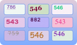

import Tabs from '@theme/Tabs';
import TabItem from '@theme/TabItem';
import ParamItem from '@theme/ParamItem';
import MethodItem from '@theme/MethodItem';
import MethodDescription from '@theme/MethodDescription'
import PriceBlock from '@theme/PriceBlock';
import PriceBlockWrap from '@theme/PriceBlockWrap';
import BlogLink from '@theme/BlogLink';
import { ArticleHead } from '@site/src/theme/ArticleHead';

<ArticleHead slug="captchas/compleximage/bls" />


# bls



<PriceBlockWrap>
  <PriceBlock  captchaId="complex-rec_bls" />
</PriceBlockWrap>

:::warning **Atenção!**
O uso de servidores proxy não é necessário para esta tarefa.
:::
<br />

No pedido, devem ser fornecidas 9 imagens no formato base64. <br />
Além disso, o valor `TaskArgument` deve ser passado dentro de `metadata`.

<BlogLink url="https://capmonster.cloud/pt-BR/blog/news/bls-solve-extension" />

## Parâmetros da solicitação

<br />
<span style={{ fontSize: "15px", fontWeight: 700 }}>
> IMPORTANTE: obtenha as imagens em base64 imediatamente antes de criar a tarefa para evitar erros durante a resolução (veja a seção [Como obter base64](#como-obter-base64)).
</span>
<br />

<div className="bordered-panel">
    <ParamItem title="type" required type="string" />
    **ComplexImageTask**

    ---

    <ParamItem title="class" required type="string" />
    **recognition**

    ---

    <ParamItem title="imagesBase64" required type="array" />
    Array de imagens codificadas em base64 (sem o prefixo `data:image/png;base64,`).

    ---

    <ParamItem title="Task (dentro de metadata)" required type="string" />
    Nome da tarefa: `"bls_3x3"`

    ---

    <ParamItem title="TaskArgument (dentro de metadata)" required type="string" />
    Valor do número que deve ser encontrado nas imagens. Exemplo: `"123"`

</div>

## Método para criar tarefa

<div className="method-panel">
	<MethodItem>
		```http
		https://api.capmonster.cloud/createTask
		```
	</MethodItem>
	<MethodDescription>
      **Exemplo de requisição**
      ```json
      {
        "clientKey": "API_KEY",
        "task": 
        {
          "type": "ComplexImageTask",
          "class": "recognition",
          "imagesBase64": [
            "image1_to_base64",
            "image2_to_base64",
            "image3_to_base64",
            "image4_to_base64",
            "image5_to_base64",
            "image6_to_base64",
            "image7_to_base64",
            "image8_to_base64",
            "image9_to_base64"
          ],
          "metadata": {
            "Task": "bls_3x3",
            "TaskArgument": "123"
          }
        }
      }
      ```

    	Exemplo de tarefa:

    	

    	Envie imagens convertidas para base64:

    	
    	
    	
    	
    	
    	
    	
    	
    	

    	Para este exemplo: `"TaskArgument": "546"`

    	**Exemplo de resposta**
    	```json
    	{
    	  "errorId":0,
    	  "taskId":143998457
    	}
    	```
    </MethodDescription>

</div>

## Método para obter o resultado da tarefa

<div className="method-panel-full">
	<MethodItem>
		```http
		https://api.capmonster.cloud/getTaskResult
		```
	</MethodItem>
	<MethodDescription>
		**Exemplo de requisição**
		```json
		{
		  "clientKey":"API_KEY",
		  "taskId": 143998457
		}
		```
		**Exemplo de resposta:**<br/>
    Um array de valores com elementos `true` ou `false`, dependendo de o número na imagem ser ou não o argumento procurado.
```json
{
  "errorId": 0,
  "status": "ready",
  "errorCode": null,
  "errorDescription": null,
  "solution": {
    "answer": [true, true, false, false, true, false, false, true, true],
    "metadata": {
      "AnswerType": "Grid"
    }
  }
}
```

</MethodDescription>

</div>

## Método alternativo de resolução (bls_text)

Em vez de usar o modo automático de correspondência (`bls_3x3`), você pode utilizar o reconhecimento de texto para cada imagem separadamente. Essa abordagem oferece maior flexibilidade e permite um controle mais preciso do fluxo de processamento.

Este método é implementado por meio da tarefa `ImageToTextTask` com o módulo `bls_text` (*veja a seção [Nome do módulo](/docs/captchas/ImageToText/module-name)*). Nesse modo, **cada imagem é processada como uma captcha individual**, e o resultado é um valor de texto reconhecido.

### Fluxo de trabalho

1. A captcha é dividida em imagens separadas (9 elementos da grade).
2. Cada imagem é enviada como uma tarefa individual `ImageToTextTask`.
3. A resposta retorna o texto reconhecido (número).
4. Os valores recebidos são comparados com o alvo para determinar as imagens correspondentes.

### Exemplo de requisição

<div className="method-panel">
	<MethodItem>
		```http
		https://api.capmonster.cloud/createTask
		```
	</MethodItem>
	<MethodDescription>
      **Exemplo de requisição**

```json
{
  "clientKey": "API_KEY",
  "task": {
    "type": "ImageToTextTask",
    "capMonsterModule": "bls_text",
    "body": "/9j/4AAQSkZJRgABAQAAAQABAAD/2wBDAA...CruPHGc8nk5z+HtRQB//9k="
  }
}
```

**Exemplo de resposta**

```json
{
  "errorId": 0,
  "status": "ready",
  "errorCode": null,
  "errorDescription": null,
  "solution": {
    "text": "123"
  }
}
```

</MethodDescription>

</div>

### Exemplo de resolução automatizada bls_text

Nesta abordagem, cada imagem é enviada individualmente como uma tarefa `ImageToTextTask` usando o módulo `bls_text`. Os resultados do reconhecimento são então coletados e processados. Você recebe um valor de texto para cada imagem e pode definir sua própria lógica — por exemplo, comparar os valores com um alvo (`target`), filtrar, combinar resultados ou implementar qualquer processamento personalizado dependendo do seu caso de uso.

<details>
      <summary>Mostrar código (Node.js)</summary>
```javascript
const API_KEY = "API_KEY";
const CREATE_TASK_URL = "https://api.capmonster.cloud/createTask";
const GET_RESULT_URL = "https://api.capmonster.cloud/getTaskResult";

const target = "546";

// 9 imagens (envie cada uma no formato: "/9j/4AAQSkZJ...6UUAf/Z")
const images = [
  "base64_img_1",
  "base64_img_2",
  "base64_img_3",
  "base64_img_4",
  "base64_img_5",
  "base64_img_6",
  "base64_img_7",
  "base64_img_8",
  "base64_img_9",
];

// criar tarefa (UMA única imagem)
async function createTask(imageBase64) {
  const payload = {
    clientKey: API_KEY,
    task: {
      type: "ImageToTextTask",
      capMonsterModule: "bls_text",
      body: imageBase64,
    },
  };

  console.log("=== REQUEST ===");
  console.log(JSON.stringify(payload, null, 2));

  const res = await fetch(CREATE_TASK_URL, {
    method: "POST",
    body: JSON.stringify(payload),
  });

  const data = await res.json();

  console.log("=== CREATE RESPONSE ===");
  console.log(JSON.stringify(data, null, 2));

  if (data.errorId !== 0) {
    throw new Error(data.errorDescription);
  }

  return data.taskId;
}

// aguardando resultado
async function getResult(taskId) {
  while (true) {
    const res = await fetch(GET_RESULT_URL, {
      method: "POST",
      body: JSON.stringify({
        clientKey: API_KEY,
        taskId,
      }),
    });

    const data = await res.json();

    if (data.errorId !== 0) {
      throw new Error(data.errorDescription);
    }

    if (data.status === "ready") {
      return data.solution.text;
    }

    await new Promise((r) => setTimeout(r, 1500));
  }
}

// lógica principal
async function solveBlsText() {
  try {
    // 1. criar tarefas
    const taskIds = await Promise.all(images.map((img) => createTask(img)));

    // 2. obter resultados
    const results = await Promise.all(taskIds.map((id) => getResult(id)));

    // 3. processamento adicional, ex: comparar com target
    const answer = results.map((text) => text === target);

    console.log("RESULTS:", results);
    console.log("ANSWER:", answer);

    return answer;
  } catch (err) {
    console.error("ERROR:", err.message);
  }
}

solveBlsText();
```
</details>


## Como obter Base64

As imagens nas páginas podem ser representadas tanto como uma URL quanto já codificadas em formato Base64. Para encontrar o valor necessário, clique com o botão direito na imagem da captcha, selecione **Inspect (Inspecionar)** e examine cuidadosamente a seção **Elements** ou as requisições de rede — ali você poderá encontrar a URL da imagem ou o conteúdo já codificado.

1. Abra o seu site onde a captcha é exibida no navegador.
2. Clique com o botão direito no elemento da captcha e selecione **Inspect (Inspecionar)**.


## Usar biblioteca SDK

<Tabs className="full-width-tabs filled-tabs request-tabs" groupId="captcha-type">

  <TabItem value="js" label="JavaScript / TypeScript" default className="method-panel">
  <details>
      <summary>Mostrar código (para navegador)</summary>
```js
// https://github.com/CapMonsterCloud/capmonster-nodejs-captcha-solver

import {
  CapMonsterCloudClientFactory,
  ClientOptions,
  ComplexImageTaskRecognitionRequest
} from "@zennolab_com/capmonstercloud-client";

document.addEventListener("DOMContentLoaded", async () => {

  const API_KEY = "YOUR_API_KEY"; // Informe sua chave de API do CapMonster Cloud

  const client = CapMonsterCloudClientFactory.Create(
    new ClientOptions({ clientKey: API_KEY })
  );

  // Não é necessário usar proxy para ComplexImageTaskRecognitionRequest
  const blsRequest = new ComplexImageTaskRecognitionRequest({
    imagesBase64: [
      "your_image_1_base64",
      "your_image_2_base64",
      "your_image_3_base64",
      "your_image_4_base64",
      "your_image_5_base64",
      "your_image_6_base64",
      "your_image_7_base64",
      "your_image_8_base64",
      "your_image_9_base64",
    ],
    metaData: {
      Task: "bls_3x3",
      TaskArgument: "123",
    },
  });

  // Se necessário, você pode verificar o saldo
  const balance = await client.getBalance();
  console.log("Balance:", balance);

  const result = await client.Solve(blsRequest);
  console.log("Solution:", result.solution);
});
```
    </details>

    <details>
      <summary>Mostrar código (Node.js)</summary>
```javascript
// https://github.com/CapMonsterCloud/capmonster-nodejs-captcha-solver

const {
  CapMonsterCloudClientFactory,
  ClientOptions,
  ComplexImageTaskRecognitionRequest,
} = require("@zennolab_com/capmonstercloud-client");

const API_KEY = "YOUR_API_KEY"; // Informe sua chave de API do CapMonster Cloud

async function solveBls3x3() {
  const client = CapMonsterCloudClientFactory.Create(
    new ClientOptions({ clientKey: API_KEY }),
  );
  // Não é necessário usar proxy para ComplexImageTaskRecognitionRequest
  const blsRequest = new ComplexImageTaskRecognitionRequest({
    imagesBase64: [
      "your_image_1_base64",
      "your_image_2_base64",
      "your_image_3_base64",
      "your_image_4_base64",
      "your_image_5_base64",
      "your_image_6_base64",
      "your_image_7_base64",
      "your_image_8_base64",
      "your_image_9_base64",
    ],
    metaData: {
      Task: "bls_3x3",
      TaskArgument: "123",
    },
  });

  // Se necessário, você pode verificar o saldo
  const balance = await client.getBalance();
  console.log("Balance:", balance);

  const result = await client.Solve(blsRequest);
  console.log("Solution:", result.solution);
}

solveBls3x3().catch(console.error);
```
</details>

  </TabItem>

  <TabItem value="python" label="Python" className="method-panel">
  <details>
      <summary>Mostrar código</summary>
```python
# https://github.com/CapMonsterCloud/capmonster-python-captcha-solver

import asyncio

from capmonstercloudclient import CapMonsterClient, ClientOptions
from capmonstercloudclient.requests import RecognitionComplexImageTaskRequest

API_KEY = "YOUR_API_KEY"  # Informe sua chave de API do CapMonster Cloud


async def solve_bls_3x3():
    client = CapMonsterClient(
        options=ClientOptions(api_key=API_KEY)
    )

    # Não é necessário usar proxy para RecognitionComplexImageTaskRequest
    bls_request = RecognitionComplexImageTaskRequest(
        imagesBase64=[
            "your_image_1_base64",
            "your_image_2_base64",
            "your_image_3_base64",
            "your_image_4_base64",
            "your_image_5_base64",
            "your_image_6_base64",
            "your_image_7_base64",
            "your_image_8_base64",
            "your_image_9_base64",
        ],
        metadata={
            "Task": "bls_3x3",
            "TaskArgument": "123",
        },
    )

    # Se necessário, você pode verificar o saldo
    balance = await client.get_balance()
    print("Balance:", balance)

    result = await client.solve_captcha(bls_request)
    print("Solution:", result)


asyncio.run(solve_bls_3x3())
```
    </details>

  </TabItem>

  <TabItem value="csharp" label="C#" className="method-panel">
  <details>
      <summary>Mostrar código</summary>
```csharp
// https://github.com/CapMonsterCloud/capmonster-dotnet-captcha-solver

using System;
using System.Threading.Tasks;
using Newtonsoft.Json;
using Zennolab.CapMonsterCloud;
using Zennolab.CapMonsterCloud.Requests;

class Program
{
    static async Task Main(string[] args)
    {
        const string API_KEY = "YOUR_API_KEY"; // Informe sua chave de API do CapMonster Cloud

        var clientOptions = new ClientOptions
        {
            ClientKey = API_KEY
        };

        var cmCloudClient = CapMonsterCloudClientFactory.Create(clientOptions);

        // Não é necessário usar proxy para RecognitionComplexImageTaskRequest
        var blsRequest = new RecognitionComplexImageTaskRequest
        {
            ImagesBase64 = new[]
            {
                "your_image_1_base64",
                "your_image_2_base64",
                "your_image_3_base64",
                "your_image_4_base64",
                "your_image_5_base64",
                "your_image_6_base64",
                "your_image_7_base64",
                "your_image_8_base64",
                "your_image_9_base64"
            },

            Metadata = new RecognitionComplexImageTaskRequest.RecognitionMetadata
            {
                Task = "bls_3x3",
                TaskArgument = "123"
            }
        };

        // Se necessário, você pode verificar o saldo
        var balance = await cmCloudClient.GetBalanceAsync();
        Console.WriteLine("Balance: " + balance);

        var result = await cmCloudClient.SolveAsync(blsRequest);

        Console.WriteLine("Solution:");
        Console.WriteLine(
            JsonConvert.SerializeObject(
                result.Solution,
                Formatting.Indented
            )
        );
    }
}
``` 
</details>
  </TabItem>

</Tabs>
