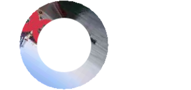

import Tabs from '@theme/Tabs';
import TabItem from '@theme/TabItem';
import ParamItem from '@theme/ParamItem';
import MethodItem from '@theme/MethodItem';
import MethodDescription from '@theme/MethodDescription'
import PriceBlock from '@theme/PriceBlock';
import PriceBlockWrap from '@theme/PriceBlockWrap';
import { ArticleHead } from '@site/src/theme/ArticleHead';

<ArticleHead slug="captchas/compleximage/oocl_rotate_double_new" />

# oocl_rotate_double_new


<PriceBlockWrap>
  <PriceBlock title="oocl_rotate_double_new" captchaId="complex-rec_oocl_rotate_double_new" />
</PriceBlockWrap>

:::warning **Atenção!**
O uso de servidores proxy não é necessário para esta tarefa.
:::
<br />

A solicitação deve conter três imagens: fundo, anel e círculo.

## Parâmetros da solicitação

<br />
<span style={{ fontSize: "15px", fontWeight: 700 }}>
> IMPORTANTE: obtenha as imagens em base64 diretamente antes de criar a tarefa para evitar erros durante a resolução (veja a seção [Como obter base64](#como-obter-base64)).
</span>
<br />

<div className="bordered-panel">
    <ParamItem title="type" required type="string" />
    **ComplexImageTask**

---

<ParamItem title="class" required type="string" />
**recognition**

---

<ParamItem title="imagesBase64" required type="array" />
Array de imagens codificadas em base64 (sem o prefixo `data:image/png;base64,`).

---

<ParamItem title="Task (dentro de metadata)" required type="string" />
Nome da tarefa: `"oocl_rotate_double_new"`

</div>

## Método para criar tarefa

<div className="method-panel">
	<MethodItem>
		```http
		https://api.capmonster.cloud/createTask
		```
	</MethodItem>
	<MethodDescription>
  **Exemplo de requisição**
  ```json
  { 
    "clientKey": "API_KEY",
    "task": {
      "type": "ComplexImageTask",
      "class": "recognition",
      "imagesBase64": [
        "{background_base64}",
        "{ring_base64}",
        "{circle_base64}"
      ],
      "metadata": {
        "Task": "oocl_rotate_double_new"
      }
    }
  }
```

Plano de fundo (*background_base64*):


Aro (*ring_base64*):



Círculo (*circle_base64*):


**Exemplo de resposta**
```json
{
  "errorId":0,
  "taskId":407533072
}
```

</MethodDescription>

</div>

## Método para obter o resultado da tarefa

<div className="method-panel-full">
	<MethodItem>
		```http
		https://api.capmonster.cloud/getTaskResult
		```
	</MethodItem>
	<MethodDescription>
		**Exemplo de requisição**
		```json
		{
		  "clientKey":"API_KEY",
		  "taskId": 407533072
		}
		```

**Exemplo de resposta** <br/>
O ângulo de rotação do anel no sentido anti-horário e do círculo no sentido horário, indicado em graus.

```json
{
  "errorId":0,
  "status":"ready",
  "errorCode":null,
  "errorDescription":null,
  "solution": 
  {
    "answer":[130.90909],
    "metadata":{"AnswerType":"NumericArray"}
  }		   
}
```

</MethodDescription>

</div>

## Como obter Base64

As imagens nas páginas podem ser representadas tanto como uma URL quanto já codificadas em formato Base64. Para encontrar o valor necessário, clique com o botão direito na imagem da captcha, selecione **Inspect (Inspecionar)** e examine cuidadosamente a seção **Elements** ou as requisições de rede — ali você poderá encontrar a URL da imagem ou o conteúdo já codificado.

1. Abra o seu site onde a captcha é exibida no navegador.
2. Clique com o botão direito no elemento da captcha e selecione **Inspect (Inspecionar)**.


## Usar biblioteca SDK

<Tabs className="full-width-tabs filled-tabs request-tabs" groupId="captcha-type">

  <TabItem value="js" label="JavaScript / TypeScript" default className="method-panel">
  <details>
      <summary>Mostrar código (para navegador)</summary>
```js
// https://github.com/CapMonsterCloud/capmonster-nodejs-captcha-solver

import {
  CapMonsterCloudClientFactory,
  ClientOptions,
  ComplexImageTaskRecognitionRequest
} from "@zennolab_com/capmonstercloud-client";

document.addEventListener("DOMContentLoaded", async () => {

  const API_KEY = "YOUR_API_KEY"; // Informe sua chave de API do CapMonster Cloud

  const client = CapMonsterCloudClientFactory.Create(
    new ClientOptions({ clientKey: API_KEY })
  );

  // Não é necessário usar proxy para ComplexImageTaskRecognitionRequest
  const ooclRequest = new ComplexImageTaskRecognitionRequest({
    imagesBase64: [
      "background_base64",
      "ring_base64",
      "circle_base64",
    ],
    metaData: {
      Task: "oocl_rotate_double_new",
    },
  });

  // Se necessário, você pode verificar o saldo
  const balance = await client.getBalance();
  console.log("Balance:", balance);

  const result = await client.Solve(ooclRequest);
  console.log("Solution:", result.solution);
});
```
    </details>

    <details>
      <summary>Mostrar código (Node.js)</summary>
```javascript
// https://github.com/CapMonsterCloud/capmonster-nodejs-captcha-solver

const {
  CapMonsterCloudClientFactory,
  ClientOptions,
  ComplexImageTaskRecognitionRequest,
} = require("@zennolab_com/capmonstercloud-client");

const API_KEY = "YOUR_API_KEY"; // Informe sua chave de API do CapMonster Cloud

async function solveOoclRotateDoubleNew() {
  const client = CapMonsterCloudClientFactory.Create(
    new ClientOptions({ clientKey: API_KEY }),
  );

  // Não é necessário usar proxy para ComplexImageTaskRecognitionRequest
  const ooclRequest = new ComplexImageTaskRecognitionRequest({
    imagesBase64: [
      "background_base64",
      "ring_base64",
      "circle_base64",
    ],
    metaData: {
      Task: "oocl_rotate_double_new",
    },
  });

  // Se necessário, você pode verificar o saldo
  const balance = await client.getBalance();
  console.log("Balance:", balance);

  const result = await client.Solve(ooclRequest);
  console.log("Solution:", result.solution);
}

solveOoclRotateDoubleNew().catch(console.error);
```
</details>

  </TabItem>

  <TabItem value="python" label="Python" className="method-panel">
  <details>
      <summary>Mostrar código</summary>
```python
# https://github.com/CapMonsterCloud/capmonster-python-captcha-solver

import asyncio

from capmonstercloudclient import CapMonsterClient, ClientOptions
from capmonstercloudclient.requests import RecognitionComplexImageTaskRequest

API_KEY = "YOUR_API_KEY"  # Informe sua chave de API do CapMonster Cloud


async def solve_oocl_rotate_double_new():
    client = CapMonsterClient(
        options=ClientOptions(api_key=API_KEY)
    )

    # Não é necessário usar proxy para RecognitionComplexImageTaskRequest
    oocl_request = RecognitionComplexImageTaskRequest(
        imagesBase64=[
            "background_base64",
            "ring_base64",
            "circle_base64",
        ],
        metadata={
            "Task": "oocl_rotate_double_new",
        },
    )

    # Se necessário, você pode verificar o saldo
    balance = await client.get_balance()
    print("Balance:", balance)

    result = await client.solve_captcha(oocl_request)
    print("Solution:", result)


asyncio.run(solve_oocl_rotate_double_new())
```
    </details>

  </TabItem>

  <TabItem value="csharp" label="C#" className="method-panel">
  <details>
      <summary>Mostrar código</summary>
```csharp
// https://github.com/CapMonsterCloud/capmonster-dotnet-captcha-solver

using System;
using System.Threading.Tasks;
using Newtonsoft.Json;
using Zennolab.CapMonsterCloud;
using Zennolab.CapMonsterCloud.Requests;

class Program
{
    static async Task Main(string[] args)
    {
        const string API_KEY = "YOUR_API_KEY"; // Informe sua chave de API do CapMonster Cloud

        var clientOptions = new ClientOptions
        {
            ClientKey = API_KEY
        };

        var cmCloudClient = CapMonsterCloudClientFactory.Create(clientOptions);

        // Não é necessário usar proxy para RecognitionComplexImageTaskRequest
        var ooclRequest = new RecognitionComplexImageTaskRequest
        {
            ImagesBase64 = new[]
            {
                "background_base64",
                "ring_base64",
                "circle_base64"
            },

            Metadata = new RecognitionComplexImageTaskRequest.RecognitionMetadata
            {
                Task = "oocl_rotate_double_new"
            }
        };

        // Se necessário, você pode verificar o saldo
        var balance = await cmCloudClient.GetBalanceAsync();
        Console.WriteLine("Balance: " + balance);

        var result = await cmCloudClient.SolveAsync(ooclRequest);

        Console.WriteLine("Solution:");
        Console.WriteLine(
            JsonConvert.SerializeObject(
                result.Solution,
                Formatting.Indented
            )
        );
    }
}
``` 
</details>
  </TabItem>

</Tabs>
