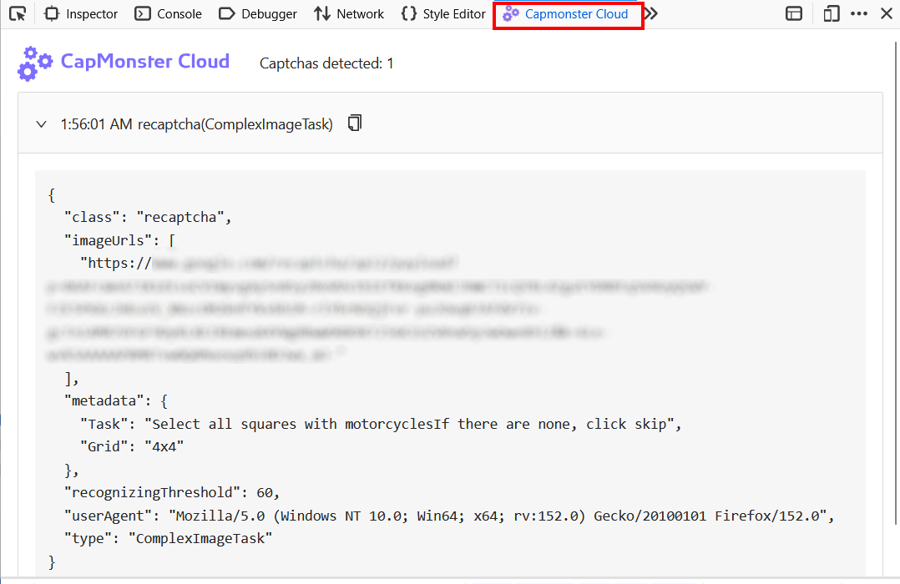

import { ArticleHead } from '../../../../../../src/theme/ArticleHead';

<ArticleHead slug="extension/captcha-parameters-firefox" />

# Obter parâmetros na extensão do Firefox

A extensão CapMonster Cloud exibe os parâmetros da CAPTCHA detectada na página. Esses dados podem ser usados como exemplo ao criar o objeto `task` para enviar uma tarefa pela API do CapMonster Cloud.

:::warning Atenção
Este recurso destina-se apenas a demonstrar o **formato da solicitação**. Não copie todos os valores exibidos pela extensão, pois alguns parâmetros podem mudar sempre que a página com a CAPTCHA é carregada.

Antes de enviar a tarefa, utilize os parâmetros atuais (*para saber como obter todos os parâmetros necessários, consulte a documentação do [tipo de CAPTCHA](../../../captchas/)*).
:::

## Como visualizar os parâmetros da CAPTCHA

Antes de começar, verifique se:

- a extensão CapMonster Cloud está instalada e ativada;
- um API key válido foi configurado nas configurações da extensão;
- há saldo suficiente na conta;
- o tipo de CAPTCHA necessário está habilitado para reconhecimento automático.

Para visualizar os parâmetros:

1. Abra a página que contém a CAPTCHA.
2. Abra as **Ferramentas do desenvolvedor**.
3. Acesse a guia **CapMonster Cloud**:

   

4. Recarregue a página.

Os parâmetros da CAPTCHA detectada serão exibidos automaticamente:



Para copiar os parâmetros, clique no ícone de copiar ao lado do nome da CAPTCHA detectada.

:::info
A guia exibe o conteúdo do objeto `task` que a extensão envia ao CapMonster Cloud.

Ao enviar uma solicitação pela API manualmente, coloque esses dados no campo `task` e adicione também o parâmetro `clientKey`.
:::

Exemplo de uma solicitação completa para o tipo de CAPTCHA selecionado (neste caso, **reCAPTCHA v2**, resolvida pelo [método de cliques](/pt-br/docs/captchas/recaptcha-click/)):

```json
{
  "clientKey": "API_KEY",
  "task": {
    "class": "recaptcha",
    "imageUrls": ["IMAGE_URL"],
    "metadata": {
      "Task": "Select all squares with motorcycles",
      "Grid": "3x3"
    },
    "recognizingThreshold": 60,
    "userAgent": "userAgentPlaceholder",
    "type": "ComplexImageTask"
  }
}
```

:::warning Importante
Para solicitações via API, utilize o `userAgent` atual compatível com o CapMonster Cloud.

Você pode obter o valor atual em: https://capmonster.cloud/api/useragent/actual
:::

## Tipos de CAPTCHA compatíveis e parâmetros

| Tipo de CAPTCHA | Parâmetros exibidos |
|---|---|
| **reCAPTCHA V2 (Click)** | `class`, `imageUrls`, `Task` dentro de `metadata`, `Grid` dentro de `metadata`, `recognizingThreshold`, `userAgent`, `type` |
| **reCAPTCHA V2 (Token)** | `websiteURL`, `websiteKey`, `userAgent`, `type` |
| **reCAPTCHA V2 Invisible** | `class`, `imageUrls`, `Task` dentro de `metadata`, `Grid` dentro de `metadata`, `recognizingThreshold`, `userAgent`, `type` |
| **reCAPTCHA V2 Enterprise (Click)** | `class`, `imageUrls`, `Task` dentro de `metadata`, `Grid` dentro de `metadata`, `recognizingThreshold`, `userAgent`, `type` |
| **reCAPTCHA V2 Enterprise (Token)** | `websiteURL`, `websiteKey`, `userAgent`, `recaptchaDataSValue`, `type` |
| **reCAPTCHA V3** | `websiteURL`, `websiteKey`, `pageAction`, `minScore`, `type` |
| **GeeTest v3** | `websiteURL`, `gt`, `challenge`, `userAgent`, `type` |
| **GeeTest v4** | `websiteURL`, `gt` (`captcha_id`), `userAgent`, `version`, `type` |
| **Cloudflare Turnstile** | `websiteURL`, `websiteKey`, `userAgent`, `type` |
| **Cloudflare Challenge** | `websiteURL`, `websiteKey`, `userAgent`, `pageAction`, `data`, `pageData`, `cloudflareTaskType`, `type` |
| **ImageToText** | `body` em formato `base64`, `type` |
| **BLS** | `class`, `imagesBase64`, `Task` dentro de `metadata`, `TaskArgument` dentro de `metadata`, `type` |
| **Binance** | `websiteURL`, `websiteKey`, `validateId`, `userAgent`, `type` |

O conjunto de parâmetros exibidos depende do tipo de CAPTCHA e da implementação utilizada pelo site.