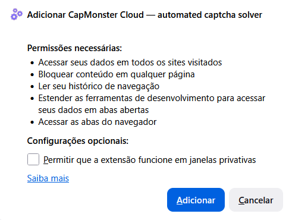
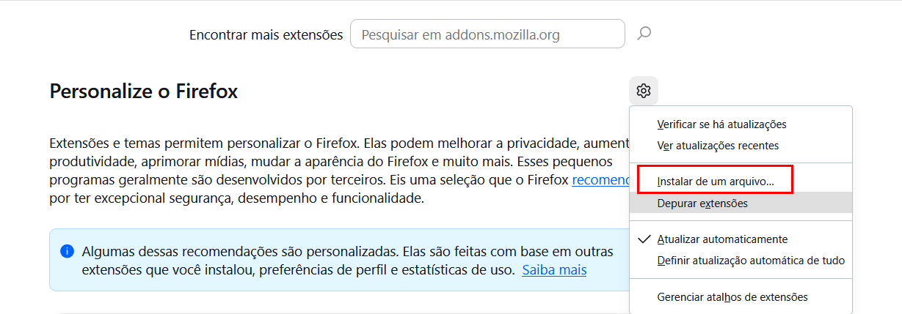
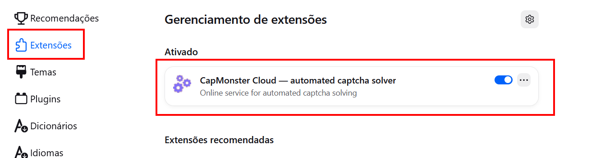
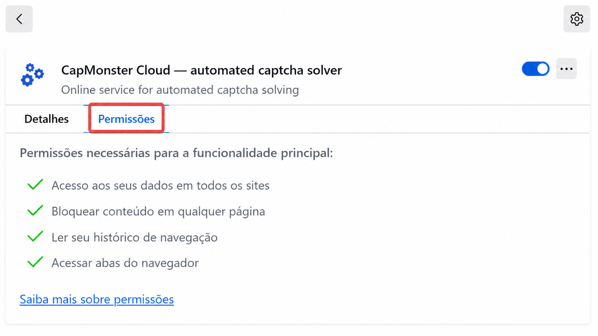
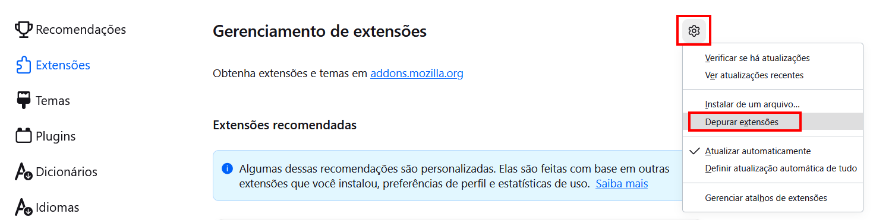

---
sidebar_position: 1
sidebar_label: Extensão para o navegador Firefox
title: "Extensão para o navegador Firefox"
---

import { ArticleHead } from '../../../../../src/theme/ArticleHead';

<ArticleHead slug="extension/extension-firefox" />

# Extensão do navegador Firefox

## Descrição

Com esta extensão, você pode reconhecer CAPTCHA automaticamente diretamente no navegador.

A extensão foi desenvolvida para funcionar no navegador Mozilla Firefox.

---

## Instalação automática
1. Abra a [Loja de Add-ons do Firefox](https://addons.mozilla.org/pt-br/firefox/addon/capmonster-cloud/).
2. Clique em **Adicionar ao Firefox**.
3. Confirme a instalação da extensão clicando em `Adicionar` na janela modal.

   

Para começar a usar a extensão, clique em seu ícone à direita da barra de endereços. Vá para as [configurações](extension-firefox.mdx#configurações).

Se não for possível instalar a extensão pela loja, siga as instruções de instalação manual.

    
Instalação manual

1. Baixe o [arquivo com a extensão](https://zenno.link/firefox-actual-build).

2. Abra o Firefox e acesse o gerenciamento de extensões:

   

3. Vá para `Gerenciamento de extensões`, clique no botão de engrenagem e, no menu suspenso que será aberto, selecione `Instalar de um arquivo…`
   

4. Selecione o arquivo baixado com a extensão.

5. Após a extensão ser carregada, vá para `Gerenciamento de extensões` e clique na extensão instalada.
   

6. Acesse a guia `Permissões` e verifique se todas as permissões necessárias foram concedidas.

   

Se ocorrerem erros durante a instalação padrão, utilize o modo de depuração de complementos:

1. Vá para `Gerenciamento de extensões`, clique no botão de engrenagem e, no menu suspenso que será aberto, selecione `Depurar extensões`.
   

2. Na janela que será aberta, clique em `Carregar extensão temporária` e selecione o arquivo baixado com a extensão.

Atualização manual da extensão

Se você estiver instalando a extensão sobre uma versão anterior, clique em `Atualizar` na página `Gerenciar extensões` após atualizar os arquivos originais.

As instruções para abrir essa página estão disponíveis acima, na seção de instalação manual.

---

## Configurações

Como fixar a extensão

Por padrão, a extensão instalada é fixada automaticamente na barra de ferramentas do navegador.

Após iniciar a extensão, você verá esta janela:

### Chave de API

Insira a chave de API no campo correspondente (**1**) e clique em **Save** (**2**).

Se a chave estiver correta, o saldo atual será exibido abaixo (**3**).

### Resolução automática de CAPTCHA

Selecione os tipos de CAPTCHA que a extensão deve reconhecer automaticamente.

:::info
Após alterar as configurações, pode ser necessário recarregar a página com a CAPTCHA.
:::

### Repetir a resolução da CAPTCHA em caso de erro

Se não for possível resolver a CAPTCHA na primeira tentativa, a extensão enviará novas tarefas até que ela seja resolvida ou até que o limite definido nas configurações seja atingido.

### Proxy

Nesta seção, você pode especificar o proxy que será enviado com a tarefa de reconhecimento.

Os campos **Login** e **Senha** são opcionais. A extensão também oferece suporte a proxies com **IPv6**.

### Gerenciamento da lista de bloqueio

Com a lista de bloqueio, você pode configurar os sites nos quais a extensão deve ignorar as CAPTCHA.

Após ativar esta opção, será exibido um campo para inserir os sites:

Os domínios devem ser especificados com o protocolo: `https://` ou `http://`.

Você pode usar as seguintes máscaras:

- `?` — qualquer caractere único, exceto ponto;
- `*` — qualquer quantidade de caracteres.

| Filtro | Descrição |
|---|---|
| `https://zennolab.com` | Impede o funcionamento da extensão no site `https://zennolab.com` |
| `https://*.zennolab.com` | Impede o funcionamento da extensão em todos os subdomínios de `zennolab.com` |
| `https://www.google.*` | Impede o funcionamento da extensão no Google em todas as zonas de domínio |

Se ocorrerem erros durante a resolução da CAPTCHA, consulte o [glossário de erros](/api/api-errors.mdx).

## Obtenção dos parâmetros da CAPTCHA

Na guia **CapMonster Cloud** das ferramentas do desenvolvedor, você pode visualizar os parâmetros da CAPTCHA detectada e o conteúdo do objeto `task` enviado pela extensão ao CapMonster Cloud.

Para mais informações, consulte a seção [Mapeamento dos parâmetros da CAPTCHA na extensão para Firefox](./captcha-parameters/captcha-parameters-firefox.mdx).
