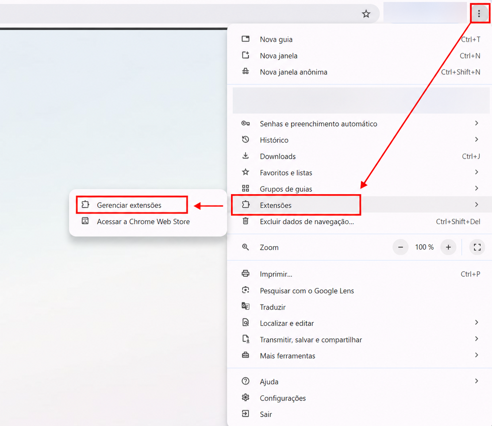
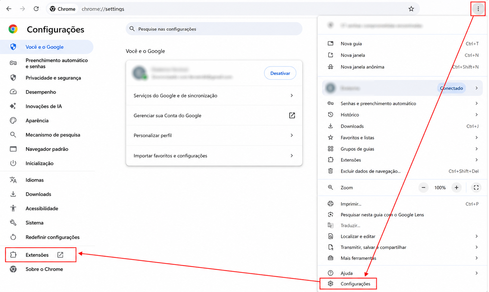
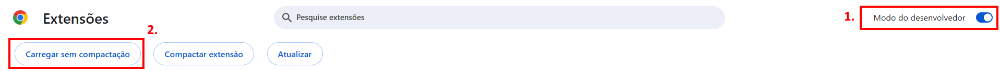
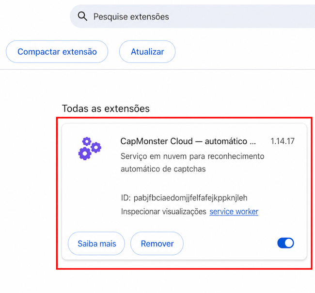
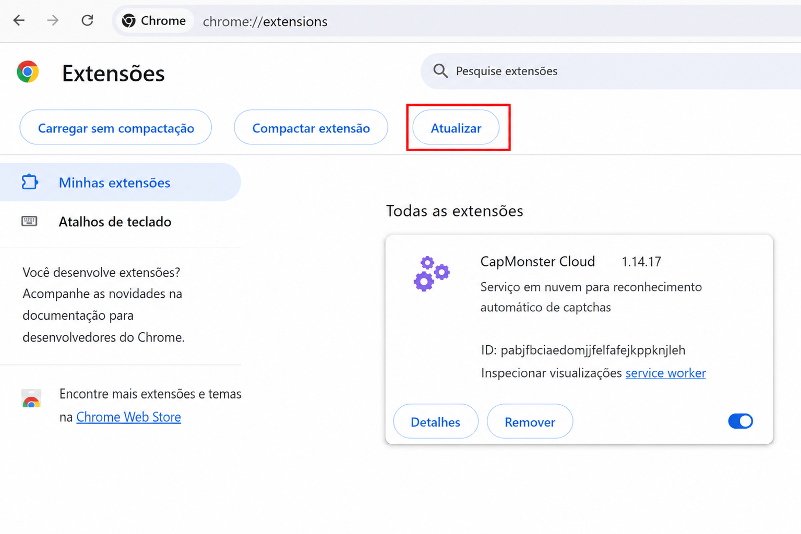
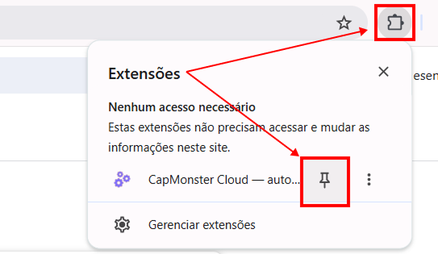
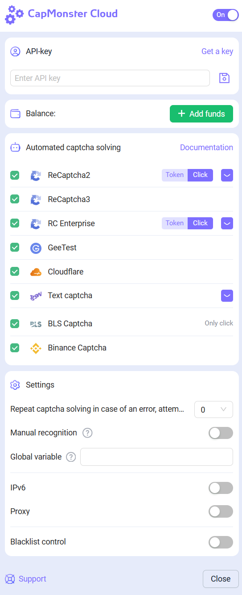
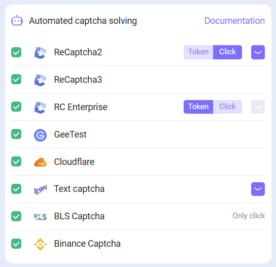
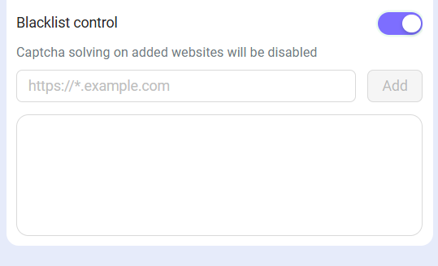

---
sidebar_position: 0
sidebar_label: Extensão para o navegador Chrome

---

import { ArticleHead } from '../../../../../src/theme/ArticleHead';

<ArticleHead slug="extension/extension-main" />

# Extensão do navegador Chrome
## Descrição
Com esta extensão, você pode reconhecer captchas automaticamente diretamente no navegador.

A extensão funciona no navegador Google Chrome.

-----
## Instalação automática
**Importante!** Não é recomendado instalar a extensão no modo anônimo ou no modo de convidado.

1. Abra a [Chrome Web Store](https://chrome.google.com/webstore/detail/capmonster-cloud-%E2%80%94-automa/pabjfbciaedomjjfelfafejkppknjleh?hl=pt-br).
2. Clique em **Instalar**.

Para começar a usar a extensão, clique em seu ícone à direita da barra de endereços. Vá para as [Configurações](extension-main.mdx#configurações).

*Se por algum motivo não for possível instalar a extensão pela Chrome Web Store, use as instruções para instalação manual.*

    
Instalação manual

1. Baixe o [arquivo com a extensão](https://zenno.link/chrome-actual-build).

2. Extraia o arquivo baixado para uma pasta com qualquer nome.

   > `Importante:` após a instalação, não exclua a pasta com a extensão; caso contrário, o navegador não poderá mais usá-la.

3. Digite `chrome://extensions` na barra de endereço do navegador e pressione `Enter`.

   Você pode abrir a página de extensões de uma das seguintes formas:

   - Pelo menu: clique em `⋮` no canto superior direito, ao lado da imagem do perfil → `Extensões` → `Gerenciar extensões`.

     

   - Ou abra as configurações do Google Chrome e selecione `Extensões` no menu à esquerda, no final da lista.

     

4. Ative o `Modo do desenvolvedor`.

5. Na parte superior da página, aparecerá um painel. Clique no botão `Carregar sem compactação`.

   

6. Na janela que será aberta, selecione a pasta para a qual o arquivo foi extraído.

7. Depois disso, a extensão aparecerá na lista de extensões instaladas.

   

    
Atualização manual da extensão

Se você estiver instalando a extensão sobre a versão anterior, ao atualizar os arquivos originais da extensão, também precisará clicar no botão de atualização na página `Extensões` (como abrir esta página está descrito acima na seção `Instalação manual`).

-----
## Configurações

    
Como fixar a extensão

Por padrão, a extensão instalada é ocultada. Para fixá-la, você deve clicar no botão `Fixar`:

Após iniciar a extensão, você verá esta janela:

### Chave API
Insira a chave da API no campo correspondente (1), pressione o botão salvar (2). Se você inseriu a chave correta, seu saldo será exibido abaixo (3).

### Solução automática de captchas
Aqui você pode selecionar os tipos de captchas que a extensão reconhecerá automaticamente.

:::info !

Pode ser necessário recarregar a página com captcha para que as alterações tenham efeito!

:::
### Repetir solução de captcha em caso de erro
Se a primeira tentativa de resolver o captcha falhar, a extensão enviará tarefas repetidas até que o captcha seja resolvido, ou até que o limite especificado nesta configuração seja atingido.
### Proxy
 

Nesta seção, é possível especificar o proxy que será enviado junto com a tarefa de reconhecimento.

Os campos **Login** e **Password** são opcionais. A extensão também oferece suporte a proxies com **IPv6**.

### Controle de lista negra
Usando a lista negra, você pode configurar a extensão para ignorar captchas em sites específicos.

Após ativar esta opção, aparecerá um campo para inserir os sites:

Os domínios devem ser especificados junto com o protocolo (https:// ou http://).
Você pode usar máscaras:

- ? - qualquer um caractere, exceto ponto final
- \* - qualquer número de caracteres

Exemplos:

|**Filtro**|**Descrição**|
| :-: | :-: |
|`https://zennolab.com`|Proibição da extensão no site `https://zennolab.com`|
|`https://*.zennolab.com`|Proibição da extensão em todos os subdomínios `https://zennolab.com`|
|`https://www.google.*`|Proibição da extensão de funcionar no Google em todas as zonas (ru, com, com.ua, etc.)|

Quando erros ocorrerem na solução de captchas, veja o [glossário de erros](/api/api-errors.mdx).

## Mapeamento de parâmetros de captcha

A extensão **CapMonster Cloud** oferece uma maneira prática de visualizar os parâmetros de vários tipos de captchas necessários para o envio correto da tarefa ao servidor e a sua resolução com sucesso. Os dados exibidos ajudam a garantir a precisão dos parâmetros enviados e podem ser usados como exemplo na construção das suas requisições de API.

### Tipos de captcha suportados e seus parâmetros

| Tipo de captcha                     | Quais parâmetros são exibidos                                                                                                   |
| ----------------------------------- | ------------------------------------------------------------------------------------------------------------------------------- |
| **reCAPTCHA V2 (Click)**            | `class`, `imageUrls`, `Task` (dentro de `metadata`), `Grid` (dentro de `metadata`), `recognizingThreshold`, `userAgent`, `type` |
| **reCAPTCHA V2 (Token)**            | `websiteURL`, `websiteKey`, `userAgent`, `type`                                                                                 |
| **reCAPTCHA V2 Invisible**          | `class`, `imageUrls`, `Task` (dentro de `metadata`), `Grid` (dentro de `metadata`), `recognizingThreshold`, `userAgent`, `type` |
| **reCAPTCHA V2 Enterprise (Click)** | `class`, `imageUrls`, `Task` (dentro de `metadata`), `Grid` (dentro de `metadata`), `recognizingThreshold`, `userAgent`, `type` |
| **reCAPTCHA V2 Enterprise (Token)** | `websiteURL`, `websiteKey`, `userAgent`, `recaptchaDataSValue`, `type`                                                          |
| **reCAPTCHA V3**                    | `websiteURL`, `websiteKey`, `pageAction`, `minScore`, `type`                                                                    |
| **GeeTest v3**                      | `websiteURL`, `gt`, `challenge`, `userAgent`, `type`                                                                            |
| **GeeTest v4**                      | `websiteURL`, `gt` (`captcha_id`), `userAgent`, `version`, `type`                                                               |
| **Cloudflare Turnstile**            | `websiteURL`, `websiteKey`, `userAgent`, `type`                                                                                 |
| **Cloudflare Challenge**            | `websiteURL`, `websiteKey`, `userAgent`, `pageAction`, `data`, `pageData`, `cloudflareTaskType`, `type`                         |
| **ImageToText**                     | `body` (no formato `base64`), `type`                                                                                            |
| **BLS**                             | `class`, `imagesBase64`, `Task` (dentro de `metadata`), `TaskArgument` (dentro de `metadata`), `type`                           |
| **Binance**                         | `websiteURL`, `websiteKey`, `validateId`, `userAgent`, `type`                                                                   |

Para usar esta função, ative a extensão, informe a chave de API nas configurações e verifique se há saldo disponível. Em seguida, abra a página com o captcha, confirme se o tipo dele é compatível e está selecionado para resolução, e siga estas etapas:

1. Abra as **Ferramentas do desenvolvedor** e acesse a guia **Capmonster Cloud**:

2. Recarregue a página.

:::warning **Importante**
Para solicitações de API, use um `userAgent` atualizado, compatível com [nosso serviço](https://capmonster.cloud/api/useragent/actual).
:::

Os parâmetros do captcha selecionado serão exibidos automaticamente:

