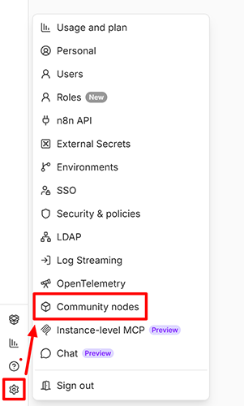

import { ArticleHead } from '../../../../../src/theme/ArticleHead';
import Tabs from '@theme/Tabs';
import TabItem from '@theme/TabItem';

<ArticleHead slug="external-services/external-n8n" />

# Como instalar e usar o node do CapMonster Cloud para n8n

O [**n8n**](https://n8n.io/) é uma plataforma aberta de automação de workflows, na qual a lógica de negócio é construída com nodes que trocam dados por meio de APIs HTTP, webhooks e integrações com serviços externos. Sua principal vantagem é a possibilidade de executar automações tanto no n8n Cloud (por um [preço acessível](https://n8n.io/pricing/)) quanto no seu próprio servidor.

O **node do CapMonster Cloud** permite adicionar a resolução automática de CAPTCHA a esses workflows: ele envia tarefas ao CapMonster Cloud, recebe tokens ou respostas prontos e os encaminha para as próximas etapas do fluxo. Isso permite automatizar de forma confiável cenários do n8n que envolvem formulários web, cadastros, logins, scraping e outras operações que, de outra forma, seriam bloqueadas pela proteção CAPTCHA.

O node oferece suporte a praticamente todos os tipos de tarefas para os quais a API do CapMonster Cloud fornece soluções e é atualizado regularmente.

Alguns tipos de tarefa oferecem suporte opcional a proxies. Você pode verificar se é necessário usar seus próprios proxies nas [páginas de CAPTCHAs específicos](https://docs.capmonster.cloud/pt-BR/docs/captchas/).

## Instalação do node

Dependendo da sua configuração do n8n, você pode instalar o **node do CapMonster Cloud** de uma das formas abaixo.

<Tabs className="full-width-tabs filled-tabs request-tabs" groupId="captcha-type">

    <TabItem value="self-hosted" label="Servidor n8n próprio" default className="method-panel">

        ### <span style={{padding: '0px 0px 0px 15px', marginTop: '15px', display: 'inline-block'}}>Instalação via CLI</span>

        1. Acesse sua instância do n8n via CLI
        2. Vá para o diretório em que os nodes do n8n normalmente são instalados, por exemplo, `~/.n8n/nodes`
        3. Instale o pacote como um node da comunidade:

           `npm install @zennolab_com/n8n-nodes-capmonstercloud`

        4. Reinicie o n8n com o comando:

           `n8n`

        5. Pronto.

        ### <span style={{padding: '0px 0px 0px 15px', marginTop: '15px', display: 'inline-block'}}>Instalação via UI</span>

        1. Abra a UI do n8n no navegador
        2. Vá para **Settings → Community nodes**

           

        3. Clique em **Install a community node**

           

        4. Insira `@zennolab_com/n8n-nodes-capmonstercloud` no campo **npm Package Name**, marque a caixa de seleção “I understand the risks…” e clique em **Install**

           

        5. Pronto.

    </TabItem>

    <TabItem value="n8n-cloud" label="n8n Cloud" default className="method-panel">

        <span style={{padding: '0px 0px 0px 15px', marginTop: '15px', display: 'inline-block'}}>Para instalar o node da comunidade do CapMonster Cloud na sua instância do n8n Cloud:</span>

        1. Abra o [painel do n8n](https://app.n8n.cloud/dashboard) e acesse uma das suas instâncias do n8n.
        2. Crie um novo workflow ou abra um já existente.
        3. Vá para o **Canvas** e abra o painel de nodes selecionando **\+** ou pressionando **N**

           

        4. Pesquise o node **CapMonster Cloud** e selecione-o

           

        5. Clique em **Install node**

           

        6. Agora você pode adicionar o node aos seus workflows.

    </TabItem>

</Tabs>

## Exemplo de uso

A seguir, há um guia passo a passo de um workflow de demonstração que usa o node do CapMonster Cloud.


Se você já tem experiência com o n8n, pode [baixar](./images/external-n8n/CapMonster_Cloud_node_for_n8n_Demo.json) este workflow, importá-lo para o seu projeto e explorá-lo por conta própria.

### Pré-requisitos

* Conta do CapMonster Cloud
* Chave de API do CapMonster Cloud, obtida no [painel do CapMonster Cloud](https://dash.capmonster.cloud/)

### Etapa 1 — Criar um novo workflow

1. Na barra lateral esquerda, clique em **\+ New workflow**
2. Clique no título na parte superior e renomeie-o para `CapMonster Cloud — reCAPTCHA v2 Demo` (por exemplo)

### Etapa 2 — Node Manual Trigger

1. No canvas, clique em **\+** → encontre **Manual Trigger** → adicione-o
2. Clique duas vezes no node → defina **Name** como `Run Test`
3. Feche o painel

### Etapa 3 — Node HTTP Request (obter o User-Agent atual)

Este node obtém uma string User-Agent atualizada no endpoint próprio do CapMonster Cloud, o que aumenta a taxa de aceitação bem-sucedida dos tokens.

1. Clique em **\+** após `Run Test` → encontre **HTTP Request** → adicione-o
2. Renomeie o node para `HTTP Request`
3. Preencha os parâmetros:

    | Campo | Valor |
    | ----- | ----- |
    | **Method** | GET |
    | **URL** | `https://capmonster.cloud/api/useragent/actual` |

4. Mantenha todas as outras configurações com os valores padrão
5. Feche o painel

### Etapa 4 — Node CapMonster Cloud (resolver o CAPTCHA)

Este exemplo mostra as configurações do node para resolver o reCAPTCHA v2 na página de demonstração dedicada do CapMonster Cloud.

1. Clique em **\+** após `HTTP Request` → encontre **CapMonster Cloud** → adicione-o
2. Renomeie o node para `Solve reCAPTCHA v2`
3. Preencha os parâmetros:

    | Campo | Valor |
    | ----- | ----- |
    | **Task Type** | RecaptchaV2 (reCAPTCHA V2) |
    | **Website URL** | `https://lessons.zennolab.com/captchas/recaptcha/v2_simple.php?level=high` |
    | **Website Key** | `6Lcg7CMUAAAAANphynKgn9YAgA4tQ2KI_iqRyTwd` |
    | **User Agent** | Mude para o modo de expressão (`=`) e insira `{{ $json.data }}` |
    | **Is Invisible** | Desativado (false) |

4. Na seção **Credential**, clique em **Create new credential**:
   * Cole sua chave de API do CapMonster Cloud no campo **Client Key**
   * Clique em **Save**
5. Feche o painel

### Etapa 5 — Node HTTP Request (enviar o token)

1. Clique em **\+** após `Solve reCAPTCHA v2` → encontre **HTTP Request** → adicione-o
2. Renomeie o node para `Submit Form with Token`
3. Preencha os parâmetros:

    | Campo | Valor |
    | ----- | ----- |
    | **Method** | POST |
    | **URL** | `https://lessons.zennolab.com/captchas/recaptcha/verify.php?type=v2&subtype=simple&level=high` |

4. Ative a opção **Send Body**:

   * **Body Content Type** → `Form Urlencoded`
   * **Specify Body** → `Using Fields Below`
   * Clique em **Add Field**:
     * **Name**: `g-recaptcha-response`
     * **Value**: mude para o modo de expressão (`=`) e insira `{{ $json.gRecaptchaResponse }}`
5. Expanda a seção **Options** na parte inferior:

   * Abra **Response**
   * Ative **Full Response** (retorna o código de status e os cabeçalhos)
   * Ative **Never Error** (nenhuma exceção será acionada para respostas fora do intervalo 2xx)
   * **Response Format** → `Text`
6. Feche o painel

### Etapa 6 — Node Code (analisar a resposta do servidor)

O servidor da ZennoLab retorna uma página HTML. O JSON com o resultado da verificação é incorporado à tag `<pre>`. Este node Code o extrai.

1. Clique em **\+** após `Submit Form with Token` → encontre **Code** → adicione-o
2. Renomeie o node para `Parse Response`
3. Defina **Language** como `JavaScript`
4. Substitua o código padrão pelo seguinte:

    ```javascript
    const html = $input.first().json.data;
    const match = html.match(/<pre>([\s\S]*?)<\/pre>/);
    if (!match) {
      // Se a tag <pre> não for encontrada, retorna um objeto com erro
      return [{ json: { success: false, challenge_ts: null, hostname: null, _error: 'No pre tag found' } }];
    }
    const parsed = JSON.parse(match.trim());
    return [{ json: parsed }];
    ```

5. Feche o painel

### Etapa 8 — Verificar as conexões

Verifique se as setas seguem exatamente esta ordem:

**Run Test → HTTP Request → Solve reCAPTCHA v2 → Submit Form with Token → Parse Response**

Se algum node estiver desconectado, arraste uma seta da saída do node anterior para a entrada do próximo.

### Etapa 9 — Salvar e executar

1. Pressione **Ctrl+S** ou clique em **Save**, na parte superior da tela, para salvar o workflow
2. Clique em **Test workflow** ou em **Execute** no node `Run Test`
3. Aguarde aproximadamente 15 a 20 segundos enquanto o CapMonster Cloud resolve o CAPTCHA

### Resultado esperado

Na saída do node **`Parse Response`**, você deverá ver:

```json
{
  "success": true,
  "challenge_ts": "2026-07-17T14:15:48Z",
  "hostname": "lessons.zennolab.com"
}
```

`"success": true` confirma que o token CAPTCHA foi resolvido pelo CapMonster Cloud e aceito pela API de verificação do Google.