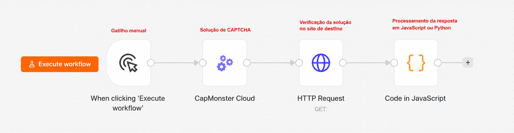
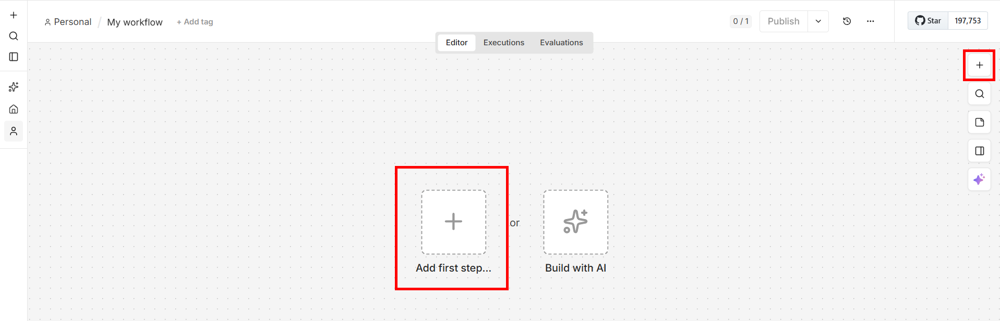
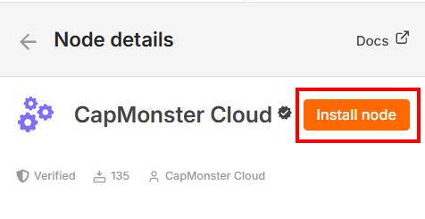
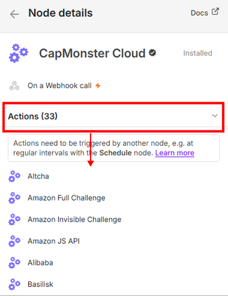
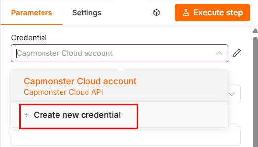
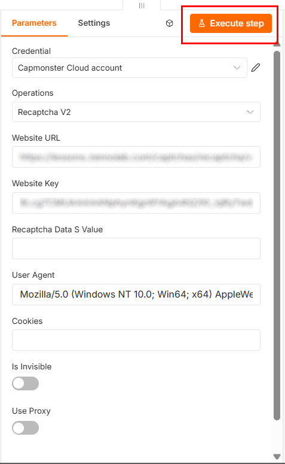
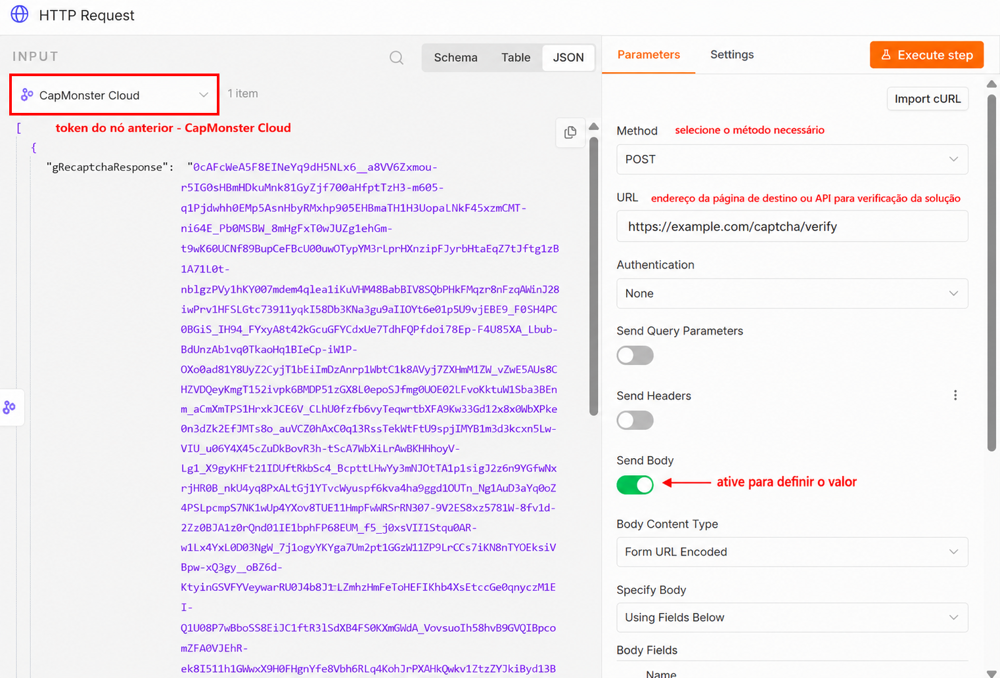
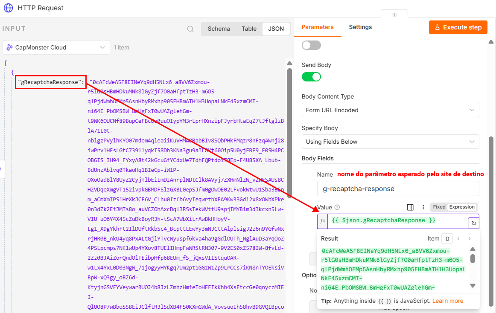
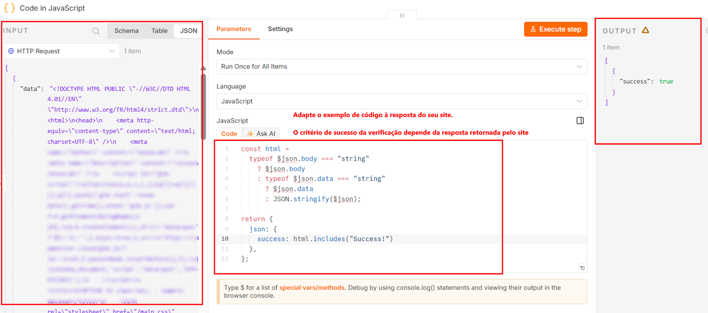

import BlogLink from '@theme/BlogLink';
import { ArticleHead } from '../../../../../src/theme/ArticleHead';

<ArticleHead slug="external-services/n8n" />

# Como resolver CAPTCHAs no n8n com o CapMonster Cloud

O n8n é uma plataforma de automação de workflows na qual os cenários são criados a partir de nós interconectados. Cada nó executa uma ação específica: inicia um workflow, envia uma solicitação HTTP, processa dados ou se conecta a um serviço externo. O n8n pode ser usado na nuvem ou implantado em seu próprio servidor.

O CapMonster Cloud é usado no n8n para resolver CAPTCHAs automaticamente dentro de um workflow. O nó envia os parâmetros do CAPTCHA ao serviço, recebe um token ou outro resultado da solução e o encaminha aos próximos nós — por exemplo, para enviar um formulário, executar uma solicitação de API ou continuar a coleta de dados de uma página da web.

Um workflow básico pode ter a seguinte aparência:



<BlogLink url="https://capmonster.cloud/pt-BR/blog/como-resolver-o-recaptcha-v2-no-n8n-usando-o-capmonster-cloud/"/>
<BlogLink url="https://capmonster.cloud/pt-BR/blog/o-capmonster-cloud-agora-esta-disponivel-no-n8n/"/>

## Métodos de instalação

### Instalação pelo painel de nós

1. Abra um workflow.
2. Clique em **Add first step...** ou **+**. Se necessário, renomeie o workflow, substituindo o nome padrão `My workflow`, por exemplo, por `CapMonster Cloud workflow`.




3. No campo *Search nodes...*, digite "CapMonster Cloud".
4. Selecione o nó encontrado.


5. Clique em **Install node**:



### Instalação via npm

Este método é destinado ao **n8n self-hosted** e requer acesso ao servidor ou computador no qual o serviço está implantado. Após instalar o pacote, reinicie o n8n para que o nó **CapMonster Cloud** apareça no painel de adição de nós.

1. Interrompa a instância do n8n em execução.

2. Abra um terminal no servidor.

3. Acesse o diretório de nós personalizados do n8n:

```bash
cd ~/.n8n/nodes
```

Se o diretório ainda não existir, crie-o:

```bash
mkdir -p ~/.n8n/nodes
cd ~/.n8n/nodes
```

4. Se o diretório não contiver um arquivo `package.json`, crie-o:

```bash
npm init -y
```

5. Instale o pacote do CapMonster Cloud:

```bash
npm install @zennolab_com/n8n-nodes-capmonstercloud
```

6. Inicie ou reinicie o n8n.

7. Abra um workflow, clique em **+** e localize o nó **CapMonster Cloud**.

Você pode verificar a versão instalada do pacote com o seguinte comando:

```bash
npm list @zennolab_com/n8n-nodes-capmonstercloud
```

:::warning Importante
Não instale o pacote globalmente usando a opção `-g`. Ele deve estar localizado no diretório de nós personalizados da instância do n8n em que será utilizado.
:::

## Atualização e remoção do pacote

### Pela interface do n8n

Se o nó tiver sido instalado pelo painel de nós:

1. Abra **Settings** → **Community nodes**.


2. Localize o pacote **CapMonster Cloud**.
3. Abra o menu **Options** usando o botão `⋮`.
4. Selecione a ação necessária:
   * **Update package** – instalar uma nova versão disponível;
   * **Uninstall package** – remover o pacote.
5. Reinicie o n8n, se necessário.

:::note
* O botão **Update package** é exibido somente quando uma nova versão do pacote está disponível.

* Após a remoção do pacote, os workflows existentes que contêm o nó CapMonster Cloud serão mantidos, mas não poderão ser executados até que o pacote seja instalado novamente.
:::

### Via npm

```bash
cd ~/.n8n/nodes
```

Para instalar a versão mais recente disponível, execute:

```bash
npm install @zennolab_com/n8n-nodes-capmonstercloud@latest
```

Para remover o pacote, execute:

```bash
npm uninstall @zennolab_com/n8n-nodes-capmonstercloud
```

Após atualizar ou remover o pacote, reinicie o n8n.


:::warning Importante
Após a remoção do pacote, os workflows existentes que contêm o nó CapMonster Cloud serão mantidos, mas não poderão ser executados até que o pacote seja instalado novamente.
:::


## Configuração do nó CapMonster Cloud

A seção **Triggers** exibe as formas disponíveis de iniciar um workflow: <br />

**On a Schedule** – inicia o workflow automaticamente de acordo com uma programação definida. Por exemplo, o cenário pode ser executado em determinados intervalos, diariamente ou de acordo com uma expressão cron. *Para mais informações, consulte a documentação do n8n: [Schedule Trigger](https://docs.n8n.io/integrations/builtin/core-nodes/n8n-nodes-base.scheduletrigger/)*. <br />

**On a Webhook call** – inicia o workflow quando uma solicitação HTTP é enviada para a URL do webhook. Esse método é adequado quando os parâmetros do CAPTCHA são enviados por um aplicativo externo, site ou script de automação de navegador. *Para mais informações, consulte a documentação do n8n: [Webhook](https://docs.n8n.io/integrations/builtin/core-nodes/n8n-nodes-base.webhook/)*. <br />

:::note
A mensagem **No CapMonster Cloud Triggers available** significa que o nó CapMonster Cloud não pode iniciar um workflow por conta própria. Adicione-o após um gatilho ou outro nó que forneça os parâmetros do CAPTCHA.
:::

Para retornar o resultado a um aplicativo externo após iniciar o workflow por meio de um webhook, você pode usar o nó [Respond to Webhook](https://docs.n8n.io/integrations/builtin/core-nodes/n8n-nodes-base.respondtowebhook/).

Uma sequência típica de nós é:

```text
Trigger → CapMonster Cloud → uso do resultado obtido
````

Para um workflow iniciado por meio de um webhook, a sequência pode ter a seguinte aparência:

```text
Webhook → CapMonster Cloud → Respond to Webhook
```

A seção **Actions** apresenta todos os tipos de CAPTCHA disponíveis para resolução:



6. Selecione o tipo de CAPTCHA necessário.
7. Clique em **Create new credential**.



8. Na janela aberta, informe sua chave de API do CapMonster Cloud.
9. Cole a chave no campo **API Key** e salve.


10. Preencha todos os parâmetros obrigatórios.

:::warning Importante
* Não informe a chave de API diretamente nos parâmetros do workflow nem a publique em um arquivo JSON exportado. Armazene a chave nas Credentials do n8n e restrinja o acesso às credenciais.

* Alguns tipos de CAPTCHA também exigem um proxy. Os requisitos correspondentes são informados na documentação do tipo de CAPTCHA selecionado.
:::


:::tip
* A descrição detalhada dos parâmetros e as instruções para obter seus valores estão disponíveis na seção [Tipos de CAPTCHA](../../captchas). Selecione o tipo de CAPTCHA necessário e abra o artigo correspondente.

* O User-Agent atual é definido automaticamente.
:::

Na aba **Settings**, você pode configurar o comportamento do nó:

* **Always Output Data** – retornar dados mesmo quando o resultado estiver vazio.
* **Execute Once** – executar o nó uma vez para todos os dados de entrada.
* **Retry On Fail** – repetir a execução em caso de erro.
* **On Error** – selecionar a ação a ser executada em caso de erro.
* **Notes** – adicionar um comentário ao nó.
* **Display Note in Flow** – exibir o comentário no diagrama do workflow.

Normalmente, essas configurações podem ser mantidas sem alterações.

11. Depois de preencher todos os dados, clique em **Execute step**:



:::tip
* **Execute step** executa apenas o nó selecionado;

* **Execute workflow** executa todo o workflow.
:::

Se a tarefa for concluída com sucesso, um objeto contendo o resultado da solução aparecerá no painel **OUTPUT**. Por exemplo, para o reCAPTCHA v2, a resposta conterá um campo com o token obtido:


A resposta obtida deve ser encaminhada ao próximo nó do workflow e utilizada ao enviar uma solicitação ao site de destino.

:::warning Importante
O resultado da solução pode ter um período de validade limitado. Portanto, é recomendável utilizá-lo imediatamente após o recebimento.
:::


## Cenários de uso comuns

O nó **CapMonster Cloud** pode ser usado em workflows do n8n nos quais a execução da próxima etapa depende do resultado da solução do CAPTCHA.

### Coleta de dados de páginas da web

Ao coletar dados disponíveis publicamente, um site pode exigir a resolução de um CAPTCHA antes de exibir uma página ou processar uma solicitação de pesquisa.

Uma sequência típica de nós é:

```text
Trigger → HTTP Request → CapMonster Cloud → HTTP Request → processamento de dados
```

O workflow pode executar as seguintes ações:

1. Abrir a página de destino usando **HTTP Request**.
2. Obter os parâmetros do CAPTCHA.
3. Enviá-los ao nó **CapMonster Cloud**.
4. Receber um token ou outro resultado da solução.
5. Repetir a solicitação à página com o resultado do CAPTCHA.
6. Extrair os dados necessários usando os nós **HTML**, **Code** ou **Edit Fields**.
7. Salvar o resultado em um arquivo, planilha ou banco de dados.

### Envio de formulários da web

O nó pode ser usado em cenários nos quais é necessário obter o resultado de um CAPTCHA antes de enviar um formulário.

Uma sequência típica é:

```text
Obtenção de dados → CapMonster Cloud → HTTP Request → verificação da resposta
```

Por exemplo, o workflow pode:

1. Receber os dados do formulário por meio de um webhook, planilha ou outro nó.
2. Resolver o CAPTCHA.
3. Adicionar o token obtido ao corpo da solicitação.
4. Enviar o formulário usando **HTTP Request**.
5. Verificar a resposta do site ou da API.

O nome do parâmetro usado para enviar o token depende da implementação do site de destino.

### Trabalho com APIs

Algumas APIs exigem o resultado do CAPTCHA junto com os demais parâmetros da solicitação.

Uma sequência típica é:

```text
Trigger → CapMonster Cloud → HTTP Request → Code
```

Após a execução do nó **CapMonster Cloud**, o resultado pode ser enviado no corpo JSON, nos parâmetros de consulta ou nos cabeçalhos da solicitação, dependendo dos requisitos da API.

Por exemplo:

```json
{
  "captchaToken": "{{$json.solution.gRecaptchaResponse}}",
  "action": "submit"
}
```

A estrutura do resultado e o caminho até o token dependem do tipo de CAPTCHA selecionado.

### Automação de navegador

O resultado da solução pode ser enviado a um script externo de automação de navegador, como Playwright, Puppeteer, Selenium ou ZennoPoster.

Exemplo de sequência:

```text
Webhook → CapMonster Cloud → HTTP Request → script de automação de navegador
```

Nesse caso, o n8n pode:

1. Receber os parâmetros do CAPTCHA de um script externo.
2. Criar uma tarefa no CapMonster Cloud.
3. Retornar o resultado por meio de um webhook ou API.
4. Enviar o token para a sessão do navegador.
5. Continuar a execução do script.

Com essa abordagem, é importante usar o resultado na mesma sessão do navegador para a qual os parâmetros do CAPTCHA foram obtidos.

### Processamento em lote

Se o nó de entrada retornar vários itens, o n8n poderá criar uma tarefa separada para cada item.

Por exemplo:

```text
Google Sheets → Loop Over Items → CapMonster Cloud → HTTP Request
```

Esse workflow é adequado para o processamento sequencial de uma lista de páginas ou tarefas.

Para o processamento em lote, recomenda-se:

* limitar o número de tarefas executadas simultaneamente;
* usar **Loop Over Items** ou outro mecanismo de gerenciamento de fila;
* tratar os erros separadamente para cada item;
* não ativar **Execute Once** se o CAPTCHA precisar ser resolvido para cada item de entrada;
* considerar os limites e o saldo da conta do CapMonster Cloud.


## Trabalho com o nó HTTP Request

Para usar o resultado obtido, adicione um nó **HTTP Request** após o nó **CapMonster Cloud**.

1. Clique em **+** ao lado do nó CapMonster Cloud.
2. Localize e selecione **HTTP Request**.
3. Informe o método da solicitação e o endereço da página ou API de destino.



4. Se necessário, adicione cabeçalhos, parâmetros de consulta, cookies e o corpo da solicitação.

:::warning Importante
Se o site de destino usar uma sessão, envie o resultado do CAPTCHA com os mesmos cookies, proxy, cabeçalhos e outros parâmetros usados ao abrir a página. Alterar os parâmetros da sessão pode fazer com que o resultado seja rejeitado.
:::

5. No campo destinado ao resultado do CAPTCHA, envie o valor do nó anterior usando uma **Expression**.

Por exemplo:



6. Após enviar o resultado do CAPTCHA, você receberá uma resposta da página ou API de destino. O formato da resposta depende do endpoint utilizado: pode ser uma página HTML, um objeto JSON ou outro tipo de dado.


**Adicionalmente:**

Para verificar o resultado automaticamente, você pode adicionar um nó **Code** após o **HTTP Request**.

:::note
O método de verificação depende da resposta do site de destino. No nó **Code**, você pode verificar o status HTTP, a URL final após um redirecionamento, a presença de um elemento esperado no HTML, a definição de um cookie ou outro indicador de processamento bem-sucedido da solicitação.
:::

### Verificação de uma resposta HTML

Por exemplo, se o texto "Success!" for exibido na página após uma verificação bem-sucedida, você poderá verificar o resultado automaticamente usando o seguinte código no nó **Code**:

```js
const html =
  typeof $json.body === "string"
    ? $json.body
    : typeof $json.data === "string"
      ? $json.data
      : JSON.stringify($json);

return {
  json: {
    success: html.includes("Success!")
  },
};
```



### Verificação de uma resposta JSON

Se a API retornar JSON, verifique diretamente o campo necessário. Por exemplo, para a seguinte resposta:

```json
{
  "success": true,
  "status": "verified"
}
```

você pode usar o seguinte código:

```js
return {
  json: {
    success:
      $json.success === true &&
      $json.status === "verified"
  },
};
```

Substitua os nomes dos campos e os valores esperados de acordo com a resposta retornada pela API utilizada.

## Exportação e transferência de um workflow

As credenciais não são incluídas quando um workflow é exportado. Após importar o workflow para outra instância do n8n, será necessário criar novamente as **Credentials** e selecioná-las no nó CapMonster Cloud.

## Depuração de um workflow

Para verificar os dados entre os nós, você pode:

* abrir a aba **OUTPUT**;
* fixar temporariamente o resultado usando **Pin data**;
* adicionar um nó **Edit Fields** para transformar a estrutura dos dados;
* usar um nó **Code** para verificar e normalizar a resposta;
* visualizar o histórico de execuções na seção **Executions**.

## Tratamento de erros

Se o nó terminar com um erro:

1. Abra a aba **OUTPUT**.
2. Verifique o código e a mensagem do erro.
3. Confirme se os parâmetros do CAPTCHA foram informados corretamente.
4. Verifique o saldo e a chave de API.
5. Confirme se o proxy está disponível e é adequado ao tipo de tarefa selecionado.
6. Em caso de erro temporário, ative **Retry On Fail** na aba **Settings**.


| Problema | Possível causa |
| --- | --- |
| O nó não é exibido | O pacote não foi instalado ou o n8n não foi reiniciado |
| Erro de autorização | Chave de API inválida |
| A tarefa demora muito | O CAPTCHA é complexo ou o proxy está instável |
| O token é rejeitado pelo site | O token expirou ou a sessão foi alterada |
| Nenhum resultado é retornado | Os parâmetros do CAPTCHA foram informados incorretamente |
<br />


:::tip
Os erros de resolução de CAPTCHA são descritos na [seção dedicada](../../api/api-errors).
:::
