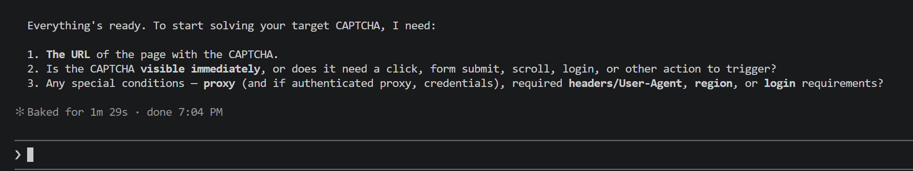

import { ArticleHead } from '../../../../../src/theme/ArticleHead';
import Tabs from '@theme/Tabs';
import TabItem from '@theme/TabItem';
import RemotePrompt from '@site/src/components/RemotePrompt';

<ArticleHead slug="mcp" />

# MCP


O **Model Context Protocol (MCP)** permite que agentes de IA se conectem a ferramentas e serviços externos.

O MCP do CapMonster Cloud fornece ao agente ferramentas para trabalhar com CAPTCHA.


<details style={{ fontWeight: 'normal' }}>
  <summary style={{ fontWeight: 'bold' }}>Como funciona o MCP do CapMonster Cloud</summary>

Com o MCP, um agente de IA pode identificar o tipo de CAPTCHA e os parâmetros da tarefa, acessar a documentação do CapMonster Cloud, criar tarefas e obter os resultados da solução. O objetivo final do agente não é apenas resolver o CAPTCHA, mas também integrar corretamente esse processo ao projeto do usuário.

Para trabalhar com uma página da Web, o MCP do CapMonster Cloud pode ser usado junto com o MCP de navegador [`capmonster-mcp-patchright`](https://github.com/CapMonsterCloud/capmonster-mcp-patchright):

```text
Agente de IA
├── capmonster → API do CapMonster Cloud
└── patchright → navegador
```

O `capmonster` é responsável pela interação com o CapMonster Cloud. O `patchright` abre a página, ajuda a identificar o tipo de CAPTCHA e obter seus parâmetros, além de aplicar a solução pronta. Em seguida, o agente transfere o fluxo validado para o código do projeto.

Fluxo típico coberto pelo [SKILL.md](https://github.com/CapMonsterCloud/capmonster-mcp-captcha-solver/blob/main/capmonster_agent/SKILL.md):

1. Obter a URL da página de destino.

2. Identificar o tipo de CAPTCHA.

3. Consultar a documentação e determinar os parâmetros obrigatórios.

4. Obter os parâmetros da página.

5. Enviar uma solicitação ao CapMonster Cloud.

6. Obter o resultado.

7. Aplicar o resultado na página e integrar esse fluxo ao código do usuário.

:::info Observação
Use automação somente em recursos nos quais você tenha autorização para isso, por exemplo, em seu próprio site, em um ambiente de teste ou em uma página de demonstração.
:::

</details>

## Início rápido

:::tip Copie o prompt para o agente de IA
Escolha o prompt de acordo com o seu ambiente — **Python / PyPI** ou **TypeScript / npm** — e clique em **Copiar prompt**. Em seguida, cole-o no Claude Code, Codex ou em outro agente de IA. O agente identificará o cliente e o sistema operacional, configurará `capmonster` e `patchright` e verificará se eles funcionam.

Se a configuração automática falhar, configure o MCP manualmente seguindo as [instruções](#configuração-manual).

:::

<Tabs groupId="quick-start-runtime">
<TabItem value="quick-start-python" label="Python / PyPI" default>

<RemotePrompt url="https://raw.githubusercontent.com/CapMonsterCloud/capmonster-mcp-captcha-solver/main/capmonster_agent/PROMPT.md" />

</TabItem>

<TabItem value="quick-start-npm" label="TypeScript / npm">

<RemotePrompt url="https://raw.githubusercontent.com/CapMonsterCloud/capmonster-mcp-captcha-solver/main/capmonster_agent/PROMPT_JS.md" />

</TabItem>
</Tabs>

---

Após a verificação, forneça ao agente a URL da página de destino, os arquivos do projeto e as condições em que o CAPTCHA aparece. O agente deve não apenas verificar a solução no navegador, mas também integrar o fluxo funcional do CapMonster Cloud ao seu código.

:::info Permissões durante a configuração
O agente pode solicitar permissão para instalar dependências, alterar a configuração do MCP, executar comandos, acessar a rede ou controlar o navegador. Revise cada solicitação e confirme as ações esperadas clicando em **Allow** ou **Approve**.

No Codex, você pode verificar ou alterar o modo de permissões atual com o comando `/permissions`.
:::

Não é necessário reenviar o prompt antes de cada tarefa. Na sessão atual, depois que o [SKILL.md](https://github.com/CapMonsterCloud/capmonster-mcp-captcha-solver/blob/main/capmonster_agent/SKILL.md) for carregado, você pode fornecer novas URLs, condições de exibição do CAPTCHA e tarefas de integração.

<BlogLink url="https://capmonster.cloud/pt-BR/blog/como-configurar-e-usar-o-capmonster-cloud-mcp/"/>

---

## Configuração manual

Você pode trabalhar com o agente por meio de um aplicativo Desktop, terminal, IDE ou editor de código. Para o fluxo completo, recomendamos conectar os dois servidores: `capmonster` e `patchright`.

Escolha como deseja trabalhar — com um agente CLI ou um aplicativo Desktop. Cada aba contém a sequência completa de configuração para a opção selecionada.

<Tabs groupId="mcp-work-mode">
<TabItem value="cli" label="Agente CLI" default>

<span style={{ fontSize: "1.2em" }}>**Etapa 1. Instale um agente de IA**</span>

<br />Você precisa de um agente de IA ou outro aplicativo compatível com MCP.

Se o agente já estiver instalado, verifique se ele inicia corretamente e está disponível no sistema.

Por exemplo, para o Claude Code:

```bash
claude --version
```

Para o Codex:

```bash
codex --version
```

Se o comando não for encontrado, instale o agente de IA escolhido de acordo com a documentação oficial: [Claude Code](https://code.claude.com/docs/en/setup) ou [Codex](https://developers.openai.com/codex/cli).


Após a instalação, verifique se o agente inicia corretamente e é compatível com servidores MCP locais.

:::tip Agente não encontrado após a instalação
Se o terminal ou a IDE não encontrar o agente instalado, feche completamente e abra novamente o terminal e o ambiente de desenvolvimento. Aplicativos que já estavam em execução podem continuar usando o valor antigo de `PATH` e não reconhecer o novo comando até serem reiniciados.
:::

<span style={{ fontSize: "1.2em" }}>**Etapa 2. Instale o Node.js e, se necessário, o uv**</span>

<br />Para executar os servidores MCP, você precisa do `npx` e, dependendo da implementação escolhida do CapMonster MCP, do `uvx`.

**Node.js e npx**

:::warning Importante:
O `patchright` é executado por meio do `npx`, portanto o Node.js é obrigatório independentemente da implementação do CapMonster MCP escolhida.
:::

Verifique a instalação:

```bash
node --version
npm --version
npx --version
```

Se os comandos não estiverem disponíveis, instale o Node.js.

O `npm` e o `npx` normalmente são instalados junto com o Node.js, portanto não é necessário instalar o `npx` separadamente.

Recomendamos usar o Node.js 18 ou posterior.

**uv e uvx**

Se você pretende usar a versão Python/PyPI do `capmonster-mcp`, também precisará do `uvx`.

Verifique se ele está disponível:

```bash
uvx --version
```

Se o comando não estiver disponível, instale o `uv`.

Depois de instalar o `uv`, o comando `uvx` também ficará disponível.

Verifique:

```bash
uv --version
uvx --version
```

:::info Observação
Se você usar a versão TypeScript/npm do `capmonster-mcp`, não será necessário instalar `uv` nem `uvx`.
:::

<span style={{ fontSize: "1.2em" }}>**Etapa 3. Obtenha uma chave de API**</span>

<br />O `capmonster` requer uma chave de API do CapMonster Cloud.

Ela é passada ao servidor MCP por meio da seguinte variável de ambiente:

```text
CM_API_KEY
```

<span style={{ fontSize: "1.2em" }}>**Etapa 4. Escolha uma implementação do CapMonster MCP**</span>


<br />Há duas implementações equivalentes do [`capmonster-mcp`](https://github.com/CapMonsterCloud/capmonster-mcp-captcha-solver).

<Tabs>
<TabItem value="npm" label="npm – TypeScript" default>

Esta versão usa o [pacote npm `capmonster-mcp`](https://www.npmjs.com/package/capmonster-mcp) e o `npx`.

Execute o servidor MCP com:

```bash
npx -y capmonster-mcp
```

</TabItem>

<TabItem value="python" label="PyPI – Python">

Esta versão usa o [pacote PyPI `capmonster-mcp`](https://pypi.org/project/capmonster-mcp/) e o `uvx`.

Execute o servidor MCP com:

```bash
uvx capmonster-mcp
```

</TabItem>
</Tabs>

Não é necessário instalar o `capmonster-mcp` como dependência do seu projeto. Por padrão, o cliente MCP pode executar o pacote publicado diretamente por meio do `npx` ou `uvx`.

<span style={{ fontSize: "1.1em" }}>**Instalação de pacotes com npm e pip**</span>

<br />Por padrão, não é necessário pré-instalar os pacotes MCP: você pode executá-los diretamente com `npx` ou `uvx`. Se quiser instalar os pacotes antecipadamente, use uma das opções abaixo.

<Tabs>
<TabItem value="npm-install" label="npm" default>

**CapMonster Cloud MCP**

Instale o [capmonster-mcp](https://www.npmjs.com/package/capmonster-mcp) com npm:

```bash
npm i capmonster-mcp
```

Você pode verificar a instalação com:

```bash
npm list capmonster-mcp
```

Após a instalação, use `npx` para executar o `capmonster`:

```json
{
  "command": "npx",
  "args": ["capmonster-mcp"],
  "env": {
    "CM_API_KEY": "YOUR_API_KEY"
  }
}
```

**Patchright MCP**

Se você pretende usar um navegador para abrir páginas, obter parâmetros de CAPTCHA e aplicar soluções, instale o [`capmonster-mcp-patchright`](https://www.npmjs.com/package/capmonster-mcp-patchright). O código-fonte está disponível no [repositório oficial](https://github.com/CapMonsterCloud/capmonster-mcp-patchright):

```bash
npm i capmonster-mcp-patchright
```

Você pode verificar a instalação com:

```bash
npm list capmonster-mcp-patchright
```

A pré-instalação do `capmonster-mcp-patchright` é opcional. Em todos os exemplos abaixo, você também pode executá-lo diretamente com:

```bash
npx -y capmonster-mcp-patchright
```

</TabItem>

<TabItem value="pypi-install" label="pip / PyPI">

A versão Python do `capmonster-mcp` está publicada no [PyPI](https://pypi.org/project/capmonster-mcp/) e requer Python 3.11 ou posterior.

Instale o `capmonster-mcp` com `pip`:

```bash
python -m pip install capmonster-mcp
```

Você pode verificar a instalação com:

```bash
python -m pip show capmonster-mcp
```

Após a instalação, você pode usar o mesmo comando CLI para `capmonster`:

```json
{
  "command": "capmonster-mcp",
  "args": [],
  "env": {
    "CM_API_KEY": "YOUR_API_KEY"
  }
}
```

</TabItem>
</Tabs>

Após instalar o pacote npm ou Python, reinicie completamente o cliente MCP se o pacote tiver sido instalado depois que o cliente já estava em execução.


<br />
<span style={{ fontSize: "1.2em" }}>**Etapa 5. Configure o cliente MCP**</span>

<br />Selecione o cliente CLI que você usa.

<Tabs>
<TabItem value="claude-code-cli" label="Claude Code" default>

Para uma configuração compartilhada do projeto, crie um arquivo `.mcp.json` na raiz do projeto e adicione `capmonster` e `patchright` a ele.

:::tip 
Esse não é o único local possível. O Claude Code oferece suporte a diferentes escopos de configuração; configurações específicas do usuário ou do projeto também podem ser armazenadas em `.claude.json` ou adicionadas com comandos do Claude Code. Se um agente estiver configurando o MCP, permita que ele determine automaticamente o escopo e o arquivo adequados.
:::

<Tabs>
<TabItem value="claude-cli-npm" label="TypeScript / npm" default>

```json
{
  "mcpServers": {
    "capmonster": {
      "command": "npx",
      "args": ["-y", "capmonster-mcp"],
      "env": {
        "CM_API_KEY": "YOUR_API_KEY"
      }
    },
    "patchright": {
      "command": "npx",
      "args": ["-y", "capmonster-mcp-patchright"]
    }
  }
}
```

</TabItem>

<TabItem value="claude-cli-python" label="Python / PyPI">

```json
{
  "mcpServers": {
    "capmonster": {
      "command": "uvx",
      "args": ["capmonster-mcp"],
      "env": {
        "CM_API_KEY": "YOUR_API_KEY"
      }
    },
    "patchright": {
      "command": "npx",
      "args": ["-y", "capmonster-mcp-patchright"]
    }
  }
}
```

</TabItem>
</Tabs>

Após reiniciar o Claude Code, verifique a conexão com o comando `/mcp`.

 

</TabItem>

<TabItem value="codex-cli" label="Codex CLI">

O Codex CLI, a extensão Codex para IDE e o ChatGPT Desktop usam a mesma configuração MCP. Por padrão, ela é armazenada no arquivo `config.toml`:

- Windows: `%USERPROFILE%\.codex\config.toml`;
- macOS/Linux: `~/.codex/config.toml`.

Para conectar servidores MCP, use o comando `codex mcp add`. O Codex salvará automaticamente as configurações no `config.toml`. Os servidores `capmonster` e `patchright` devem ser adicionados separadamente, executando o comando correspondente para cada um deles.

<Tabs groupId="codex-mcp-os">
<TabItem value="codex-mcp-windows" label="Windows" default>

Abra o PowerShell ou o terminal integrado da sua IDE.

Para a versão TypeScript/npm do `capmonster`, execute:

```powershell
codex mcp add capmonster --env CM_API_KEY=YOUR_API_KEY -- npx.cmd -y capmonster-mcp
```

Para a versão Python/PyPI, execute em vez disso:

```powershell
codex mcp add capmonster --env CM_API_KEY=YOUR_API_KEY -- uvx capmonster-mcp
```

Em seguida, independentemente da implementação escolhida, adicione o `patchright`:

```powershell
codex mcp add patchright -- npx.cmd -y capmonster-mcp-patchright
```

No Windows, usa-se `npx.cmd` para que a inicialização do servidor MCP não dependa da política de execução do PowerShell para `npx.ps1`.

</TabItem>

<TabItem value="codex-mcp-macos-linux" label="macOS / Linux">

Abra um terminal.

Para a versão TypeScript/npm do `capmonster`, execute:

```bash
codex mcp add capmonster --env CM_API_KEY=YOUR_API_KEY -- npx -y capmonster-mcp
```

Para a versão Python/PyPI, execute em vez disso:

```bash
codex mcp add capmonster --env CM_API_KEY=YOUR_API_KEY -- uvx capmonster-mcp
```

Em seguida, independentemente da implementação escolhida, adicione o `patchright`:

```bash
codex mcp add patchright -- npx -y capmonster-mcp-patchright
```

</TabItem>
</Tabs>

Substitua `YOUR_API_KEY` pela sua chave de API do CapMonster Cloud. Não adicione a chave real às mensagens do agente, exemplos de código ou a um repositório público.

Verifique se os dois servidores foram adicionados:

```bash
codex mcp list
```

<details style={{ fontWeight: 'normal' }}>
  <summary style={{ fontWeight: 'bold' }}>Alternativa: configurar os servidores pelo config.toml</summary>

Para um projeto confiável, você também pode salvar a configuração em `.codex/config.toml` na raiz do projeto. O arquivo do projeto só será usado depois que o projeto for marcado como confiável.

<Tabs>
<TabItem value="codex-cli-npm" label="TypeScript / npm" default>

```toml
[mcp_servers.capmonster]
command = "npx"
args = ["-y", "capmonster-mcp"]

[mcp_servers.capmonster.env]
CM_API_KEY = "YOUR_API_KEY"

[mcp_servers.patchright]
command = "npx"
args = ["-y", "capmonster-mcp-patchright"]
```

</TabItem>

<TabItem value="codex-cli-python" label="Python / PyPI">

```toml
[mcp_servers.capmonster]
command = "uvx"
args = ["capmonster-mcp"]

[mcp_servers.capmonster.env]
CM_API_KEY = "YOUR_API_KEY"

[mcp_servers.patchright]
command = "npx"
args = ["-y", "capmonster-mcp-patchright"]
```

</TabItem>
</Tabs>

No Windows, se houver problemas ao executar `npx.ps1`, especifique `command = "npx.cmd"` em vez de `command = "npx"`. Se o download inicial do pacote demorar muito, você pode adicionar `startup_timeout_sec = 60` à seção de cada servidor.

</details>

Reinicie completamente o Codex ou a IDE. Em uma nova sessão, execute `/mcp` e verifique se `capmonster` e `patchright` estão conectados e disponibilizam suas ferramentas. Para mais detalhes, consulte a [documentação do Codex sobre MCP](https://developers.openai.com/codex/mcp).

 

</TabItem>
</Tabs>

Substitua `YOUR_API_KEY` pela sua chave de API do CapMonster Cloud e reinicie o cliente MCP.

<span style={{ fontSize: "1.2em" }}>**Etapa 6. Envie o prompt ao agente**</span>

<br />Abra um novo chat ou uma nova sessão e envie o prompt da seção [Início rápido](#início-rápido). Após a verificação, forneça a URL da página, os arquivos do projeto e as condições em que o CAPTCHA aparece.

Durante a configuração, aprove apenas as solicitações de permissão esperadas. Não é necessário reenviar o prompt antes de cada tarefa na sessão atual.



</TabItem>

<TabItem value="desktop" label="Aplicativo Desktop">

O MCP do CapMonster Cloud pode ser usado não apenas por meio de agentes CLI, mas também em aplicativos Desktop compatíveis com servidores MCP locais.

Por exemplo:

- **Claude Desktop**;
- **ChatGPT Desktop com Codex**;
- outro cliente Desktop compatível com servidores MCP STDIO locais.

Nesse caso, não é necessário iniciar o agente de IA pelo terminal. Os servidores MCP são configurados no próprio aplicativo ou em seu arquivo de configuração.

<span style={{ fontSize: "1.2em" }}>**Etapa 1. Instale um aplicativo Desktop**</span>

<br />Instale o cliente Desktop compatível com MCP escolhido:

- [Claude Desktop](https://claude.com/download);
- [ChatGPT Desktop](https://chatgpt.com/download).

Se o aplicativo já estiver instalado, verifique se você está usando a versão mais recente.

<span style={{ fontSize: "1.2em" }}>**Etapa 2. Obtenha uma chave de API e instale o runtime**</span>

<br />Para usar o `capmonster`, obtenha uma chave de API do CapMonster Cloud. Durante a configuração, passe-a por meio da variável de ambiente `CM_API_KEY`.

Para executar o `patchright`, são necessários Node.js e `npx`.

Verifique a instalação:

```bash
node --version
npm --version
npx --version
```

Se os comandos não estiverem disponíveis, instale o Node.js. O `npm` e o `npx` normalmente são instalados junto com o Node.js.

Se você usar a versão Python/PyPI do `capmonster`, também precisará do `uvx`.

Verifique:

```bash
uv --version
uvx --version
```

Se o `uvx` não estiver disponível, instale o `uv`.

:::info Observação
Para a versão TypeScript/npm do `capmonster-mcp`, não é necessário instalar `uv` nem `uvx`.
:::
<br />
<span style={{ fontSize: "1.2em" }}>**Etapa 3. Configure os servidores MCP**</span>

<br />

<br /><Tabs>
<TabItem value="claude-desktop" label="Claude Desktop" default>

O Claude Desktop usa um arquivo separado de configuração MCP local — `claude_desktop_config.json`.

No Claude Desktop, abra **File → Settings → Developer** e clique em **Edit Config**. No arquivo aberto, adicione os servidores `capmonster` e `patchright`.

<Tabs>
<TabItem value="claude-npm" label="TypeScript / npm" default>

```json
{
  "mcpServers": {
    "capmonster": {
      "command": "npx",
      "args": ["-y", "capmonster-mcp"],
      "env": {
        "CM_API_KEY": "YOUR_API_KEY"
      }
    },
    "patchright": {
      "command": "npx",
      "args": ["-y", "capmonster-mcp-patchright"]
    }
  }
}
```

</TabItem>

<TabItem value="claude-python" label="Python / PyPI">

```json
{
  "mcpServers": {
    "capmonster": {
      "command": "uvx",
      "args": ["capmonster-mcp"],
      "env": {
        "CM_API_KEY": "YOUR_API_KEY"
      }
    },
    "patchright": {
      "command": "npx",
      "args": ["-y", "capmonster-mcp-patchright"]
    }
  }
}
```

</TabItem>
</Tabs>

Substitua `YOUR_API_KEY` pela sua chave de API do CapMonster Cloud, salve a configuração e reinicie completamente o Claude Desktop.

Depois de reiniciar, clique em **+** ao lado do campo de entrada e abra **Connectors**. Verifique se `capmonster` e `patchright` aparecem na lista. O status da conexão e os erros de inicialização também podem ser verificados nas configurações de desenvolvedor do Claude Desktop.


:::info Observação
Os servidores MCP locais configurados no Claude Desktop por meio de `claude_desktop_config.json` são separados das configurações MCP de projeto e usuário do Claude Code.
:::

</TabItem>

<TabItem value="chatgpt-desktop" label="ChatGPT Desktop / Codex">

Você pode configurar os servidores MCP manualmente por meio do arquivo `config.toml` usado pelo ChatGPT Desktop, Codex CLI e pela extensão Codex para IDE.

##### 1. Abra ou crie o arquivo de configuração

<Tabs groupId="codex-config-os">
<TabItem value="codex-config-windows" label="Windows" default>

O arquivo fica localizado em:

```text
%USERPROFILE%\.codex\config.toml
```

Para criar o diretório e abrir o arquivo no Bloco de Notas, execute o seguinte no PowerShell:

```powershell
New-Item -ItemType Directory -Force "$env:USERPROFILE\.codex"
notepad "$env:USERPROFILE\.codex\config.toml"
```

Se for solicitado que você crie um novo arquivo, confirme. Verifique se o arquivo foi salvo com a extensão `.toml`, e não `.toml.txt`.

</TabItem>

<TabItem value="codex-config-unix" label="macOS / Linux">

O arquivo fica localizado em:

```text
~/.codex/config.toml
```

Para criar o diretório e abrir o arquivo no editor `nano`, execute:

```bash
mkdir -p ~/.codex
nano ~/.codex/config.toml
```

</TabItem>
</Tabs>

##### 2. Adicione a configuração dos servidores MCP

Cole uma das configurações abaixo em `config.toml`. Se o arquivo já contiver outras configurações, não as remova — adicione os blocos `mcp_servers` ao final do arquivo.

<Tabs groupId="codex-config-runtime">
<TabItem value="codex-npm" label="TypeScript / npm" default>

```toml
[mcp_servers.capmonster]
command = "npx"
args = ["-y", "capmonster-mcp"]

[mcp_servers.capmonster.env]
CM_API_KEY = "YOUR_API_KEY"

[mcp_servers.patchright]
command = "npx"
args = ["-y", "capmonster-mcp-patchright"]
```

:::info Para Windows
Se a política do PowerShell bloquear o `npx`, especifique `command = "npx.cmd"` para os dois servidores.
:::

</TabItem>

<TabItem value="codex-python" label="Python / PyPI">

```toml
[mcp_servers.capmonster]
command = "uvx"
args = ["capmonster-mcp"]

[mcp_servers.capmonster.env]
CM_API_KEY = "YOUR_API_KEY"

[mcp_servers.patchright]
command = "npx"
args = ["-y", "capmonster-mcp-patchright"]
```

:::info Para Windows
Se a política do PowerShell bloquear o `npx`, especifique `command = "npx.cmd"` na seção `mcp_servers.patchright`.
:::

</TabItem>
</Tabs>

Substitua `YOUR_API_KEY` pela sua chave de API do CapMonster Cloud e salve o arquivo.

##### 3. Reinicie o aplicativo

Feche completamente o ChatGPT Desktop ou o Codex e abra o aplicativo novamente.

Em um novo chat, execute:

```text
/mcp
```

Verifique se os servidores conectados `capmonster` e `patchright` aparecem na lista.

</TabItem>
</Tabs>

<span style={{ fontSize: "1.2em" }}>**Etapa 4. Envie o prompt ao agente**</span>

<br />Abra um novo chat e envie o prompt da seção [Início rápido](#início-rápido). Após a verificação, forneça a URL da página, as condições de exibição do CAPTCHA e os arquivos do projeto.

Durante a configuração, aprove apenas as solicitações de permissão esperadas. Não é necessário reenviar o prompt antes de cada tarefa na sessão atual.

:::info Observação
A principal diferença entre as opções Desktop e CLI é a forma de conexão dos servidores MCP. O fluxo de trabalho e o prompt inicial permanecem os mesmos.
:::

</TabItem>
</Tabs>

---

## Ferramentas disponíveis

Depois que os servidores MCP forem conectados, as ferramentas ficarão automaticamente disponíveis para o agente de IA. Normalmente, não é necessário selecioná-las manualmente — o agente chama as ferramentas adequadas conforme a tarefa atual.

### CapMonster Cloud

O `capmonster-mcp` fornece as seguintes ferramentas:

- `get_supported_tasks` — retorna os tipos de tarefa compatíveis com o CapMonster Cloud;
- `get_task_parameters(task_type)` — retorna os parâmetros do tipo de tarefa selecionado e o esquema da solução;
- `get_docs(url, offset, limit, section)` — carrega a documentação do CapMonster Cloud;
- `create_task(task)` — cria uma tarefa e retorna o `taskId`;
- `get_task_result(task_id)` — verifica o status da tarefa uma vez;
- `get_task_result_wait(task_id, timeout_seconds, poll_interval_seconds)` — aguarda automaticamente a conclusão da tarefa;
- `get_actual_user_agent()` — retorna o User-Agent atual do Windows;
- `get_balance()` — retorna o saldo da conta do CapMonster Cloud.

### Patchright

O `capmonster-mcp-patchright` fornece ferramentas para interação com o navegador. O agente acessa essas ferramentas por meio do cliente MCP e seleciona automaticamente as ações necessárias.

A lista atual de ferramentas está disponível no [repositório oficial](https://github.com/CapMonsterCloud/capmonster-mcp-patchright) e na [página do pacote npm `capmonster-mcp-patchright`](https://www.npmjs.com/package/capmonster-mcp-patchright).

---

## Solução de problemas

:::tip Deixe o agente diagnosticar o problema
Se a configuração não funcionar, envie a mensagem de erro ao agente. Ele pode verificar o runtime, os comandos de inicialização, as configurações MCP do usuário e do projeto e sugerir ou aplicar as correções necessárias.
:::

<details style={{ fontWeight: 'normal' }}>
  <summary style={{ fontWeight: 'bold' }}>O servidor MCP não inicia</summary>

Verifique se o comando da configuração está disponível no mesmo ambiente em que o cliente MCP está sendo executado:

<Tabs>
<TabItem value="troubleshooting-npm" label="TypeScript / npm" default>

```bash
node --version
npx --version
npx -y capmonster-mcp
```

</TabItem>

<TabItem value="troubleshooting-python" label="Python / PyPI">

```bash
uvx --version
uvx capmonster-mcp
```

</TabItem>
</Tabs>

Se o comando iniciar e não produzir nenhuma saída, isso não significa necessariamente que há um erro: o servidor MCP STDIO está aguardando a conexão de um cliente. Você pode interromper a execução de teste com `Ctrl+C`.

Verifique também se:

- a configuração JSON não contém comentários, vírgulas finais ou colchetes/chaves não fechados;

- os nomes dos campos `mcpServers`, `command`, `args` e `env` estão escritos corretamente;

- o cliente MCP foi reiniciado completamente após a alteração da configuração;

- o download de pacotes por `npx` ou `uvx` não está sendo bloqueado pela rede, proxy, antivírus ou política corporativa.

</details>

<details style={{ fontWeight: 'normal' }}>
  <summary style={{ fontWeight: 'bold' }}>O comando <code>capmonster-mcp</code> não é encontrado após a instalação do pacote</summary>

Um comando CLI pré-instalado deve estar disponível no `PATH` do processo que inicia o cliente MCP.

Verifique a localização do comando:

<Tabs>
<TabItem value="command-path-windows" label="Windows" default>

```powershell
where.exe capmonster-mcp
```

</TabItem>

<TabItem value="command-path-unix" label="macOS / Linux">

```bash
which capmonster-mcp
```

</TabItem>
</Tabs>

Se o terminal encontrar o comando, mas o aplicativo Desktop não, feche completamente e abra o aplicativo novamente. Se necessário, informe o caminho completo para o executável no campo `command`.

</details>

<details style={{ fontWeight: 'normal' }}>
  <summary style={{ fontWeight: 'bold' }}>As ferramentas <code>capmonster</code> ou <code>patchright</code> não são exibidas</summary>

Peça ao agente para verificar de onde a sessão atual carrega a configuração MCP. O local depende do cliente, do escopo da configuração e da forma como o servidor foi conectado:

- no Claude Code, os servidores podem ser configurados no nível do projeto ou do usuário; a configuração pode ser armazenada em `.mcp.json`, `.claude.json` ou gerenciada por comandos do Claude Code;

- o Claude Desktop usa `claude_desktop_config.json`;

- o Codex usa `~/.codex/config.toml`, `%USERPROFILE%\.codex\config.toml` ou um `.codex/config.toml` no nível do projeto;

- no ChatGPT Desktop, os servidores locais também podem ser adicionados pelas configurações de MCP.

Após corrigir a configuração, reinicie completamente o cliente e abra uma nova sessão. No Claude Code, você pode verificar a conexão com `/mcp`; no Codex, use `/mcp` ou `codex mcp list`.

</details>

<details style={{ fontWeight: 'normal' }}>
  <summary style={{ fontWeight: 'bold' }}><code>get_balance</code> retorna um erro</summary>

Peça ao agente para verificar a configuração do `capmonster`. Normalmente, é necessário garantir que:

- a variável `CM_API_KEY` contenha uma chave de API válida do CapMonster Cloud;

- o valor de exemplo `YOUR_API_KEY` tenha sido substituído;

- a chave seja passada no bloco `env` do servidor `capmonster`, e não do `patchright`.

Depois de alterar a chave, reinicie o cliente MCP. O agente poderá verificar novamente a conexão e o saldo.

Se o saldo for zero, faça uma recarga antes de criar tarefas.

</details>

<details style={{ fontWeight: 'normal' }}>
  <summary style={{ fontWeight: 'bold' }}><code>get_docs</code> não carrega a documentação</summary>

Peça ao agente para verificar o acesso de rede do cliente MCP a `https://docs.capmonster.cloud/` e se ele consegue carregar o arquivo a seguir:

```text
https://docs.capmonster.cloud/llms.txt
```

Se a documentação estiver temporariamente indisponível ou se os parâmetros da tarefa precisarem de verificação adicional, o agente poderá usar a especificação da API:

```text
https://api.capmonster.cloud/docs/swagger-ui/spec.js
```

</details>

<details style={{ fontWeight: 'normal' }}>
  <summary style={{ fontWeight: 'bold' }}><code>patchright</code> não abre a página</summary>

Verifique o `node`, o `npx` e o comando de inicialização:

```bash
npx -y capmonster-mcp-patchright
```

Se a página exigir proxy, User-Agent ou locale, forneça esses parâmetros ao agente. Ele poderá usá-los ao iniciar o navegador por meio do `patchright`.

</details>

<details style={{ fontWeight: 'normal' }}>
  <summary style={{ fontWeight: 'bold' }}>A tarefa retorna um erro ou o site rejeita a solução</summary>

Forneça ao agente a mensagem de erro e as condições em que o CAPTCHA aparece. Para o diagnóstico, ele pode:

1. verificar o tipo de tarefa compatível;

2. obter os parâmetros atuais e o esquema da solução;

3. abrir a documentação do tipo de CAPTCHA selecionado;

4. obter novamente os parâmetros dinâmicos após recarregar ou invocar o CAPTCHA outra vez;

5. verificar se User-Agent, proxy, cookies, cabeçalhos e Client Hints são consistentes para CAPTCHAs vinculados à sessão;

6. garantir que o resultado seja aplicado no formato exigido pelo tipo específico de CAPTCHA.

Não use valores expirados de `challenge`, `token`, `data`, `blob` ou outros parâmetros de uso único.

`ERROR_INVALID_TASK` normalmente indica parâmetros inválidos ou desatualizados. `ERROR_CAPTCHA_UNSOLVABLE` pode ser um erro temporário — o agente pode verificar os dados de entrada e criar uma nova tarefa.

</details>

---

## Perguntas frequentes

<details style={{ fontWeight: 'normal' }}>
  <summary style={{ fontWeight: 'bold' }}>Preciso selecionar e chamar as ferramentas MCP manualmente?</summary>

Não. Depois que os servidores MCP forem conectados, as ferramentas ficam automaticamente disponíveis para o agente de IA. O agente as seleciona e chama de acordo com a tarefa atual.

</details>

<details style={{ fontWeight: 'normal' }}>
  <summary style={{ fontWeight: 'bold' }}>Preciso conectar os dois servidores MCP?</summary>

Não. Você pode usar o `capmonster` sozinho se os parâmetros do CAPTCHA já forem conhecidos e não for necessária interação com o navegador. O `patchright` é necessário quando o agente precisa abrir uma página, obter parâmetros do CAPTCHA ou aplicar a solução.

</details>

<details style={{ fontWeight: 'normal' }}>
  <summary style={{ fontWeight: 'bold' }}>Qual implementação devo escolher: npm ou Python?</summary>

As duas implementações do `capmonster-mcp` fornecem as mesmas ferramentas. Escolha a opção que corresponde ao seu ambiente:

- npm — se o Node.js e o `npx` já estiverem instalados;

- Python — se você usar Python 3.11 ou posterior e tiver o `uvx` instalado.

Em ambos os casos, o `patchright` requer Node.js e `npx`.

</details>


<details style={{ fontWeight: 'normal' }}>
  <summary style={{ fontWeight: 'bold' }}>Onde devo armazenar a chave de API?</summary>

Passe a chave de API por meio da variável de ambiente `CM_API_KEY` na configuração do servidor `capmonster`. Não a inclua no prompt, em mensagens de chat, exemplos de código ou em um repositório público.

Se o arquivo de configuração contiver uma chave real, exclua-o do Git ou use um mecanismo seguro de armazenamento de segredos compatível com o cliente MCP.

</details>

<details style={{ fontWeight: 'normal' }}>
  <summary style={{ fontWeight: 'bold' }}>Preciso enviar o prompt antes de cada CAPTCHA?</summary>

Não. Após a configuração, durante a sessão atual, basta fornecer novas URLs, condições de exibição do CAPTCHA e tarefas de integração.

Em uma nova sessão, recomendamos enviar o prompt novamente se o agente não preservar as instruções carregadas e os resultados da verificação do ambiente.

</details>

<details style={{ fontWeight: 'normal' }}>
  <summary style={{ fontWeight: 'bold' }}>Como posso verificar quais tipos de CAPTCHA são compatíveis?</summary>

Peça ao agente para identificar os tipos de CAPTCHA compatíveis. Ele pode usar `get_supported_tasks` e, para uma tarefa específica, `get_task_parameters(task_type)` e a documentação por meio de `get_docs`.

</details>

<details style={{ fontWeight: 'normal' }}>
  <summary style={{ fontWeight: 'bold' }}>Preciso configurar um proxy na configuração MCP?</summary>

Não necessariamente. Se o navegador exigir um proxy, forneça os parâmetros ao agente — ele poderá usá-los ao iniciar o navegador sem alterar a configuração MCP.

Se o tipo de CAPTCHA selecionado exigir seu próprio proxy, o agente também deverá passar os parâmetros na tarefa do CapMonster Cloud. Para CAPTCHAs vinculados a um endereço IP ou a uma sessão, o mesmo proxy deve ser usado no navegador e na tarefa.

</details>
