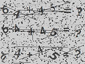
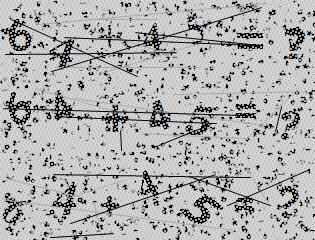

import Tabs from '@theme/Tabs';
import TabItem from '@theme/TabItem';
import ParamItem from '@theme/ParamItem';
import MethodItem from '@theme/MethodItem';
import MethodDescription from '@theme/MethodDescription'
import PriceBlock from '@theme/PriceBlock';
import PriceBlockWrap from '@theme/PriceBlockWrap';
import { ArticleHead } from '@site/src/theme/ArticleHead';

<ArticleHead slug="captchas/compleximage/mathsum" />

# mathsum



<PriceBlockWrap>
  <PriceBlock title="mathsum" captchaId="complex-rec_baidu" />
</PriceBlockWrap>

:::warning **注意！**
此任务不需要使用代理服务器。
:::
<br />

请求必须包含一张图片，并以 base64 格式提供。

## 请求参数

<br />
<span style={{ fontSize: "15px", fontWeight: 700 }}>
> 重要提示：在创建任务之前请直接获取 base64 图片，以避免在解题过程中出现错误（参见章节 [如何获取 base64](#如何获取-base64)）。
</span>
<br />

<div className="bordered-panel">
    <ParamItem title="type" required type="string" />
    **ComplexImageTask**

    ---

    <ParamItem title="class" required type="string" />
    **recognition**

    ---

    <ParamItem title="imagesBase64" required type="array" />
    采用 base64 编码的图像（包装在数组中，不包含 `data:image/png;base64,` 前缀）。

    ---

    <ParamItem title="Task（位于 metadata 中）" required type="string" />
    任务名称：`"MathSum"`

</div>

## 创建任务方法

<div className="method-panel">
	<MethodItem>
		```http
		https://api.capmonster.cloud/createTask
		```
    </MethodItem>
    <MethodDescription>
      **请求示例**
      ```json
      {
        "clientKey": "API_KEY",
        "task": {
          "type": "ComplexImageTask",
          "class": "recognition",
          "imagesBase64": [
            "base64"
          ],
          "metadata": {
            "Task": "MathSum"
          }
        }
      }
      ```

    	**任务示例：**

    	

    	**响应示例**
    	```json
    	{
    	  "errorId":0,
    	  "taskId":143998457
    	}
    	```
    </MethodDescription>

</div>

## 获取任务结果方法

<div className="method-panel-full">
	<MethodItem>
		```http
		https://api.capmonster.cloud/getTaskResult
		```
	</MethodItem>
	<MethodDescription>
		**请求示例**
		```json
		{
		  "clientKey":"API_KEY",
		  "taskId": 143998457
		}
		```
		**响应示例**<br/>
		以字符串形式返回的计算结果（数值）：
```json
{
  "solution": {
    "answer": "109",
    "metadata": {
      "AnswerType": "Text"
    }
  },
  "cost": 0.0005,
  "status": "ready",
  "errorId": 0,
  "errorCode": null,
  "errorDescription": null
}
```
	</MethodDescription>
</div>

## 如何获取 Base64

页面中的图片可以以 URL 形式存在，也可以已经被编码为 Base64 格式。要找到所需的值，请在验证码图片上右键，选择 **检查（Inspect）**，然后仔细查看 **Elements（元素）** 面板或网络请求 —— 在那里你可以找到图片 URL 或已编码的内容。

1. 在浏览器中打开显示验证码的网站。  
2. 右键点击验证码元素并选择 **检查（Inspect）**。


