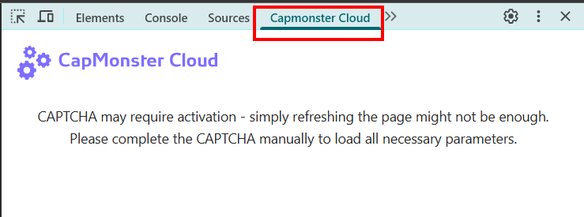

import { ArticleHead } from '../../../../../../src/theme/ArticleHead';

<ArticleHead slug="extension/captcha-parameters" />

# 获取 Chrome 扩展程序中的 CAPTCHA 参数

CapMonster Cloud 扩展程序会显示页面上检测到的 CAPTCHA 参数。创建 `task` 对象并通过 CapMonster Cloud API 提交任务时，可以将这些数据用作示例。

:::warning 注意
此功能仅用于演示**请求格式**。请勿直接复制扩展程序显示的所有参数值，因为每次加载包含 CAPTCHA 的页面时，部分参数都可能发生变化。

提交任务前，请使用当前有效的参数（有关如何获取所有必需参数的详细信息，请参阅相应的 [CAPTCHA 类型](../../captchas/)文档）。
:::

## 如何查看 CAPTCHA 参数

开始前，请确保：

- CapMonster Cloud 扩展程序已安装并启用；
- 扩展程序设置中已指定有效的 API 密钥；
- 账户余额充足；
- 已启用所需的 CAPTCHA 类型以进行自动识别。

查看参数：

1. 打开包含 CAPTCHA 的页面。
2. 打开**开发者工具**。
3. 转到 **CapMonster Cloud** 标签页：

   

4. 重新加载页面。

检测到的 CAPTCHA 参数将自动显示。如果未显示任何数据，请先手动完成 CAPTCHA，验证成功后即可查看相关参数。


要复制参数，请点击检测到的 CAPTCHA 名称旁边的复制图标。

:::info
该标签页显示扩展程序发送到 CapMonster Cloud 的 `task` 对象内容。

如果您手动通过 API 发送请求，请将这些数据放入 `task` 字段，并添加 `clientKey`。
:::

所选 CAPTCHA 类型的完整请求示例（本例为使用[点击方法](/zh/docs/captchas/recaptcha-click/)解决的 **reCAPTCHA v2**）：

```json
{
  "clientKey": "API_KEY",
  "task": {
    "class": "recaptcha",
    "imageUrls": ["IMAGE_URL"],
    "metadata": {
      "Task": "Select all squares with motorcycles",
      "Grid": "3x3"
    },
    "recognizingThreshold": 60,
    "userAgent": "userAgentPlaceholder",
    "type": "ComplexImageTask"
  }
}
```

:::warning 重要
发送 API 请求时，请使用 CapMonster Cloud 当前支持的 `userAgent`。

您可以通过以下地址获取最新值：https://capmonster.cloud/api/useragent/actual
:::

## 支持的 CAPTCHA 类型和参数

| CAPTCHA 类型 | 显示的参数 |
|---|---|
| **reCAPTCHA V2 (Click)** | `class`、`imageUrls`、`metadata` 中的 `Task`、`metadata` 中的 `Grid`、`recognizingThreshold`、`userAgent`、`type` |
| **reCAPTCHA V2 (Token)** | `websiteURL`、`websiteKey`、`userAgent`、`type` |
| **reCAPTCHA V2 Invisible** | `class`、`imageUrls`、`metadata` 中的 `Task`、`metadata` 中的 `Grid`、`recognizingThreshold`、`userAgent`、`type` |
| **reCAPTCHA V2 Enterprise (Click)** | `class`、`imageUrls`、`metadata` 中的 `Task`、`metadata` 中的 `Grid`、`recognizingThreshold`、`userAgent`、`type` |
| **reCAPTCHA V2 Enterprise (Token)** | `websiteURL`、`websiteKey`、`userAgent`、`recaptchaDataSValue`、`type` |
| **reCAPTCHA V3** | `websiteURL`、`websiteKey`、`pageAction`、`minScore`、`type` |
| **GeeTest v3** | `websiteURL`、`gt`、`challenge`、`userAgent`、`type` |
| **GeeTest v4** | `websiteURL`、`gt`（`captcha_id`）、`userAgent`、`version`、`type` |
| **Cloudflare Turnstile** | `websiteURL`、`websiteKey`、`userAgent`、`type` |
| **Cloudflare Challenge** | `websiteURL`、`websiteKey`、`userAgent`、`pageAction`、`data`、`pageData`、`cloudflareTaskType`、`type` |
| **ImageToText** | `base64` 格式的 `body`、`type` |
| **BLS** | `class`、`imagesBase64`、`metadata` 中的 `Task`、`metadata` 中的 `TaskArgument`、`type` |
| **Binance** | `websiteURL`、`websiteKey`、`validateId`、`userAgent`、`type` |

显示的参数取决于 CAPTCHA 类型及其在目标网站上的具体实现。
