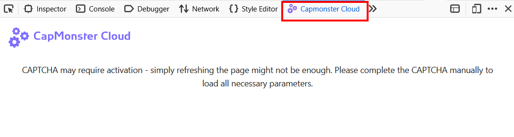

---
sidebar_position: 1
sidebar_label: Firefox 浏览器扩展
---

import { ArticleHead } from '../../../../../src/theme/ArticleHead';

<ArticleHead slug="extension/extension-firefox" />

# Firefox 浏览器扩展

## 说明
使用此扩展，您可以直接在浏览器中自动识别验证码。

该扩展适用于 Mozilla Firefox 浏览器。

-----
## 自动安装
1. 打开 [Firefox 附加组件商店](https://addons.mozilla.org/zh-CN/firefox/addon/capmonster-cloud/)。
2. 点击 **添加到 Firefox**。
3. 在弹出的窗口中点击 **添加 (A)**，确认添加扩展程序。

要开始使用该扩展，请点击地址栏右侧的扩展图标。然后前往[设置](extension-firefox.mdx#设置)。

*如果由于某种原因无法从 Firefox 附加组件商店安装该扩展，请使用手动安装说明。*

    
手动安装

1. 下载[扩展压缩包](https://zenno.link/firefox-actual-build)。

2. 打开 Firefox 浏览器并进入扩展程序管理页面：
   
   
3. 转到 `管理您的扩展`，点击齿轮按钮，然后在打开的下拉列表中选择 `从文件安装附加组件…`
   
   
4. 选择已下载的扩展压缩包。

5. 扩展加载完成后，打开“扩展”页面，然后点击已安装的扩展。
   
   
6. 转到 `权限` 选项卡，并确保已授予所有权限。
   

如果在标准安装过程中出现错误，请使用附加组件调试模式：

1. 转到 `管理您的扩展`，点击齿轮按钮，然后在打开的下拉列表中选择 `调试附加组件`

2. 在打开的窗口中点击 `临时载入附加组件`，然后选择已下载的扩展压缩包。

    
手动更新扩展程序

如果您是在旧版本上安装此扩展程序，那么在更新原始扩展文件后，还需要在 `扩展程序` 页面点击更新按钮（如何打开此页面，请参阅上方的 `手动安装` 部分）。

-----
## 设置

    
如何固定扩展程序

默认情况下，新安装的扩展程序会自动固定到浏览器工具栏。 
   

启动扩展程序后，您将看到以下窗口：

### API 密钥
在相应字段中输入 API 密钥（**1**），然后点击 **保存** 按钮（**2**）。如果输入的密钥正确，您的余额将显示在下方（**3**）。

### 自动识别验证码
您可以在此选择扩展程序将自动识别的验证码类型。

:::info !

您可能需要重新加载包含验证码的页面，才能使更改生效！

:::

### 出错时重复识别验证码

如果第一次识别验证码失败，扩展程序将重复发送任务，直到验证码被成功识别，或达到此设置中指定的限制。

### 代理

 

在此部分中，您可以指定一个代理，该代理将与识别任务一起发送。

**登录名** 和 **密码** 字段为可选项。该扩展程序还支持使用 **IPv6** 的代理。

### 黑名单管理

您可以使用黑名单配置扩展程序，使其忽略特定网站上的验证码。

启用此选项后，将显示一个用于输入网站的字段：

必须连同协议（https:// 或 http://）一起指定域名。
您可以使用通配符：

- ? - 除句点外的任意单个字符
- \* - 任意数量的任意字符

示例：

|**过滤器**|**说明**|
| :-: | :-: |
|`https://zennolab.com`|禁止扩展程序在网站 `https://zennolab.com` 上运行|
|`https://*.zennolab.com`|禁止扩展程序在 `https://zennolab.com` 的所有子域名上运行|
|`https://www.google.*`|禁止扩展程序在所有区域域名（ru、com、com.ua 等）的 Google 网站上运行|

如果识别验证码时出现错误，请参阅[错误词汇表](/api/api-errors.mdx)。

## 验证码参数映射

**CapMonster Cloud** 扩展程序提供了一种便捷方式，用于查看正确提交任务和成功识别各种验证码类型所需的参数。显示的数据有助于确保您发送的参数准确无误，也可以在构建 API 请求时用作示例。

### 支持的验证码类型及其参数

| 验证码类型                        | 显示的参数                                                                                                      |
| ----------------------------------- | ------------------------------------------------------------------------------------------------------------------------- |
| **reCAPTCHA V2（Click）**            | `class`、`imageUrls`、`Task`（位于 `metadata` 内）、`Grid`（位于 `metadata` 内）、`recognizingThreshold`、`userAgent`、`type` |
| **reCAPTCHA V2（Token）**            | `websiteURL`、`websiteKey`、`userAgent`、`type`                                                                           |
| **reCAPTCHA V2 Invisible**          | `class`、`imageUrls`、`Task`（位于 `metadata` 内）、`Grid`（位于 `metadata` 内）、`recognizingThreshold`、`userAgent`、`type` |
| **reCAPTCHA V2 Enterprise（Click）** | `class`、`imageUrls`、`Task`（位于 `metadata` 内）、`Grid`（位于 `metadata` 内）、`recognizingThreshold`、`userAgent`、`type` |
| **reCAPTCHA V2 Enterprise（Token）** | `websiteURL`、`websiteKey`、`userAgent`、`recaptchaDataSValue`、`type`                                                    |
| **reCAPTCHA V3**                    | `websiteURL`、`websiteKey`、`pageAction」、`minScore」、`type」                                                              |
| **GeeTest v3**                      | `websiteURL」、`gt」、`challenge」、`userAgent」、`type」                                                                      |
| **GeeTest v4**                      | `websiteURL`、`gt`（`captcha_id`）、`userAgent`、`version`、`type`                                                         |
| **Cloudflare Turnstile**            | `websiteURL`、`websiteKey`、`userAgent`、`type`                                                                           |
| **Cloudflare Challenge**            | `websiteURL`、`websiteKey`、`userAgent`、`pageAction`、`data`、`pageData`、`cloudflareTaskType`、`type`                   |
| **ImageToText**                     | `body`（采用 `base64` 格式）、`type`                                                                                       |
| **BLS**                             | `class`、`imagesBase64`、`Task`（位于 `metadata` 内）、`TaskArgument`（位于 `metadata` 内）、`type`                           |
| **Binance**                         | `websiteURL`、`websiteKey`、`validateId`、`userAgent`、`type`                                                             |

要使用此功能，请启用扩展程序，在设置中指定您的 API 密钥，并确保账户余额充足。然后打开包含验证码的页面，确认该验证码类型受支持且已被选择用于识别，并按照以下步骤操作：

1. 打开 **开发者工具**，然后转到 **Capmonster Cloud** 选项卡：  
   
   

2. 重新加载页面。

:::warning **重要**
对于 API 请求，请使用[我们的服务](https://capmonster.cloud/api/useragent/actual)支持的最新 `userAgent`。
:::

验证码参数将自动显示：  

