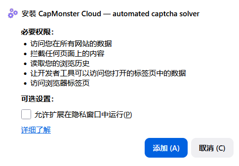
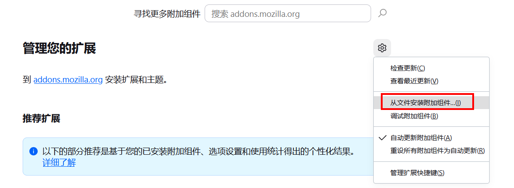
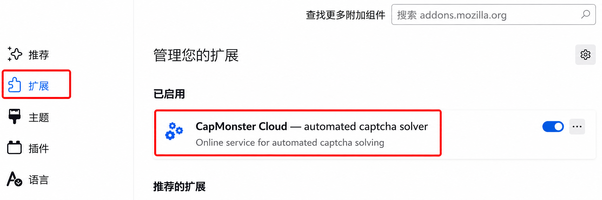
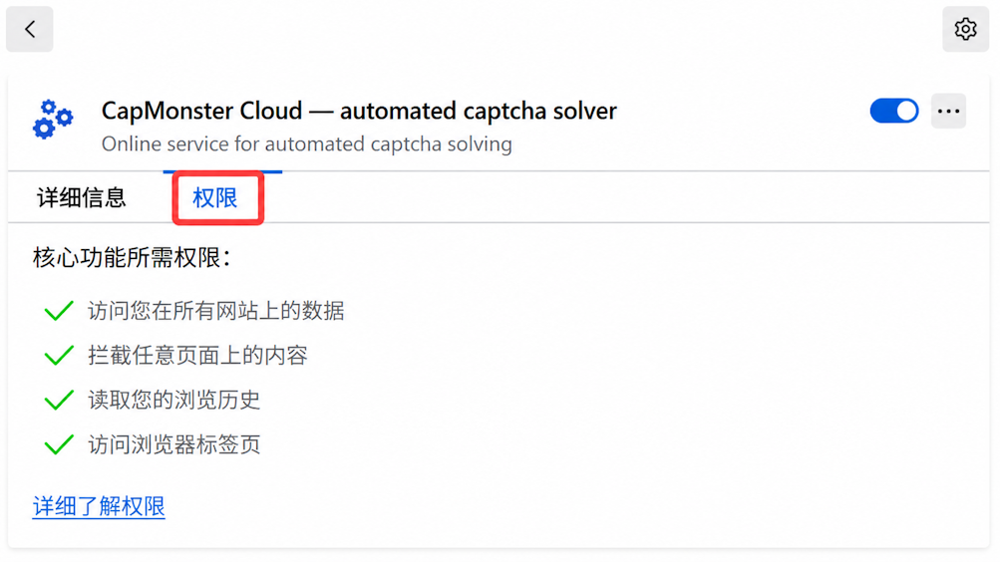
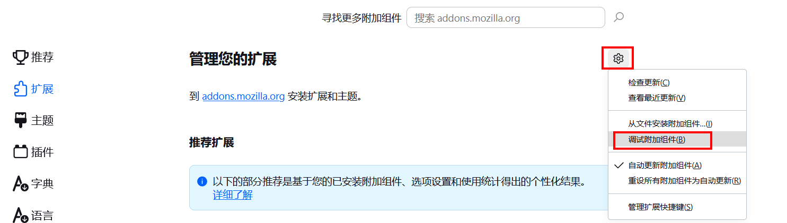

---
sidebar_position: 1
sidebar_label: Firefox 浏览器扩展
title: "Firefox 浏览器扩展"
---

import { ArticleHead } from '../../../../../src/theme/ArticleHead';

<ArticleHead slug="extension/extension-firefox" />

# Firefox 浏览器扩展

## 说明

使用此扩展程序，您可以直接在浏览器中自动识别 CAPTCHA。

该扩展程序适用于 Mozilla Firefox 浏览器。

---

## 自动安装

:::warning 重要
不建议在隐私浏览模式或访客模式下安装扩展程序。
:::

1. 打开 Firefox 附加组件商店中的 CapMonster Cloud 扩展程序页面。
2. 点击 **添加到 Firefox**。
3. 在弹出的窗口中点击 **添加 (A)**，确认添加扩展程序。

如果无法通过 Firefox 附加组件商店安装扩展程序，请按照手动安装说明操作。

手动安装扩展程序

1. 下载 Firefox 扩展程序文件。

2. 打开 Firefox 浏览器并进入扩展程序管理页面：
   
   
3. 转到 `管理您的扩展`，点击齿轮按钮，然后在打开的下拉列表中选择 `从文件安装附加组件…`
   
   
4. 选择已下载的扩展压缩包。

5. 扩展加载完成后，打开“扩展”页面，然后点击已安装的扩展。
   
   
6. 转到 `权限` 选项卡，并确保已授予所有权限。
   

如果在标准安装过程中出现错误，请使用附加组件调试模式：

1. 转到 `管理您的扩展`，点击齿轮按钮，然后在打开的下拉列表中选择 `调试附加组件`

2. 在打开的窗口中点击 `临时载入附加组件`，然后选择已下载的扩展压缩包。

手动更新扩展程序

如果扩展程序是手动安装的，请下载新版本文件，然后按照手动安装步骤重新安装。

---

## 设置

如何固定扩展程序

新安装的扩展程序可能不会显示在工具栏中。打开扩展程序菜单，然后使用相应的固定图标将 CapMonster Cloud 固定到工具栏。

   

启动扩展程序后，您将看到以下窗口：

### API 密钥

在相应字段中输入 API 密钥（**1**），然后点击**保存**（**2**）。

如果密钥正确，下方将显示当前余额（**3**）。

### 自动解决 CAPTCHA

选择扩展程序应自动识别的 CAPTCHA 类型。

:::info
更改设置后，可能需要重新加载包含 CAPTCHA 的页面。
:::

### 出错时重新解决 CAPTCHA

如果第一次未能解决 CAPTCHA，扩展程序将继续发送新任务，直到成功解决 CAPTCHA 或达到设置中指定的重试次数限制。

### 代理

 

您可以在此部分指定随识别任务一起发送的代理。

**登录名**和**密码**字段为可选项。扩展程序也支持使用 **IPv6** 的代理。

### 黑名单管理

通过黑名单，可以设置扩展程序在哪些网站上忽略 CAPTCHA。

启用此选项后，将显示用于输入网站的字段：

域名必须与协议一起指定：`https://` 或 `http://`。

可以使用以下通配符：

- `?` — 除句点外的任意单个字符；
- `*` — 任意数量的字符。

| 过滤器 | 说明 |
|---|---|
| `https://zennolab.com` | 禁止扩展程序在 `https://zennolab.com` 网站上运行 |
| `https://*.zennolab.com` | 禁止扩展程序在 `zennolab.com` 的所有子域名上运行 |
| `https://www.google.*` | 禁止扩展程序在 Google 的所有域名区域中运行 |

如果识别验证码时出现错误，请参阅[错误词汇表](/api/api-errors.mdx)。

## 获取 CAPTCHA 参数

在开发者工具的 **CapMonster Cloud** 标签页中，可以查看检测到的 CAPTCHA 参数，以及扩展程序发送到 CapMonster Cloud 的 `task` 对象内容。

有关详细信息，请参阅 [Firefox 扩展程序中的 CAPTCHA 参数映射](./captcha-parameters/captcha-parameters-firefox.mdx)。
