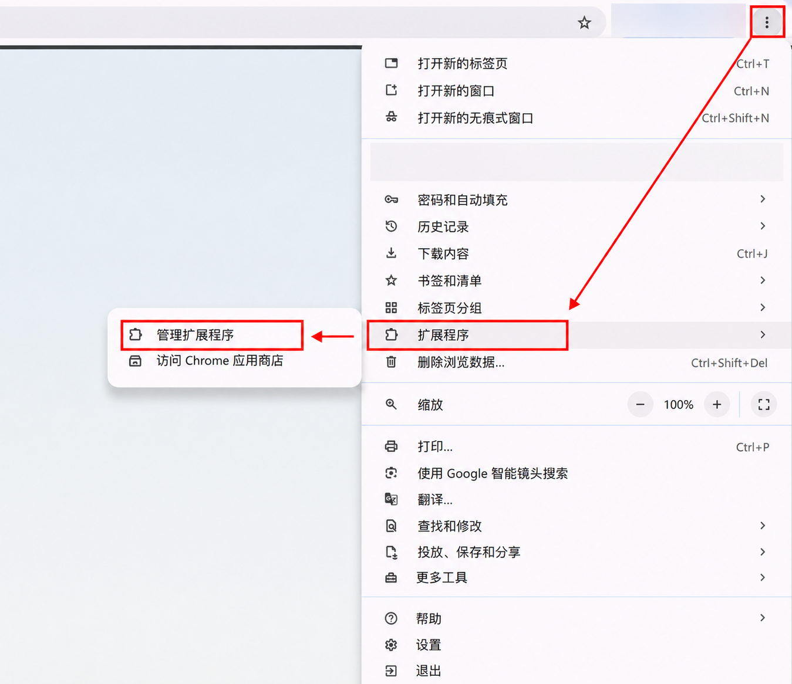
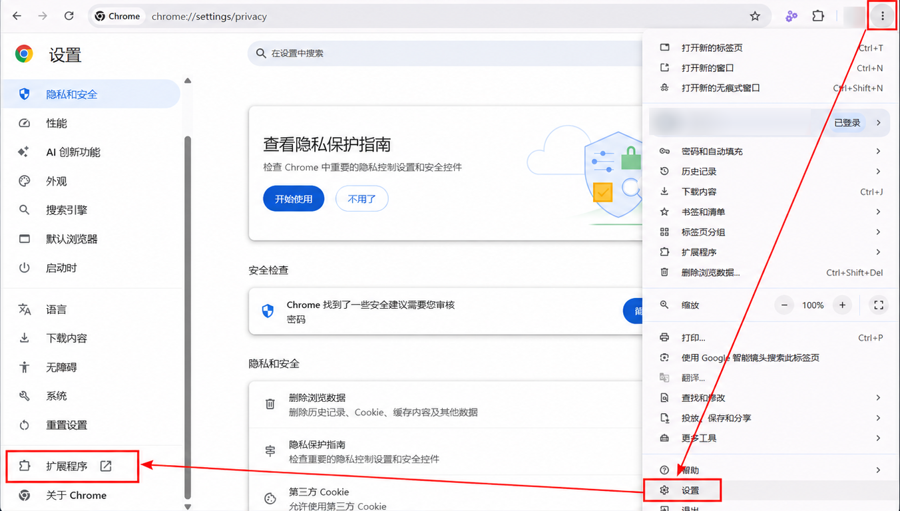
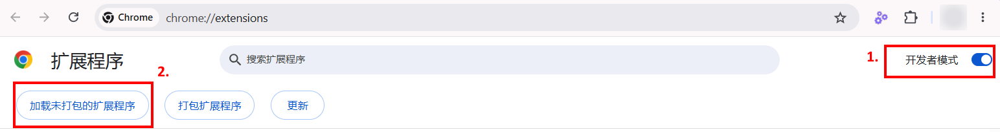
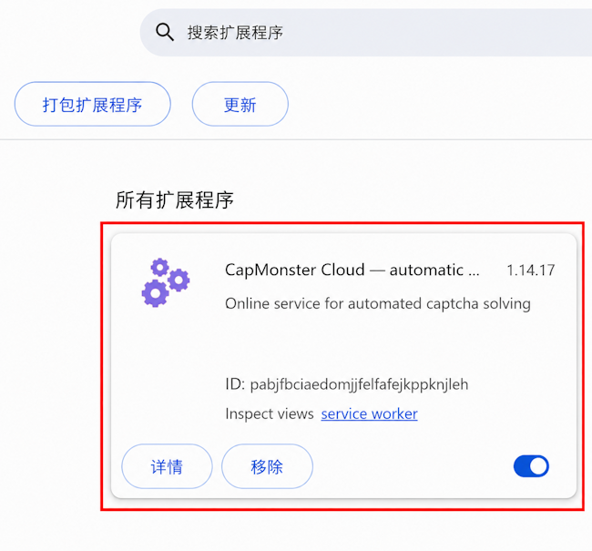
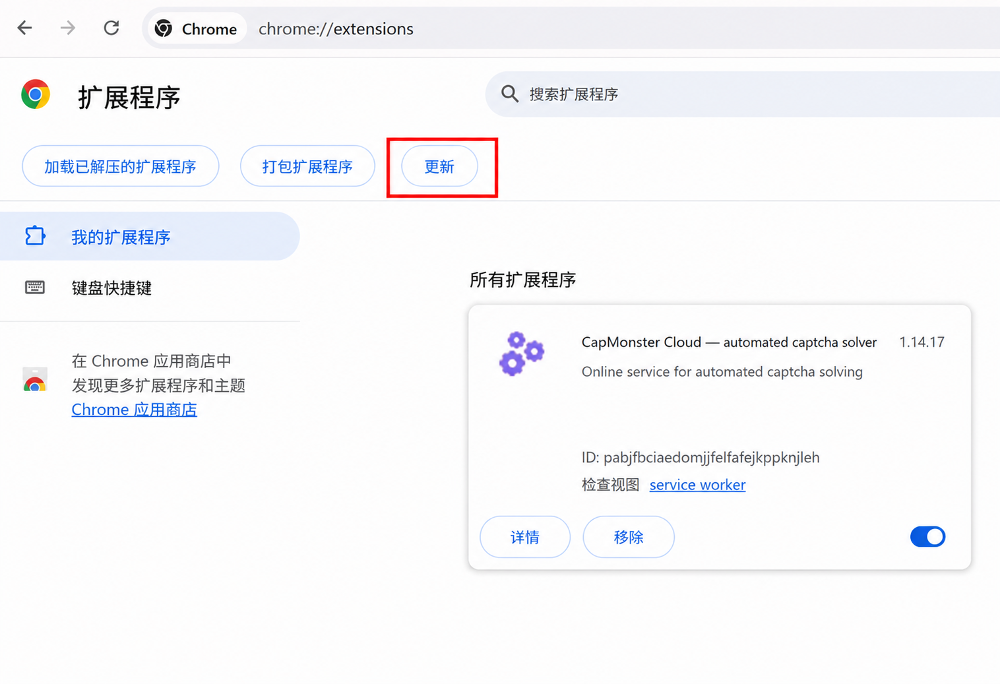
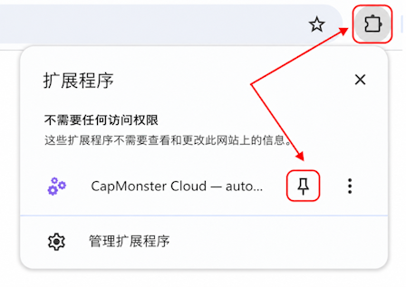
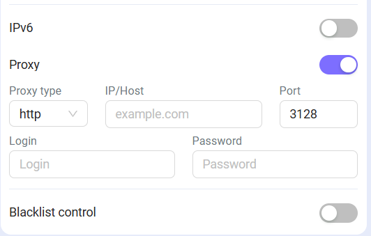

---
sidebar_position: 0
sidebar_label: Chrome 浏览器扩展
title: "Chrome 浏览器扩展"
---

import { ArticleHead } from '../../../../../src/theme/ArticleHead';

<ArticleHead slug="extension/extension-main" />

# Chrome 浏览器扩展
## 说明
使用此扩展，您可以直接在浏览器中自动识别验证码。

---

## 自动安装

:::warning 重要
不建议在无痕模式或访客模式下安装扩展程序。
:::

1. 打开 [Chrome 网上应用店](https://chrome.google.com/webstore/detail/capmonster-cloud-%E2%80%94-automa/pabjfbciaedomjjfelfafejkppknjleh?hl=zh)。
2. 点击 **安装**。

要开始使用该扩展，请点击地址栏右侧的扩展图标。然后前往[设置](extension-main.mdx#设置)。

*如果由于某种原因无法从 Chrome 网上应用店安装该扩展，请使用手动安装说明。*

    
手动安装

1. 下载[扩展压缩包](https://zenno.link/chrome-actual-build)。

2. 将下载的压缩包解压到任意名称的文件夹中。

   :::warning 重要
   安装后请勿删除扩展程序文件夹，否则浏览器将无法继续使用该扩展程序。
   :::

3. 在浏览器地址栏中输入 `chrome://extensions`，然后按 `Enter`。

   也可以通过以下任一方式打开扩展程序页面：

   - 通过菜单：点击右上角的 `⋮` → `扩展程序` → `管理扩展程序`；

     

   - 或打开 Google Chrome 设置，然后在左侧菜单最底部选择 `扩展程序`。

     

4. 启用 `开发者模式`。

5. 页面顶部将出现一个面板。点击 `加载已解压的扩展程序` 按钮。

   

6. 在打开的窗口中，选择解压该压缩包的文件夹。

7. 此后，该扩展将出现在已安装扩展程序列表中。

   

手动更新扩展程序

如果您是在旧版本上安装此扩展程序，那么在更新原始扩展文件后，还需要在 `扩展程序` 页面点击更新按钮（如何打开此页面，请参阅上方的 `手动安装` 部分）。

---

## 设置

如何固定扩展程序

默认情况下，已安装的扩展程序处于隐藏状态。要将其固定，请点击 **固定** 按钮：

启动扩展程序后，您将看到以下窗口：

### API 密钥

在相应字段中输入 API 密钥（**1**），然后点击 **Save**（**2**）。

如果密钥正确，下方将显示当前余额（**3**）。

### 自动解决 CAPTCHA

选择扩展程序应自动识别的 CAPTCHA 类型。

:::info
更改设置后，可能需要重新加载包含 CAPTCHA 的页面。
:::

### 出错时重新解决 CAPTCHA

如果第一次未能解决 CAPTCHA，扩展程序将继续发送新任务，直到成功解决 CAPTCHA 或达到设置中指定的重试次数限制。

### 代理

 

您可以在此部分指定随识别任务一起发送的代理。

**Login** 和 **Password** 字段为可选项。扩展程序也支持使用 **IPv6** 代理。

### 黑名单管理

通过黑名单，可以设置扩展程序在哪些网站上忽略 CAPTCHA。

启用此选项后，将显示用于输入网站的字段：

域名必须与协议一起指定：`https://` 或 `http://`。

可以使用以下通配符：

- `?` — 除句点外的任意单个字符；
- `*` — 任意数量的字符。

| 过滤器 | 说明 |
|---|---|
| `https://zennolab.com` | 禁止扩展程序在 `https://zennolab.com` 网站上运行 |
| `https://*.zennolab.com` | 禁止扩展程序在 `zennolab.com` 的所有子域名上运行 |
| `https://www.google.*` | 禁止扩展程序在 Google 的所有域名区域中运行 |

如果识别验证码时出现错误，请参阅[错误词汇表](/api/api-errors.mdx)。

## 获取 CAPTCHA 参数

在开发者工具的 **CapMonster Cloud** 标签页中，可以查看检测到的 CAPTCHA 参数，以及扩展程序发送到 CapMonster Cloud 的 `task` 对象内容。

有关详细信息，请参阅 [Chrome 扩展程序中的 CAPTCHA 参数映射](./captcha-parameters/captcha-parameters.mdx)。
