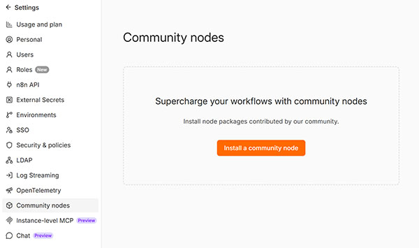
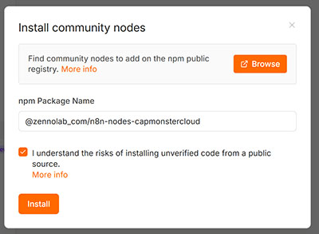
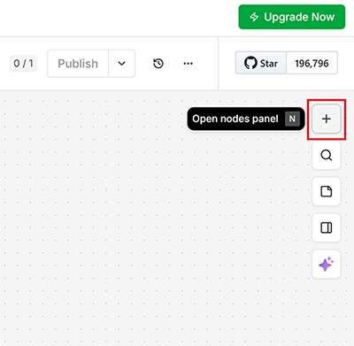
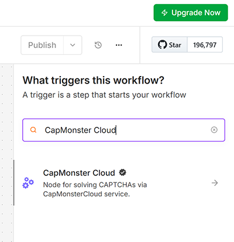

import { ArticleHead } from '../../../../../src/theme/ArticleHead';
import Tabs from '@theme/Tabs';
import TabItem from '@theme/TabItem';

<ArticleHead slug="external-services/external-n8n" />

# 如何安装和使用 n8n 的 CapMonster Cloud 节点

[**n8n**](https://n8n.io/) 是一个开源工作流自动化平台，其业务逻辑由节点构建而成；这些节点通过 HTTP API、webhook 以及与外部服务的集成来交换数据。它的主要优势在于，您既可以在 n8n Cloud 中运行自动化流程（价格[合理](https://n8n.io/pricing/)），也可以在自己的服务器上运行。

**CapMonster Cloud 节点**可为这些工作流添加自动 CAPTCHA 识别功能：它将任务发送至 CapMonster Cloud，获取已完成的 token 或答案，并将其传递到工作流的后续步骤。这使您能够可靠地自动化与网页表单、注册、登录、爬取及其他操作相关的 n8n 场景；否则，这些操作可能会受到 CAPTCHA 防护的阻止。

该节点支持几乎所有 CapMonster Cloud API 提供解决方案的任务类型，并会定期更新。

某些任务类型可选支持 proxy。是否需要使用自己的 proxy，可在[特定 CAPTCHA 的页面](https://docs.capmonster.cloud/zh/docs/captchas/)中查看。

## 安装节点

根据您的 n8n 配置，可以使用以下任一方式安装 **CapMonster Cloud 节点**。

<Tabs className="full-width-tabs filled-tabs request-tabs" groupId="captcha-type">

    <TabItem value="self-hosted" label="自托管 n8n 服务器" default className="method-panel">

        ### <span style={{padding: '0px 0px 0px 15px', marginTop: '15px', display: 'inline-block'}}>通过 CLI 安装</span>

        1. 通过 CLI 登录您的 n8n 实例
        2. 进入通常安装 n8n 节点的目录，例如 `~/.n8n/nodes`
        3. 将该软件包作为社区节点安装：

           `npm install @zennolab_com/n8n-nodes-capmonstercloud`

        4. 使用以下命令重启 n8n：

           `n8n`

        5. 完成。

        ### <span style={{padding: '0px 0px 0px 15px', marginTop: '15px', display: 'inline-block'}}>通过 UI 安装</span>

        1. 在浏览器中打开 n8n UI
        2. 前往 **Settings → Community nodes**

           

        3. 点击 **Install a community node**

           

        4. 在 **npm Package Name** 字段中输入 `@zennolab_com/n8n-nodes-capmonstercloud`，勾选“I understand the risks…”复选框，然后点击 **Install**

           

        5. 完成。

    </TabItem>

    <TabItem value="n8n-cloud" label="n8n Cloud" default className="method-panel">

        <span style={{padding: '0px 0px 0px 15px', marginTop: '15px', display: 'inline-block'}}>要将 CapMonster Cloud 社区节点安装到您的 n8n Cloud 实例中：</span>

        1. 打开 [n8n 控制面板](https://app.n8n.cloud/dashboard)，并进入您的一个 n8n 实例。
        2. 创建一个新的工作流，或打开任意现有工作流。
        3. 前往 **Canvas**，点击 **\+** 或按 **N** 键以打开节点面板。

           

        4. 搜索并选择 **CapMonster Cloud** 节点。

           

        5. 点击 **Install node**

           

        6. 现在您可以将该节点添加到工作流中。

    </TabItem>

</Tabs>

## 使用示例

以下是使用 CapMonster Cloud 节点的演示工作流的分步指南。


如果您是有经验的 n8n 用户，可以[下载](./images/external-n8n/CapMonster_Cloud_node_for_n8n_Demo.json)此工作流，将其导入项目后自行研究。

### 前提条件

* CapMonster Cloud 账户
* CapMonster Cloud API 密钥，可在 [CapMonster Cloud 控制面板](https://dash.capmonster.cloud/)中获取

### 步骤 1 — 创建新工作流

1. 在左侧边栏中点击 **\+ New workflow**
2. 点击顶部标题并将其重命名为 `CapMonster Cloud — reCAPTCHA v2 Demo`（例如）

### 步骤 2 — Manual Trigger 节点

1. 在画布中点击 **\+** → 找到 **Manual Trigger** → 添加该节点
2. 双击该节点 → 将 **Name** 设置为 `Run Test`
3. 关闭面板

### 步骤 3 — HTTP Request 节点（获取当前 User-Agent）

该节点从 CapMonster Cloud 自身的端点获取最新的 User-Agent 字符串，从而提高 token 被成功接受的概率。

1. 在 `Run Test` 后点击 **\+** → 找到 **HTTP Request** → 添加该节点
2. 将节点重命名为 `HTTP Request`
3. 填写以下参数：

    | 字段 | 值 |
    | ----- | ----- |
    | **Method** | GET |
    | **URL** | `https://capmonster.cloud/api/useragent/actual` |

4. 其他设置均保留默认值
5. 关闭面板

### 步骤 4 — CapMonster Cloud 节点（识别 CAPTCHA）

本示例展示了在 CapMonster Cloud 专用演示页面上识别 reCAPTCHA v2 的节点设置。

1. 在 `HTTP Request` 后点击 **\+** → 找到 **CapMonster Cloud** → 添加该节点
2. 将节点重命名为 `Solve reCAPTCHA v2`
3. 填写以下参数：

    | 字段 | 值 |
    | ----- | ----- |
    | **Task Type** | RecaptchaV2 (reCAPTCHA V2) |
    | **Website URL** | `https://lessons.zennolab.com/captchas/recaptcha/v2_simple.php?level=high` |
    | **Website Key** | `6Lcg7CMUAAAAANphynKgn9YAgA4tQ2KI_iqRyTwd` |
    | **User Agent** | 切换到表达式模式（`=`），然后输入 `{{ $json.data }}` |
    | **Is Invisible** | 关闭（false） |

4. 在 **Credential** 部分点击 **Create new credential**：
   * 将您的 CapMonster Cloud API 密钥粘贴到 **Client Key** 字段
   * 点击 **Save**
5. 关闭面板

### 步骤 5 — HTTP Request 节点（提交 token）

1. 在 `Solve reCAPTCHA v2` 后点击 **\+** → 找到 **HTTP Request** → 添加该节点
2. 将节点重命名为 `Submit Form with Token`
3. 填写以下参数：

    | 字段 | 值 |
    | ----- | ----- |
    | **Method** | POST |
    | **URL** | `https://lessons.zennolab.com/captchas/recaptcha/verify.php?type=v2&subtype=simple&level=high` |

4. 启用 **Send Body** 开关：

   * **Body Content Type** → `Form Urlencoded`
   * **Specify Body** → `Using Fields Below`
   * 点击 **Add Field**：
     * **Name**：`g-recaptcha-response`
     * **Value**：切换到表达式模式（`=`），然后输入 `{{ $json.gRecaptchaResponse }}`
5. 展开底部的 **Options** 部分：

   * 打开 **Response**
   * 启用 **Full Response**（返回状态码和响应头）
   * 启用 **Never Error**（响应不在 2xx 范围内时不会引发异常）
   * **Response Format** → `Text`
6. 关闭面板

### 步骤 6 — Code 节点（解析服务器响应）

ZennoLab 服务器会返回一个 HTML 页面。验证结果的 JSON 嵌入在 `<pre>` 标签内，此 Code 节点会将其提取出来。

1. 在 `Submit Form with Token` 后点击 **\+** → 找到 **Code** → 添加该节点
2. 将节点重命名为 `Parse Response`
3. 将 **Language** 设置为 `JavaScript`
4. 将默认代码替换为以下内容：

    ```javascript
    const html = $input.first().json.data;
    const match = html.match(/<pre>([\s\S]*?)<\/pre>/);
    if (!match) {
      // 如果未找到 <pre> 标签，则返回包含错误的对象
      return [{ json: { success: false, challenge_ts: null, hostname: null, _error: 'No pre tag found' } }];
    }
    const parsed = JSON.parse(match.trim());
    return [{ json: parsed }];
    ```

5. 关闭面板

### 步骤 8 — 检查连接

请确认箭头严格按照以下顺序连接：

**Run Test → HTTP Request → Solve reCAPTCHA v2 → Submit Form with Token → Parse Response**

如果有节点未连接，请将箭头从前一个节点的输出端拖到下一个节点的输入端。

### 步骤 9 — 保存并运行

1. 按 **Ctrl+S**（或点击顶部的 **Save**）保存工作流
2. 点击 **Test workflow**，或点击 `Run Test` 节点上的 **Execute**
3. 等待约 15–20 秒，让 CapMonster Cloud 完成 CAPTCHA 识别

### 预期结果

在 **`Parse Response`** 节点的输出中，您应看到：

```json
{
  "success": true,
  "challenge_ts": "2026-07-17T14:15:48Z",
  "hostname": "lessons.zennolab.com"
}
```

`"success": true` 表示 CAPTCHA token 已由 CapMonster Cloud 识别，并被 Google 验证 API 接受。