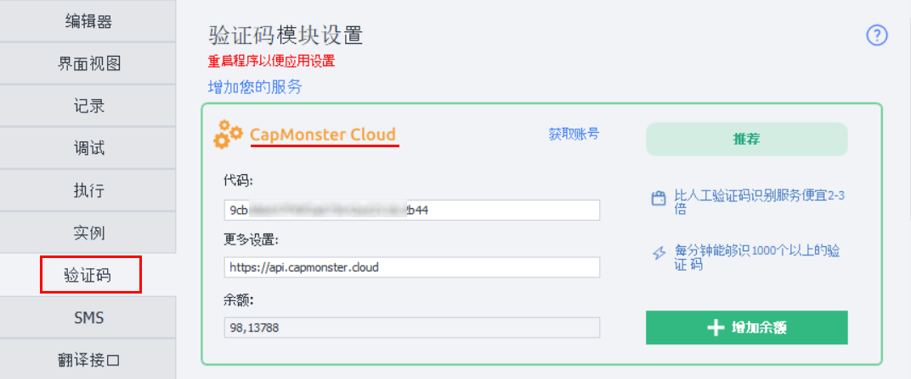
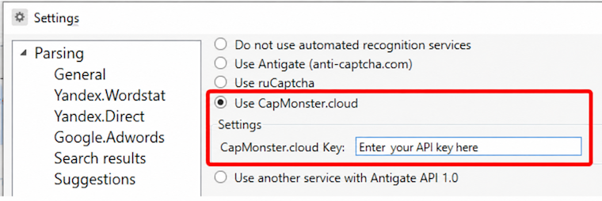
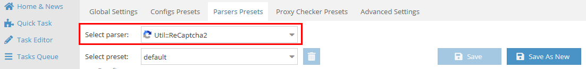
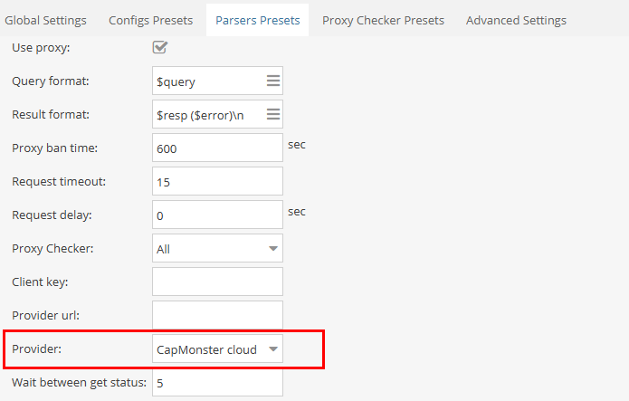
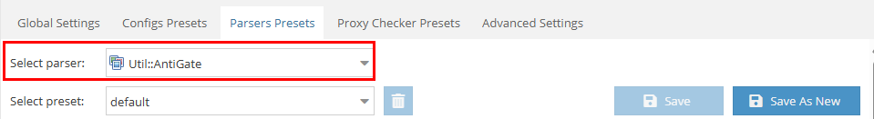
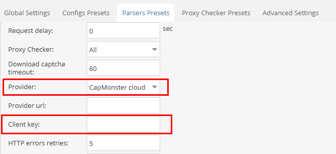
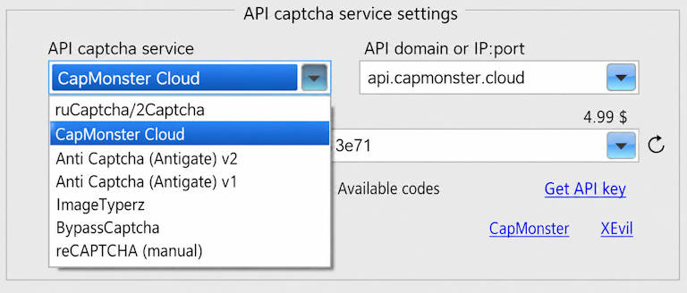
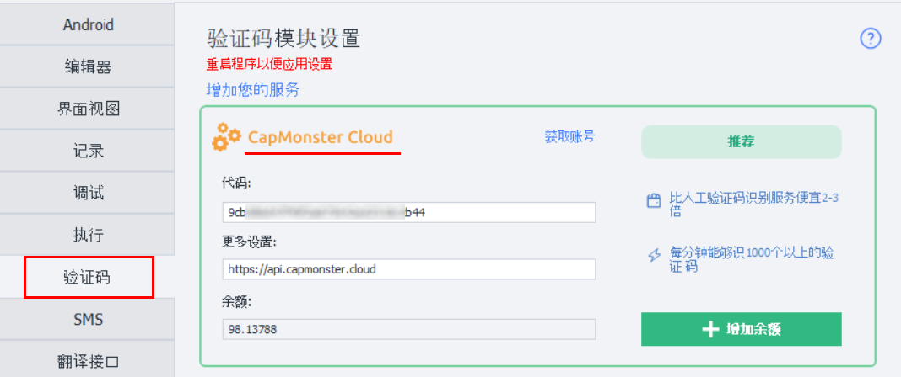
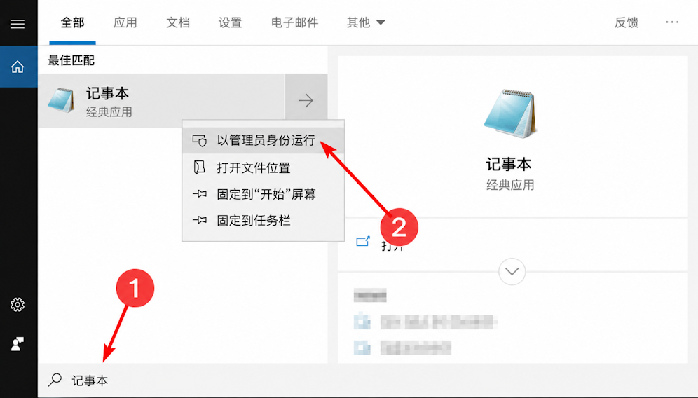
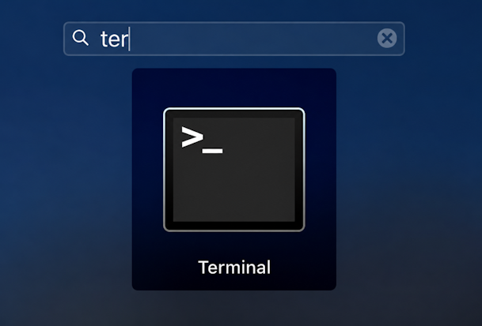

---
sidebar_position: 1
sidebar_label: 如何将 CapMonster Cloud 连接到程序？
title: 如何将 CapMonster Cloud 连接到程序？
---

import { ArticleHead } from '../../../../../src/theme/ArticleHead';

<ArticleHead slug="extension/external-program" />

# 如何将 CapMonster Cloud 连接到程序？
CapMonster Cloud 兼容所有验证码解决方案。要将 CapMonster Cloud 连接到您的程序，请按照以下指南操作。
## 连接到支持 CapMonster Cloud 的程序
<details>
<summary>ZennoPoster</summary>


</details>

<details>
<summary>KeyCollector</summary>

选择 **Use CapMonster Cloud** 并输入您的个人 API 密钥。


</details>

<details>
<summary>A-Parser</summary>

要解决 reCAPTCHA，请选择 `Util::ReCaptcha2`，并在 `Provider` 字段中选择 `CapMonster Cloud`。

 
 

要解决标准验证码，请选择 `Util::Antigate`，并在 `Provider` 字段中选择 `CapMonster Cloud`。在 `Client key` 字段中输入您的 CapMonster Cloud API 密钥。



</details>

<details>
<summary>MailBot by Tavel</summary>


</details>
## 连接到可以指定域名的程序
复制域名 [api.capmonster.cloud](https://api.capmonster.cloud) 和 CapMonster Cloud 的密钥。

此方法适用于以下程序：

<details>
<summary>ZennoDroid</summary>


</details>
## 连接到其他程序的三个步骤

1. 在您的程序中，选择我们支持的验证码识别服务之一：
   `Anti-Captcha (v1.0, v2.0), RuCaptcha, RipCaptcha, 2Captcha, BypassCaptcha, DeathByCaptcha`。

2. 然后，在您用于发送验证码的程序中的相应字段里，指定您的 CapMonsterCloud 个人 API 密钥。

> **DeathByCaptcha 注意事项：** DeathByCaptcha API 使用用户名和密码来识别用户，而不是 API 密钥。在这种情况下，请在密码字段中指定 CapMonsterCloud 的 API 密钥。用户名字段中可以输入任意值。

3. 最后一步：将我们的 IP 与另一个服务进行匹配，以便 CapMonster Cloud 可以从上述服务接收验证码。为此，请选择您的操作系统，展开折叠部分，并按照说明操作。

<details>
<summary>我使用 Windows</summary>

打开这个路径：C:\Windows\System32\drivers\etc\ 并找到名为 `hosts` 的文件。用记事本打开它，并在文档末尾添加以下行：

```
# capmonster.cloud 开始

65.21.216.235 rucaptcha.com

65.21.216.235 ripcaptcha.com

65.21.216.235 imacros2.rucaptcha.com

65.21.216.235 2captcha.com

65.21.216.235 imacros2.2captcha.com

65.21.216.235 dc.antigate.com

65.21.216.235 anti-captcha.net

65.21.216.235 antigate.com

65.21.216.235 anticaptcha.com

65.21.216.235 www.anti-captcha.net

65.21.216.235 www.antigate.com

65.21.216.235 www.anticaptcha.com

65.21.216.235 anti-captcha.com

65.21.216.235 api.anti-captcha.com

65.21.216.235 bypasscaptcha.com

65.21.216.235 www.bypasscaptcha.com

65.21.216.235 api.dbcapi.me

65.21.216.235 api.deathbycaptcha.com

65.21.216.235 api.deathbycaptcha.eu

65.21.216.235 api.dbc.me

# capmonster.cloud 结束
```

保存。

:::info 信息
` `在某些情况下，您可能需要管理员权限来保存文件。在这种情况下，您将需要遵循这些简单的指示：

1. 开始在任务栏的搜索栏中输入 `记事本`。找到结果后，右键单击它，然后点击 `以管理员身份运行`。

  

2. 在记事本顶部菜单中，点击 `文件` — 打开，并指定 `hosts` 的路径：*C:\Windows\System32\drivers\etc.* 如果该文件夹中有多个同名文件，请打开没有扩展名的文件。
3. 对 `hosts` 进行更改，然后在菜单中保存文件。
:::

尝试访问这些域名中的任意一个。如果一切正确，将打开一个空白页面。如果您无法完成此操作，请联系 [支持团队](https://helpdesk.zennolab.com/zh-cn/conversation/new)，我们会帮助您完成所有配置！
</details>

<details>
<summary>我使用 MacOS</summary>

通过 Spotlight 或 Launchpad 打开 Terminal。



在应用程序窗口中，输入打开 Nano 文本编辑器的命令：`sudo nano /etc/hosts`

输入命令后，按 Enter 键，输入您的管理员密码，再次按 Enter 键。

:::info 信息
输入管理员密码的过程不会显示出来。只需输入密码，点击 Enter 键，您就可以进入系统。
:::

现在您已经进入了 Nano 文本编辑器。

:::info 信息
这里鼠标和触控板都无法使用。您只能使用键盘。
:::

将以下行添加到文档的末尾：
```
# capmonster.cloud 开始

65.21.216.235 rucaptcha.com

65.21.216.235 ripcaptcha.com

65.21.216.235 imacros2.rucaptcha.com

65.21.216.235 2captcha.com

65.21.216.235 imacros2.2captcha.com

65.21.216.235 dc.antigate.com

65.21.216.235 anti-captcha.net

65.21.216.235 antigate.com

65.21.216.235 anticaptcha.com

65.21.216.235 www.anti-captcha.net

65.21.216.235 www.antigate.com

65.21.216.235 www.anticaptcha.com

65.21.216.235 anti-captcha.com

65.21.216.235 api.anti-captcha.com

65.21.216.235 bypasscaptcha.com

65.21.216.235 www.bypasscaptcha.com

65.21.216.235 api.dbcapi.me

65.21.216.235 api.deathbycaptcha.com

65.21.216.235 api.deathbycaptcha.eu

65.21.216.235 api.dbc.me

# capmonster.cloud 结束
```

完成修改后，按 Ctrl+O 保存更改。之后，按 Ctrl+X 然后按 Enter 键退出编辑器。

要查看更改，请清除 DNS 缓存。为此，请输入以下命令：`sudo killall -HUP mDNSResponder`。这将清除您的 Mac 上的 DNS 缓存，并使操作系统看到 Hosts 文件中的更改。

尝试访问这些任何一个域名。如果一切正确，将会打开一个空白页面。如果您无法完成此操作，请联系[support](https://helpdesk.zennolab.com/zh-cn/conversation/new)，我们将帮助您进行所有配置。
</details>

<details>
<summary>我使用 Linux</summary>

在应用程序窗口中，输入打开 Nano 文本编辑器的命令：`sudo nano /etc/hosts`

输入命令后，按 Enter 键。现在您已经进入了 Nano 文本编辑器。

将以下行添加到文档的末尾：
```
# capmonster.cloud 开始

65.21.216.235 rucaptcha.com

65.21.216.235 ripcaptcha.com

65.21.216.235 imacros2.rucaptcha.com

65.21.216.235 2captcha.com

65.21.216.235 imacros2.2captcha.com

65.21.216.235 dc.antigate.com

65.21.216.235 anti-captcha.net

65.21.216.235 antigate.com

65.21.216.235 anticaptcha.com

65.21.216.235 www.anti-captcha.net

65.21.216.235 www.antigate.com

65.21.216.235 www.anticaptcha.com

65.21.216.235 anti-captcha.com

65.21.216.235 api.anti-captcha.com

65.21.216.235 bypasscaptcha.com

65.21.216.235 www.bypasscaptcha.com

65.21.216.235 api.dbcapi.me

65.21.216.235 api.deathbycaptcha.com

65.21.216.235 api.deathbycaptcha.eu

65.21.216.235 api.dbc.me

# capmonster.cloud 结束
```

完成修改后，点击 Ctrl+X 然后按 Y 来应用这些更改。

尝试访问这些任何一个域名。如果一切正确，将会打开一个空白页面。如果您无法完成此操作，请联系[support](https://helpdesk.zennolab.com/zh-cn/conversation/new)，我们将帮助您进行所有配置。
</details>

这种方法适用于许多应用程序，包括以下：

- BroBot
- Жукладочник
- Определяйка
- Scripts PHP
- СловоЕБ
- Add2Board
- AddNews
- AddSite
- Advego Plagiatus
- All-in-One Checker
- AllSubmitter
- Botsapp for VK
- BotZilla
- BrowserAutomationStudio
- CheckCheck
- ComparseR
- Dark Sender
- DVChecker
- eTXT Антиплагиат
- FastTrust
- GSA Search Engine Ranker (GSA SER)
- VKCH
- Human Emulator
- Hwaddurl
- LInviter VK
- LSender VK PRO
- LSSender
- MagadanLite
- MailBot Tavel
- Majento PositionMeter
- MultiCaptchaBot
- Netpeak Checker
- Page Weight
- Poster PRO
- Private Keeper
- Quick Sender
- Register-mail
- ScrapeBox
- SELKA
- Semonitor
- Sender.Services
- SEO PowerSuite
- SERP Parser
- Sobot
- Staf4 Registrator
- TOBBOT
- TOPBOT
- TopSite
- TrafficLinks
- VkButton
- VKClient
- Web Parser
- Xneolinks
- X Parser Light
- XSEOchecker
- XseoN
- 等等...

:::info 信息！

如果您无法将 CapMonster Cloud 连接到您的应用程序，请联系[support](https://helpdesk.zennolab.com/zh-cn/conversation/new)，我们将帮助您完成所有配置。

:::

## 频繁连接错误。如何避免？
**网络问题**：如果您无法连接到 CapMonster Cloud，请检查您的互联网连接。不稳定的网络或路由问题可能导致服务出现故障。

**程序配置错误**：不正确的程序配置可能导致使用 CapMonster Cloud 时出现错误。检查您软件的设置，确保所有参数都正确配置以与服务配合工作。

**超出限制**：您可能已超出使用 CapMonster Cloud 服务的限制。检查您的帐户以查看活动限制，并确保它们未被耗尽。

**认证问题**：确保您的 API 密钥已正确复制并粘贴到软件设置中。

**代理设置错误**：如果您使用代理服务器连接到互联网，请确保代理设置在软件中正确指定，并且不会阻止访问 CapMonster Cloud。
