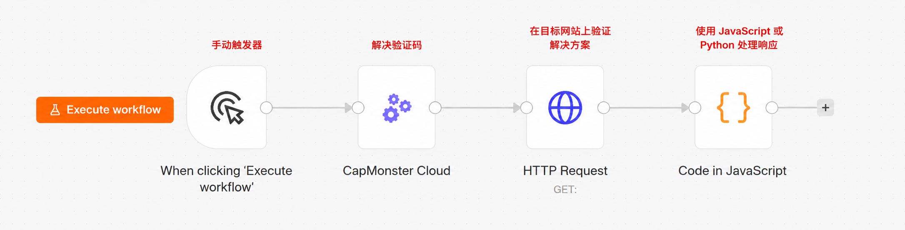
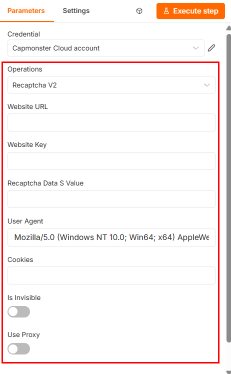
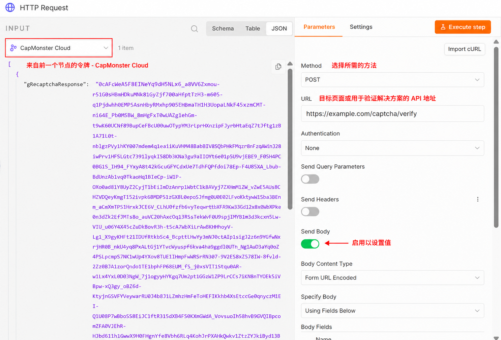
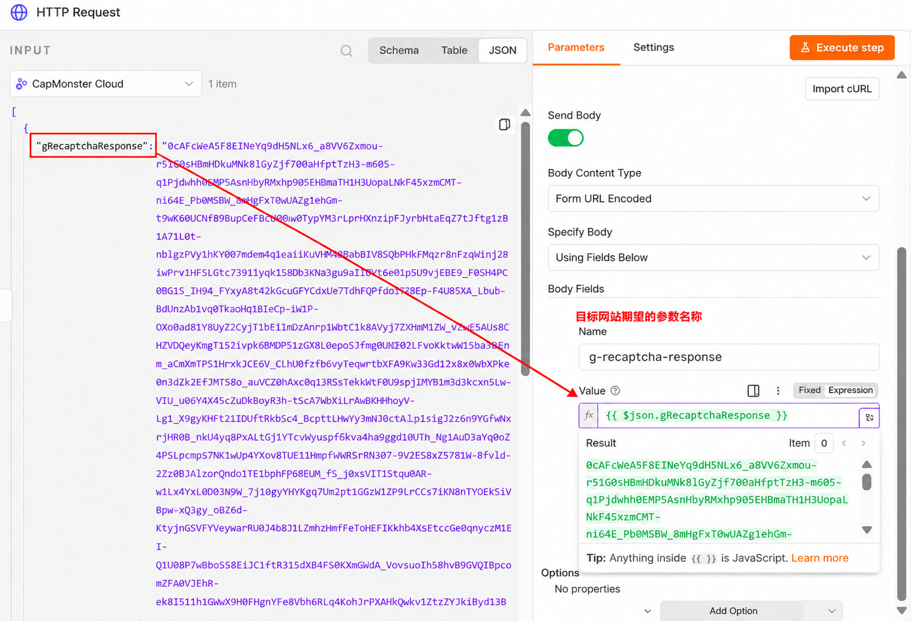
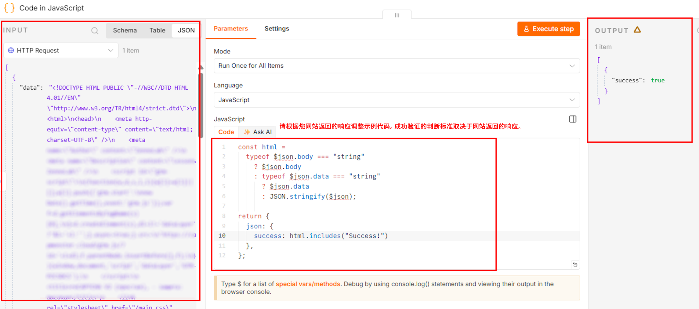

import BlogLink from '@theme/BlogLink';
import { ArticleHead } from '../../../../../src/theme/ArticleHead';

<ArticleHead slug="external-services/n8n" />

# 使用 CapMonster Cloud 在 n8n 中解决 CAPTCHA

n8n 是一个 workflow 自动化平台，可以通过相互连接的节点来构建自动化流程。每个节点执行一项独立操作，例如启动 workflow、发送 HTTP 请求、处理数据或连接外部服务。n8n 既可以在云端使用，也可以部署在您自己的服务器上。

CapMonster Cloud 可用于在 n8n workflow 中自动解决 CAPTCHA。该节点会将 CAPTCHA 参数发送到服务，接收令牌或其他解决结果，并将其传递给后续节点，例如提交表单、执行 API 请求或继续从网页收集数据。

一个基础 workflow 可以如下所示：



<BlogLink url="https://capmonster.cloud/zh/blog/ru-he-shi-yong-capmonster-cloud-zai-n8n-zhong-jie-jue-recaptcha-v2/"/>
<BlogLink url="https://capmonster.cloud/zh/blog/ru-he-shi-yong-capmonster-cloud-zai-n8n-zhong-jie-jue-recaptcha-v2/"/>

## 安装方式

### 从节点面板安装

1. 打开一个 workflow。
2. 点击 **Add first step...** 或 **+**。如有需要，可以将默认名称 `My workflow` 重命名，例如改为 `CapMonster Cloud workflow`。


3. 在 *Search nodes...* 字段中输入 "CapMonster Cloud"。
4. 从搜索结果中选择该节点。


5. 点击 **Install node**：


### 通过 npm 安装

此方式适用于 **self-hosted n8n**，并且需要访问部署该服务的服务器或计算机。安装软件包后，请重新启动 n8n，使 **CapMonster Cloud** 节点显示在节点面板中。

1. 停止正在运行的 n8n 实例。

2. 在服务器上打开终端。

3. 进入 n8n 自定义节点目录：

```bash
cd ~/.n8n/nodes
```

如果该目录尚不存在，请创建它：

```bash
mkdir -p ~/.n8n/nodes
cd ~/.n8n/nodes
```

4. 如果目录中没有 `package.json` 文件，请创建一个：

```bash
npm init -y
```

5. 安装 CapMonster Cloud 软件包：

```bash
npm install @zennolab_com/n8n-nodes-capmonstercloud
```

6. 启动或重新启动 n8n。

7. 打开 workflow，点击 **+**，然后查找 **CapMonster Cloud** 节点。

您可以使用以下命令检查已安装的软件包版本：

```bash
npm list @zennolab_com/n8n-nodes-capmonstercloud
```

:::warning 重要
不要使用 `-g` 参数全局安装该软件包。它必须位于实际使用该节点的 n8n 实例的自定义节点目录中。
:::

## 更新和卸载软件包

### 通过 n8n 界面

如果节点是从节点面板安装的：

1. 打开 **Settings** → **Community nodes**。


2. 找到 **CapMonster Cloud** 软件包。
3. 使用 `⋮` 按钮打开 **Options** 菜单。
4. 选择所需操作：
   * **Update package** – 安装可用的新版本；
   * **Uninstall package** – 卸载软件包。
5. 如有需要，请重新启动 n8n。

:::note
* 只有在有新版本可用时，才会显示 **Update package** 按钮。

* 卸载软件包后，包含 CapMonster Cloud 节点的现有 workflow 会被保留，但在重新安装软件包之前无法运行。
:::

### 通过 npm

```bash
cd ~/.n8n/nodes
```

要安装最新可用版本，请运行：

```bash
npm install @zennolab_com/n8n-nodes-capmonstercloud@latest
```

要卸载软件包，请运行：

```bash
npm uninstall @zennolab_com/n8n-nodes-capmonstercloud
```

更新或卸载软件包后，请重新启动 n8n。


:::warning 重要
卸载软件包后，包含 CapMonster Cloud 节点的现有 workflow 会被保留，但在重新安装软件包之前无法运行。
:::


## 配置 CapMonster Cloud 节点

**Triggers** 部分显示可用于启动 workflow 的方式：<br />

**On a Schedule** – 按指定计划自动启动 workflow。例如，可以按固定时间间隔、每天或根据 cron 表达式运行 workflow。*更多信息请参阅 n8n 文档：[Schedule Trigger](https://docs.n8n.io/integrations/builtin/core-nodes/n8n-nodes-base.scheduletrigger/)*。<br />

**On a Webhook call** – 当 HTTP 请求发送到 webhook URL 时启动 workflow。此方式适用于从外部应用程序、网站或浏览器自动化脚本传递 CAPTCHA 参数的场景。*更多信息请参阅 n8n 文档：[Webhook](https://docs.n8n.io/integrations/builtin/core-nodes/n8n-nodes-base.webhook/)*。<br />

:::note
消息 **No CapMonster Cloud Triggers available** 表示 CapMonster Cloud 节点无法自行启动 workflow。请将其添加在触发器或其他用于传递 CAPTCHA 参数的节点之后。
:::

如果 workflow 通过 webhook 启动，并且需要将结果返回给外部应用程序，可以使用 [Respond to Webhook](https://docs.n8n.io/integrations/builtin/core-nodes/n8n-nodes-base.respondtowebhook/) 节点。

典型的节点顺序如下：

```text
Trigger → CapMonster Cloud → 使用获取的结果
````

对于通过 webhook 启动的 workflow，节点顺序可以如下所示：

```text
Webhook → CapMonster Cloud → Respond to Webhook
```

**Actions** 部分包含所有可解决的 CAPTCHA 类型：


6. 选择所需的 CAPTCHA 类型。
7. 点击 **Create new credential**。


8. 在打开的窗口中输入您的 CapMonster Cloud API 密钥。
9. 将密钥粘贴到 **API Key** 字段中并保存。


10. 填写所有必填参数。

:::warning 重要
* 不要直接在 workflow 参数中传递 API 密钥，也不要将其发布在导出的 JSON 文件中。请将密钥保存在 n8n Credentials 中，并限制对凭据的访问。

* 某些 CAPTCHA 类型还需要代理。相关要求会在所选 CAPTCHA 类型的文档中说明。
:::



:::tip
* 参数的详细说明以及获取参数值的方法，请参阅 [CAPTCHA 类型](../../captchas) 部分。选择所需的 CAPTCHA 类型并打开对应文章。

* 当前 User-Agent 会自动设置。
:::

在 **Settings** 选项卡中，可以配置节点行为：

* **Always Output Data** – 即使结果为空也返回数据。
* **Execute Once** – 对所有输入数据仅执行一次节点。
* **Retry On Fail** – 发生错误时重新执行。
* **On Error** – 选择发生错误时要执行的操作。
* **Notes** – 为节点添加备注。
* **Display Note in Flow** – 在 workflow 图中显示备注。

通常可以保留这些设置不变。

11. 填写完所有字段后，点击 **Execute step**：


:::tip
* **Execute step** 仅运行当前选中的节点；

* **Execute workflow** 运行整个 workflow。
:::

如果任务成功完成，**OUTPUT** 面板中会显示一个包含解决结果的对象。例如，对于 reCAPTCHA v2，响应中会包含一个带有已获取令牌的字段：


需要将获取的响应传递给 workflow 中的下一个节点，并在向目标网站发送请求时使用。

:::warning 重要
解决结果可能只有有限的有效期，因此建议在收到后立即使用。
:::


## 常见使用场景

在下一步操作依赖 CAPTCHA 解决结果的 n8n workflow 中，可以使用 **CapMonster Cloud** 节点。

### 从网页收集数据

在收集公开数据时，网站可能会要求先完成 CAPTCHA，然后才显示页面或处理搜索请求。

典型的节点顺序如下：

```text
Trigger → HTTP Request → CapMonster Cloud → HTTP Request → 数据处理
```

workflow 可以执行以下操作：

1. 使用 **HTTP Request** 打开目标页面。
2. 获取 CAPTCHA 参数。
3. 将参数传递给 **CapMonster Cloud** 节点。
4. 获取令牌或其他解决结果。
5. 携带 CAPTCHA 结果重新向页面发送请求。
6. 使用 **HTML**、**Code** 或 **Edit Fields** 节点提取所需数据。
7. 将结果保存到文件、表格或数据库中。

### 提交网页表单

在提交表单之前需要获取 CAPTCHA 结果的场景中，可以使用该节点。

典型顺序如下：

```text
获取数据 → CapMonster Cloud → HTTP Request → 检查响应
```

例如，workflow 可以：

1. 从 webhook、表格或其他节点接收表单数据。
2. 解决 CAPTCHA。
3. 将获取的令牌添加到请求正文中。
4. 使用 **HTTP Request** 提交表单。
5. 检查网站或 API 的响应。

用于传递令牌的参数名称取决于目标网站的具体实现。

### 使用 API

某些 API 要求在请求中同时提供 CAPTCHA 结果和其他参数。

典型顺序如下：

```text
Trigger → CapMonster Cloud → HTTP Request → Code
```

运行 **CapMonster Cloud** 节点后，可以根据 API 要求，将结果传递到 JSON 请求正文、查询参数或请求头中。

例如：

```json
{
  "captchaToken": "{{$json.solution.gRecaptchaResponse}}",
  "action": "submit"
}
```

结果结构和令牌路径取决于所选的 CAPTCHA 类型。

### 浏览器自动化

解决结果可以传递给外部浏览器自动化脚本，例如 Playwright、Puppeteer、Selenium 或 ZennoPoster。

示例顺序：

```text
Webhook → CapMonster Cloud → HTTP Request → 浏览器自动化脚本
```

在这种情况下，n8n 可以：

1. 从外部脚本接收 CAPTCHA 参数。
2. 在 CapMonster Cloud 中创建任务。
3. 通过 webhook 或 API 返回结果。
4. 将令牌传递到浏览器会话。
5. 继续执行脚本。

采用这种方式时，必须在获取 CAPTCHA 参数的同一个浏览器会话中使用结果。

### 批量处理

如果输入节点返回多个项目，n8n 可以为每个项目创建一个单独的任务。

例如：

```text
Google Sheets → Loop Over Items → CapMonster Cloud → HTTP Request
```

这种 workflow 适合按顺序处理页面或任务列表。

进行批量处理时，建议：

* 限制同时运行的任务数量；
* 使用 **Loop Over Items** 或其他队列管理机制；
* 分别处理每个项目的错误；
* 如果需要为每个输入项目解决 CAPTCHA，请不要启用 **Execute Once**；
* 考虑 CapMonster Cloud 账户的限制和余额。


## 使用 HTTP Request 节点

要使用获取的解决结果，请在 **CapMonster Cloud** 节点之后添加一个 **HTTP Request** 节点。

1. 点击 CapMonster Cloud 节点旁边的 **+**。
2. 查找并选择 **HTTP Request**。
3. 指定请求方法以及目标页面或 API 地址。



4. 如有需要，请添加请求头、查询参数、cookies 和请求正文。

:::warning 重要
如果目标网站使用会话，请使用打开页面时相同的 cookies、代理、请求头和其他参数发送 CAPTCHA 结果。更改会话参数可能导致结果被拒绝。
:::

5. 在用于传递 CAPTCHA 结果的字段中，使用 **Expression** 传递上一个节点的值。

例如：



6. 提交 CAPTCHA 结果后，您将收到目标页面或 API 的响应。响应格式取决于所使用的 endpoint：可能是 HTML 页面、JSON 对象或其他数据类型。


**补充说明：**

要自动检查结果，可以在 **HTTP Request** 后添加一个 **Code** 节点。

:::note
验证方式取决于目标网站返回的响应。在 **Code** 节点中，可以检查 HTTP 状态、重定向后的最终 URL、HTML 中是否包含预期元素、是否设置了 cookie，或其他表明请求已成功处理的标志。
:::

### 检查 HTML 响应

例如，如果验证成功后页面上显示文本 "Success!"，可以在 **Code** 节点中使用以下代码自动检查结果：

```js
const html =
  typeof $json.body === "string"
    ? $json.body
    : typeof $json.data === "string"
      ? $json.data
      : JSON.stringify($json);

return {
  json: {
    success: html.includes("Success!")
  },
};
```



### 检查 JSON 响应

如果 API 返回 JSON，请直接检查所需字段。例如，对于以下响应：

```json
{
  "success": true,
  "status": "verified"
}
```

可以使用以下代码：

```js
return {
  json: {
    success:
      $json.success === true &&
      $json.status === "verified"
  },
};
```

请根据实际使用的 API 返回内容，替换字段名称和预期值。

## 导出和迁移 workflow

导出 workflow 时不会包含凭据。将 workflow 导入另一个 n8n 实例后，需要重新创建 **Credentials**，并在 CapMonster Cloud 节点中选择这些凭据。

## 调试 workflow

要检查节点之间的数据，可以：

* 打开 **OUTPUT** 选项卡；
* 使用 **Pin data** 临时固定结果；
* 添加 **Edit Fields** 节点以转换数据结构；
* 使用 **Code** 节点检查并规范化响应；
* 在 **Executions** 部分查看执行历史记录。

## 错误处理

如果节点执行失败：

1. 打开 **OUTPUT** 选项卡。
2. 检查错误代码和错误消息。
3. 确认 CAPTCHA 参数填写正确。
4. 检查账户余额和 API 密钥。
5. 确认代理可用，并且适用于所选任务类型。
6. 如果是临时错误，请在 **Settings** 选项卡中启用 **Retry On Fail**。


| 问题 | 可能原因 |
| --- | --- |
| 节点未显示 | 软件包未安装，或 n8n 未重新启动 |
| 授权错误 | API 密钥无效 |
| 任务执行时间过长 | CAPTCHA 较复杂，或代理运行不稳定 |
| 网站拒绝令牌 | 令牌已过期，或会话已发生变化 |
| 未返回结果 | CAPTCHA 参数不正确 |
<br />


:::tip
有关 CAPTCHA 解决错误的说明，请参阅[专门章节](../../api/api-errors)。
:::
