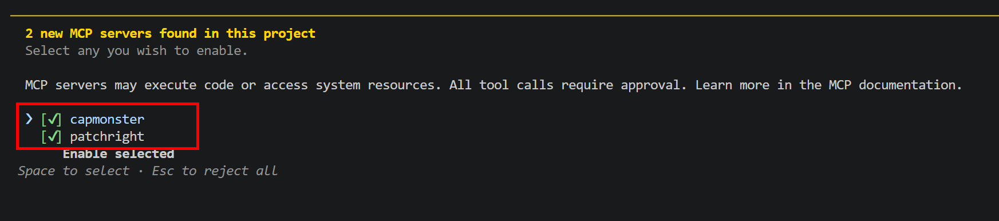
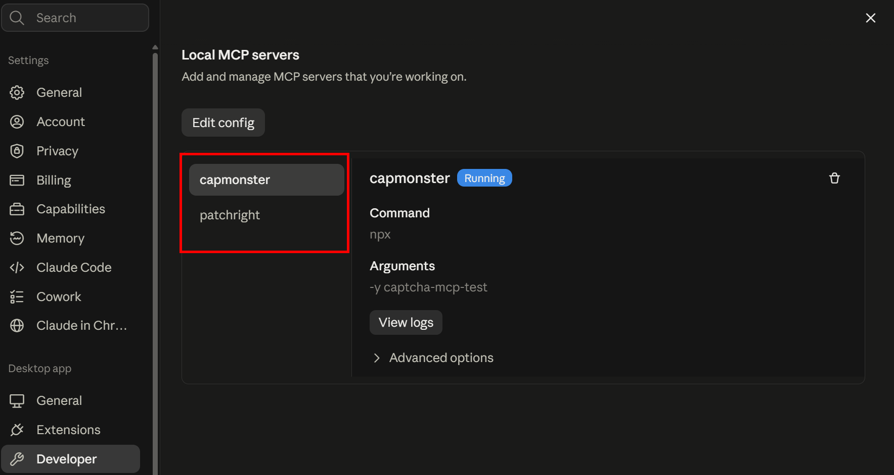

import { ArticleHead } from '../../../../../src/theme/ArticleHead';
import Tabs from '@theme/Tabs';
import TabItem from '@theme/TabItem';
import RemotePrompt from '@site/src/components/RemotePrompt';

<ArticleHead slug="mcp" />

# MCP


**Model Context Protocol (MCP)** 允许 AI 代理连接外部工具和服务。

CapMonster Cloud MCP 为代理提供处理 CAPTCHA 所需的工具。


<details style={{ fontWeight: 'normal' }}>
  <summary style={{ fontWeight: 'bold' }}>CapMonster Cloud MCP 的工作原理</summary>

借助 MCP，AI 代理可以识别 CAPTCHA 类型和任务参数、访问 CapMonster Cloud 文档、创建任务并获取识别结果。代理的最终目标不仅是解决 CAPTCHA，还要将这一流程正确集成到用户项目中。

处理网页时，可以将 CapMonster Cloud MCP 与浏览器 MCP [`capmonster-mcp-patchright`](https://github.com/CapMonsterCloud/capmonster-mcp-patchright) 配合使用：

```text
AI 代理
├── capmonster → CapMonster Cloud API
└── patchright → 浏览器
```

`capmonster` 负责与 CapMonster Cloud 交互。`patchright` 打开页面，帮助识别 CAPTCHA 类型、获取其参数并应用已完成的解决结果。随后，代理会将已验证的流程集成到项目代码中。

[SKILL.md](https://github.com/CapMonsterCloud/capmonster-mcp-captcha-solver/blob/main/capmonster_agent/SKILL.md) 所覆盖的典型流程：

1. 获取目标页面 URL。

2. 识别 CAPTCHA 类型。

3. 查看文档并确定必需参数。

4. 从页面获取参数。

5. 向 CapMonster Cloud 发送请求。

6. 获取结果。

7. 在页面上应用结果，并将该流程集成到用户代码中。

:::info 注意
仅在您有权执行自动化操作的资源上使用自动化，例如您自己的网站、测试环境或演示页面。
:::

</details>

## 快速开始

:::tip 为 AI 代理复制 prompt
根据您的环境选择相应的 prompt — **Python / PyPI** 或 **TypeScript / npm** — 然后点击 **复制 prompt**。接着将其粘贴到 Claude Code、Codex 或其他 AI 代理中。代理会识别客户端和操作系统，配置 `capmonster` 和 `patchright`，并检查它们是否可以正常工作。

如果自动配置失败，请按照[说明](#手动配置)手动配置 MCP。

:::

<Tabs groupId="quick-start-runtime">
<TabItem value="quick-start-python" label="Python / PyPI" default>

<RemotePrompt url="https://raw.githubusercontent.com/CapMonsterCloud/capmonster-mcp-captcha-solver/main/capmonster_agent/PROMPT.md" />

</TabItem>

<TabItem value="quick-start-npm" label="TypeScript / npm">

<RemotePrompt url="https://raw.githubusercontent.com/CapMonsterCloud/capmonster-mcp-captcha-solver/main/capmonster_agent/PROMPT_JS.md" />

</TabItem>
</Tabs>

---

验证完成后，将目标页面 URL、项目文件以及 CAPTCHA 出现的条件提供给代理。代理不仅应在浏览器中验证解决方案，还应将可用的 CapMonster Cloud 流程集成到您的代码中。

:::info 配置期间的权限
代理可能会请求权限以安装依赖项、修改 MCP 配置、运行命令、访问网络或控制浏览器。请检查每个请求，并通过 **Allow** 或 **Approve** 确认预期操作。

在 Codex 中，可以使用 `/permissions` 命令检查或更改当前权限模式。
:::

无需在每个任务之前重复发送 prompt。在当前会话中加载 [SKILL.md](https://github.com/CapMonsterCloud/capmonster-mcp-captcha-solver/blob/main/capmonster_agent/SKILL.md) 后，您可以继续提供新的 URL、CAPTCHA 出现条件和集成任务。

---

## 手动配置

您可以通过 Desktop 应用、终端、IDE 或代码编辑器与代理配合使用。若要使用完整流程，建议同时连接两个服务器：`capmonster` 和 `patchright`。

请选择工作方式 — CLI 代理或 Desktop 应用。每个选项卡都包含所选方式的完整配置步骤。

<Tabs groupId="mcp-work-mode">
<TabItem value="cli" label="CLI 代理" default>

<span style={{ fontSize: "1.2em" }}>**步骤 1. 安装 AI 代理**</span>

<br />您需要安装 AI 代理或其他支持 MCP 的应用。

如果代理已安装，请确认它可以正常启动并且系统能够找到该命令。

例如，对于 Claude Code：

```bash
claude --version
```

对于 Codex：

```bash
codex --version
```

如果找不到命令，请按照官方说明安装所选 AI 代理：[Claude Code](https://code.claude.com/docs/en/setup) 或 [Codex](https://developers.openai.com/codex/cli)。


安装后，请确认代理能够正常启动并支持连接本地 MCP 服务器。

:::tip 安装后找不到代理
如果终端或 IDE 无法识别已安装的代理，请完全关闭并重新打开终端和开发环境。已经运行的应用可能仍在使用旧的 `PATH` 值，因此在重启前无法识别新命令。
:::

<span style={{ fontSize: "1.2em" }}>**步骤 2. 安装 Node.js，并在需要时安装 uv**</span>

<br />运行 MCP 服务器需要 `npx`，根据所选 CapMonster MCP 实现，还可能需要 `uvx`。

**Node.js 和 npx**

:::warning 重要：
`patchright` 通过 `npx` 运行，因此无论选择哪种 CapMonster MCP 实现，都需要安装 Node.js。
:::

检查安装：

```bash
node --version
npm --version
npx --version
```

如果这些命令不可用，请安装 Node.js。

`npm` 和 `npx` 通常会随 Node.js 一起安装，因此不需要单独安装 `npx`。

建议使用 Node.js 18 或更高版本。

**uv 和 uvx**

如果您计划使用 Python/PyPI 版本的 `capmonster-mcp`，还需要安装 `uvx`。

检查是否可用：

```bash
uvx --version
```

如果命令不可用，请安装 `uv`。

安装 `uv` 后，`uvx` 命令也会可用。

检查：

```bash
uv --version
uvx --version
```

:::info 注意
如果使用 TypeScript/npm 版本的 `capmonster-mcp`，则无需安装 `uv` 或 `uvx`。
:::

<span style={{ fontSize: "1.2em" }}>**步骤 3. 获取 API 密钥**</span>

<br />`capmonster` 需要 CapMonster Cloud API 密钥。

该密钥通过以下环境变量传递给 MCP 服务器：

```text
CM_API_KEY
```

<span style={{ fontSize: "1.2em" }}>**步骤 4. 选择 CapMonster MCP 实现**</span>


<br />[`capmonster-mcp`](https://github.com/CapMonsterCloud/capmonster-mcp-captcha-solver) 提供两种功能等效的实现。

<Tabs>
<TabItem value="npm" label="npm – TypeScript" default>

此版本使用 [npm 包 `capmonster-mcp`](https://www.npmjs.com/package/capmonster-mcp) 和 `npx`。

使用以下命令运行 MCP 服务器：

```bash
npx -y capmonster-mcp
```

</TabItem>

<TabItem value="python" label="PyPI – Python">

此版本使用 [PyPI 包 `capmonster-mcp`](https://pypi.org/project/capmonster-mcp/) 和 `uvx`。

使用以下命令运行 MCP 服务器：

```bash
uvx capmonster-mcp
```

</TabItem>
</Tabs>

无需将 `capmonster-mcp` 安装为项目依赖。默认情况下，MCP 客户端可以通过 `npx` 或 `uvx` 直接运行已发布的包。

<span style={{ fontSize: "1.1em" }}>**通过 npm 和 pip 安装包**</span>

<br />默认情况下，无需预先安装 MCP 包：可以直接通过 `npx` 或 `uvx` 运行。如果希望提前安装，请使用以下任一方式。

<Tabs>
<TabItem value="npm-install" label="npm" default>

**CapMonster Cloud MCP**

使用 npm 安装 [capmonster-mcp](https://www.npmjs.com/package/capmonster-mcp)：

```bash
npm i capmonster-mcp
```

可以使用以下命令检查安装：

```bash
npm list capmonster-mcp
```

安装后，使用 `npx` 运行 `capmonster`：

```json
{
  "command": "npx",
  "args": ["capmonster-mcp"],
  "env": {
    "CM_API_KEY": "YOUR_API_KEY"
  }
}
```

**Patchright MCP**

如果您计划使用浏览器打开页面、获取 CAPTCHA 参数并应用解决结果，请安装 [`capmonster-mcp-patchright`](https://www.npmjs.com/package/capmonster-mcp-patchright)。源代码可在[官方仓库](https://github.com/CapMonsterCloud/capmonster-mcp-patchright)中查看：

```bash
npm i capmonster-mcp-patchright
```

可以使用以下命令检查安装：

```bash
npm list capmonster-mcp-patchright
```

预先安装 `capmonster-mcp-patchright` 不是必需的。在下面的所有示例中，也可以直接使用以下命令运行：

```bash
npx -y capmonster-mcp-patchright
```

</TabItem>

<TabItem value="pypi-install" label="pip / PyPI">

Python 版本的 `capmonster-mcp` 已发布到 [PyPI](https://pypi.org/project/capmonster-mcp/)，需要 Python 3.11 或更高版本。

使用 `pip` 安装 `capmonster-mcp`：

```bash
python -m pip install capmonster-mcp
```

可以使用以下命令检查安装：

```bash
python -m pip show capmonster-mcp
```

安装后，可以为 `capmonster` 使用相同的 CLI 命令：

```json
{
  "command": "capmonster-mcp",
  "args": [],
  "env": {
    "CM_API_KEY": "YOUR_API_KEY"
  }
}
```

</TabItem>
</Tabs>

如果 npm 或 Python 包是在 MCP 客户端启动后安装的，请在安装完成后完全重启 MCP 客户端。


<br />
<span style={{ fontSize: "1.2em" }}>**步骤 5. 配置 MCP 客户端**</span>

<br />选择您使用的 CLI 客户端。

<Tabs>
<TabItem value="claude-code-cli" label="Claude Code" default>

对于共享项目配置，请在项目根目录创建 `.mcp.json` 文件，并将 `capmonster` 和 `patchright` 添加到其中。

:::tip 
这并不是唯一可用的位置。Claude Code 支持不同的配置作用域；用户级或项目级设置也可以存储在 `.claude.json` 中，或通过 Claude Code 命令添加。如果由代理配置 MCP，请允许它自动确定合适的作用域和配置文件。
:::

<Tabs>
<TabItem value="claude-cli-npm" label="TypeScript / npm" default>

```json
{
  "mcpServers": {
    "capmonster": {
      "command": "npx",
      "args": ["-y", "capmonster-mcp"],
      "env": {
        "CM_API_KEY": "YOUR_API_KEY"
      }
    },
    "patchright": {
      "command": "npx",
      "args": ["-y", "capmonster-mcp-patchright"]
    }
  }
}
```

</TabItem>

<TabItem value="claude-cli-python" label="Python / PyPI">

```json
{
  "mcpServers": {
    "capmonster": {
      "command": "uvx",
      "args": ["capmonster-mcp"],
      "env": {
        "CM_API_KEY": "YOUR_API_KEY"
      }
    },
    "patchright": {
      "command": "npx",
      "args": ["-y", "capmonster-mcp-patchright"]
    }
  }
}
```

</TabItem>
</Tabs>

重启 Claude Code 后，使用 `/mcp` 命令检查连接。

 

</TabItem>

<TabItem value="codex-cli" label="Codex CLI">

Codex CLI、Codex IDE 扩展和 ChatGPT Desktop 使用同一套 MCP 配置。默认情况下，该配置存储在 `config.toml` 文件中：

- Windows：`%USERPROFILE%\.codex\config.toml`；
- macOS/Linux：`~/.codex/config.toml`。

要连接 MCP 服务器，请使用 `codex mcp add` 命令。Codex 会自动将设置保存到 `config.toml`。`capmonster` 和 `patchright` 需要分别添加，请为每个服务器单独执行对应命令。

<Tabs groupId="codex-mcp-os">
<TabItem value="codex-mcp-windows" label="Windows" default>

打开 PowerShell 或 IDE 中的集成终端。

对于 TypeScript/npm 版本的 `capmonster`，执行：

```powershell
codex mcp add capmonster --env CM_API_KEY=YOUR_API_KEY -- npx.cmd -y capmonster-mcp
```

对于 Python/PyPI 版本，请改为执行：

```powershell
codex mcp add capmonster --env CM_API_KEY=YOUR_API_KEY -- uvx capmonster-mcp
```

然后，无论选择哪种实现，都添加 `patchright`：

```powershell
codex mcp add patchright -- npx.cmd -y capmonster-mcp-patchright
```

在 Windows 上使用 `npx.cmd`，可以避免 MCP 服务器启动受 PowerShell 对 `npx.ps1` 的执行策略影响。

</TabItem>

<TabItem value="codex-mcp-macos-linux" label="macOS / Linux">

打开终端。

对于 TypeScript/npm 版本的 `capmonster`，执行：

```bash
codex mcp add capmonster --env CM_API_KEY=YOUR_API_KEY -- npx -y capmonster-mcp
```

对于 Python/PyPI 版本，请改为执行：

```bash
codex mcp add capmonster --env CM_API_KEY=YOUR_API_KEY -- uvx capmonster-mcp
```

然后，无论选择哪种实现，都添加 `patchright`：

```bash
codex mcp add patchright -- npx -y capmonster-mcp-patchright
```

</TabItem>
</Tabs>

将 `YOUR_API_KEY` 替换为您的 CapMonster Cloud API 密钥。不要将真实密钥添加到代理消息、代码示例或公共仓库中。

检查两个服务器是否都已添加：

```bash
codex mcp list
```

<details style={{ fontWeight: 'normal' }}>
  <summary style={{ fontWeight: 'bold' }}>另一种方式：通过 config.toml 配置服务器</summary>

对于受信任的项目，也可以将配置保存在项目根目录的 `.codex/config.toml` 中。只有在项目被标记为受信任后，项目级配置文件才会生效。

<Tabs>
<TabItem value="codex-cli-npm" label="TypeScript / npm" default>

```toml
[mcp_servers.capmonster]
command = "npx"
args = ["-y", "capmonster-mcp"]

[mcp_servers.capmonster.env]
CM_API_KEY = "YOUR_API_KEY"

[mcp_servers.patchright]
command = "npx"
args = ["-y", "capmonster-mcp-patchright"]
```

</TabItem>

<TabItem value="codex-cli-python" label="Python / PyPI">

```toml
[mcp_servers.capmonster]
command = "uvx"
args = ["capmonster-mcp"]

[mcp_servers.capmonster.env]
CM_API_KEY = "YOUR_API_KEY"

[mcp_servers.patchright]
command = "npx"
args = ["-y", "capmonster-mcp-patchright"]
```

</TabItem>
</Tabs>

在 Windows 上，如果运行 `npx.ps1` 时出现问题，请将 `command = "npx"` 改为 `command = "npx.cmd"`。如果首次下载包耗时过长，可以在每个服务器配置中添加 `startup_timeout_sec = 60`。

</details>

完全重启 Codex 或 IDE。在新会话中运行 `/mcp`，确认 `capmonster` 和 `patchright` 已连接并提供相应工具。详情请参阅 [Codex MCP 文档](https://developers.openai.com/codex/mcp)。

 

</TabItem>
</Tabs>

将 `YOUR_API_KEY` 替换为您的 CapMonster Cloud API 密钥，然后重启 MCP 客户端。

<span style={{ fontSize: "1.2em" }}>**步骤 6. 将 prompt 发送给代理**</span>

<br />打开新的聊天或会话，并发送[快速开始](#快速开始)部分中的 prompt。验证完成后，提供页面 URL、项目文件以及 CAPTCHA 出现的条件。

配置期间，仅批准符合预期的权限请求。在当前会话中，无需在每个任务前重复发送 prompt。


</TabItem>

<TabItem value="desktop" label="Desktop 应用">

CapMonster Cloud MCP 不仅可以通过 CLI 代理使用，也可以通过支持本地 MCP 服务器的 Desktop 应用使用。

例如：

- **Claude Desktop**；
- **带 Codex 的 ChatGPT Desktop**；
- 其他支持本地 STDIO MCP 服务器的 Desktop 客户端。

在这种情况下，无需从终端启动 AI 代理。MCP 服务器可直接在应用中或其配置文件中进行设置。

<span style={{ fontSize: "1.2em" }}>**步骤 1. 安装 Desktop 应用**</span>

<br />安装所选的 MCP 兼容 Desktop 客户端：

- [Claude Desktop](https://claude.com/download)；
- [ChatGPT Desktop](https://chatgpt.com/download)。

如果应用已经安装，请确认使用的是最新版本。

<span style={{ fontSize: "1.2em" }}>**步骤 2. 获取 API 密钥并安装运行环境**</span>

<br />要使用 `capmonster`，请获取 CapMonster Cloud API 密钥。在配置过程中，需要通过 `CM_API_KEY` 环境变量传递该密钥。

运行 `patchright` 需要 Node.js 和 `npx`。

检查安装：

```bash
node --version
npm --version
npx --version
```

如果这些命令不可用，请安装 Node.js。`npm` 和 `npx` 通常会随 Node.js 一起安装。

如果使用 Python/PyPI 版本的 `capmonster`，还需要安装 `uvx`。

检查：

```bash
uv --version
uvx --version
```

如果 `uvx` 不可用，请安装 `uv`。

:::info 注意
对于 TypeScript/npm 版本的 `capmonster-mcp`，无需安装 `uv` 或 `uvx`。
:::
<br />
<span style={{ fontSize: "1.2em" }}>**步骤 3. 配置 MCP 服务器**</span>

<br />

<br /><Tabs>
<TabItem value="claude-desktop" label="Claude Desktop" default>

Claude Desktop 使用独立的本地 MCP 配置文件 — `claude_desktop_config.json`。

在 Claude Desktop 中打开 **File → Settings → Developer**，然后点击 **Edit Config**。在打开的文件中添加 `capmonster` 和 `patchright` 服务器。

<Tabs>
<TabItem value="claude-npm" label="TypeScript / npm" default>

```json
{
  "mcpServers": {
    "capmonster": {
      "command": "npx",
      "args": ["-y", "capmonster-mcp"],
      "env": {
        "CM_API_KEY": "YOUR_API_KEY"
      }
    },
    "patchright": {
      "command": "npx",
      "args": ["-y", "capmonster-mcp-patchright"]
    }
  }
}
```

</TabItem>

<TabItem value="claude-python" label="Python / PyPI">

```json
{
  "mcpServers": {
    "capmonster": {
      "command": "uvx",
      "args": ["capmonster-mcp"],
      "env": {
        "CM_API_KEY": "YOUR_API_KEY"
      }
    },
    "patchright": {
      "command": "npx",
      "args": ["-y", "capmonster-mcp-patchright"]
    }
  }
}
```

</TabItem>
</Tabs>

将 `YOUR_API_KEY` 替换为您的 CapMonster Cloud API 密钥，保存配置并完全重启 Claude Desktop。

重启后，点击输入框旁边的 **+**，然后打开 **Connectors**。确认列表中显示 `capmonster` 和 `patchright`。您也可以在 Claude Desktop 的开发者设置中查看连接状态和启动错误。



:::info 注意
通过 `claude_desktop_config.json` 在 Claude Desktop 中配置的本地 MCP 服务器，与 Claude Code 的项目级和用户级 MCP 配置相互独立。
:::

</TabItem>

<TabItem value="chatgpt-desktop" label="ChatGPT Desktop / Codex">

可以通过 ChatGPT Desktop、Codex CLI 和 Codex IDE 扩展共同使用的 `config.toml` 文件手动配置 MCP 服务器。

##### 1. 打开或创建配置文件

<Tabs groupId="codex-config-os">
<TabItem value="codex-config-windows" label="Windows" default>

文件位置：

```text
%USERPROFILE%\.codex\config.toml
```

要创建目录并使用记事本打开文件，请在 PowerShell 中执行：

```powershell
New-Item -ItemType Directory -Force "$env:USERPROFILE\.codex"
notepad "$env:USERPROFILE\.codex\config.toml"
```

如果系统提示创建新文件，请确认。请确保文件保存为 `.toml` 扩展名，而不是 `.toml.txt`。

</TabItem>

<TabItem value="codex-config-unix" label="macOS / Linux">

文件位置：

```text
~/.codex/config.toml
```

要创建目录并使用 `nano` 打开文件，请执行：

```bash
mkdir -p ~/.codex
nano ~/.codex/config.toml
```

</TabItem>
</Tabs>

##### 2. 添加 MCP 服务器配置

将以下任一配置粘贴到 `config.toml` 中。如果文件已经包含其他设置，请不要删除它们 — 只需在文件末尾添加 `mcp_servers` 配置块。

<Tabs groupId="codex-config-runtime">
<TabItem value="codex-npm" label="TypeScript / npm" default>

```toml
[mcp_servers.capmonster]
command = "npx"
args = ["-y", "capmonster-mcp"]

[mcp_servers.capmonster.env]
CM_API_KEY = "YOUR_API_KEY"

[mcp_servers.patchright]
command = "npx"
args = ["-y", "capmonster-mcp-patchright"]
```

:::info Windows
如果 PowerShell 策略阻止 `npx` 运行，请为两个服务器都指定 `command = "npx.cmd"`。
:::

</TabItem>

<TabItem value="codex-python" label="Python / PyPI">

```toml
[mcp_servers.capmonster]
command = "uvx"
args = ["capmonster-mcp"]

[mcp_servers.capmonster.env]
CM_API_KEY = "YOUR_API_KEY"

[mcp_servers.patchright]
command = "npx"
args = ["-y", "capmonster-mcp-patchright"]
```

:::info Windows
如果 PowerShell 策略阻止 `npx` 运行，请在 `mcp_servers.patchright` 部分指定 `command = "npx.cmd"`。
:::

</TabItem>
</Tabs>

将 `YOUR_API_KEY` 替换为您的 CapMonster Cloud API 密钥并保存文件。

##### 3. 重启应用

完全退出 ChatGPT Desktop 或 Codex，然后重新打开应用。

在新聊天中运行：

```text
/mcp
```

确认列表中显示已连接的 `capmonster` 和 `patchright` 服务器。

</TabItem>
</Tabs>

<span style={{ fontSize: "1.2em" }}>**步骤 4. 将 prompt 发送给代理**</span>

<br />打开新的聊天，并发送[快速开始](#快速开始)部分中的 prompt。验证完成后，提供页面 URL、CAPTCHA 出现条件和项目文件。

配置期间，仅批准符合预期的权限请求。在当前会话中，无需在每个任务前重复发送 prompt。

:::info 注意
Desktop 方式与 CLI 方式的主要区别在于 MCP 服务器的连接方式。工作流程和初始 prompt 保持不变。
:::

</TabItem>
</Tabs>

---

## 可用工具

连接 MCP 服务器后，相关工具会自动提供给 AI 代理。通常无需手动选择 — 代理会根据当前任务调用所需工具。

### CapMonster Cloud

`capmonster-mcp` 提供以下工具：

- `get_supported_tasks` — 返回 CapMonster Cloud 支持的任务类型；
- `get_task_parameters(task_type)` — 返回所选任务类型的参数和解决方案结构；
- `get_docs(url, offset, limit, section)` — 加载 CapMonster Cloud 文档；
- `create_task(task)` — 创建任务并返回 `taskId`；
- `get_task_result(task_id)` — 单次检查任务状态；
- `get_task_result_wait(task_id, timeout_seconds, poll_interval_seconds)` — 自动等待任务完成；
- `get_actual_user_agent()` — 返回当前 Windows User-Agent；
- `get_balance()` — 返回 CapMonster Cloud 账户余额。

### Patchright

`capmonster-mcp-patchright` 提供浏览器交互工具。代理通过 MCP 客户端访问这些工具，并自动选择所需操作。

当前工具列表可在[官方仓库](https://github.com/CapMonsterCloud/capmonster-mcp-patchright)和 [`capmonster-mcp-patchright` npm 包页面](https://www.npmjs.com/package/capmonster-mcp-patchright)中查看。

---

## 故障排除

:::tip 让代理诊断问题
如果配置无法正常工作，请将错误信息发送给代理。代理可以检查运行环境、启动命令、用户和项目 MCP 配置，并建议或应用所需修复。
:::

<details style={{ fontWeight: 'normal' }}>
  <summary style={{ fontWeight: 'bold' }}>MCP 服务器无法启动</summary>

确认配置中的命令在 MCP 客户端运行的同一环境中可用：

<Tabs>
<TabItem value="troubleshooting-npm" label="TypeScript / npm" default>

```bash
node --version
npx --version
npx -y capmonster-mcp
```

</TabItem>

<TabItem value="troubleshooting-python" label="Python / PyPI">

```bash
uvx --version
uvx capmonster-mcp
```

</TabItem>
</Tabs>

如果命令启动后没有任何输出，这不一定表示出错：STDIO MCP 服务器正在等待客户端连接。可以使用 `Ctrl+C` 停止测试运行。

还请确认：

- JSON 配置中没有注释、多余的尾随逗号或未闭合的括号；

- `mcpServers`、`command`、`args` 和 `env` 字段名称拼写正确；

- 修改配置后已完全重启 MCP 客户端；

- 通过 `npx` 或 `uvx` 下载包时未被网络、代理、防病毒软件或企业策略阻止。

</details>

<details style={{ fontWeight: 'normal' }}>
  <summary style={{ fontWeight: 'bold' }}>安装包后找不到 <code>capmonster-mcp</code> 命令</summary>

预先安装的 CLI 命令必须存在于启动 MCP 客户端的进程 `PATH` 中。

检查命令位置：

<Tabs>
<TabItem value="command-path-windows" label="Windows" default>

```powershell
where.exe capmonster-mcp
```

</TabItem>

<TabItem value="command-path-unix" label="macOS / Linux">

```bash
which capmonster-mcp
```

</TabItem>
</Tabs>

如果终端可以找到该命令，但 Desktop 应用无法找到，请完全关闭并重新打开应用。如有必要，请在 `command` 字段中指定可执行文件的完整路径。

</details>

<details style={{ fontWeight: 'normal' }}>
  <summary style={{ fontWeight: 'bold' }}><code>capmonster</code> 或 <code>patchright</code> 工具未显示</summary>

请让代理检查当前会话从何处加载 MCP 配置。具体位置取决于客户端、配置作用域以及服务器的连接方式：

- 在 Claude Code 中，服务器可以在项目级或用户级配置；配置可能存储在 `.mcp.json`、`.claude.json` 中，也可能通过 Claude Code 命令管理；

- Claude Desktop 使用 `claude_desktop_config.json`；

- Codex 使用 `~/.codex/config.toml`、`%USERPROFILE%\.codex\config.toml` 或项目级 `.codex/config.toml`；

- 在 ChatGPT Desktop 中，也可以通过 MCP 设置添加本地服务器。

修复配置后，请完全重启客户端并打开新会话。在 Claude Code 中，可以使用 `/mcp` 检查连接；在 Codex 中，可以使用 `/mcp` 或 `codex mcp list`。

</details>

<details style={{ fontWeight: 'normal' }}>
  <summary style={{ fontWeight: 'bold' }}><code>get_balance</code> 返回错误</summary>

请让代理检查 `capmonster` 配置。通常需要确认：

- `CM_API_KEY` 变量中包含有效的 CapMonster Cloud API 密钥；

- 已将占位值 `YOUR_API_KEY` 替换为实际密钥；

- 密钥传递在 `capmonster` 服务器的 `env` 配置块中，而不是 `patchright` 中。

更改密钥后，请重启 MCP 客户端。随后，代理可以再次检查连接和余额。

如果余额为零，请先充值再创建任务。

</details>

<details style={{ fontWeight: 'normal' }}>
  <summary style={{ fontWeight: 'bold' }}><code>get_docs</code> 无法加载文档</summary>

请让代理检查 MCP 客户端是否可以访问 `https://docs.capmonster.cloud/`，以及是否能够加载以下文件：

```text
https://docs.capmonster.cloud/llms.txt
```

如果文档暂时不可用，或者需要进一步验证任务参数，代理可以使用 API 规范：

```text
https://api.capmonster.cloud/docs/swagger-ui/spec.js
```

</details>

<details style={{ fontWeight: 'normal' }}>
  <summary style={{ fontWeight: 'bold' }}><code>patchright</code> 无法打开页面</summary>

检查 `node`、`npx` 和启动命令：

```bash
npx -y capmonster-mcp-patchright
```

如果页面需要代理、User-Agent 或 locale，请将这些参数提供给代理。代理可以在通过 `patchright` 启动浏览器时使用这些参数。

</details>

<details style={{ fontWeight: 'normal' }}>
  <summary style={{ fontWeight: 'bold' }}>任务返回错误或网站拒绝解决结果</summary>

请将错误信息和 CAPTCHA 出现条件提供给代理。进行诊断时，代理可以：

1. 检查是否使用了受支持的任务类型；

2. 获取当前参数和解决方案结构；

3. 打开所选 CAPTCHA 类型的文档；

4. 在重新加载页面或再次触发 CAPTCHA 后重新获取动态参数；

5. 对于与会话绑定的 CAPTCHA，检查 User-Agent、代理、cookies、请求头和 Client Hints 是否保持一致；

6. 确认结果以该 CAPTCHA 类型所要求的格式进行应用。

不要使用已过期的 `challenge`、`token`、`data`、`blob` 或其他一次性参数。

`ERROR_INVALID_TASK` 通常表示参数无效或已过期。`ERROR_CAPTCHA_UNSOLVABLE` 可能是临时错误 — 代理可以检查输入数据并创建新任务。

</details>

---

## 常见问题

<details style={{ fontWeight: 'normal' }}>
  <summary style={{ fontWeight: 'bold' }}>需要手动选择和调用 MCP 工具吗？</summary>

不需要。连接 MCP 服务器后，工具会自动提供给 AI 代理。代理会根据当前任务自行选择并调用所需工具。

</details>

<details style={{ fontWeight: 'normal' }}>
  <summary style={{ fontWeight: 'bold' }}>必须连接两个 MCP 服务器吗？</summary>

不必须。如果 CAPTCHA 参数已知，并且不需要浏览器交互，可以单独使用 `capmonster`。当代理需要打开页面、获取 CAPTCHA 参数或应用解决结果时，则需要 `patchright`。

</details>

<details style={{ fontWeight: 'normal' }}>
  <summary style={{ fontWeight: 'bold' }}>应该选择哪种实现：npm 还是 Python？</summary>

两种 `capmonster-mcp` 实现提供相同的工具。请选择与您的环境匹配的方式：

- npm — 如果已经安装 Node.js 和 `npx`；

- Python — 如果使用 Python 3.11 或更高版本，并且已安装 `uvx`。

无论哪种方式，`patchright` 都需要 Node.js 和 `npx`。

</details>


<details style={{ fontWeight: 'normal' }}>
  <summary style={{ fontWeight: 'bold' }}>API 密钥应该存储在哪里？</summary>

通过 `capmonster` 服务器配置中的 `CM_API_KEY` 环境变量传递 API 密钥。不要将密钥添加到 prompt、聊天消息、代码示例或公共仓库中。

如果配置文件中包含真实密钥，请将其排除在 Git 之外，或使用 MCP 客户端支持的安全密钥存储机制。

</details>

<details style={{ fontWeight: 'normal' }}>
  <summary style={{ fontWeight: 'bold' }}>每次解决 CAPTCHA 前都需要发送 prompt 吗？</summary>

不需要。完成配置后，在当前会话中只需提供新的 URL、CAPTCHA 出现条件和集成任务即可。

在新会话中，如果代理不会保留已加载的说明和环境检查结果，建议再次发送 prompt。

</details>

<details style={{ fontWeight: 'normal' }}>
  <summary style={{ fontWeight: 'bold' }}>如何检查支持哪些 CAPTCHA 类型？</summary>

请让代理识别支持的 CAPTCHA 类型。代理可以使用 `get_supported_tasks`，对于具体任务，还可以使用 `get_task_parameters(task_type)` 以及通过 `get_docs` 获取文档。

</details>

<details style={{ fontWeight: 'normal' }}>
  <summary style={{ fontWeight: 'bold' }}>需要在 MCP 配置中设置代理吗？</summary>

不一定。如果浏览器需要代理，请将代理参数提供给 AI 代理 — 它可以在不修改 MCP 配置的情况下启动浏览器并使用这些参数。

如果所选 CAPTCHA 类型要求使用自有代理，代理还必须在 CapMonster Cloud 任务中传递相应参数。对于与 IP 地址或会话绑定的 CAPTCHA，浏览器和任务必须使用同一个代理。

</details>
